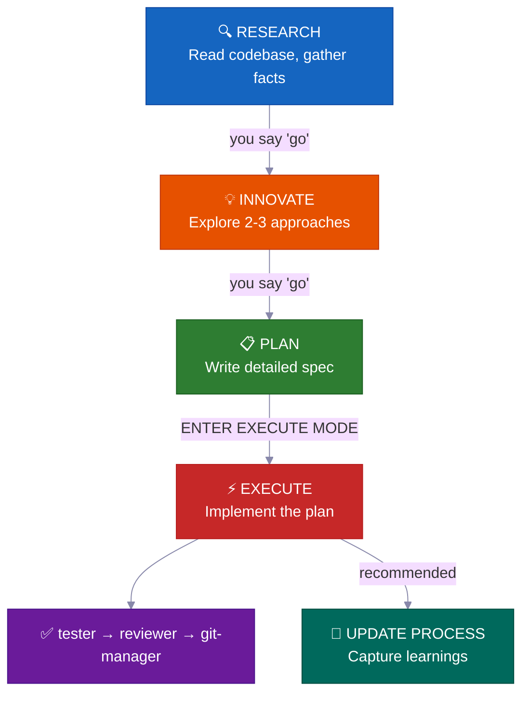
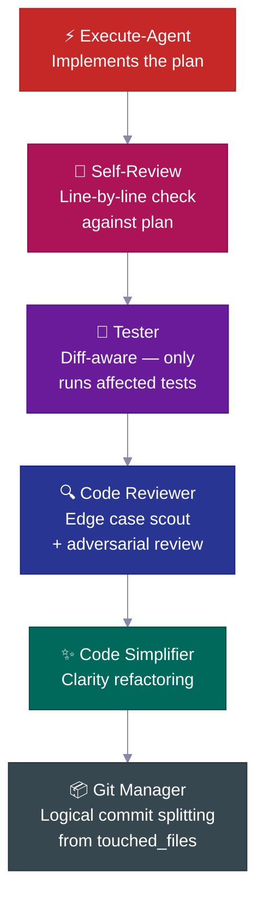
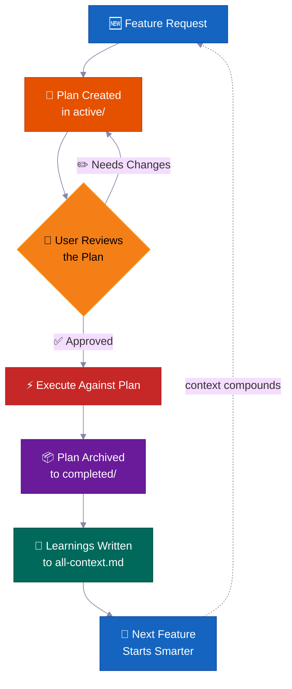
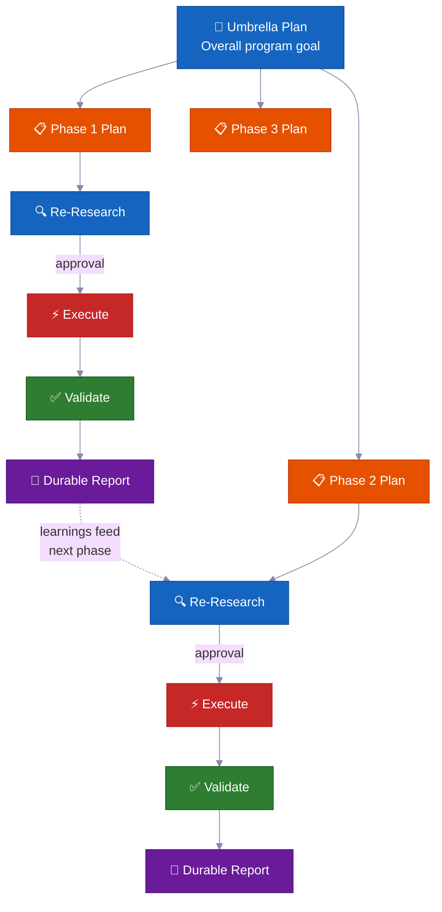

<p align="center">
  <strong>English</strong> |
  <a href="docs/i18n/README.zh-CN.md">简体中文</a> |
  <a href="docs/i18n/README.ja-JP.md">日本語</a> |
  <a href="docs/i18n/README.ko-KR.md">한국어</a> |
  <a href="docs/i18n/README.vi-VN.md">Tiếng Việt</a> |
  <a href="docs/i18n/README.pt-BR.md">Portugues</a>
</p>

<div align="center">

<a href="https://flowser.ai">
  
</a>

*Built by world-class engineers, for vibecoders at*<br>
*[flowser.ai](https://flowser.ai) — AI Agents with computers for GTM*

<br>

# vibecode-pro-max-kit

**Stop your AI from coding before it thinks — and forgetting every detailed prompt from you.<br>This harness turns any AI coding agent into a spec-driven engineering team<br>that researches, plans, ships production-grade code, and self-improves its memory to survive context-rotting even 6 months later.**

<br>

<p align="center">
  
  <br><br>
  <em>"Total Concentration — Spec Breathing, Tenth Form: Constant Flux.<br>A continuous development cycle that grows stronger with each feature shipped.<br>Context compounds. The flow never breaks."</em><br>
  <strong>— Tanjiro Kamado</strong>
</p>

🔬 Spec-driven development for AI agents<br>
📋 Auto-generates PRDs, manages backlogs, routes context automatically<br>
🧠 Self-improving knowledge base that compounds as you ship<br>
⚡ Runs autonomously for hours on large tasks without losing state<br>
🤝 Plans and specs are shareable — devs, PMs, and stakeholders review the same artifacts

<p>
  <a href="https://github.com/withkynam/vibecode-pro-max-kit/stargazers"></a>
  <a href="https://github.com/withkynam/vibecode-pro-max-kit/network/members"></a>
  <a href="LICENSE"></a>
  <a href="https://github.com/withkynam/vibecode-pro-max-kit/graphs/contributors"></a>
  <a href="https://github.com/withkynam/vibecode-pro-max-kit/actions/workflows/validate.yml"></a>
  <a href="https://github.com/withkynam/vibecode-pro-max-kit/commits/main"></a>
  
  
  
</p>

<p>
  <strong>The simplest, most flexible, team-friendly coding harness for</strong><br><br>
  <a href="https://github.com/anthropics/claude-code"></a>&nbsp;
  <a href="https://github.com/openai/codex"></a>&nbsp;
  <a href="https://cursor.com"></a>&nbsp;
  <a href="https://windsurf.com"></a><br>
  <a href="https://github.com/google-gemini/gemini-cli"></a>&nbsp;
  <a href="https://github.com/opencode-ai/opencode"></a>&nbsp;
  <a href="https://github.com/features/copilot"></a>
</p>

<p>
  <em>Works across any tech stack, any language, any project</em><br><br>
  <picture>
    <source media="(prefers-color-scheme: dark)" srcset="https://skillicons.dev/icons?i=ts,js,react,nextjs,vue,nuxt,svelte,angular,nodejs,express,bun,python,django,flask,fastapi&theme=dark&perline=15" />
    <source media="(prefers-color-scheme: light)" srcset="https://skillicons.dev/icons?i=ts,js,react,nextjs,vue,nuxt,svelte,angular,nodejs,express,bun,python,django,flask,fastapi&theme=light&perline=15" />
    
  </picture>
  <br>
  <picture>
    <source media="(prefers-color-scheme: dark)" srcset="https://skillicons.dev/icons?i=ruby,rails,go,rust,java,spring,kotlin,swift,php,laravel,cs,dotnet,elixir,graphql,prisma&theme=dark&perline=15" />
    <source media="(prefers-color-scheme: light)" srcset="https://skillicons.dev/icons?i=ruby,rails,go,rust,java,spring,kotlin,swift,php,laravel,cs,dotnet,elixir,graphql,prisma&theme=light&perline=15" />
    
  </picture>
  <br>
  <picture>
    <source media="(prefers-color-scheme: dark)" srcset="https://skillicons.dev/icons?i=supabase,firebase,postgres,mongodb,redis,docker,kubernetes,aws,gcp,azure,vercel,cloudflare,tailwind,electron&theme=dark&perline=15" />
    <source media="(prefers-color-scheme: light)" srcset="https://skillicons.dev/icons?i=supabase,firebase,postgres,mongodb,redis,docker,kubernetes,aws,gcp,azure,vercel,cloudflare,tailwind,electron&theme=light&perline=15" />
    
  </picture>
  <br>
  <sub>React · Next.js · Vue · Nuxt · Svelte · Angular · React Native · Electron · Node.js · Express · Bun · Hono · Python · Django · FastAPI · Flask · Ruby · Rails · Go · Rust · Java · Spring Boot · Kotlin · Swift · PHP · Laravel · C# · .NET · Elixir · TypeScript · Prisma · Supabase · Firebase · PostgreSQL · MongoDB · Redis · GraphQL · Docker · Kubernetes · Terraform · AWS · GCP · Azure · Vercel · Cloudflare · Tailwind · shadcn/ui · and any other stack your project uses</sub>
</p>

</div>

---

## 🚀 Install (30 seconds)

```bash
curl -fsSL https://raw.githubusercontent.com/withkynam/vibecode-pro-max-kit/main/install.sh | bash
```

Then open Claude Code and say:

```
Run vc-setup
```

That's it. The setup skill detects your stack, asks about your project (a real conversation, not a checklist), scaffolds the process directory, deep-scans your codebase, and populates context files with actual content — not placeholders.

<br>

<details>
<summary><strong>📦 What gets installed</strong></summary>

<br>

```
your-project/
├── .claude/
│   ├── agents/              # 🤖 12 specialized agent definitions
│   │   ├── vc-research-agent.md
│   │   ├── vc-execute-agent.md
│   │   └── ...
│   ├── skills/              # ⚡ 31 auto-discovered skills
│   │   ├── vc-generate-plan/
│   │   ├── vc-security/
│   │   ├── vc-scout/
│   │   └── ...
│   └── hooks/               # 🪝 7 lifecycle hooks
│       ├── privacy-block.cjs
│       ├── scout-block.cjs
│       └── ...
├── .codex/
│   └── agents/              # 🔄 Mirrored agents for Codex
├── CLAUDE.md                # 📋 Orchestrator + routing rules
├── AGENTS.md                # 📖 Agent registry
└── process/                 # 🧠 Created by vc-setup (not install)
    └── ...
```

- **Fresh project?** Installs the full harness, then `vc-setup` studies your codebase
- **Existing `.claude/` config?** Backs up to `.vibecode-backup/`, installs fresh, restores your `settings.json`
- **Existing `process/` directory?** Never touched by install — `vc-setup` handles migration intelligently
- **Existing `CLAUDE.md`?** Backed up as `CLAUDE.md.pre-vibecode`, harness version installed

</details>

<details>
<summary><strong>🤖 Full agent setup prompt</strong> (copy-paste this into Claude Code for maximum control)</summary>

```
First, install the vibecode-pro-max-kit agent harness by running this command:

curl -fsSL https://raw.githubusercontent.com/withkynam/vibecode-pro-max-kit/main/install.sh | bash

After the install completes, run vc-setup to configure everything for this project.

Follow the full interactive flow:

1. DETECT — Read package.json, detect my stack (framework, package manager, monorepo
   structure, test framework, database, auth). Also check if I have any existing .claude/,
   process/, or context files from a previous setup.

2. SHOW ME WHAT YOU FOUND — Present a summary of the detection results and wait for me
   to confirm before continuing. If this is an existing project with process/ folders or
   context files, tell me what you found and what looks good vs what could be improved.

3. ASK ME ABOUT THE PROJECT — Before scaffolding or scanning, have a real conversation
   with me about this project. Don't just ask a fixed list of questions and move on — ask
   follow-ups based on my answers, probe deeper on anything vague, and keep going until
   you genuinely understand the project. Start with the basics (what is this? who uses it?),
   then dig into architecture, features, conventions, pain points, and anything else that
   matters. Summarize your understanding back to me and confirm it's correct before moving on.

4. SCAFFOLD — Create the process/ directory structure. If I already have process/ folders,
   show me what you plan to change and wait for my approval before reorganizing anything.
   Never silently move or delete my existing files.

5. STUDY — Deep-scan the codebase and populate process/context/all-context.md with REAL
   content based on what you find AND what I told you. Include: repo structure, tech stack
   with versions, key patterns and conventions, import aliases, env vars, API routes,
   database schema, test setup. Do not leave placeholder text.

6. VALIDATE — Run all the validation checks to make sure everything is wired correctly.

Important rules:
- If I have existing context files or a well-written CLAUDE.md, read them first and
  preserve what is good. Merge intelligently — do not replace good content with generic scans.
- Show me a summary of what you plan to create or change at each major step and wait
  for my OK before proceeding.
- Do not create empty placeholder files. Only create files that have real content.
- Ask before reorganizing. If my existing setup works, tell me what you would improve
  and let me decide.
```

</details>

<br>

<details>
<summary>Table of Contents</summary>

- [The Problem](#-the-problem)
- [The Fix](#-the-fix)
- [The Vibe Coding Revolution](#the-vibe-coding-revolution)
- [Who Is This For?](#who-is-this-for)
- [At a Glance](#at-a-glance)
- [Why Teams Use This](#-why-teams-use-this)
- [How This Compares](#how-this-compares)
- [What Makes This Different](#-what-makes-this-different)
- [What's Inside](#-whats-inside)
- [How It Works](#-how-it-works)
- [Built-in Safety Systems](#-built-in-safety-systems)
- [Contributing](#contributing)
- [Star History](#-star-history)

</details>

---

## 🔥 The Problem

You ask Claude to "add webhook support." It immediately starts writing code. No questions about your architecture. No check on existing patterns. No plan. You get 400 lines that don't fit your codebase, and you spend an hour fixing it.

**But that's just the surface.** The deeper problems hit harder:

<table>
<tr>
<td width="50%" valign="top">
<h1>🧠</h1>
<strong>Context dies every session</strong><br><br>
Your agent forgets everything it learned. Same mistakes, same questions, every time. No memory, no compounding knowledge.
</td>
<td width="50%" valign="top">
<h1>📄</h1>
<strong>Docs go stale instantly</strong><br><br>
You wrote great context docs last week. They're already outdated. Nothing auto-updates them as the codebase evolves.
</td>
</tr>
<tr>
<td width="50%" valign="top">
<h1>💥</h1>
<strong>Big tasks collapse mid-way</strong><br><br>
Context window fills up, state is lost, the agent starts hallucinating. You restart from scratch on hour 3.
</td>
<td width="50%" valign="top">
<h1>🤝</h1>
<strong>No specs, no review, no collaboration</strong><br><br>
Your PM can't review what the agent is about to build. There's no artifact to share, discuss, or approve before code is written.
</td>
</tr>
<tr>
<td width="50%" valign="top">
<h1>🎭</h1>
<strong>Architecture decisions are hallucinated</strong><br><br>
The agent invents patterns instead of researching how other codebases solved the same problem.
</td>
</tr>
</table>

**Your agent has intelligence but no process, no memory, and no way to collaborate with your team.**

Whether you're a developer, a PM, or a CEO who just started vibe coding — this problem hits everyone the same way. The fix is the same too: **give your agent a real development process.**

---

## 🛠️ The Fix

This harness installs a complete development system into your project — not just a CLAUDE.md file, but **12 specialized agents, 31 skills**, and a phase-locked workflow that forces your agent to **understand before it builds**.

<br>

<table>
<tr>
<td align="center" width="50%" valign="top">
<h1>📋</h1>
<strong>Spec-driven plans</strong><br><br>
<sub>PMs and devs review the same plan artifact before any code is written</sub>
</td>
<td align="center" width="50%" valign="top">
<h1>🔄</h1>
<strong>Self-improving context</strong><br><br>
<sub>Auto-updates every time a feature ships — docs never go stale</sub>
</td>
</tr>
<tr>
<td align="center" width="50%" valign="top">
<h1>⚡</h1>
<strong>Autonomous execution</strong><br><br>
<sub>Survives context compaction — runs for hours, not minutes</sub>
</td>
<td align="center" width="50%" valign="top">
<h1>🧬</h1>
<strong>Architecture research</strong><br><br>
<sub>Studies real codebases before making design decisions</sub>
</td>
</tr>
<tr>
<td align="center" width="50%" valign="top">
<h1>🧭</h1>
<strong>Smart context routing</strong><br><br>
<sub>Loads only what's relevant — not your entire knowledge base every time</sub>
</td>
</tr>
</table>

<br>



Every transition requires your **explicit approval**. Nothing auto-advances. You stay in control.

---

## The Vibe Coding Revolution

<div align="center">
<h3><em>"The hottest new programming language is English."</em></h3>
<strong>— Andrej Karpathy</strong>
</div>

<br>

**Vibe coding changed who can build software. Spec-driven development changes what they can ship.**

<table>
<tr>
<td align="center" width="50%">
<h3>63%</h3>
<sub>of vibe coding users are <strong>NOT</strong> developers</sub>
</td>
<td align="center" width="50%">
<h3>16.2M</h3>
<sub>citizen developers worldwide<br>(38% YoY growth)</sub>
</td>
</tr>
<tr>
<td align="center" width="50%">
<h3>$4.7B</h3>
<sub>vibe coding market<br>growing 38% annually</sub>
</td>
<td align="center" width="50%">
<h3>25%</h3>
<sub>of YC W25 startups had 95%+ AI-generated codebases</sub>
</td>
</tr>
</table>

Most tools help you start a project. This harness helps you **finish it** — with plans your team can review, context that never goes stale, and safety systems that catch mistakes before they ship.

---

## Who Is This For?

<div align="center">
<h3><em>"The point isn't who typed it. It's what shipped."</em></h3>
<strong>— Garry Tan, YC</strong>
</div>

<br>

Whether you just discovered vibe coding or you're a staff engineer shipping production systems — this harness adapts to your workflow.

<table>
<tr>
<td width="50%" valign="top">
<h1>🧑‍💼</h1>
<strong>CEO / Founder</strong><br><br>
<em>"Build me a SaaS with auth, billing, and a landing page"</em><br><br>
The agent researches your stack, writes an architecture plan you can review, implements with tests, and captures every decision for your technical co-founder to audit later.
</td>
<td width="50%" valign="top">
<h1>📊</h1>
<strong>Product Manager</strong><br><br>
<em>"Create a dashboard showing MRR, churn, and growth metrics"</em><br><br>
It generates a PRD-style spec, gets your approval before writing code, implements to spec, and archives the plan as searchable project history.
</td>
</tr>
<tr>
<td width="50%" valign="top">
<h1>🎨</h1>
<strong>Designer</strong><br><br>
<em>"Match this Figma screenshot pixel-perfect"</em><br><br>
The design-aware agent analyzes your mockup, implements component-by-component with your design tokens, and spawns visual comparison checks.
</td>
<td width="50%" valign="top">
<h1>⚙️</h1>
<strong>Engineer</strong><br><br>
<em>"Refactor the auth module to support RBAC with zero downtime"</em><br><br>
It researches your current auth code and how other codebases solved RBAC, writes a migration plan with blast radius analysis, implements safely with rollback notes.
</td>
</tr>
</table>

---

## At a Glance

<table>
<tr>
<td align="center" width="50%" valign="top">
<h1>🤖</h1>
<h3>12</h3>
<strong>Specialized Agents</strong><br>
<sub>Domain experts that own each development phase</sub>
</td>
<td align="center" width="50%" valign="top">
<h1>⚡</h1>
<h3>32</h3>
<strong>Auto-Discovered Skills</strong><br>
<sub>Reusable capabilities surfaced by keyword matching</sub>
</td>
</tr>
<tr>
<td align="center" width="50%" valign="top">
<h1>🪝</h1>
<h3>7</h3>
<strong>Lifecycle Hooks</strong><br>
<sub>Pre/post execution guardrails and context injection</sub>
</td>
<td align="center" width="50%" valign="top">
<h1>📜</h1>
<h3>6</h3>
<strong>Development Protocols</strong><br>
<sub>Shared workflow rules across all tools</sub>
</td>
</tr>
<tr>
<td align="center" width="50%" valign="top">
<h1>🛡️</h1>
<h3>5</h3>
<strong>Safety Systems</strong><br>
<sub>Phase-locking, blast radius, privacy, leak detection</sub>
</td>
<td align="center" width="50%" valign="top">
<h1>🔧</h1>
<h3>7</h3>
<strong>Supported Tools</strong><br>
<sub>Claude Code, Codex, Cursor, Windsurf, Antigravity, OpenCode, Copilot</sub>
</td>
</tr>
<tr>
<td align="center" width="50%" valign="top">
<h1>🌍</h1>
<h3>6</h3>
<strong>Languages</strong><br>
<sub>EN · 中文 · 日本語 · 한국어 · Tiếng Việt · Português</sub>
</td>
<td align="center" width="50%" valign="top">
<h1>⚡</h1>
<h3>30s</h3>
<strong>Install Time</strong><br>
<sub>One curl command + auto-setup does the rest</sub>
</td>
</tr>
</table>

---

## 💎 Why Teams Use This

> Most harnesses give you a CLAUDE.md and instructions. This gives you an **autonomous development system** that compounds intelligence over time.

<br>

### 📋 Spec-Driven Development — Not Vibes-Driven

Every feature gets a **written plan with blast radius analysis** before a single line of code is written.

> 💡 Auto-generates PRDs, manages backlogs, organizes feature groups. Works for both developers and product managers — your agent plans like a senior engineer, not an intern.

**What's in every plan:**

| Section | Purpose |
|---|---|
| 📍 **Touchpoints** | Every file that will be created or modified, listed upfront |
| 📜 **Public contracts** | What API surfaces or interfaces change |
| 💥 **Blast radius** | What could break, what tests to run, what to watch |
| ✅ **Verification evidence** | How to prove the implementation is correct |
| 🔄 **Resume handoff** | Enough context for any agent to pick up mid-plan |

<br>

### 🔄 Autonomous Multi-Phase Execution — Hours of Hands-Free Work

For large tasks, the agent runs an **iterative phased loop**:

```
🔍 research → ⚡ execute → ✅ validate → 📄 report → 🔄 repeat
```

> 💡 It self-heals when stuck, self-reflects to improve approach, and writes durable progress reports to disk. **Context compaction can't kill it** — all state lives in files, not memory.

Walk away and come back to completed work.

<br>

### 🧬 Auto-Architecture Research — Learn From Any Codebase

The agent doesn't just read your code — it **studies other repositories** to learn how they solved similar problems (`vc-xia`).

> 💡 It researches, compares approaches, and adapts the best patterns into your codebase. Architecture decisions are informed by real-world implementations, not hallucinated best practices.

<br>

### 🧭 Persistent Smart Context Routing — Always the Right Context

Context isn't one giant file. It's organized into **auto-routed knowledge domains**:

```
process/context/
├── all-context.md              # 🧭 Root router — reads your task, loads what's relevant
├── tests/
│   └── all-tests.md            # 🧪 Test runners, commands, debugging
├── container/
│   └── all-container.md        # 🐳 Docker, deployment, infra
├── uxui/
│   └── all-uxui.md             # 🎨 Components, design tokens, patterns
└── {your-domain}/
    └── all-{domain}.md         # 📚 Any domain with 3+ durable docs
```

> 💡 When the agent works on billing, it loads billing context — not your entire codebase docs. Context **auto-updates every time you complete a feature**, so it never goes stale.

<br>

### 🧠 Self-Improving Knowledge Base — Gets Smarter as You Ship

Every completed feature feeds learnings back into the context system.

> 💡 Research findings, architectural decisions, debugging insights, and coding patterns are **captured and indexed automatically**. Your 100th feature benefits from everything learned in the first 99. The knowledge compounds — it doesn't reset.

---

## How This Compares

| Feature | vibecode-pro-max-kit | Superpowers | GSD | gstack |
|---------|---------------------|-------------|-----|--------|
| Spec-driven lifecycle | Full RIPER-5 (research → plan → execute → verify) | Mandatory workflows | Context-rot fix | Partial |
| Phase-locked safety | Tool restrictions per mode (read-only research, no-write innovate) | Skill-based constraints | Phase separation | None |
| Multi-tool support | 7 tools via AGENTS.md + native | Claude Code plugin | 14 runtimes | 1 tool |
| Auto-improving context | Domain-routed context groups, updates after every feature | Plugin memory | Disk-persisted state | Manual |
| Team collaboration | Shared specs, plans, and review artifacts | Solo | Solo | Solo |
| Skills system | 32 auto-discovered, keyword-matched at every prompt | 86 composable skills | Meta-prompting | 23 role tools |
| Multi-phase programs | Umbrella plans + phase-by-phase execution loop with regression checks | Single task | Single task | Single task |
| Quality pipeline | 6-step chain (code-review → test → simplify → security → audit → commit) | Per-skill quality | No auto-chain | No auto-chain |
| Installation | 30-second `curl` install + auto-setup | Plugin marketplace | npx one-liner | git clone |
| Context routing | Domain-based routing table with grouped context packs | Flat skill context | Flat context | Single file |

> **On runtime breadth:** GSD supports 14 runtimes. We support 7 deeply — with full agent harnesses, skill discovery, and lifecycle hooks on every platform. Breadth vs. depth: your choice.

---

## ⚡ What Makes This Different

Most agent harnesses give you a big CLAUDE.md and some instructions. Here's what this one actually does:

<br>

<table>
<tr>
<td width="50%" valign="top">
<h1>🔒</h1>
<strong>Phase-Locked Tool Restrictions</strong><br><br>
Your agent literally <strong>cannot</strong> write code during research. RESEARCH is read-only, INNOVATE has no Bash, PLAN can only write to <code>process/</code>. <strong>Actual capability removal</strong>, not suggestions.
</td>
<td width="50%" valign="top">
<h1>🎯</h1>
<strong>Smart Auto-Routing</strong><br><br>
Detects your intent from natural language. "build webhook support" → full pipeline. "login is broken" → debugger. 6-level precedence, one clarifying question max.
</td>
</tr>
<tr>
<td width="50%" valign="top">
<h1>🔍</h1>
<strong>Automatic Skill Discovery</strong><br><br>
Before routing any request, scans <strong>32 skills</strong> and matches keywords. Say "add webhook support" and <code>vc-security</code> + <code>vc-scenario</code> surface automatically.
</td>
<td width="50%" valign="top">
<h1>💾</h1>
<strong>Survives Context Compaction</strong><br><br>
Plans, reports, context docs, and learnings all live on disk. The session-init hook re-injects approval gates after compaction. <strong>Nothing is lost.</strong>
</td>
</tr>
<tr>
<td width="50%" valign="top">
<h1>🛡️</h1>
<strong>Self-Policing Violation Detection</strong><br><br>
When the agent is about to cross a phase boundary, it stops itself: <em>"PHASE JUMPING PREVENTED"</em>. A <strong>structural hallucination guard</strong>.
</td>
<td width="50%" valign="top">
<h1>🔄</h1>
<strong>Works Across 7 AI Coding Tools</strong><br><br>
Two open standards — <code>AGENTS.md</code> and <code>SKILL.md</code> — mean <strong>zero adapters, zero plugins, zero configuration.</strong> Start in Claude Code, switch to Cursor, continue in Codex.
</td>
</tr>
</table>

---

## 🧭 How It Works

```
Your request
  → Step 0: Skill Discovery (match keywords → surface relevant skills)
  → Intent Detection (feature / bug / question / refactor / UI)
  → Route to the right agent
  → Phase-locked execution with explicit transitions
```

The orchestrator **never does the work itself** — it routes, monitors, and manages transitions.

<br>

### 📊 The Workflow

| Phase | What happens | You say |
|-------|-------------|---------|
| 🔍 **RESEARCH** | Read-only fact gathering — codebase + web | *(automatic on feature requests)* |
| 💡 **INNOVATE** | Explore 2-3 approaches with trade-offs | `go` |
| 📋 **PLAN** | Write a detailed spec you can review | `go` |
| ⚡ **EXECUTE** | Implement exactly what was planned | `ENTER EXECUTE MODE` |
| 🧠 **UPDATE PROCESS** | Capture learnings, update context, archive plan | *(recommended after non-trivial work)* |

> 💡 **Shortcuts:** `ENTER FAST MODE - [task]` compresses RESEARCH+INNOVATE+PLAN into one pass — still pauses before EXECUTE. Trivial fixes (single file, <15 lines, no schema/auth changes) skip straight to execute.

<br>

### 💻 Typical Session

```
# 🆕 Feature request
You: "add webhook support to the API"
→ Skill discovery surfaces: vc-scenario, vc-security
→ research-agent gathers context (read-only, can't touch code)
→ You say "go" → innovate-agent explores approaches
→ You say "go" → plan-agent writes spec with blast radius
→ You review the plan, say "ENTER EXECUTE MODE"
→ execute-agent implements → self-review → tester → code-reviewer → git-manager
→ Closeout packet: what changed, what's verified, recommended next step
```

```
# 🐛 Bug fix
You: "login redirect is broken"
→ Routes to vc-debugger → evidence gathering → competing hypotheses
→ Root cause identified with proof chain
→ execute-agent implements the fix → quality pipeline
```

```
# ⏩ Fast mode
You: "ENTER FAST MODE - add rate limiting middleware"
→ Compressed research+innovate+plan in one pass
→ Mandatory safety pause → you review → "ENTER EXECUTE MODE"
```

```
# 🏗️ Large program
You: "build a full testing platform"
→ Creates umbrella plan + phase plans in a feature folder
→ Each phase: re-research → approve → execute → validate → durable report
→ Progress survives context compaction — durable reports on disk
```

```
# 🔄 Autonomous optimization
You: "improve test coverage to 80% using vc-autoresearch"
→ Agent iterates: make change → commit → measure → keep/revert
→ Stuck detection after 5 consecutive discards → strategy shift
→ Full audit trail in TSV
```

---

## 🛡️ Built-in Safety Systems

These aren't just guidelines — they're **structural enforcement** built into every agent.

<table>
<tr>
<td width="50%" valign="top">
<h1>⏸️</h1>
<strong>50% Mid-Implementation Check-In</strong><br><br>
At approximately halfway through execution, the agent <strong>pauses</strong> to report progress, list completed and remaining items, and asks: <em>"Continue with current approach or pause and return to PLAN?"</em>
</td>
<td width="50%" valign="top">
<h1>🚫</h1>
<strong>Never Silently Deviate</strong><br><br>
If the execute-agent hits a problem requiring deviation from the plan, it <strong>immediately stops</strong>, explains the issue, and returns to PLAN mode. No quiet improvising.
</td>
</tr>
<tr>
<td width="50%" valign="top">
<h1>🔙</h1>
<strong>Approach Abandonment Protocol</strong><br><br>
When an approach fails, the agent evaluates reusable components, documents lessons before deletion, creates an abandonment summary, and returns to PLAN.
</td>
<td width="50%" valign="top">
<h1>🔐</h1>
<strong>Privacy Guardrails Hook</strong><br><br>
The agent is <strong>blocked from reading</strong> <code>.env</code>, credentials, SSH keys, and <code>.pem</code> files. Must ask for explicit approval.
</td>
</tr>
<tr>
<td width="50%" valign="top">
<h1>⚠️</h1>
<strong>High-Risk Evidence Packs</strong><br><br>
For changes touching auth, billing, schema migrations, or public APIs — the system requires a formal evidence pack before calling work "done."
</td>
<td width="50%" valign="top">
<h1>📊</h1>
<strong>Drift Signal Scoring</strong><br><br>
After execution, the system scores urgency: <strong>LOW</strong> (light touch), <strong>MEDIUM</strong> (significant changes), <strong>HIGH</strong> (harness/protocol files touched).
</td>
</tr>
</table>

---

## 🔍 Pre-Implementation Intelligence

Before a single line of code is written, the system can catch issues through specialized analysis:

<br>

<table>
<tr>
<td width="50%" valign="top">
<h1>🎭</h1>
<strong>5-Persona Pre-Implementation Debate</strong><br><br>
<code>vc-predict</code> — Architect, Security, Performance, UX, and Devil's Advocate debate your plan. Produces a <strong>GO / CAUTION / STOP</strong> verdict before you write a line of code.
</td>
<td width="50%" valign="top">
<h1>🎲</h1>
<strong>12-Dimension Edge Case Generator</strong><br><br>
<code>vc-scenario</code> — Decomposes any feature across 12 dimensions (user types, input extremes, timing, scale, state, env, errors, auth, data, integrations, compliance, business logic). Outputs usable as test specs.
</td>
</tr>
<tr>
<td width="50%" valign="top">
<h1>🔐</h1>
<strong>STRIDE + OWASP Security Audit</strong><br><br>
<code>vc-security</code> — Dual-methodology security audit with dependency auditing, secret detection, and <strong>auto-fix mode</strong> that sorts by severity and fixes Critical first with regression guards.
</td>
</tr>
</table>

---

## 🤖 Autonomous Agent Capabilities

<br>

<table>
<tr>
<td width="50%" valign="top">
<h1>🔄</h1>
<strong>Autonomous Metric Optimization</strong><br><br>
<code>vc-autoresearch</code> — Set a goal, walk away. Iterative git-backed loop: make ONE atomic change → commit → measure → keep or revert. Stuck detection after 5 consecutive discards triggers strategy shifts.
</td>
<td width="50%" valign="top">
<h1>👥</h1>
<strong>Parallel Agent Teams</strong><br><br>
<code>vc-team</code> — Multiple agents working <strong>simultaneously</strong> with git worktree isolation. Research in parallel, execute in parallel, review in parallel, debug adversarially.
</td>
</tr>
<tr>
<td width="50%" valign="top">
<h1>🔬</h1>
<strong>Evidence-Before-Hypothesis Debugging</strong><br><br>
<code>vc-debugger</code> — Gathers evidence first → forms 2-3 competing hypotheses → systematically tests each → documents elimination path. <strong>Never guesses — proves.</strong>
</td>
</tr>
</table>

---

## ✅ Quality Pipeline — Built Into Execution

The execute-agent doesn't just write code and call it done. It auto-chains through a **quality pipeline**:

<br>



<br>

| Step | What it does |
|---|---|
| 🔎 **Self-review** | Checks every checklist item against plan for deviations, documents them |
| 🧪 **Tester** | Maps changed files to test files, auto-escalates to full suite when >70% mapped |
| 🔍 **Code reviewer** | Dispatches edge case scout BEFORE review, checks N+1 queries, auth paths, data leaks |
| ✨ **Simplifier** | Clarity refactoring after review passes — no behavior changes |
| 📦 **Git manager** | Receives `touched_files` list, splits into logical conventional commits, refuses unknown files |

---

## 📋 The Plan Lifecycle — Spec-Driven, Not Vibes-Driven

Every non-trivial feature follows a **plan lifecycle** — a written spec that is created, reviewed, executed against, and archived as project history.

<br>



<br>

> 💡 Six months from now, when someone asks *"why did we build auth this way?"*, the answer is in `completed/`. Not lost in a Slack thread.

<br>

**Where plans live on disk:**

```
process/
├── general-plans/
│   ├── active/                  # 📋 Plans currently being worked on
│   │   └── webhooks_PLAN_28-05-26.md
│   ├── completed/               # ✅ Archived plans (searchable history)
│   ├── backlog/                 # 📌 Deferred work
│   ├── reports/                 # 📄 Cross-cutting reports
│   └── references/              # 📚 Research outputs
└── features/
    └── billing/                 # 🏷️ Feature-scoped (5+ artifacts)
        ├── active/
        ├── completed/
        ├── backlog/
        ├── reports/
        └── references/
```

---

## 🏗️ Phase Programs — Large Projects That Don't Fall Apart

Normal features use one plan. **Large multi-phase projects** use a phase program — an umbrella plan plus individual phase plans, each with its own validation gate.

<br>



<br>

**Key features:**

| | Feature | Why it matters |
|---|---|---|
| 🔄 | **Re-research at every phase** | Checks for code drift, reads latest reports, updates assumptions |
| ✅ | **Validation gates** | Phase isn't `VERIFIED` until evidence proves it. Honest status: `PLANNED` → `CODE DONE` → `TESTING` → `VERIFIED` or `BLOCKED` |
| 📄 | **Durable reports** | Every phase writes results to disk. Progress survives context compaction |
| 🧠 | **Learnings feed forward** | Phase 1 discoveries update Phase 2's plan before execution |
| 🏗️ | **Foundation vs expansion** | Explicitly splits "prove the architecture" from "implement everything" |
| 🚧 | **Honest blocker handling** | Blocked phases stay `BLOCKED` with evidence. No forcing green status |

---

## 🧠 Context Groups — Organized Knowledge, Not One Giant File

Project knowledge is organized into **context groups** — durable knowledge domains, each with an `all-{group}.md` router that tells agents what to read and when.

<br>

```
process/context/
├── all-context.md              # 🧭 Root router — architecture, stack, patterns, conventions
├── tests/
│   └── all-tests.md            # 🧪 Test runners, commands, debugging procedures
├── container/
│   └── all-container.md        # 🐳 Docker, deployment, infra procedures
├── uxui/
│   └── all-uxui.md             # 🎨 Components, design tokens, patterns
├── infra/
│   └── all-infra.md            # 🖥️ Worker nodes, provisioning, DNS
├── skills/
│   └── all-skills.md           # ⚡ Skill runtime, app architecture
├── workflows/
│   └── all-workflows.md        # 🔄 Workflow runtime, deployment
└── {your-domain}/
    └── all-{domain}.md         # 📚 Any knowledge domain with 3+ durable docs
```

<br>

| | How it works |
|---|---|
| 🧭 **Router pattern** | Agents read only what's relevant to their task, not everything |
| 📏 **Auto-promotion** | Topics with 3+ docs or 800+ lines get their own context group |
| 🔄 **Living docs** | Updated by `update-process-agent` after every non-trivial feature |
| 🧪 **Auditable** | `vc-audit-context` verifies routing and consistency |

---

## 📁 Feature Folders — Self-Organizing Project Memory

When a topic accumulates 5+ artifacts, it gets its own **feature folder** — a complete lifecycle container.

<br>

```
process/features/{feature}/
├── active/       # 📋 Plans currently being worked on
├── completed/    # ✅ Archived plans (searchable decision history)
├── backlog/      # 📌 Deferred work (agents check before duplicating)
├── reports/      # 📄 Execution reports, post-mortems, validation results
└── references/   # 📚 Research outputs that inform future decisions
```

<br>

| | What happens |
|---|---|
| 🆕 | New work starts in `active/` → reports accumulate → plan archives to `completed/` |
| 📌 | Deferred work goes to `backlog/` — agents check it before creating duplicate plans |
| 📦 | Feature promotion happens automatically when general artifacts hit 5+ |
| 🔍 | Every feature has complete, self-contained history — plans, decisions, reports, research |

---

## 🤖 What's Inside

<br>

### 12 Agents

<details>
<summary>Click to expand agent list (12 agents)</summary>

<br>

**Core workflow agents** — one per RIPER-5 phase:

| Agent | Role |
|-------|------|
| 🔍 `vc-research-agent` | Codebase + web research, read-only. Contradiction tracking built in |
| 💡 `vc-innovate-agent` | Brainstorm 2-3 approaches. Must produce decision summary before PLAN |
| 📋 `vc-plan-agent` | Write spec with anti-rationalization guards. "I already know how" is not a plan |
| ⚡ `vc-execute-agent` | Implement per plan. 50% check-in, deviation protocol, self-review |
| ⏩ `vc-fast-mode-agent` | Compressed RESEARCH→INNOVATE→PLAN with mandatory safety pause |
| 🧠 `vc-update-process-agent` | 7-phase mandatory checklist including stale artifact scanning |

<br>

**Specialist agents** — called during EXECUTE or standalone:

| Agent | Role |
|-------|------|
| 🐛 `vc-debugger` | Evidence-before-hypothesis. Competing hypotheses, elimination chains |
| 🧪 `vc-tester` | Diff-aware. Only runs affected tests. Auto-escalates on config changes |
| 🔎 `vc-code-reviewer` | Edge case scout BEFORE review. N+1 detection, auth path validation |
| ✨ `vc-code-simplifier` | Clarity refactoring without behavior change |
| 🎨 `vc-ui-ux-designer` | Design-aware frontend. Can spawn research subagent mid-execution |
| 📦 `vc-git-manager` | Logical commit splitting from `touched_files`. Refuses unknown files |

</details>

<br>

### 31 Skills (auto-discovered)

<details>
<summary>Click to expand skill list (31 skills)</summary>

<br>

**🔧 Contract skills** — `vc-generate-plan` · `vc-generate-context` · `vc-audit-context` · `vc-audit-plans` · `vc-audit-vc` · `vc-setup` · `vc-update` · `vc-publish`

**🧠 Planning** — `vc-predict` (5-persona debate) · `vc-scenario` (12-dimension edge cases) · `vc-sequential-thinking` · `vc-problem-solving`

**🐛 Debug & security** — `vc-debug` · `vc-security` (STRIDE + OWASP + auto-fix) · `vc-autoresearch` (autonomous optimization)

**📚 Research** — `vc-docs-seeker` · `vc-scout` · `vc-docs` · `vc-repomix` · `vc-xia` (repo comparison)

**🎨 Frontend** — `vc-frontend-design` · `vc-chrome-devtools` · `vc-agent-browser` · `vc-web-testing`

**⚙️ Utilities** — `vc-context-engineering` · `vc-mcp-management` · `vc-preview` · `vc-team` (parallel agents) · `vc-tech-graph` · `vc-watzup` (session handoff) · `vc-merge-worktree`

</details>

<br>

### 🪝 7 Hooks

| Hook | What it does |
|------|-------------|
| 🔐 **Privacy guardrails** | Blocks `.env`, credentials, SSH keys. Requires explicit approval |
| 🚫 **Scout blocker** | Prevents agent from wandering into `node_modules/`, `dist/`. Gitignore-syntax `.ckignore` |
| 🧠 **Session init** | Detects stack, injects env vars, recovers approval gates after compaction |
| 💉 **Subagent context** | Injects ~200 token compact context block into every subagent |
| ✨ **Edit quality** | After 5+ edits, nudges to run code-simplifier (non-blocking, throttled) |
| 📛 **Descriptive naming** | Language-aware file naming conventions on every Write |
| 📊 **Usage tracking** | Session metrics and token awareness |

<br>

**Where everything lives:**

```
your-project/
├── .claude/
│   ├── agents/              # 🤖 12 agent definitions (.md)
│   ├── skills/              # ⚡ 31 skill modules (each a directory with SKILL.md)
│   └── hooks/               # 🪝 7 lifecycle hooks (.cjs)
├── .codex/
│   └── agents/              # 🔄 Mirrored for Codex compatibility
├── .agents/
│   └── skills -> ../.claude/skills   # 🔗 Symlink for Codex discovery
├── CLAUDE.md                # 📋 Orchestrator config + routing rules
├── AGENTS.md                # 📖 Agent + skill registry
└── process/
    ├── context/             # 🧠 Auto-routed knowledge domains
    ├── general-plans/       # 📋 Cross-cutting plans + reports
    ├── features/            # 🏷️ Feature-scoped lifecycle folders
    └── development-protocols/  # 📜 Shared workflow rules
```

---

## 🔄 Updating

Pull the latest harness improvements:

```
Run vc-update
```

> 💡 Shows a dry-run diff, waits for confirmation. Your `process/` directory and project-specific content are **never touched**.

---

## Contributing

We welcome contributions! See [CONTRIBUTING.md](CONTRIBUTING.md) for guidelines.

<br>

**Quick links:**

- 🐛 [Report a bug](https://github.com/withkynam/vibecode-pro-max-kit/issues/new?template=1.bug_report.yml)
- 💡 [Request a feature](https://github.com/withkynam/vibecode-pro-max-kit/issues/new?template=2.feature_request.yml)
- ⚡ [Submit a skill](https://github.com/withkynam/vibecode-pro-max-kit/issues/new?template=3.skill_submission.yml)
- 🌐 [Add a translation](https://github.com/withkynam/vibecode-pro-max-kit/issues/new?template=5.translation.yml)

<br>

<a href="https://github.com/withkynam/vibecode-pro-max-kit/graphs/contributors">
  
</a>

---

## ⭐ Star History

<a href="https://star-history.com/#withkynam/vibecode-pro-max-kit&Date">
 <picture>
   <source media="(prefers-color-scheme: dark)" srcset="https://api.star-history.com/svg?repos=withkynam/vibecode-pro-max-kit&type=Date&theme=dark" />
   <source media="(prefers-color-scheme: light)" srcset="https://api.star-history.com/svg?repos=withkynam/vibecode-pro-max-kit&type=Date" />
   
 </picture>
</a>

---

## 📄 License

MIT
