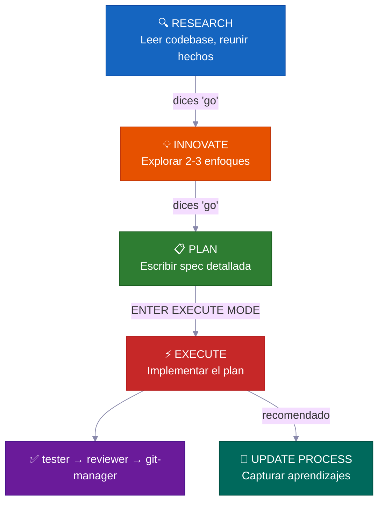
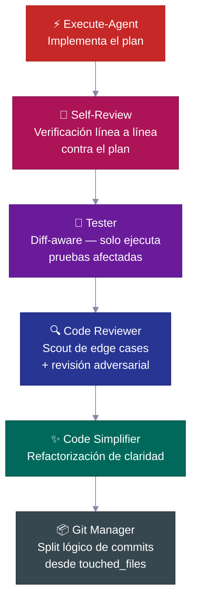
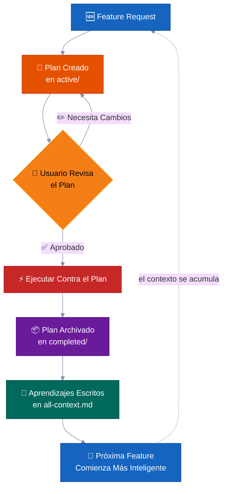
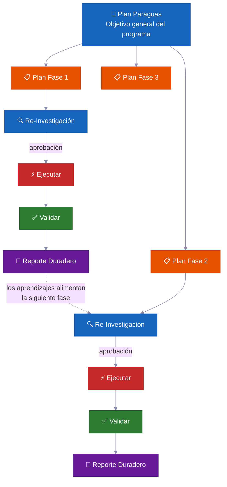

<p align="center">
  <a href="../../README.md">English</a> |
  <a href="README.zh-CN.md">简体中文</a> |
  <a href="README.ja-JP.md">日本語</a> |
  <a href="README.ko-KR.md">한국어</a> |
  <a href="README.vi-VN.md">Tiếng Việt</a> |
  <a href="README.pt-BR.md">Português</a> |
  <strong>Español</strong> |
  <a href="README.de.md">Deutsch</a> |
  <a href="README.fr.md">Français</a> |
  <a href="README.hi.md">हिंदी</a>
</p>

<div align="center">

<a href="https://flowser.ai">
  
</a>

*Creado por ingenieros de clase mundial, para vibecoders en*<br>
*[flowser.ai](https://flowser.ai) — Agentes de IA con computadoras para GTM*

<br>

# vibecode-pro-max-kit

**Evita que tu IA escriba código antes de pensar — y que olvide cada prompt detallado que le enviaste.<br>Este harness convierte cualquier agente de código de IA en un equipo de ingeniería orientado a specs<br>que investiga, planifica, entrega código listo para producción y mejora su memoria continuamente para sobrevivir el deterioro de contexto incluso 6 meses después.**

<br>

<p align="center">
  
  <br><br>
  <em>"Concentración Total — Respiración Spec, Décima Forma: El Vibe Flow nunca se rompe."</em><br>
  <strong>— Tanjiro Kamado</strong>
</p>

🔬 Desarrollo orientado a specs para agentes de IA<br>
📋 Genera PRDs automáticamente, gestiona backlogs, enruta contexto de forma automática<br>
🧠 Base de conocimiento que se auto-mejora y se acumula conforme entregas<br>
⚡ Funciona de forma autónoma durante horas en tareas grandes sin perder el estado<br>
🤝 Los planes y specs son compartibles — devs, PMs y stakeholders revisan los mismos artefactos

<p>
  <a href="https://github.com/withkynam/vibecode-pro-max-kit/stargazers"></a>
  <a href="https://github.com/withkynam/vibecode-pro-max-kit/network/members"></a>
  <a href="LICENSE"></a>
  <a href="https://github.com/withkynam/vibecode-pro-max-kit/graphs/contributors"></a>
  <a href="https://github.com/withkynam/vibecode-pro-max-kit/actions/workflows/validate.yml"></a>
  <a href="https://github.com/withkynam/vibecode-pro-max-kit/commits/main"></a>
  
  
  
</p>

<p>
  <strong>El harness de programación más simple, flexible y amigable para equipos en</strong><br><br>
  <a href="https://github.com/anthropics/claude-code"></a>&nbsp;
  <a href="https://github.com/openai/codex"></a>&nbsp;
  <a href="https://cursor.com"></a>&nbsp;
  <a href="https://windsurf.com"></a><br>
  <a href="https://github.com/google-gemini/gemini-cli"></a>&nbsp;
  <a href="https://github.com/opencode-ai/opencode"></a>&nbsp;
  <a href="https://github.com/features/copilot"></a>
</p>

<p>
  <em>Funciona con cualquier stack, cualquier lenguaje, cualquier proyecto</em><br><br>
  <picture>
    <source media="(prefers-color-scheme: dark)" srcset="https://skillicons.dev/icons?i=ts%2Cjs%2Creact%2Cnextjs%2Cvue%2Cnuxt%2Csvelte%2Cangular%2Cnodejs%2Cexpress%2Cbun%2Cpython%2Cdjango%2Cflask%2Cfastapi&theme=dark&perline=15" />
    <source media="(prefers-color-scheme: light)" srcset="https://skillicons.dev/icons?i=ts%2Cjs%2Creact%2Cnextjs%2Cvue%2Cnuxt%2Csvelte%2Cangular%2Cnodejs%2Cexpress%2Cbun%2Cpython%2Cdjango%2Cflask%2Cfastapi&theme=light&perline=15" />
    
  </picture>
  <br>
  <picture>
    <source media="(prefers-color-scheme: dark)" srcset="https://skillicons.dev/icons?i=ruby%2Crails%2Cgo%2Crust%2Cjava%2Cspring%2Ckotlin%2Cswift%2Cphp%2Claravel%2Ccs%2Cdotnet%2Celixir%2Cgraphql%2Cprisma&theme=dark&perline=15" />
    <source media="(prefers-color-scheme: light)" srcset="https://skillicons.dev/icons?i=ruby%2Crails%2Cgo%2Crust%2Cjava%2Cspring%2Ckotlin%2Cswift%2Cphp%2Claravel%2Ccs%2Cdotnet%2Celixir%2Cgraphql%2Cprisma&theme=light&perline=15" />
    
  </picture>
  <br>
  <picture>
    <source media="(prefers-color-scheme: dark)" srcset="https://skillicons.dev/icons?i=supabase%2Cfirebase%2Cpostgres%2Cmongodb%2Credis%2Cdocker%2Ckubernetes%2Caws%2Cgcp%2Cazure%2Cvercel%2Ccloudflare%2Ctailwind%2Celectron&theme=dark&perline=15" />
    <source media="(prefers-color-scheme: light)" srcset="https://skillicons.dev/icons?i=supabase%2Cfirebase%2Cpostgres%2Cmongodb%2Credis%2Cdocker%2Ckubernetes%2Caws%2Cgcp%2Cazure%2Cvercel%2Ccloudflare%2Ctailwind%2Celectron&theme=light&perline=15" />
    
  </picture>
  <br>
  <p><em>No es decorativo. Al ejecutar <code>vc-setup</code>, agentes en paralelo escanean tu codebase,<br>
  detectan tu stack y construyen grupos de contexto específicos del proyecto que cada skill lee antes de trabajar.<br>
  Otros harnesses fijan agentes a un solo lenguaje — <code>rust-review-agent</code>, <code>python-linter</code> — inútiles en cualquier otro lugar.<br>
  Este se adapta a cualquier combinación anterior y acumula conocimiento conforme entregas.</em></p>
</p>

</div>

---

## 🚀 Instalación (30 segundos)

> **Ejecuta esto dentro de la carpeta de tu proyecto.** Abre una terminal y usa `cd` para entrar al proyecto donde quieres instalar el harness *antes* de ejecutar el comando — se instala en el directorio actual.
>
> ¿Prefieres manejarlo desde tu agente? Abre Claude Code o Codex **con esa carpeta de proyecto como directorio de trabajo**, luego pega el [prompt completo de configuración](#-prompt-completo-de-configuración-del-agente) a continuación.

```bash
curl -fsSL https://raw.githubusercontent.com/withkynam/vibecode-pro-max-kit/main/install.sh | bash
```

Luego abre Claude Code y di:

```
Run vc-setup
```

Eso es todo. La skill de setup detecta tu stack, pregunta sobre tu proyecto (una conversación real, no una lista de verificación), crea el directorio process, hace un escaneo profundo de tu codebase y rellena los archivos de contexto con contenido real — no marcadores de posición.

<br>

<details>
<summary><strong>📦 Qué se instala</strong></summary>

<br>

```
your-project/
├── .claude/
│   ├── agents/              # 🤖 12 definiciones de agentes especializados
│   │   ├── vc-research-agent.md
│   │   ├── vc-execute-agent.md
│   │   └── ...
│   ├── skills/              # ⚡ 31 skills auto-descubiertas
│   │   ├── vc-generate-plan/
│   │   ├── vc-security/
│   │   ├── vc-scout/
│   │   └── ...
│   └── hooks/               # 🪝 7 hooks de ciclo de vida
│       ├── privacy-block.cjs
│       ├── scout-block.cjs
│       └── ...
├── .codex/
│   └── agents/              # 🔄 Agentes espejados para Codex
├── CLAUDE.md                # 📋 Orquestador + reglas de enrutamiento
├── AGENTS.md                # 📖 Registro de agentes
└── process/                 # 🧠 Creado por vc-setup (no por install)
    └── ...
```

- **¿Proyecto nuevo?** Instala el harness completo, luego `vc-setup` estudia tu codebase
- **¿Ya tienes configuración `.claude/`?** Hace backup en `.vibecode-backup/`, instala desde cero, restaura tu `settings.json`
- **¿Ya tienes directorio `process/`?** Nunca es tocado por install — `vc-setup` maneja la migración de forma inteligente
- **¿Ya tienes `CLAUDE.md`?** Se guarda como `CLAUDE.md.pre-vibecode`, se instala la versión del harness

</details>

<a id="-prompt-completo-de-configuración-del-agente"></a>

<details>
<summary><strong>🤖 Prompt completo de configuración del agente</strong> (copia y pega esto en Claude Code para máximo control)</summary>

> **Primero, abre Claude Code o Codex con la carpeta de tu proyecto como directorio de trabajo** (inícialo desde dentro del proyecto, o usa `cd` para ir allí antes). El harness se instala en el directorio actual, así que este debe ser tu proyecto — luego pega el prompt a continuación.

```
First, install the vibecode-pro-max-kit agent harness by running this command:

curl -fsSL https://raw.githubusercontent.com/withkynam/vibecode-pro-max-kit/main/install.sh | bash

After the install completes, run vc-setup to configure everything for this project.

Follow the full interactive flow:

1. DETECT — Read package.json, detect my stack (framework, package manager, monorepo
   structure, test framework, database, auth). Also check if I have any existing .claude/,
   process/, or context files from a previous setup.

2. SHOW ME WHAT YOU FOUND — Present a summary of the detection results and wait for me
   to confirm before continuing. If this is an existing project with process/ folders or
   context files, tell me what you found and what looks good vs what could be improved.

3. ASK ME ABOUT THE PROJECT — Before scaffolding or scanning, have a real conversation
   with me about this project. Don't just ask a fixed list of questions and move on — ask
   follow-ups based on my answers, probe deeper on anything vague, and keep going until
   you genuinely understand the project. Start with the basics (what is this? who uses it?),
   then dig into architecture, features, conventions, pain points, and anything else that
   matters. Summarize your understanding back to me and confirm it's correct before moving on.

4. SCAFFOLD — Create the process/ directory structure. If I already have process/ folders,
   show me what you plan to change and wait for my approval before reorganizing anything.
   Never silently move or delete my existing files.

5. STUDY — Deep-scan the codebase and populate process/context/all-context.md with REAL
   content based on what you find AND what I told you. Include: repo structure, tech stack
   with versions, key patterns and conventions, import aliases, env vars, API routes,
   database schema, test setup. Do not leave placeholder text.

6. VALIDATE — Run all the validation checks to make sure everything is wired correctly.

Important rules:
- If I have existing context files or a well-written CLAUDE.md, read them first and
  preserve what is good. Merge intelligently — do not replace good content with generic scans.
- Show me a summary of what you plan to create or change at each major step and wait
  for my OK before proceeding.
- Do not create empty placeholder files. Only create files that have real content.
- Ask before reorganizing. If my existing setup works, tell me what you would improve
  and let me decide.
```

</details>

<br>

<details>
<summary>Tabla de contenido</summary>

- [El Problema](#-el-problema)
- [La Solución](#️-la-solución)
- [La Revolución del Vibe Coding](#la-revolución-del-vibe-coding)
- [¿Para Quién Es Esto?](#para-quién-es-esto)
- [De un Vistazo](#de-un-vistazo)
- [Por Qué los Equipos Usan Esto](#-por-qué-los-equipos-usan-esto)
- [Cómo Se Compara](#cómo-se-compara)
- [Qué Lo Hace Diferente](#-qué-lo-hace-diferente)
- [Qué Hay Dentro](#-qué-hay-dentro)
- [Cómo Funciona](#-cómo-funciona)
- [Sistemas de Seguridad Integrados](#️-sistemas-de-seguridad-integrados)
- [Contribuir](#contribuir)
- [Star History](#-star-history)

</details>

---

## 🔥 El Problema

Le pides a Claude que "agregue soporte para webhooks." Inmediatamente empieza a escribir código. Sin preguntas sobre tu arquitectura. Sin revisar los patrones existentes. Sin plan. Obtienes 400 líneas que no encajan en tu codebase y pasas una hora arreglándolo.

**Pero eso es solo la superficie.** Los problemas más profundos duelen más:

<table>
<tr>
<td width="50%" valign="top">
<h1>🧠</h1>
<strong>El contexto muere en cada sesión</strong><br><br>
Tu agente olvida todo lo que aprendió. Los mismos errores, las mismas preguntas, cada vez. Sin memoria, sin conocimiento acumulado.
</td>
<td width="50%" valign="top">
<h1>📄</h1>
<strong>Los docs se desactualizan al instante</strong><br><br>
Escribiste excelentes docs de contexto la semana pasada. Ya están desactualizados. Nada los actualiza automáticamente mientras el codebase evoluciona.
</td>
</tr>
<tr>
<td width="50%" valign="top">
<h1>💥</h1>
<strong>Las tareas grandes colapsan a mitad de camino</strong><br><br>
La ventana de contexto se llena, el estado se pierde, el agente empieza a alucinar. Reinicias desde cero en la hora 3.
</td>
<td width="50%" valign="top">
<h1>🤝</h1>
<strong>Sin specs, sin revisión, sin colaboración</strong><br><br>
Tu PM no puede revisar lo que el agente está a punto de construir. No hay artefacto para compartir, discutir o aprobar antes de que se escriba el código.
</td>
</tr>
<tr>
<td width="50%" valign="top">
<h1>🎭</h1>
<strong>Las decisiones de arquitectura son alucinadas</strong><br><br>
El agente inventa patrones en lugar de investigar cómo otros codebases resolvieron el mismo problema.
</td>
</tr>
</table>

**Tu agente tiene inteligencia pero no tiene proceso, no tiene memoria ni manera de colaborar con tu equipo.**

Ya seas desarrollador, PM o CEO que acaba de descubrir el vibe coding — este problema afecta a todos por igual. La solución también es la misma: **dale a tu agente un proceso de desarrollo real.**

---

## 🛠️ La Solución

Este harness instala un sistema de desarrollo completo en tu proyecto — no solo un archivo CLAUDE.md, sino **12 agentes especializados, 31 skills** y un flujo de trabajo con fases bloqueadas que obliga a tu agente a **entender antes de construir**.

<br>

<table>
<tr>
<td align="center" width="50%" valign="top">
<h1>📋</h1>
<strong>Planes orientados a specs</strong><br><br>
<sub>PMs y devs revisan el mismo artefacto de plan antes de que se escriba una sola línea de código</sub>
</td>
<td align="center" width="50%" valign="top">
<h1>🔄</h1>
<strong>Contexto que se auto-actualiza</strong><br><br>
<sub>Se actualiza automáticamente cada vez que se entrega una feature — los docs nunca quedan obsoletos</sub>
</td>
</tr>
<tr>
<td align="center" width="50%" valign="top">
<h1>⚡</h1>
<strong>Ejecución autónoma</strong><br><br>
<sub>Sobrevive la compactación de contexto — funciona durante horas, no minutos</sub>
</td>
<td align="center" width="50%" valign="top">
<h1>🧬</h1>
<strong>Investigación de arquitectura</strong><br><br>
<sub>Estudia codebases reales antes de tomar decisiones de diseño</sub>
</td>
</tr>
<tr>
<td align="center" width="50%" valign="top">
<h1>🧭</h1>
<strong>Enrutamiento inteligente de contexto</strong><br><br>
<sub>Carga solo lo relevante — no toda tu base de conocimiento cada vez</sub>
</td>
</tr>
</table>

<br>



Cada transición requiere tu **aprobación explícita**. Nada avanza automáticamente. Tú mantienes el control.

---

## La Revolución del Vibe Coding

<div align="center">
<h3><em>"El lenguaje de programación más popular del momento es el inglés."</em></h3>
<strong>— Andrej Karpathy</strong>
</div>

<br>

**El vibe coding cambió quién puede construir software. El desarrollo orientado a specs cambia lo que pueden entregar.**

<table>
<tr>
<td align="center" width="50%">
<h3>63%</h3>
<sub>de los usuarios de vibe coding <strong>NO</strong> son desarrolladores</sub>
</td>
<td align="center" width="50%">
<h3>16.2M</h3>
<sub>citizen developers en todo el mundo<br>(38% de crecimiento interanual)</sub>
</td>
</tr>
<tr>
<td align="center" width="50%">
<h3>$4.7B</h3>
<sub>mercado de vibe coding<br>creciendo un 38% anual</sub>
</td>
<td align="center" width="50%">
<h3>25%</h3>
<sub>de las startups del YC W25 tenían codebases con 95%+ generado por IA</sub>
</td>
</tr>
</table>

La mayoría de las herramientas te ayudan a comenzar un proyecto. Este harness te ayuda a **terminarlo** — con planes que tu equipo puede revisar, contexto que nunca queda obsoleto y sistemas de seguridad que detectan errores antes de que lleguen a producción.

---

## ¿Para Quién Es Esto?

<div align="center">
<h3><em>"Lo importante no es quién lo escribió. Es lo que se entregó."</em></h3>
<strong>— Garry Tan, YC</strong>
</div>

<br>

Ya sea que acabes de descubrir el vibe coding o seas un staff engineer entregando sistemas en producción — este harness se adapta a tu flujo de trabajo.

<table>
<tr>
<td width="50%" valign="top">
<h1>🧑‍💼</h1>
<strong>CEO / Fundador</strong><br><br>
<em>"Construyeme un SaaS con auth, billing y una landing page"</em><br><br>
El agente investiga tu stack, escribe un plan de arquitectura que puedes revisar, implementa con pruebas y captura cada decisión para que tu co-fundador técnico lo audite después.
</td>
<td width="50%" valign="top">
<h1>📊</h1>
<strong>Product Manager</strong><br><br>
<em>"Crea un dashboard que muestre MRR, churn y métricas de crecimiento"</em><br><br>
Genera una spec estilo PRD, obtiene tu aprobación antes de escribir código, implementa según la spec y archiva el plan como historial del proyecto con capacidad de búsqueda.
</td>
</tr>
<tr>
<td width="50%" valign="top">
<h1>🎨</h1>
<strong>Diseñador</strong><br><br>
<em>"Replica este screenshot de Figma con precisión pixel-perfect"</em><br><br>
El agente consciente del diseño analiza tu mockup, implementa componente por componente con tus design tokens y activa verificaciones de comparación visual.
</td>
<td width="50%" valign="top">
<h1>⚙️</h1>
<strong>Ingeniero</strong><br><br>
<em>"Refactoriza el módulo de auth para soportar RBAC con cero downtime"</em><br><br>
Investiga tu código de auth actual y cómo otros codebases resolvieron RBAC, escribe un plan de migración con análisis de blast radius e implementa de forma segura con notas de rollback.
</td>
</tr>
</table>

---

## De un Vistazo

<table>
<tr>
<td align="center" width="50%" valign="top">
<h1>🤖</h1>
<h3>12</h3>
<strong>Agentes Especializados</strong><br>
<sub>Expertos de dominio que controlan cada fase del desarrollo</sub>
</td>
<td align="center" width="50%" valign="top">
<h1>⚡</h1>
<h3>32</h3>
<strong>Skills Auto-Descubiertas</strong><br>
<sub>Capacidades reutilizables activadas por coincidencia de palabras clave</sub>
</td>
</tr>
<tr>
<td align="center" width="50%" valign="top">
<h1>🪝</h1>
<h3>7</h3>
<strong>Hooks de Ciclo de Vida</strong><br>
<sub>Guardrails de pre/post ejecución e inyección de contexto</sub>
</td>
<td align="center" width="50%" valign="top">
<h1>📜</h1>
<h3>6</h3>
<strong>Protocolos de Desarrollo</strong><br>
<sub>Reglas de flujo de trabajo compartidas entre todas las herramientas</sub>
</td>
</tr>
<tr>
<td align="center" width="50%" valign="top">
<h1>🛡️</h1>
<h3>5</h3>
<strong>Sistemas de Seguridad</strong><br>
<sub>Bloqueo de fases, blast radius, privacidad, detección de fugas</sub>
</td>
<td align="center" width="50%" valign="top">
<h1>🔧</h1>
<h3>7</h3>
<strong>Herramientas Soportadas</strong><br>
<sub>Claude Code, Codex, Cursor, Windsurf, Antigravity, OpenCode, Copilot</sub>
</td>
</tr>
<tr>
<td align="center" width="50%" valign="top">
<h1>🌍</h1>
<h3>6</h3>
<strong>Idiomas</strong><br>
<sub>EN · 中文 · 日本語 · 한국어 · Tiếng Việt · Português</sub>
</td>
<td align="center" width="50%" valign="top">
<h1>⚡</h1>
<h3>30s</h3>
<strong>Tiempo de Instalación</strong><br>
<sub>Un comando curl + auto-setup hace el resto</sub>
</td>
</tr>
</table>

---

## 💎 Por Qué los Equipos Usan Esto

> La mayoría de los harnesses te dan un CLAUDE.md e instrucciones. Este te da un **sistema de desarrollo autónomo** que acumula inteligencia con el tiempo.

<br>

### 📋 Desarrollo Orientado a Specs — No a Vibes

Cada feature recibe un **plan escrito con análisis de blast radius** antes de que se escriba una sola línea de código.

> 💡 Genera PRDs automáticamente, gestiona backlogs, organiza grupos de features. Funciona tanto para desarrolladores como para product managers — tu agente planifica como un ingeniero senior, no como un becario.

**Qué hay en cada plan:**

| Sección | Propósito |
|---|---|
| 📍 **Touchpoints** | Cada archivo que se creará o modificará, listado de antemano |
| 📜 **Contratos públicos** | Qué superficies de API o interfaces cambian |
| 💥 **Blast radius** | Qué podría romperse, qué pruebas ejecutar, qué vigilar |
| ✅ **Evidencia de verificación** | Cómo demostrar que la implementación es correcta |
| 🔄 **Handoff de retomada** | Suficiente contexto para que cualquier agente pueda continuar a mitad del plan |

<br>

### 🔄 Ejecución Autónoma Multi-Fase — Horas de Trabajo sin Supervisión

Para tareas grandes, el agente ejecuta un **bucle iterativo por fases**:

```
🔍 investigación → ⚡ ejecución → ✅ validación → 📄 reporte → 🔄 repetir
```

> 💡 Se auto-recupera cuando se atasca, reflexiona para mejorar el enfoque y escribe reportes de progreso duraderos en disco. **La compactación de contexto no puede detenerlo** — todo el estado vive en archivos, no en memoria.

Aléjate y vuelve al trabajo completado.

<br>

### 🧬 Investigación de Arquitectura Automática — Aprende de Cualquier Codebase

El agente no solo lee tu código — **estudia otros repositorios** para aprender cómo resolvieron problemas similares (`vc-xia`).

> 💡 Investiga, compara enfoques y adapta los mejores patrones a tu codebase. Las decisiones de arquitectura están informadas por implementaciones del mundo real, no por buenas prácticas alucinadas.

<br>

### 🧭 Enrutamiento de Contexto Inteligente y Persistente — Siempre el Contexto Correcto

El contexto no es un archivo gigante. Está organizado en **dominios de conocimiento con enrutamiento automático**:

```
process/context/
├── all-context.md              # 🧭 Router raíz — lee tu tarea, carga lo relevante
├── tests/
│   └── all-tests.md            # 🧪 Test runners, comandos, debugging
├── container/
│   └── all-container.md        # 🐳 Docker, deployment, infra
├── uxui/
│   └── all-uxui.md             # 🎨 Componentes, design tokens, patrones
└── {tu-dominio}/
    └── all-{dominio}.md        # 📚 Cualquier dominio con 3+ docs duraderos
```

> 💡 Cuando el agente trabaja en billing, carga el contexto de billing — no todos los docs de tu codebase. El contexto **se auto-actualiza cada vez que completas una feature**, por lo que nunca queda obsoleto.

<br>

### 🧠 Base de Conocimiento que Se Auto-Mejora — Se Vuelve Más Inteligente Conforme Entregas

Cada feature completada retroalimenta aprendizajes al sistema de contexto.

> 💡 Los hallazgos de investigación, las decisiones de arquitectura, los conocimientos de debugging y los patrones de código son **capturados e indexados automáticamente**. Tu feature número 100 se beneficia de todo lo aprendido en las primeras 99. El conocimiento se acumula — no se reinicia.

---

## Cómo Se Compara

| Feature | vibecode-pro-max-kit | Superpowers | GSD | gstack |
|---------|---------------------|-------------|-----|--------|
| Ciclo de vida orientado a specs | RIPER-5 completo (investigación → plan → ejecución → verificación) | Flujos de trabajo obligatorios | Corrección de context-rot | Parcial |
| Seguridad bloqueada por fase | Restricciones de herramientas por modo (investigación de solo lectura, innovate sin escritura) | Restricciones basadas en skills | Separación de fases | Ninguna |
| Soporte multi-herramienta | 7 herramientas vía AGENTS.md + nativo | Plugin de Claude Code | 14 runtimes | 1 herramienta |
| Contexto que se auto-mejora | Context groups enrutados por dominio, se actualiza después de cada feature | Memoria de plugin | Estado persistido en disco | Manual |
| Colaboración en equipo | Specs, planes y artefactos de revisión compartidos | Solo | Solo | Solo |
| Sistema de skills | 32 auto-descubiertas, coincidencia por palabra clave en cada prompt | 86 skills componibles | Meta-prompting | 23 role tools |
| Programas multi-fase | Planes paraguas + bucle de ejecución por fase con verificaciones de regresión | Tarea única | Tarea única | Tarea única |
| Pipeline de calidad | Cadena de 6 pasos (code-review → test → simplify → security → audit → commit) | Calidad por skill | Sin cadena automática | Sin cadena automática |
| Instalación | Install de 30s con `curl` + auto-setup | Marketplace de plugins | npx one-liner | git clone |
| Enrutamiento de contexto | Tabla de enrutamiento por dominio con packs de contexto agrupados | Contexto plano de skill | Contexto plano | Archivo único |

> **Sobre amplitud de runtimes:** GSD soporta 14 runtimes. Nosotros soportamos 7 en profundidad — con harnesses completos de agentes, descubrimiento de skills y hooks de ciclo de vida en cada plataforma. Amplitud vs. profundidad: tú eliges.

---

## ⚡ Qué Lo Hace Diferente

La mayoría de los harnesses de agente te dan un CLAUDE.md grande y algunas instrucciones. Esto es lo que este realmente hace:

<br>

<table>
<tr>
<td width="50%" valign="top">
<h1>🔒</h1>
<strong>Restricciones de Herramientas Bloqueadas por Fase</strong><br><br>
Tu agente literalmente <strong>no puede</strong> escribir código durante la investigación. RESEARCH es de solo lectura, INNOVATE no tiene Bash, PLAN solo puede escribir en <code>process/</code>. <strong>Eliminación real de capacidades</strong>, no sugerencias.
</td>
<td width="50%" valign="top">
<h1>🎯</h1>
<strong>Auto-Enrutamiento Inteligente</strong><br><br>
Detecta tu intención a partir del lenguaje natural. "build webhook support" → pipeline completo. "login is broken" → debugger. Precedencia de 6 niveles, máximo una pregunta de aclaración.
</td>
</tr>
<tr>
<td width="50%" valign="top">
<h1>🔍</h1>
<strong>Descubrimiento Automático de Skills</strong><br><br>
Antes de enrutar cualquier solicitud, escanea <strong>32 skills</strong> y hace coincidencia de palabras clave. Di "add webhook support" y <code>vc-security</code> + <code>vc-scenario</code> aparecen automáticamente.
</td>
<td width="50%" valign="top">
<h1>💾</h1>
<strong>Sobrevive la Compactación de Contexto</strong><br><br>
Los planes, reportes, docs de contexto y aprendizajes viven en disco. El hook de inicio de sesión re-inyecta las puertas de aprobación después de la compactación. <strong>Nada se pierde.</strong>
</td>
</tr>
<tr>
<td width="50%" valign="top">
<h1>🛡️</h1>
<strong>Detección de Violaciones Auto-Gestionada</strong><br><br>
Cuando el agente está a punto de cruzar una frontera de fase, se detiene solo: <em>"PHASE JUMPING PREVENTED"</em>. Una <strong>guardia estructural contra alucinaciones</strong>.
</td>
<td width="50%" valign="top">
<h1>🔄</h1>
<strong>Funciona en 7 Herramientas de Código de IA</strong><br><br>
Dos estándares abiertos — <code>AGENTS.md</code> y <code>SKILL.md</code> — significan <strong>cero adaptadores, cero plugins, cero configuración.</strong> Empieza en Claude Code, cambia a Cursor, continúa en Codex.
</td>
</tr>
</table>

---

## 🧭 Cómo Funciona

```
Tu solicitud
  → Paso 0: Descubrimiento de Skills (coincidencia de palabras clave → muestra skills relevantes)
  → Detección de Intención (feature / bug / pregunta / refactor / UI)
  → Enruta al agente correcto
  → Ejecución bloqueada por fase con transiciones explícitas
```

El orquestador **nunca hace el trabajo él mismo** — enruta, monitorea y gestiona las transiciones.

<br>

### 📊 El Flujo de Trabajo

| Fase | Qué sucede | Tú dices |
|-------|-------------|---------|
| 🔍 **RESEARCH** | Recopilación de hechos de solo lectura — codebase + web | *(automático en feature requests)* |
| 💡 **INNOVATE** | Explorar 2-3 enfoques con trade-offs | `go` |
| 📋 **PLAN** | Escribir una spec detallada que puedas revisar | `go` |
| ⚡ **EXECUTE** | Implementar exactamente lo que se planificó | `ENTER EXECUTE MODE` |
| 🧠 **UPDATE PROCESS** | Capturar aprendizajes, actualizar contexto, archivar plan | *(recomendado después de trabajo no trivial)* |

> 💡 **Atajos:** `ENTER FAST MODE - [tarea]` comprime RESEARCH+INNOVATE+PLAN en un solo pase — aún hace pausa antes de EXECUTE. Las correcciones triviales (un solo archivo, <15 líneas, sin cambios de schema/auth) van directamente a execute.

<br>

### 💻 Sesión Típica

```
# 🆕 Feature request
Tú: "add webhook support to the API"
→ El descubrimiento de skills muestra: vc-scenario, vc-security
→ research-agent reúne contexto (solo lectura, no toca código)
→ Dices "go" → innovate-agent explora enfoques
→ Dices "go" → plan-agent escribe spec con blast radius
→ Revisas el plan, dices "ENTER EXECUTE MODE"
→ execute-agent implementa → self-review → tester → code-reviewer → git-manager
→ Paquete de cierre: qué cambió, qué se verificó, próximo paso recomendado
```

```
# 🐛 Bug fix
Tú: "login redirect is broken"
→ Enruta a vc-debugger → recopilación de evidencia → hipótesis concurrentes
→ Causa raíz identificada con cadena de pruebas
→ execute-agent implementa la corrección → pipeline de calidad
```

```
# ⏩ Fast mode
Tú: "ENTER FAST MODE - add rate limiting middleware"
→ Investigación+innovate+plan comprimidos en un solo pase
→ Pausa de seguridad obligatoria → revisas → "ENTER EXECUTE MODE"
```

```
# 🏗️ Programa grande
Tú: "build a full testing platform"
→ Crea plan paraguas + planes por fase en una feature folder
→ Cada fase: re-investigación → aprobación → ejecución → validación → reporte duradero
→ El progreso sobrevive la compactación de contexto — reportes duraderos en disco
```

```
# 🔄 Optimización autónoma
Tú: "improve test coverage to 80% using vc-autoresearch"
→ El agente itera: hace cambio → commit → mide → conserva/revierte
→ Detección de bloqueo después de 5 descartes consecutivos → cambio de estrategia
→ Historial de auditoría completo en TSV
```

---

## 🛡️ Sistemas de Seguridad Integrados

Estos no son solo lineamientos — son **aplicación estructural** integrada en cada agente.

<table>
<tr>
<td width="50%" valign="top">
<h1>⏸️</h1>
<strong>Check-In del 50% a Mitad de la Implementación</strong><br><br>
Aproximadamente a la mitad de la ejecución, el agente <strong>hace una pausa</strong> para reportar el progreso, listar los elementos completados y pendientes, y pregunta: <em>"¿Continuar con el enfoque actual o pausar y regresar al PLAN?"</em>
</td>
<td width="50%" valign="top">
<h1>🚫</h1>
<strong>Nunca Desvía en Silencio</strong><br><br>
Si el execute-agent encuentra un problema que requiere desviarse del plan, se <strong>detiene de inmediato</strong>, explica el problema y regresa al modo PLAN. Sin improvisación silenciosa.
</td>
</tr>
<tr>
<td width="50%" valign="top">
<h1>🔙</h1>
<strong>Protocolo de Abandono de Enfoque</strong><br><br>
Cuando un enfoque falla, el agente evalúa los componentes reutilizables, documenta las lecciones antes de eliminar, crea un resumen de abandono y regresa al PLAN.
</td>
<td width="50%" valign="top">
<h1>🔐</h1>
<strong>Hook de Guardrails de Privacidad</strong><br><br>
El agente está <strong>bloqueado para leer</strong> <code>.env</code>, credenciales, claves SSH y archivos <code>.pem</code>. Debe solicitar aprobación explícita.
</td>
</tr>
<tr>
<td width="50%" valign="top">
<h1>⚠️</h1>
<strong>Paquetes de Evidencia para Alto Riesgo</strong><br><br>
Para cambios que tocan auth, billing, migraciones de schema o APIs públicas — el sistema requiere un paquete formal de evidencia antes de declarar el trabajo "terminado."
</td>
<td width="50%" valign="top">
<h1>📊</h1>
<strong>Puntuación de Señales de Desviación</strong><br><br>
Después de la ejecución, el sistema evalúa la urgencia: <strong>LOW</strong> (contacto ligero), <strong>MEDIUM</strong> (cambios significativos), <strong>HIGH</strong> (archivos de harness/protocolo tocados).
</td>
</tr>
</table>

---

## 🔍 Inteligencia Pre-Implementación

Antes de que se escriba una sola línea de código, el sistema puede detectar problemas a través de análisis especializados:

<br>

<table>
<tr>
<td width="50%" valign="top">
<h1>🎭</h1>
<strong>Debate Pre-Implementación con 5 Personas</strong><br><br>
<code>vc-predict</code> — Arquitecto, Seguridad, Performance, UX y el Abogado del Diablo debaten tu plan. Produce un veredicto <strong>GO / CAUTION / STOP</strong> antes de que escribas una sola línea de código.
</td>
<td width="50%" valign="top">
<h1>🎲</h1>
<strong>Generador de Edge Cases en 12 Dimensiones</strong><br><br>
<code>vc-scenario</code> — Descompone cualquier feature en 12 dimensiones (tipos de usuario, extremos de entrada, timing, escala, estado, entorno, errores, auth, datos, integraciones, cumplimiento, lógica de negocio). Los outputs son utilizables como specs de prueba.
</td>
</tr>
<tr>
<td width="50%" valign="top">
<h1>🔐</h1>
<strong>Auditoría de Seguridad STRIDE + OWASP</strong><br><br>
<code>vc-security</code> — Auditoría de seguridad con metodología dual, auditoría de dependencias, detección de secretos y <strong>modo auto-fix</strong> que ordena por severidad y corrige Critical primero con guardas de regresión.
</td>
</tr>
</table>

---

## 🤖 Capacidades de Agente Autónomo

<br>

<table>
<tr>
<td width="50%" valign="top">
<h1>🔄</h1>
<strong>Optimización Autónoma de Métricas</strong><br><br>
<code>vc-autoresearch</code> — Define un objetivo, aléjate. Bucle iterativo respaldado por git: hace UN cambio atómico → commit → mide → conserva o revierte. La detección de bloqueo después de 5 descartes consecutivos activa cambios de estrategia.
</td>
<td width="50%" valign="top">
<h1>👥</h1>
<strong>Equipos de Agentes en Paralelo</strong><br><br>
<code>vc-team</code> — Múltiples agentes trabajando <strong>simultáneamente</strong> con aislamiento mediante git worktree. Investigación en paralelo, ejecución en paralelo, revisión en paralelo, debugging adversarial.
</td>
</tr>
<tr>
<td width="50%" valign="top">
<h1>🔬</h1>
<strong>Debugging con Evidencia Antes de la Hipótesis</strong><br><br>
<code>vc-debugger</code> — Reúne evidencia primero → forma 2-3 hipótesis concurrentes → las prueba sistemáticamente → documenta el camino de eliminación. <strong>Nunca adivina — demuestra.</strong>
</td>
</tr>
</table>

---

## ✅ Pipeline de Calidad — Integrado en la Ejecución

El execute-agent no solo escribe código y lo llama terminado. Se encadena automáticamente a través de un **pipeline de calidad**:

<br>



<br>

| Paso | Qué hace |
|---|---|
| 🔎 **Self-review** | Verifica cada elemento del checklist contra el plan en busca de desviaciones, las documenta |
| 🧪 **Tester** | Mapea archivos modificados a archivos de prueba, escala automáticamente a suite completa cuando >70% está mapeado |
| 🔍 **Code reviewer** | Envía scout de edge cases ANTES de la revisión, verifica queries N+1, rutas de auth, fugas de datos |
| ✨ **Simplifier** | Refactorización de claridad después de que pasa la revisión — sin cambios de comportamiento |
| 📦 **Git manager** | Recibe la lista `touched_files`, divide en commits convencionales lógicos, rechaza archivos desconocidos |

---

## 📋 El Ciclo de Vida del Plan — Orientado a Specs, No a Vibes

Cada feature no trivial sigue un **ciclo de vida de plan** — una spec escrita que se crea, revisa, ejecuta y archiva como historial del proyecto.

<br>



<br>

> 💡 Seis meses después, cuando alguien pregunte *"¿por qué construimos auth de esta manera?"*, la respuesta está en `completed/`. No perdida en un hilo de Slack.

<br>

**Dónde viven los planes en disco:**

```
process/
├── general-plans/
│   ├── active/                  # 📋 Planes en los que se está trabajando actualmente
│   │   └── webhooks_PLAN_28-05-26.md
│   ├── completed/               # ✅ Planes archivados (historial con búsqueda)
│   ├── backlog/                 # 📌 Trabajo aplazado
│   ├── reports/                 # 📄 Reportes transversales
│   └── references/              # 📚 Resultados de investigación
└── features/
    └── billing/                 # 🏷️ Con alcance por feature (5+ artefactos)
        ├── active/
        ├── completed/
        ├── backlog/
        ├── reports/
        └── references/
```

---

## 🏗️ Programas de Fase — Proyectos Grandes que No se Derrumban

Las features normales usan un plan. **Los proyectos grandes multi-fase** usan un programa de fases — un plan paraguas más planes individuales por fase, cada uno con su propia puerta de validación.

<br>



<br>

**Características clave:**

| | Característica | Por qué importa |
|---|---|---|
| 🔄 | **Re-investigación en cada fase** | Verifica la desviación del código, lee los reportes más recientes, actualiza suposiciones |
| ✅ | **Puertas de validación** | La fase no es `VERIFIED` hasta que la evidencia lo demuestre. Estado honesto: `PLANNED` → `CODE DONE` → `TESTING` → `VERIFIED` o `BLOCKED` |
| 📄 | **Reportes duraderos** | Cada fase escribe resultados en disco. El progreso sobrevive la compactación de contexto |
| 🧠 | **Los aprendizajes se transmiten** | Los descubrimientos de la Fase 1 actualizan el plan de la Fase 2 antes de la ejecución |
| 🏗️ | **Fundación vs expansión** | Separa explícitamente "demostrar la arquitectura" de "implementar todo" |
| 🚧 | **Manejo honesto de bloqueos** | Las fases bloqueadas permanecen `BLOCKED` con evidencia. Sin forzar estado verde |

---

## 🧠 Context Groups — Conocimiento Organizado, No un Archivo Gigante

El conocimiento del proyecto se organiza en **context groups** — dominios de conocimiento duraderos, cada uno con un router `all-{group}.md` que le indica a los agentes qué leer y cuándo.

<br>

```
process/context/
├── all-context.md              # 🧭 Router raíz — arquitectura, stack, patrones, convenciones
├── tests/
│   └── all-tests.md            # 🧪 Test runners, comandos, procedimientos de debugging
├── container/
│   └── all-container.md        # 🐳 Docker, deployment, procedimientos de infra
├── uxui/
│   └── all-uxui.md             # 🎨 Componentes, design tokens, patrones
├── infra/
│   └── all-infra.md            # 🖥️ Worker nodes, aprovisionamiento, DNS
├── skills/
│   └── all-skills.md           # ⚡ Runtime de skills, arquitectura de apps
├── workflows/
│   └── all-workflows.md        # 🔄 Runtime de workflows, deployment
└── {tu-dominio}/
    └── all-{dominio}.md        # 📚 Cualquier dominio de conocimiento con 3+ docs duraderos
```

<br>

| | Cómo funciona |
|---|---|
| 🧭 **Patrón router** | Los agentes leen solo lo relevante para su tarea, no todo |
| 📏 **Auto-promoción** | Los temas con 3+ docs o 800+ líneas obtienen su propio context group |
| 🔄 **Docs vivos** | Actualizados por `update-process-agent` después de cada feature no trivial |
| 🧪 **Auditable** | `vc-audit-context` verifica el enrutamiento y la consistencia |

---

## 📁 Feature Folders — Memoria de Proyecto Auto-Organizada

Cuando un tema acumula 5+ artefactos, obtiene su propia **feature folder** — un contenedor de ciclo de vida completo.

<br>

```
process/features/{feature}/
├── active/       # 📋 Planes en los que se está trabajando actualmente
├── completed/    # ✅ Planes archivados (historial de decisiones con búsqueda)
├── backlog/      # 📌 Trabajo aplazado (los agentes lo verifican antes de duplicar)
├── reports/      # 📄 Reportes de ejecución, post-mortems, resultados de validación
└── references/   # 📚 Resultados de investigación que informan decisiones futuras
```

<br>

| | Qué sucede |
|---|---|
| 🆕 | El trabajo nuevo comienza en `active/` → los reportes se acumulan → el plan se archiva en `completed/` |
| 📌 | El trabajo aplazado va al `backlog/` — los agentes lo verifican antes de crear planes duplicados |
| 📦 | La promoción de feature ocurre automáticamente cuando los artefactos generales alcanzan 5+ |
| 🔍 | Cada feature tiene historial completo y auto-contenido — planes, decisiones, reportes, investigación |

---

## 🤖 Qué Hay Dentro

<br>

### 12 Agentes

<details>
<summary>Haz clic para expandir la lista de agentes (12 agentes)</summary>

<br>

**Agentes core del flujo de trabajo** — uno por fase RIPER-5:

| Agente | Rol |
|-------|------|
| 🔍 `vc-research-agent` | Investigación de codebase + web, solo lectura. Seguimiento de contradicciones integrado |
| 💡 `vc-innovate-agent` | Brainstorm de 2-3 enfoques. Debe producir resumen de decisión antes del PLAN |
| 📋 `vc-plan-agent` | Escribe spec con guardas anti-racionalización. "Ya sé cómo hacerlo" no es un plan |
| ⚡ `vc-execute-agent` | Implementa según el plan. Check-in del 50%, protocolo de desviación, self-review |
| ⏩ `vc-fast-mode-agent` | RESEARCH→INNOVATE→PLAN comprimido con pausa de seguridad obligatoria |
| 🧠 `vc-update-process-agent` | Lista de verificación obligatoria de 7 fases que incluye escaneo de artefactos obsoletos |

<br>

**Agentes especialistas** — invocados durante EXECUTE o de forma independiente:

| Agente | Rol |
|-------|------|
| 🐛 `vc-debugger` | Evidencia antes de hipótesis. Hipótesis concurrentes, cadenas de eliminación |
| 🧪 `vc-tester` | Diff-aware. Solo ejecuta pruebas afectadas. Escala automáticamente en cambios de configuración |
| 🔎 `vc-code-reviewer` | Scout de edge cases ANTES de la revisión. Detección de N+1, validación de rutas de auth |
| ✨ `vc-code-simplifier` | Refactorización de claridad sin cambio de comportamiento |
| 🎨 `vc-ui-ux-designer` | Frontend consciente del diseño. Puede lanzar subagente de investigación durante la ejecución |
| 📦 `vc-git-manager` | Split lógico de commits desde `touched_files`. Rechaza archivos desconocidos |

</details>

<br>

### 31 Skills (auto-descubiertas)

<details>
<summary>Haz clic para expandir la lista de skills (31 skills)</summary>

<br>

**🔧 Skills de contrato** — `vc-generate-plan` · `vc-generate-context` · `vc-audit-context` · `vc-audit-plans` · `vc-audit-vc` · `vc-setup` · `vc-update` · `vc-publish`

**🧠 Planificación** — `vc-predict` (debate con 5 personas) · `vc-scenario` (edge cases en 12 dimensiones) · `vc-sequential-thinking` · `vc-problem-solving`

**🐛 Debug y seguridad** — `vc-debug` · `vc-security` (STRIDE + OWASP + auto-fix) · `vc-autoresearch` (optimización autónoma)

**📚 Investigación** — `vc-docs-seeker` · `vc-scout` · `vc-docs` · `vc-repomix` · `vc-xia` (comparación de repositorios)

**🎨 Frontend** — `vc-frontend-design` · `vc-chrome-devtools` · `vc-agent-browser` · `vc-web-testing`

**⚙️ Utilidades** — `vc-context-engineering` · `vc-mcp-management` · `vc-preview` · `vc-team` (agentes en paralelo) · `vc-tech-graph` · `vc-watzup` (handoff de sesión) · `vc-merge-worktree`

</details>

> 💡 Algunas skills (como `vc-xia`) fueron inspiradas por [ClaudeKit](https://claudekit.cc/?ref=OEOM7R7G) de [@mrgoonie](https://github.com/mrgoonie). Nos enfocamos en menos skills pero más profundas en lugar de 80+.

<br>

### 🪝 7 Hooks

| Hook | Qué hace |
|------|-------------|
| 🔐 **Privacy guardrails** | Bloquea `.env`, credenciales, claves SSH. Requiere aprobación explícita |
| 🚫 **Scout blocker** | Evita que el agente explore `node_modules/`, `dist/`. Sintaxis gitignore via `.ckignore` |
| 🧠 **Session init** | Detecta stack, inyecta variables de entorno, recupera puertas de aprobación después de compactación |
| 💉 **Subagent context** | Inyecta bloque de contexto compacto de ~200 tokens en cada subagente |
| ✨ **Edit quality** | Después de 5+ ediciones, sugiere ejecutar code-simplifier (no bloqueante, con throttle) |
| 📛 **Descriptive naming** | Convenciones de nomenclatura de archivos consciente del lenguaje en cada escritura |
| 📊 **Usage tracking** | Métricas de sesión y conciencia del uso de tokens |

<br>

**Dónde vive todo:**

```
your-project/
├── .claude/
│   ├── agents/              # 🤖 12 definiciones de agentes (.md)
│   ├── skills/              # ⚡ 31 módulos de skills (cada uno es un directorio con SKILL.md)
│   └── hooks/               # 🪝 7 hooks de ciclo de vida (.cjs)
├── .codex/
│   └── agents/              # 🔄 Espejados para compatibilidad con Codex
├── .agents/
│   └── skills -> ../.claude/skills   # 🔗 Symlink para descubrimiento por Codex
├── CLAUDE.md                # 📋 Configuración del orquestador + reglas de enrutamiento
├── AGENTS.md                # 📖 Registro de agentes + skills
└── process/
    ├── context/             # 🧠 Dominios de conocimiento con enrutamiento automático
    ├── general-plans/       # 📋 Planes transversales + reportes
    ├── features/            # 🏷️ Carpetas de ciclo de vida por feature
    └── development-protocols/  # 📜 Reglas de flujo de trabajo compartidas
```

---

## 🔄 Actualización

Obtén las últimas mejoras del harness:

```
Run vc-update
```

> 💡 Muestra un diff en dry-run, espera confirmación. Tu directorio `process/` y el contenido específico del proyecto **nunca son tocados**.

---

## Contribuir

¡Aceptamos contribuciones! Consulta [CONTRIBUTING.md](CONTRIBUTING.md) para ver las pautas.

<br>

**Enlaces rápidos:**

- 🐛 [Reportar un bug](https://github.com/withkynam/vibecode-pro-max-kit/issues/new?template=1.bug_report.yml)
- 💡 [Solicitar una feature](https://github.com/withkynam/vibecode-pro-max-kit/issues/new?template=2.feature_request.yml)
- ⚡ [Enviar una skill](https://github.com/withkynam/vibecode-pro-max-kit/issues/new?template=3.skill_submission.yml)
- 🌐 [Agregar una traducción](https://github.com/withkynam/vibecode-pro-max-kit/issues/new?template=5.translation.yml)

<br>

<a href="https://github.com/withkynam/vibecode-pro-max-kit/graphs/contributors">
  
</a>

<br>

### 🙏 Créditos

Este proyecto se benefició de [ClaudeKit](https://claudekit.cc/?ref=OEOM7R7G) de [@mrgoonie](https://github.com/mrgoonie) — en particular skills como `ck:xia` que inspiraron algunas de las nuestras.

La diferencia: vibecode-pro-max-kit se centra en el framework de desarrollo spec-driven y la organización de contexto auto-mejorable, sin sobrecargarte con 80+ skills. Menos herramientas, más estructura.

---

## ⭐ Star History

<a href="https://star-history.com/#withkynam/vibecode-pro-max-kit&Date">
 <picture>
   <source media="(prefers-color-scheme: dark)" srcset="https://api.star-history.com/svg?repos=withkynam/vibecode-pro-max-kit&type=Date&theme=dark" />
   <source media="(prefers-color-scheme: light)" srcset="https://api.star-history.com/svg?repos=withkynam/vibecode-pro-max-kit&type=Date" />
   
 </picture>
</a>

---

## 📄 Licencia

MIT
