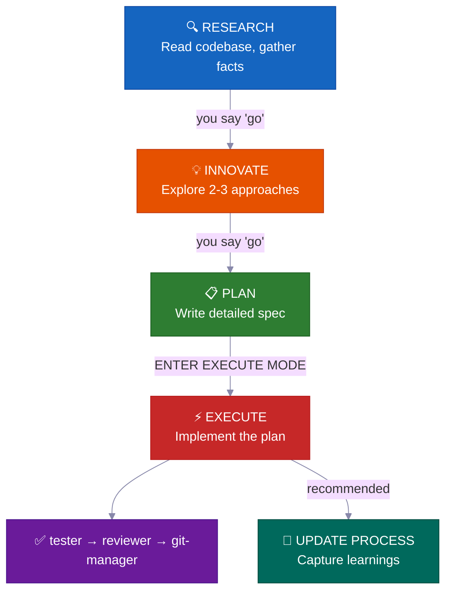
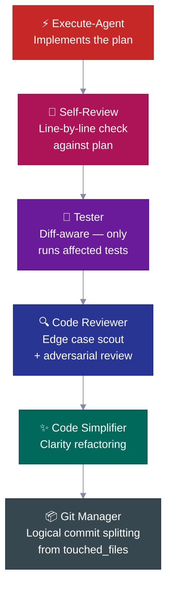
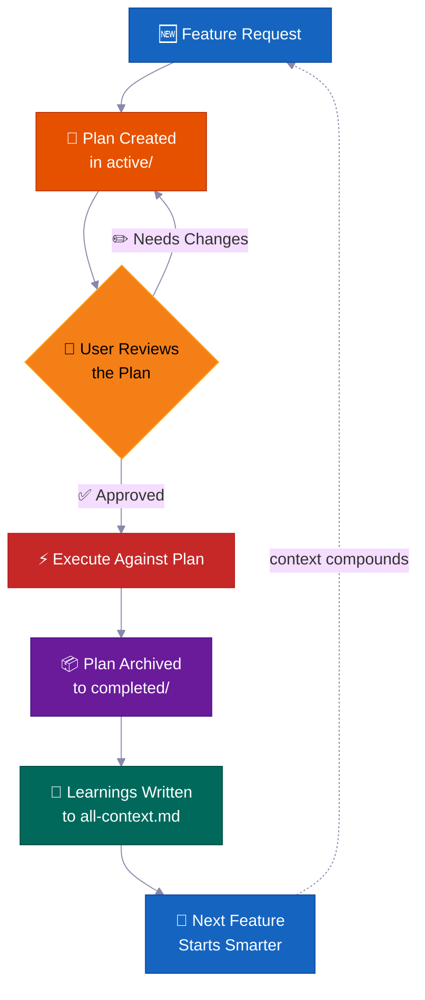
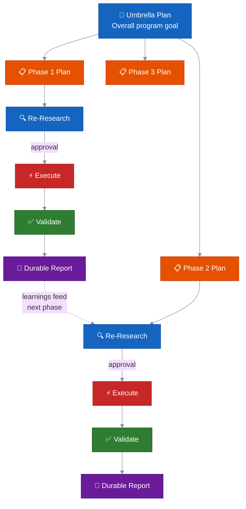

<p align="center">
  <a href="../../README.md">English</a> |
  <a href="README.zh-CN.md">简体中文</a> |
  <a href="README.ja-JP.md">日本語</a> |
  <a href="README.ko-KR.md">한국어</a> |
  <a href="README.vi-VN.md">Tiếng Việt</a> |
  <a href="README.pt-BR.md">Português</a> |
  <a href="README.es.md">Español</a> |
  <a href="README.de.md">Deutsch</a> |
  <strong>Français</strong> |
  <a href="README.hi.md">हिंदी</a>
</p>

<div align="center">

<a href="https://flowser.ai">
  
</a>

*Conçu par des ingénieurs de haut niveau, pour les vibecoders de*<br>
*[flowser.ai](https://flowser.ai) — Agents IA avec ordinateurs pour la mise sur le marché*

<br>

# vibecode-pro-max-kit

**Empêchez votre IA de coder avant de réfléchir — et d'oublier chaque prompt détaillé que vous lui donnez.<br>Ce harness transforme n'importe quel agent de codage IA en une équipe d'ingénierie spec-driven<br>qui recherche, planifie, livre du code de qualité production, et améliore sa mémoire pour survivre à la corruption de contexte même 6 mois plus tard.**

<br>

<p align="center">
  
  <br><br>
  <em>"Concentration Totale — Respiration Spec, Dixième Forme : Le Vibe Flow ne s'arrête jamais."</em><br>
  <strong>— Tanjiro Kamado</strong>
</p>

🔬 Développement spec-driven pour les agents IA<br>
📋 Génère automatiquement des PRDs, gère les backlogs, route le contexte automatiquement<br>
🧠 Base de connaissances auto-améliorante qui s'enrichit au fil des livraisons<br>
⚡ Fonctionne de manière autonome pendant des heures sur de grandes tâches sans perdre l'état<br>
🤝 Plans et specs sont partageables — développeurs, PMs et parties prenantes examinent les mêmes artefacts

<p>
  <a href="https://github.com/withkynam/vibecode-pro-max-kit/stargazers"></a>
  <a href="https://github.com/withkynam/vibecode-pro-max-kit/network/members"></a>
  <a href="LICENSE"></a>
  <a href="https://github.com/withkynam/vibecode-pro-max-kit/graphs/contributors"></a>
  <a href="https://github.com/withkynam/vibecode-pro-max-kit/actions/workflows/validate.yml"></a>
  <a href="https://github.com/withkynam/vibecode-pro-max-kit/commits/main"></a>
  
  
  
</p>

<p>
  <strong>Le harness de codage le plus simple, flexible et adapté aux équipes pour</strong><br><br>
  <a href="https://github.com/anthropics/claude-code"></a>&nbsp;
  <a href="https://github.com/openai/codex"></a>&nbsp;
  <a href="https://cursor.com"></a>&nbsp;
  <a href="https://windsurf.com"></a><br>
  <a href="https://github.com/google-gemini/gemini-cli"></a>&nbsp;
  <a href="https://github.com/opencode-ai/opencode"></a>&nbsp;
  <a href="https://github.com/features/copilot"></a>
</p>

<p>
  <em>Fonctionne avec n'importe quelle stack technique, n'importe quel langage, n'importe quel projet</em><br><br>
  <picture>
    <source media="(prefers-color-scheme: dark)" srcset="https://skillicons.dev/icons?i=ts%2Cjs%2Creact%2Cnextjs%2Cvue%2Cnuxt%2Csvelte%2Cangular%2Cnodejs%2Cexpress%2Cbun%2Cpython%2Cdjango%2Cflask%2Cfastapi&theme=dark&perline=15" />
    <source media="(prefers-color-scheme: light)" srcset="https://skillicons.dev/icons?i=ts%2Cjs%2Creact%2Cnextjs%2Cvue%2Cnuxt%2Csvelte%2Cangular%2Cnodejs%2Cexpress%2Cbun%2Cpython%2Cdjango%2Cflask%2Cfastapi&theme=light&perline=15" />
    
  </picture>
  <br>
  <picture>
    <source media="(prefers-color-scheme: dark)" srcset="https://skillicons.dev/icons?i=ruby%2Crails%2Cgo%2Crust%2Cjava%2Cspring%2Ckotlin%2Cswift%2Cphp%2Claravel%2Ccs%2Cdotnet%2Celixir%2Cgraphql%2Cprisma&theme=dark&perline=15" />
    <source media="(prefers-color-scheme: light)" srcset="https://skillicons.dev/icons?i=ruby%2Crails%2Cgo%2Crust%2Cjava%2Cspring%2Ckotlin%2Cswift%2Cphp%2Claravel%2Ccs%2Cdotnet%2Celixir%2Cgraphql%2Cprisma&theme=light&perline=15" />
    
  </picture>
  <br>
  <picture>
    <source media="(prefers-color-scheme: dark)" srcset="https://skillicons.dev/icons?i=supabase%2Cfirebase%2Cpostgres%2Cmongodb%2Credis%2Cdocker%2Ckubernetes%2Caws%2Cgcp%2Cazure%2Cvercel%2Ccloudflare%2Ctailwind%2Celectron&theme=dark&perline=15" />
    <source media="(prefers-color-scheme: light)" srcset="https://skillicons.dev/icons?i=supabase%2Cfirebase%2Cpostgres%2Cmongodb%2Credis%2Cdocker%2Ckubernetes%2Caws%2Cgcp%2Cazure%2Cvercel%2Ccloudflare%2Ctailwind%2Celectron&theme=light&perline=15" />
    
  </picture>
  <br>
  <p><em>Pas décoratif. Quand vous lancez <code>vc-setup</code>, des agents parallèles analysent votre codebase,<br>
  détectent votre stack, et construisent des groupes de contexte spécifiques au projet que chaque skill lit avant de travailler.<br>
  D'autres harnesses codent en dur les agents pour un seul langage — <code>rust-review-agent</code>, <code>python-linter</code> — inutiles ailleurs.<br>
  Celui-ci s'adapte à n'importe quelle combinaison ci-dessus et capitalise les connaissances au fil des livraisons.</em></p>
</p>

</div>

---

## 🚀 Installation (30 secondes)

> **Lancez cette commande depuis votre dossier de projet.** Ouvrez un terminal et faites `cd` dans le projet où vous souhaitez installer le harness *avant* d'exécuter la commande — elle s'installe dans le répertoire courant.
>
> Vous préférez le piloter depuis votre agent ? Ouvrez Claude Code ou Codex **avec ce dossier de projet comme répertoire de travail**, puis collez le [prompt de configuration complet](#-full-agent-setup-prompt) ci-dessous.

```bash
curl -fsSL https://raw.githubusercontent.com/withkynam/vibecode-pro-max-kit/main/install.sh | bash
```

Ensuite, ouvrez Claude Code et dites :

```
Run vc-setup
```

C'est tout. La skill de configuration détecte votre stack, vous pose des questions sur votre projet (une vraie conversation, pas une checklist), structure le répertoire process, analyse en profondeur votre codebase, et remplit les fichiers de contexte avec un contenu réel — pas des placeholders.

<br>

<details>
<summary><strong>📦 Ce qui est installé</strong></summary>

<br>

```
your-project/
├── .claude/
│   ├── agents/              # 🤖 12 définitions d'agents spécialisés
│   │   ├── vc-research-agent.md
│   │   ├── vc-execute-agent.md
│   │   └── ...
│   ├── skills/              # ⚡ 31 skills auto-découverts
│   │   ├── vc-generate-plan/
│   │   ├── vc-security/
│   │   ├── vc-scout/
│   │   └── ...
│   └── hooks/               # 🪝 7 hooks de cycle de vie
│       ├── privacy-block.cjs
│       ├── scout-block.cjs
│       └── ...
├── .codex/
│   └── agents/              # 🔄 Agents dupliqués pour Codex
├── CLAUDE.md                # 📋 Orchestrateur + règles de routage
├── AGENTS.md                # 📖 Registre des agents
└── process/                 # 🧠 Créé par vc-setup (pas par install)
    └── ...
```

- **Nouveau projet ?** Installe le harness complet, puis `vc-setup` étudie votre codebase
- **Un `.claude/` existant ?** Sauvegardé dans `.vibecode-backup/`, harness installé à neuf, votre `settings.json` restauré
- **Un répertoire `process/` existant ?** Jamais touché par l'installation — `vc-setup` gère la migration intelligemment
- **Un `CLAUDE.md` existant ?** Sauvegardé en `CLAUDE.md.pre-vibecode`, version harness installée

</details>

<a id="-full-agent-setup-prompt"></a>

<details>
<summary><strong>🤖 Prompt de configuration complet</strong> (copiez-collez ceci dans Claude Code pour un contrôle maximal)</summary>

> **D'abord, ouvrez Claude Code ou Codex avec votre dossier de projet comme répertoire de travail** (lancez-le depuis l'intérieur du projet, ou faites `cd` d'abord). Le harness s'installe dans le répertoire courant, donc celui-ci doit être votre projet — puis collez le prompt ci-dessous.

```
First, install the vibecode-pro-max-kit agent harness by running this command:

curl -fsSL https://raw.githubusercontent.com/withkynam/vibecode-pro-max-kit/main/install.sh | bash

After the install completes, run vc-setup to configure everything for this project.

Follow the full interactive flow:

1. DETECT — Read package.json, detect my stack (framework, package manager, monorepo
   structure, test framework, database, auth). Also check if I have any existing .claude/,
   process/, or context files from a previous setup.

2. SHOW ME WHAT YOU FOUND — Present a summary of the detection results and wait for me
   to confirm before continuing. If this is an existing project with process/ folders or
   context files, tell me what you found and what looks good vs what could be improved.

3. ASK ME ABOUT THE PROJECT — Before scaffolding or scanning, have a real conversation
   with me about this project. Don't just ask a fixed list of questions and move on — ask
   follow-ups based on my answers, probe deeper on anything vague, and keep going until
   you genuinely understand the project. Start with the basics (what is this? who uses it?),
   then dig into architecture, features, conventions, pain points, and anything else that
   matters. Summarize your understanding back to me and confirm it's correct before moving on.

4. SCAFFOLD — Create the process/ directory structure. If I already have process/ folders,
   show me what you plan to change and wait for my approval before reorganizing anything.
   Never silently move or delete my existing files.

5. STUDY — Deep-scan the codebase and populate process/context/all-context.md with REAL
   content based on what you find AND what I told you. Include: repo structure, tech stack
   with versions, key patterns and conventions, import aliases, env vars, API routes,
   database schema, test setup. Do not leave placeholder text.

6. VALIDATE — Run all the validation checks to make sure everything is wired correctly.

Important rules:
- If I have existing context files or a well-written CLAUDE.md, read them first and
  preserve what is good. Merge intelligently — do not replace good content with generic scans.
- Show me a summary of what you plan to create or change at each major step and wait
  for my OK before proceeding.
- Do not create empty placeholder files. Only create files that have real content.
- Ask before reorganizing. If my existing setup works, tell me what you would improve
  and let me decide.
```

</details>

<br>

<details>
<summary>Table des matières</summary>

- [Le Problème](#-le-problème)
- [La Solution](#️-la-solution)
- [La Révolution du Vibe Coding](#la-révolution-du-vibe-coding)
- [Pour qui est-ce ?](#pour-qui-est-ce-)
- [En un coup d'œil](#en-un-coup-dœil)
- [Pourquoi les équipes utilisent ceci](#-pourquoi-les-équipes-utilisent-ceci)
- [Comparaison](#comparaison)
- [Ce qui rend ceci différent](#-ce-qui-rend-ceci-différent)
- [Ce qui est inclus](#-ce-qui-est-inclus)
- [Comment ça fonctionne](#-comment-ça-fonctionne)
- [Systèmes de sécurité intégrés](#️-systèmes-de-sécurité-intégrés)
- [Contribuer](#contribuer)
- [Historique des étoiles](#-historique-des-étoiles)

</details>

---

## 🔥 Le Problème

Vous demandez à Claude d'"ajouter le support des webhooks." Il commence immédiatement à écrire du code. Aucune question sur votre architecture. Aucune vérification des patterns existants. Aucun plan. Vous obtenez 400 lignes qui ne correspondent pas à votre codebase, et vous passez une heure à les corriger.

**Mais ce n'est que la surface.** Les problèmes plus profonds sont bien plus graves :

<table>
<tr>
<td width="50%" valign="top">
<h1>🧠</h1>
<strong>Le contexte disparaît à chaque session</strong><br><br>
Votre agent oublie tout ce qu'il a appris. Mêmes erreurs, mêmes questions, à chaque fois. Pas de mémoire, pas de capitalisation des connaissances.
</td>
<td width="50%" valign="top">
<h1>📄</h1>
<strong>La documentation devient obsolète instantanément</strong><br><br>
Vous avez rédigé d'excellents docs de contexte la semaine dernière. Ils sont déjà dépassés. Rien ne les met à jour automatiquement au fur et à mesure que le codebase évolue.
</td>
</tr>
<tr>
<td width="50%" valign="top">
<h1>💥</h1>
<strong>Les grandes tâches s'effondrent à mi-chemin</strong><br><br>
La fenêtre de contexte se remplit, l'état est perdu, l'agent commence à halluciner. Vous repartez de zéro à la troisième heure.
</td>
<td width="50%" valign="top">
<h1>🤝</h1>
<strong>Pas de specs, pas de revue, pas de collaboration</strong><br><br>
Votre PM ne peut pas examiner ce que l'agent s'apprête à construire. Il n'y a aucun artefact à partager, discuter ou approuver avant que le code soit écrit.
</td>
</tr>
<tr>
<td width="50%" valign="top">
<h1>🎭</h1>
<strong>Les décisions d'architecture sont hallucinées</strong><br><br>
L'agent invente des patterns au lieu de rechercher comment d'autres codebases ont résolu le même problème.
</td>
</tr>
</table>

**Votre agent a de l'intelligence mais aucun processus, aucune mémoire, et aucun moyen de collaborer avec votre équipe.**

Que vous soyez développeur, PM ou PDG qui vient de découvrir le vibe coding — ce problème touche tout le monde de la même façon. La solution est la même aussi : **donnez à votre agent un vrai processus de développement.**

---

## 🛠️ La Solution

Ce harness installe un système de développement complet dans votre projet — pas seulement un fichier CLAUDE.md, mais **12 agents spécialisés, 31 skills**, et un workflow phase-locked qui force votre agent à **comprendre avant de construire**.

<br>

<table>
<tr>
<td align="center" width="50%" valign="top">
<h1>📋</h1>
<strong>Plans spec-driven</strong><br><br>
<sub>PMs et développeurs examinent le même artefact de plan avant qu'une seule ligne de code soit écrite</sub>
</td>
<td align="center" width="50%" valign="top">
<h1>🔄</h1>
<strong>Contexte auto-améliorant</strong><br><br>
<sub>Mis à jour automatiquement à chaque livraison de fonctionnalité — la doc ne devient jamais obsolète</sub>
</td>
</tr>
<tr>
<td align="center" width="50%" valign="top">
<h1>⚡</h1>
<strong>Exécution autonome</strong><br><br>
<sub>Survit à la compaction de contexte — fonctionne pendant des heures, pas des minutes</sub>
</td>
<td align="center" width="50%" valign="top">
<h1>🧬</h1>
<strong>Recherche d'architecture</strong><br><br>
<sub>Étudie de vrais codebases avant de prendre des décisions de conception</sub>
</td>
</tr>
<tr>
<td align="center" width="50%" valign="top">
<h1>🧭</h1>
<strong>Routage de contexte intelligent</strong><br><br>
<sub>Charge uniquement ce qui est pertinent — pas toute votre base de connaissances à chaque fois</sub>
</td>
</tr>
</table>

<br>



Chaque transition nécessite votre **approbation explicite**. Rien n'avance automatiquement. Vous gardez le contrôle.

---

## La Révolution du Vibe Coding

<div align="center">
<h3><em>"Le nouveau langage de programmation le plus populaire, c'est l'anglais."</em></h3>
<strong>— Andrej Karpathy</strong>
</div>

<br>

**Le vibe coding a changé qui peut créer des logiciels. Le développement spec-driven change ce qu'ils peuvent livrer.**

<table>
<tr>
<td align="center" width="50%">
<h3>63%</h3>
<sub>des utilisateurs du vibe coding ne sont <strong>PAS</strong> des développeurs</sub>
</td>
<td align="center" width="50%">
<h3>16,2 M</h3>
<sub>développeurs citoyens dans le monde<br>(croissance de 38 % par an)</sub>
</td>
</tr>
<tr>
<td align="center" width="50%">
<h3>4,7 Mds $</h3>
<sub>marché du vibe coding<br>croissance annuelle de 38 %</sub>
</td>
<td align="center" width="50%">
<h3>25 %</h3>
<sub>des startups YC W25 avaient des codebases générées à 95 %+ par l'IA</sub>
</td>
</tr>
</table>

La plupart des outils vous aident à démarrer un projet. Ce harness vous aide à le **terminer** — avec des plans que votre équipe peut examiner, un contexte qui ne devient jamais obsolète, et des systèmes de sécurité qui détectent les erreurs avant qu'elles ne soient livrées.

---

## Pour qui est-ce ?

<div align="center">
<h3><em>"Ce qui compte, ce n'est pas qui l'a tapé. C'est ce qui a été livré."</em></h3>
<strong>— Garry Tan, YC</strong>
</div>

<br>

Que vous veniez de découvrir le vibe coding ou que vous soyez un ingénieur senior livrant des systèmes en production — ce harness s'adapte à votre workflow.

<table>
<tr>
<td width="50%" valign="top">
<h1>🧑‍💼</h1>
<strong>PDG / Fondateur</strong><br><br>
<em>"Construis-moi un SaaS avec authentification, facturation et une landing page"</em><br><br>
L'agent recherche votre stack, rédige un plan d'architecture que vous pouvez examiner, implémente avec des tests, et documente chaque décision pour que votre co-fondateur technique puisse l'auditer ultérieurement.
</td>
<td width="50%" valign="top">
<h1>📊</h1>
<strong>Product Manager</strong><br><br>
<em>"Crée un tableau de bord montrant le MRR, le churn et les métriques de croissance"</em><br><br>
Il génère une spec de style PRD, obtient votre approbation avant d'écrire du code, implémente selon la spec, et archive le plan comme historique de projet consultable.
</td>
</tr>
<tr>
<td width="50%" valign="top">
<h1>🎨</h1>
<strong>Designer</strong><br><br>
<em>"Reproduis cette maquette Figma au pixel près"</em><br><br>
L'agent conscient du design analyse votre maquette, implémente composant par composant avec vos design tokens, et lance des vérifications de comparaison visuelle.
</td>
<td width="50%" valign="top">
<h1>⚙️</h1>
<strong>Ingénieur</strong><br><br>
<em>"Refactorise le module d'authentification pour prendre en charge le RBAC sans interruption de service"</em><br><br>
Il recherche votre code d'authentification actuel et comment d'autres codebases ont résolu le RBAC, rédige un plan de migration avec analyse de blast radius, implémente en toute sécurité avec des notes de rollback.
</td>
</tr>
</table>

---

## En un coup d'œil

<table>
<tr>
<td align="center" width="50%" valign="top">
<h1>🤖</h1>
<h3>12</h3>
<strong>Agents spécialisés</strong><br>
<sub>Experts du domaine qui possèdent chaque phase de développement</sub>
</td>
<td align="center" width="50%" valign="top">
<h1>⚡</h1>
<h3>32</h3>
<strong>Skills auto-découverts</strong><br>
<sub>Capacités réutilisables activées par correspondance de mots-clés</sub>
</td>
</tr>
<tr>
<td align="center" width="50%" valign="top">
<h1>🪝</h1>
<h3>7</h3>
<strong>Hooks de cycle de vie</strong><br>
<sub>Garde-fous pré/post exécution et injection de contexte</sub>
</td>
<td align="center" width="50%" valign="top">
<h1>📜</h1>
<h3>6</h3>
<strong>Protocoles de développement</strong><br>
<sub>Règles de workflow partagées entre tous les outils</sub>
</td>
</tr>
<tr>
<td align="center" width="50%" valign="top">
<h1>🛡️</h1>
<h3>5</h3>
<strong>Systèmes de sécurité</strong><br>
<sub>Phase-locking, blast radius, confidentialité, détection de fuites</sub>
</td>
<td align="center" width="50%" valign="top">
<h1>🔧</h1>
<h3>7</h3>
<strong>Outils supportés</strong><br>
<sub>Claude Code, Codex, Cursor, Windsurf, Antigravity, OpenCode, Copilot</sub>
</td>
</tr>
<tr>
<td align="center" width="50%" valign="top">
<h1>🌍</h1>
<h3>6</h3>
<strong>Langues</strong><br>
<sub>EN · 中文 · 日本語 · 한국어 · Tiếng Việt · Português</sub>
</td>
<td align="center" width="50%" valign="top">
<h1>⚡</h1>
<h3>30 s</h3>
<strong>Temps d'installation</strong><br>
<sub>Une commande curl + configuration automatique fait le reste</sub>
</td>
</tr>
</table>

---

## 💎 Pourquoi les équipes utilisent ceci

> La plupart des harnesses vous donnent un CLAUDE.md et des instructions. Celui-ci vous offre un **système de développement autonome** qui capitalise l'intelligence au fil du temps.

<br>

### 📋 Développement spec-driven — Pas guidé par les vibes

Chaque fonctionnalité reçoit un **plan écrit avec analyse de blast radius** avant qu'une seule ligne de code soit écrite.

> 💡 Génère automatiquement des PRDs, gère les backlogs, organise les groupes de fonctionnalités. Fonctionne aussi bien pour les développeurs que pour les product managers — votre agent planifie comme un ingénieur senior, pas un stagiaire.

**Ce que contient chaque plan :**

| Section | Objectif |
|---|---|
| 📍 **Touchpoints** | Chaque fichier qui sera créé ou modifié, listé dès le départ |
| 📜 **Contrats publics** | Quelles surfaces API ou interfaces changent |
| 💥 **Blast radius** | Ce qui pourrait casser, quels tests lancer, quoi surveiller |
| ✅ **Preuves de vérification** | Comment prouver que l'implémentation est correcte |
| 🔄 **Handoff de reprise** | Suffisamment de contexte pour que n'importe quel agent reprenne en cours de plan |

<br>

### 🔄 Exécution multi-phases autonome — Des heures de travail sans surveillance

Pour les grandes tâches, l'agent exécute une **boucle par phases itérative** :

```
🔍 research → ⚡ execute → ✅ validate → 📄 report → 🔄 repeat
```

> 💡 Il se remet seul en état de marche quand il est bloqué, s'auto-évalue pour améliorer son approche, et écrit des rapports de progression durables sur le disque. **La compaction de contexte ne peut pas l'arrêter** — tout l'état vit dans des fichiers, pas en mémoire.

Partez et revenez à un travail terminé.

<br>

### 🧬 Recherche d'architecture automatique — Apprenez de n'importe quel codebase

L'agent ne fait pas que lire votre code — il **étudie d'autres dépôts** pour apprendre comment ils ont résolu des problèmes similaires (`vc-xia`).

> 💡 Il recherche, compare les approches, et adapte les meilleurs patterns à votre codebase. Les décisions d'architecture sont éclairées par des implémentations réelles, pas par des meilleures pratiques hallucinées.

<br>

### 🧭 Routage de contexte intelligent persistant — Toujours le bon contexte

Le contexte n'est pas un fichier géant. Il est organisé en **domaines de connaissances auto-routés** :

```
process/context/
├── all-context.md              # 🧭 Routeur racine — lit votre tâche, charge ce qui est pertinent
├── tests/
│   └── all-tests.md            # 🧪 Test runners, commandes, débogage
├── container/
│   └── all-container.md        # 🐳 Docker, déploiement, infra
├── uxui/
│   └── all-uxui.md             # 🎨 Composants, design tokens, patterns
└── {votre-domaine}/
    └── all-{domain}.md         # 📚 N'importe quel domaine avec 3+ docs durables
```

> 💡 Quand l'agent travaille sur la facturation, il charge le contexte de facturation — pas toute la documentation de votre codebase. Le contexte **se met à jour automatiquement à chaque fois que vous terminez une fonctionnalité**, donc il ne devient jamais obsolète.

<br>

### 🧠 Base de connaissances auto-améliorante — Devient plus intelligente à chaque livraison

Chaque fonctionnalité terminée réinjecte les apprentissages dans le système de contexte.

> 💡 Les résultats de recherche, les décisions architecturales, les insights de débogage, et les patterns de codage sont **capturés et indexés automatiquement**. Votre 100e fonctionnalité bénéficie de tout ce qui a été appris dans les 99 premières. Les connaissances se capitalisent — elles ne se réinitialisent pas.

---

## Comparaison

| Fonctionnalité | vibecode-pro-max-kit | Superpowers | GSD | gstack |
|---------|---------------------|-------------|-----|--------|
| Cycle de vie spec-driven | RIPER-5 complet (research → plan → execute → verify) | Workflows obligatoires | Correction de context-rot | Partiel |
| Sécurité phase-locked | Restrictions d'outils par mode (research en lecture seule, innovate sans Bash) | Contraintes par skill | Séparation de phases | Aucune |
| Support multi-outils | 7 outils via AGENTS.md + natif | Plugin Claude Code | 14 runtimes | 1 outil |
| Contexte auto-améliorant | Groupes de contexte routés par domaine, mis à jour après chaque fonctionnalité | Mémoire par plugin | État persisté sur disque | Manuel |
| Collaboration d'équipe | Specs partagées, plans et artefacts de revue | Solo | Solo | Solo |
| Système de skills | 32 auto-découverts, correspondance par mots-clés à chaque prompt | 86 skills composables | Meta-prompting | 23 outils de rôle |
| Programmes multi-phases | Plans parapluie + boucle d'exécution phase par phase avec vérifications de régression | Tâche unique | Tâche unique | Tâche unique |
| Pipeline qualité | Chaîne en 6 étapes (code-review → test → simplify → security → audit → commit) | Qualité par skill | Pas de chaîne auto | Pas de chaîne auto |
| Installation | Installation `curl` en 30 secondes + configuration auto | Marketplace de plugins | npx one-liner | git clone |
| Routage de contexte | Table de routage par domaine avec packs de contexte groupés | Contexte de skill plat | Contexte plat | Fichier unique |

> **Sur l'étendue des runtimes :** GSD supporte 14 runtimes. Nous en supportons 7 en profondeur — avec des harnesses d'agents complets, la découverte de skills, et des hooks de cycle de vie sur chaque plateforme. Étendue vs. profondeur : à vous de choisir.

---

## ⚡ Ce qui rend ceci différent

La plupart des harnesses d'agents vous donnent un grand CLAUDE.md et quelques instructions. Voici ce que celui-ci fait réellement :

<br>

<table>
<tr>
<td width="50%" valign="top">
<h1>🔒</h1>
<strong>Restrictions d'outils phase-locked</strong><br><br>
Votre agent <strong>ne peut littéralement pas</strong> écrire du code pendant la recherche. RESEARCH est en lecture seule, INNOVATE n'a pas de Bash, PLAN ne peut écrire que dans <code>process/</code>. <strong>Suppression réelle de capacités</strong>, pas des suggestions.
</td>
<td width="50%" valign="top">
<h1>🎯</h1>
<strong>Routage automatique intelligent</strong><br><br>
Détecte votre intention à partir du langage naturel. "build webhook support" → pipeline complet. "login is broken" → debugger. Priorité à 6 niveaux, une question de clarification maximum.
</td>
</tr>
<tr>
<td width="50%" valign="top">
<h1>🔍</h1>
<strong>Découverte automatique de skills</strong><br><br>
Avant de router toute requête, analyse <strong>32 skills</strong> et fait correspondre les mots-clés. Dites "add webhook support" et <code>vc-security</code> + <code>vc-scenario</code> apparaissent automatiquement.
</td>
<td width="50%" valign="top">
<h1>💾</h1>
<strong>Survit à la compaction de contexte</strong><br><br>
Plans, rapports, docs de contexte et apprentissages vivent tous sur le disque. Le hook d'init de session réinjecte les gates d'approbation après compaction. <strong>Rien n'est perdu.</strong>
</td>
</tr>
<tr>
<td width="50%" valign="top">
<h1>🛡️</h1>
<strong>Détection de violations auto-policée</strong><br><br>
Quand l'agent est sur le point de franchir une limite de phase, il s'arrête lui-même : <em>"PHASE JUMPING PREVENTED"</em>. Un <strong>garde contre les hallucinations structurelles</strong>.
</td>
<td width="50%" valign="top">
<h1>🔄</h1>
<strong>Fonctionne avec 7 outils de codage IA</strong><br><br>
Deux standards ouverts — <code>AGENTS.md</code> et <code>SKILL.md</code> — signifient <strong>zéro adaptateur, zéro plugin, zéro configuration.</strong> Commencez dans Claude Code, passez à Cursor, continuez dans Codex.
</td>
</tr>
</table>

---

## 🧭 Comment ça fonctionne

```
Votre requête
  → Étape 0 : Découverte de skills (correspondance de mots-clés → surface des skills pertinents)
  → Détection d'intention (fonctionnalité / bug / question / refactoring / UI)
  → Routage vers le bon agent
  → Exécution phase-locked avec transitions explicites
```

L'orchestrateur **ne fait jamais le travail lui-même** — il route, surveille et gère les transitions.

<br>

### 📊 Le Workflow

| Phase | Ce qui se passe | Vous dites |
|-------|-------------|---------|
| 🔍 **RESEARCH** | Collecte de faits en lecture seule — codebase + web | *(automatique sur les demandes de fonctionnalités)* |
| 💡 **INNOVATE** | Explorer 2-3 approches avec compromis | `go` |
| 📋 **PLAN** | Écrire une spec détaillée que vous pouvez examiner | `go` |
| ⚡ **EXECUTE** | Implémenter exactement ce qui était planifié | `ENTER EXECUTE MODE` |
| 🧠 **UPDATE PROCESS** | Capturer les apprentissages, mettre à jour le contexte, archiver le plan | *(recommandé après un travail non trivial)* |

> 💡 **Raccourcis :** `ENTER FAST MODE - [tâche]` compresse RESEARCH+INNOVATE+PLAN en un seul passage — fait quand même une pause avant EXECUTE. Les corrections triviales (fichier unique, <15 lignes, pas de changements de schéma/auth) passent directement à l'exécution.

<br>

### 💻 Session typique

```
# 🆕 Demande de fonctionnalité
Vous : "add webhook support to the API"
→ La découverte de skills révèle : vc-scenario, vc-security
→ research-agent collecte le contexte (lecture seule, ne peut pas toucher le code)
→ Vous dites "go" → innovate-agent explore les approches
→ Vous dites "go" → plan-agent rédige la spec avec blast radius
→ Vous examinez le plan, dites "ENTER EXECUTE MODE"
→ execute-agent implémente → auto-revue → tester → code-reviewer → git-manager
→ Paquet de clôture : ce qui a changé, ce qui est vérifié, prochaine étape recommandée
```

```
# 🐛 Correction de bug
Vous : "login redirect is broken"
→ Route vers vc-debugger → collecte de preuves → hypothèses concurrentes
→ Cause racine identifiée avec chaîne de preuves
→ execute-agent implémente le correctif → pipeline qualité
```

```
# ⏩ Mode rapide
Vous : "ENTER FAST MODE - add rate limiting middleware"
→ Research+innovate+plan compressés en un seul passage
→ Pause de sécurité obligatoire → vous examinez → "ENTER EXECUTE MODE"
```

```
# 🏗️ Grand programme
Vous : "build a full testing platform"
→ Crée un plan parapluie + plans de phases dans un dossier de fonctionnalité
→ Chaque phase : re-research → approuver → exécuter → valider → rapport durable
→ La progression survit à la compaction de contexte — rapports durables sur le disque
```

```
# 🔄 Optimisation autonome
Vous : "improve test coverage to 80% using vc-autoresearch"
→ L'agent itère : faire un changement → commit → mesurer → garder/annuler
→ Détection de blocage après 5 annulations consécutives → changement de stratégie
→ Piste d'audit complète en TSV
```

---

## 🛡️ Systèmes de sécurité intégrés

Ce ne sont pas que des directives — ce sont des **contraintes structurelles** intégrées dans chaque agent.

<table>
<tr>
<td width="50%" valign="top">
<h1>⏸️</h1>
<strong>Point de contrôle à 50% de l'implémentation</strong><br><br>
À environ mi-chemin de l'exécution, l'agent <strong>fait une pause</strong> pour rapporter l'avancement, lister les éléments terminés et restants, et demande : <em>"Continuer avec l'approche actuelle ou faire une pause et retourner au PLAN ?"</em>
</td>
<td width="50%" valign="top">
<h1>🚫</h1>
<strong>Ne jamais dévier silencieusement</strong><br><br>
Si l'execute-agent rencontre un problème nécessitant de s'écarter du plan, il <strong>s'arrête immédiatement</strong>, explique le problème, et retourne en mode PLAN. Pas d'improvisation discrète.
</td>
</tr>
<tr>
<td width="50%" valign="top">
<h1>🔙</h1>
<strong>Protocole d'abandon d'approche</strong><br><br>
Quand une approche échoue, l'agent évalue les composants réutilisables, documente les leçons avant suppression, crée un résumé d'abandon, et retourne au PLAN.
</td>
<td width="50%" valign="top">
<h1>🔐</h1>
<strong>Hook de garde-fous de confidentialité</strong><br><br>
L'agent est <strong>bloqué pour lire</strong> les fichiers <code>.env</code>, les identifiants, les clés SSH, et les fichiers <code>.pem</code>. Doit demander une approbation explicite.
</td>
</tr>
<tr>
<td width="50%" valign="top">
<h1>⚠️</h1>
<strong>Packs de preuves pour les changements à haut risque</strong><br><br>
Pour les changements touchant l'auth, la facturation, les migrations de schéma, ou les API publiques — le système exige un pack de preuves formel avant de déclarer le travail "terminé".
</td>
<td width="50%" valign="top">
<h1>📊</h1>
<strong>Score de signal de dérive</strong><br><br>
Après l'exécution, le système évalue l'urgence : <strong>LOW</strong> (contact léger), <strong>MEDIUM</strong> (changements significatifs), <strong>HIGH</strong> (fichiers harness/protocole touchés).
</td>
</tr>
</table>

---

## 🔍 Intelligence pré-implémentation

Avant qu'une seule ligne de code soit écrite, le système peut détecter des problèmes grâce à une analyse spécialisée :

<br>

<table>
<tr>
<td width="50%" valign="top">
<h1>🎭</h1>
<strong>Débat pré-implémentation à 5 personas</strong><br><br>
<code>vc-predict</code> — Architecte, Sécurité, Performance, UX et Avocat du Diable débattent de votre plan. Produit un verdict <strong>GO / CAUTION / STOP</strong> avant que vous n'écriviez une seule ligne de code.
</td>
<td width="50%" valign="top">
<h1>🎲</h1>
<strong>Générateur de cas limites en 12 dimensions</strong><br><br>
<code>vc-scenario</code> — Décompose n'importe quelle fonctionnalité selon 12 dimensions (types d'utilisateurs, extrêmes d'entrée, timing, échelle, état, env, erreurs, auth, données, intégrations, conformité, logique métier). Les sorties sont utilisables comme specs de tests.
</td>
</tr>
<tr>
<td width="50%" valign="top">
<h1>🔐</h1>
<strong>Audit de sécurité STRIDE + OWASP</strong><br><br>
<code>vc-security</code> — Audit de sécurité à double méthodologie avec audit de dépendances, détection de secrets, et <strong>mode auto-correctif</strong> qui trie par sévérité et corrige les Critiques en premier avec des gardes de régression.
</td>
</tr>
</table>

---

## 🤖 Capacités d'agents autonomes

<br>

<table>
<tr>
<td width="50%" valign="top">
<h1>🔄</h1>
<strong>Optimisation autonome de métriques</strong><br><br>
<code>vc-autoresearch</code> — Définissez un objectif, partez. Boucle itérative sauvegardée par git : faire UN changement atomique → commit → mesurer → garder ou annuler. La détection de blocage après 5 annulations consécutives déclenche des changements de stratégie.
</td>
<td width="50%" valign="top">
<h1>👥</h1>
<strong>Équipes d'agents parallèles</strong><br><br>
<code>vc-team</code> — Plusieurs agents travaillant <strong>simultanément</strong> avec isolation par git worktree. Recherche en parallèle, exécution en parallèle, revue en parallèle, débogage adversarial.
</td>
</tr>
<tr>
<td width="50%" valign="top">
<h1>🔬</h1>
<strong>Débogage preuves-avant-hypothèses</strong><br><br>
<code>vc-debugger</code> — Collecte les preuves d'abord → forme 2-3 hypothèses concurrentes → teste chacune systématiquement → documente le chemin d'élimination. <strong>Ne devine jamais — prouve.</strong>
</td>
</tr>
</table>

---

## ✅ Pipeline qualité — Intégré à l'exécution

L'execute-agent ne se contente pas d'écrire du code et de déclarer le travail terminé. Il enchaîne automatiquement un **pipeline qualité** :

<br>



<br>

| Étape | Ce qu'elle fait |
|---|---|
| 🔎 **Auto-revue** | Vérifie chaque élément de la checklist par rapport au plan pour détecter les écarts, les documente |
| 🧪 **Tester** | Mappe les fichiers modifiés aux fichiers de tests, escalade automatiquement à la suite complète quand >70% sont mappés |
| 🔍 **Code reviewer** | Lance l'explorateur de cas limites AVANT la revue, vérifie les requêtes N+1, les chemins d'auth, les fuites de données |
| ✨ **Simplifier** | Refactoring de clarté après la revue — aucun changement de comportement |
| 📦 **Git manager** | Reçoit la liste `touched_files`, divise en commits conventionnels logiques, refuse les fichiers inconnus |

---

## 📋 Le cycle de vie du plan — Spec-driven, pas vibe-driven

Chaque fonctionnalité non triviale suit un **cycle de vie du plan** — une spec écrite qui est créée, examinée, exécutée, et archivée comme historique du projet.

<br>



<br>

> 💡 Dans six mois, quand quelqu'un demande *"pourquoi avons-nous construit l'auth de cette façon ?"*, la réponse est dans `completed/`. Pas perdue dans un fil Slack.

<br>

**Où les plans vivent sur le disque :**

```
process/
├── general-plans/
│   ├── active/                  # 📋 Plans en cours de travail
│   │   └── webhooks_PLAN_28-05-26.md
│   ├── completed/               # ✅ Plans archivés (historique consultable)
│   ├── backlog/                 # 📌 Travail différé
│   ├── reports/                 # 📄 Rapports transversaux
│   └── references/              # 📚 Sorties de recherche
└── features/
    └── billing/                 # 🏷️ Scopé par fonctionnalité (5+ artefacts)
        ├── active/
        ├── completed/
        ├── backlog/
        ├── reports/
        └── references/
```

---

## 🏗️ Programmes de phases — De grands projets qui ne s'effondrent pas

Les fonctionnalités normales utilisent un plan. **Les grands projets multi-phases** utilisent un programme de phases — un plan parapluie plus des plans de phase individuels, chacun avec sa propre gate de validation.

<br>



<br>

**Fonctionnalités clés :**

| | Fonctionnalité | Pourquoi c'est important |
|---|---|---|
| 🔄 | **Re-recherche à chaque phase** | Vérifie la dérive du code, lit les derniers rapports, met à jour les hypothèses |
| ✅ | **Gates de validation** | Une phase n'est pas `VERIFIED` tant que les preuves ne le prouvent pas. Statut honnête : `PLANNED` → `CODE DONE` → `TESTING` → `VERIFIED` ou `BLOCKED` |
| 📄 | **Rapports durables** | Chaque phase écrit les résultats sur le disque. La progression survit à la compaction de contexte |
| 🧠 | **Les apprentissages alimentent la suite** | Les découvertes de la Phase 1 mettent à jour le plan de la Phase 2 avant exécution |
| 🏗️ | **Fondation vs expansion** | Sépare explicitement "prouver l'architecture" de "tout implémenter" |
| 🚧 | **Gestion honnête des blocages** | Les phases bloquées restent `BLOCKED` avec des preuves. Pas de forçage du statut vert |

---

## 🧠 Context Groups — Connaissances organisées, pas un fichier géant

Les connaissances du projet sont organisées en **context groups** — des domaines de connaissances durables, chacun avec un routeur `all-{group}.md` qui indique aux agents quoi lire et quand.

<br>

```
process/context/
├── all-context.md              # 🧭 Routeur racine — architecture, stack, patterns, conventions
├── tests/
│   └── all-tests.md            # 🧪 Test runners, commandes, procédures de débogage
├── container/
│   └── all-container.md        # 🐳 Docker, déploiement, procédures infra
├── uxui/
│   └── all-uxui.md             # 🎨 Composants, design tokens, patterns
├── infra/
│   └── all-infra.md            # 🖥️ Nœuds workers, provisionnement, DNS
├── skills/
│   └── all-skills.md           # ⚡ Runtime de skills, architecture applicative
├── workflows/
│   └── all-workflows.md        # 🔄 Runtime de workflow, déploiement
└── {votre-domaine}/
    └── all-{domain}.md         # 📚 N'importe quel domaine de connaissances avec 3+ docs durables
```

<br>

| | Comment ça fonctionne |
|---|---|
| 🧭 **Pattern de routeur** | Les agents ne lisent que ce qui est pertinent pour leur tâche, pas tout |
| 📏 **Promotion automatique** | Les sujets avec 3+ docs ou 800+ lignes obtiennent leur propre context group |
| 🔄 **Docs vivants** | Mis à jour par `update-process-agent` après chaque fonctionnalité non triviale |
| 🧪 **Auditable** | `vc-audit-context` vérifie le routage et la cohérence |

---

## 📁 Dossiers de fonctionnalités — Mémoire de projet auto-organisée

Quand un sujet accumule 5+ artefacts, il obtient son propre **dossier de fonctionnalité** — un conteneur de cycle de vie complet.

<br>

```
process/features/{feature}/
├── active/       # 📋 Plans en cours de travail
├── completed/    # ✅ Plans archivés (historique décisionnel consultable)
├── backlog/      # 📌 Travail différé (les agents vérifient avant de dupliquer)
├── reports/      # 📄 Rapports d'exécution, post-mortems, résultats de validation
└── references/   # 📚 Sorties de recherche qui informent les décisions futures
```

<br>

| | Ce qui se passe |
|---|---|
| 🆕 | Le nouveau travail commence dans `active/` → les rapports s'accumulent → le plan est archivé dans `completed/` |
| 📌 | Le travail différé va dans `backlog/` — les agents le vérifient avant de créer des plans en double |
| 📦 | La promotion de fonctionnalité se produit automatiquement quand les artefacts généraux atteignent 5+ |
| 🔍 | Chaque fonctionnalité a un historique complet et autonome — plans, décisions, rapports, recherches |

---

## 🤖 Ce qui est inclus

<br>

### 12 Agents

<details>
<summary>Cliquez pour développer la liste des agents (12 agents)</summary>

<br>

**Agents de workflow principaux** — un par phase RIPER-5 :

| Agent | Rôle |
|-------|------|
| 🔍 `vc-research-agent` | Recherche codebase + web, lecture seule. Suivi des contradictions intégré |
| 💡 `vc-innovate-agent` | Brainstorming de 2-3 approches. Doit produire un résumé décisionnel avant PLAN |
| 📋 `vc-plan-agent` | Rédige la spec avec garde-fous anti-rationalisation. "Je sais déjà comment" n'est pas un plan |
| ⚡ `vc-execute-agent` | Implémente selon le plan. Point de contrôle à 50%, protocole de déviation, auto-revue |
| ⏩ `vc-fast-mode-agent` | RESEARCH→INNOVATE→PLAN compressés avec pause de sécurité obligatoire |
| 🧠 `vc-update-process-agent` | Checklist obligatoire en 7 phases incluant l'analyse des artefacts obsolètes |

<br>

**Agents spécialistes** — appelés pendant EXECUTE ou en mode autonome :

| Agent | Rôle |
|-------|------|
| 🐛 `vc-debugger` | Preuves avant hypothèses. Hypothèses concurrentes, chaînes d'élimination |
| 🧪 `vc-tester` | Diff-aware. Lance uniquement les tests affectés. Escalade automatique sur les changements de config |
| 🔎 `vc-code-reviewer` | Explorateur de cas limites AVANT la revue. Détection N+1, validation des chemins d'auth |
| ✨ `vc-code-simplifier` | Refactoring de clarté sans changement de comportement |
| 🎨 `vc-ui-ux-designer` | Frontend conscient du design. Peut lancer un subagent de recherche en cours d'exécution |
| 📦 `vc-git-manager` | Division logique des commits à partir de `touched_files`. Refuse les fichiers inconnus |

</details>

<br>

### 31 Skills (auto-découverts)

<details>
<summary>Cliquez pour développer la liste des skills (31 skills)</summary>

<br>

**🔧 Skills contractuels** — `vc-generate-plan` · `vc-generate-context` · `vc-audit-context` · `vc-audit-plans` · `vc-audit-vc` · `vc-setup` · `vc-update` · `vc-publish`

**🧠 Planification** — `vc-predict` (débat à 5 personas) · `vc-scenario` (cas limites en 12 dimensions) · `vc-sequential-thinking` · `vc-problem-solving`

**🐛 Débogage & sécurité** — `vc-debug` · `vc-security` (STRIDE + OWASP + auto-correctif) · `vc-autoresearch` (optimisation autonome)

**📚 Recherche** — `vc-docs-seeker` · `vc-scout` · `vc-docs` · `vc-repomix` · `vc-xia` (comparaison de dépôts)

**🎨 Frontend** — `vc-frontend-design` · `vc-chrome-devtools` · `vc-agent-browser` · `vc-web-testing`

**⚙️ Utilitaires** — `vc-context-engineering` · `vc-mcp-management` · `vc-preview` · `vc-team` (agents parallèles) · `vc-tech-graph` · `vc-watzup` (handoff de session) · `vc-merge-worktree`

</details>

> 💡 Certains skills (comme `vc-xia`) ont été inspirés par [ClaudeKit](https://claudekit.cc/?ref=OEOM7R7G) de [@mrgoonie](https://github.com/mrgoonie). Nous nous sommes concentrés sur moins de skills, mais plus approfondis, plutôt que 80+.

<br>

### 🪝 7 Hooks

| Hook | Ce qu'il fait |
|------|-------------|
| 🔐 **Garde-fous de confidentialité** | Bloque `.env`, identifiants, clés SSH. Requiert une approbation explicite |
| 🚫 **Bloqueur de scout** | Empêche l'agent d'errer dans `node_modules/`, `dist/`. Syntaxe gitignore `.ckignore` |
| 🧠 **Init de session** | Détecte la stack, injecte les variables d'env, récupère les gates d'approbation après compaction |
| 💉 **Contexte de subagent** | Injecte un bloc de contexte compact d'environ 200 tokens dans chaque subagent |
| ✨ **Qualité d'édition** | Après 5+ modifications, suggère de lancer code-simplifier (non bloquant, régulé) |
| 📛 **Nommage descriptif** | Conventions de nommage de fichiers adaptées au langage à chaque écriture |
| 📊 **Suivi d'utilisation** | Métriques de session et conscience des tokens |

<br>

**Où tout vit :**

```
your-project/
├── .claude/
│   ├── agents/              # 🤖 12 définitions d'agents (.md)
│   ├── skills/              # ⚡ 31 modules de skills (chacun un répertoire avec SKILL.md)
│   └── hooks/               # 🪝 7 hooks de cycle de vie (.cjs)
├── .codex/
│   └── agents/              # 🔄 Dupliqué pour la compatibilité Codex
├── .agents/
│   └── skills -> ../.claude/skills   # 🔗 Lien symbolique pour la découverte Codex
├── CLAUDE.md                # 📋 Config de l'orchestrateur + règles de routage
├── AGENTS.md                # 📖 Registre des agents + skills
└── process/
    ├── context/             # 🧠 Domaines de connaissances auto-routés
    ├── general-plans/       # 📋 Plans transversaux + rapports
    ├── features/            # 🏷️ Dossiers de cycle de vie scopés par fonctionnalité
    └── development-protocols/  # 📜 Règles de workflow partagées
```

---

## 🔄 Mise à jour

Récupérez les dernières améliorations du harness :

```
Run vc-update
```

> 💡 Affiche un diff de simulation, attend la confirmation. Votre répertoire `process/` et votre contenu spécifique au projet ne sont **jamais touchés**.

---

## Contribuer

Les contributions sont les bienvenues ! Consultez [CONTRIBUTING.md](CONTRIBUTING.md) pour les directives.

<br>

**Liens rapides :**

- 🐛 [Signaler un bug](https://github.com/withkynam/vibecode-pro-max-kit/issues/new?template=1.bug_report.yml)
- 💡 [Demander une fonctionnalité](https://github.com/withkynam/vibecode-pro-max-kit/issues/new?template=2.feature_request.yml)
- ⚡ [Soumettre un skill](https://github.com/withkynam/vibecode-pro-max-kit/issues/new?template=3.skill_submission.yml)
- 🌐 [Ajouter une traduction](https://github.com/withkynam/vibecode-pro-max-kit/issues/new?template=5.translation.yml)

<br>

<a href="https://github.com/withkynam/vibecode-pro-max-kit/graphs/contributors">
  
</a>

<br>

### 🙏 Remerciements

Ce projet a bénéficié de [ClaudeKit](https://claudekit.cc/?ref=OEOM7R7G) de [@mrgoonie](https://github.com/mrgoonie) — en particulier des skills comme `ck:xia` qui ont inspiré certains des nôtres.

La différence : vibecode-pro-max-kit se concentre sur le framework de développement spec-driven et l'organisation de contexte auto-améliorante, sans vous surcharger de 80+ skills. Moins d'outils, plus de structure.

---

## ⭐ Historique des étoiles

<a href="https://star-history.com/#withkynam/vibecode-pro-max-kit&Date">
 <picture>
   <source media="(prefers-color-scheme: dark)" srcset="https://api.star-history.com/svg?repos=withkynam/vibecode-pro-max-kit&type=Date&theme=dark" />
   <source media="(prefers-color-scheme: light)" srcset="https://api.star-history.com/svg?repos=withkynam/vibecode-pro-max-kit&type=Date" />
   
 </picture>
</a>

---

## 📄 Licence

MIT
