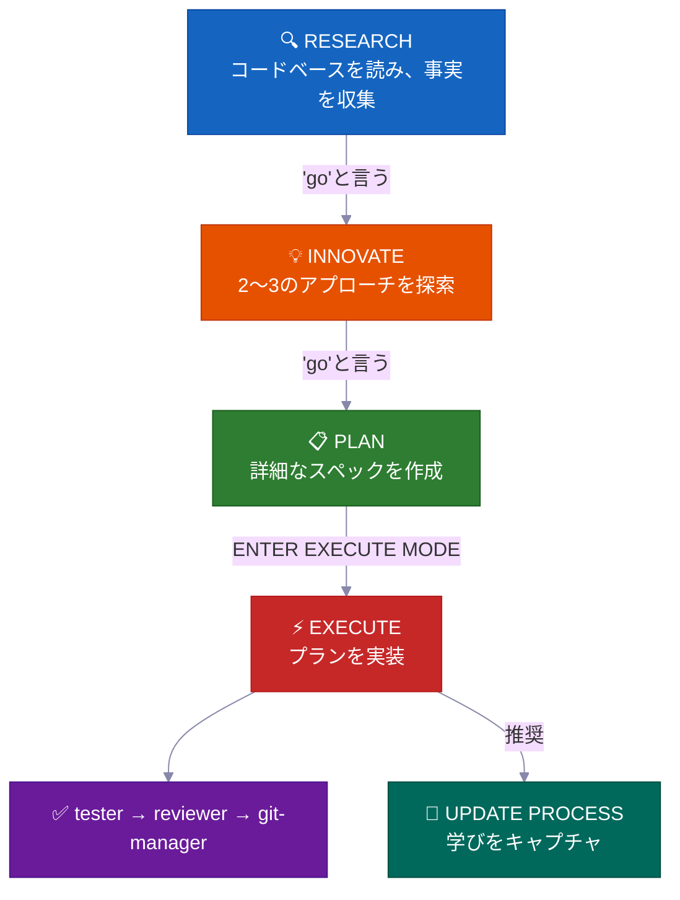
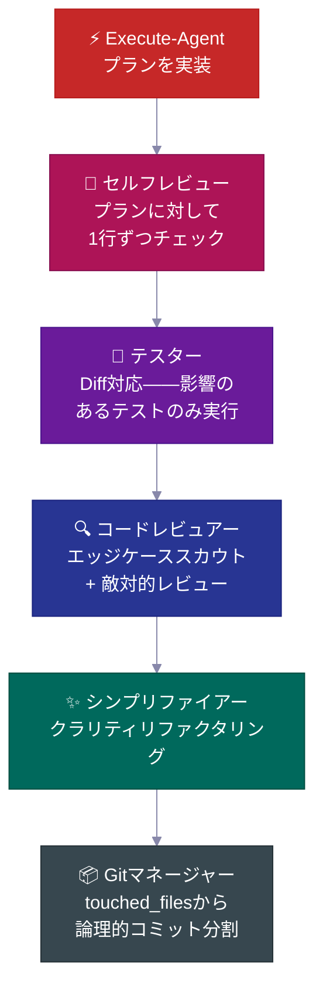
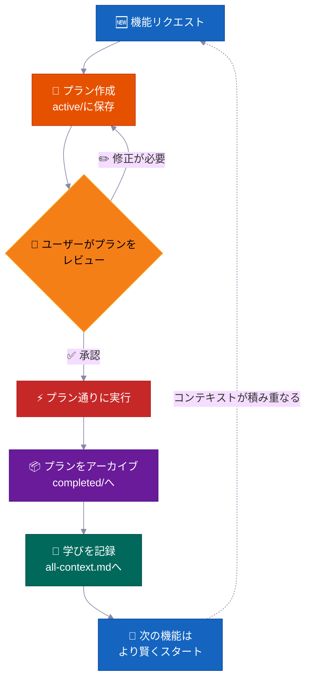
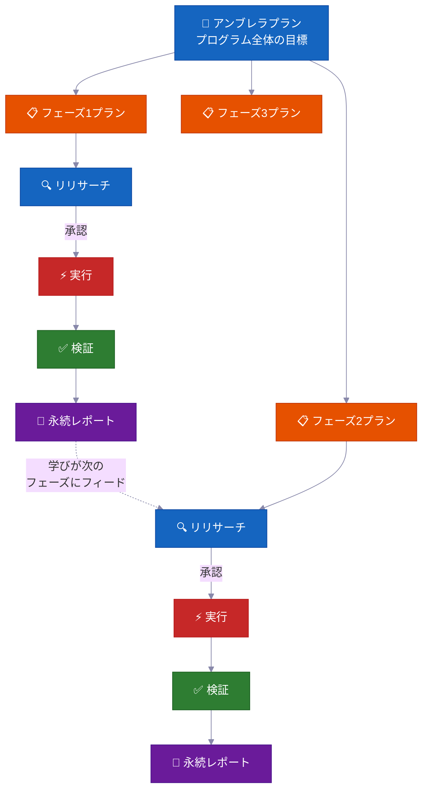

<p align="center">
  <a href="../../README.md">English</a> |
  <a href="README.zh-CN.md">简体中文</a> |
  <strong>日本語</strong> |
  <a href="README.ko-KR.md">한국어</a> |
  <a href="README.vi-VN.md">Tiếng Việt</a> |
  <a href="README.pt-BR.md">Portugues</a>
</p>

<div align="center">

<a href="https://flowser.ai">
  
</a>

*世界トップクラスのエンジニアが、バイブコーダーのために開発*<br>
*[flowser.ai](https://flowser.ai) — GTM向けコンピュータ付きAIエージェント*

<br>

# vibecode-pro-max-kit

**AIが考える前にコードを書き始めるのを止めよう——あなたの詳細なプロンプトを毎回忘れるのも。<br>このハーネスはあらゆるAIコーディングエージェントを、スペック駆動のエンジニアリングチームに変えます。<br>リサーチし、計画を立て、プロダクション品質のコードを出荷し、6ヶ月後のコンテキスト腐敗すら生き延びる自己改善メモリを持ちます。**

<br>

<p align="center">
  
  <br><br>
  <em>「全集中——スペックの呼吸 拾ノ型・生生流転。<br>機能を出荷するたびに強くなる、途切れることのない開発の循環。<br>コンテキストは積み重なる。流れは決して途切れない。」</em><br>
  <strong>——竈門炭治郎</strong>
</p>

🔬 AIエージェントのためのスペック駆動開発<br>
📋 PRDの自動生成、バックログ管理、コンテキストの自動ルーティング<br>
🧠 機能をリリースするたびに成長する自己改善型ナレッジベース<br>
⚡ 大きなタスクでも状態を失わずに何時間も自律実行<br>
🤝 プランとスペックは共有可能——開発者、PM、ステークホルダーが同じ成果物をレビューできます

<p>
  <a href="https://github.com/withkynam/vibecode-pro-max-kit/stargazers"></a>
  <a href="https://github.com/withkynam/vibecode-pro-max-kit/network/members"></a>
  <a href="LICENSE"></a>
  <a href="https://github.com/withkynam/vibecode-pro-max-kit/graphs/contributors"></a>
  <a href="https://github.com/withkynam/vibecode-pro-max-kit/actions/workflows/validate.yml"></a>
  <a href="https://github.com/withkynam/vibecode-pro-max-kit/commits/main"></a>
  
  
  
</p>

<p>
  <strong>最もシンプルで、最も柔軟で、チームフレンドリーなコーディングハーネス</strong><br><br>
  <a href="https://github.com/anthropics/claude-code"></a>&nbsp;
  <a href="https://github.com/openai/codex"></a>&nbsp;
  <a href="https://cursor.com"></a>&nbsp;
  <a href="https://windsurf.com"></a><br>
  <a href="https://github.com/google-gemini/gemini-cli"></a>&nbsp;
  <a href="https://github.com/opencode-ai/opencode"></a>&nbsp;
  <a href="https://github.com/features/copilot"></a>
</p>

<p>
  <em>あらゆるテックスタック、あらゆる言語、あらゆるプロジェクトで動作</em><br><br>
  <picture>
    <source media="(prefers-color-scheme: dark)" srcset="https://skillicons.dev/icons?i=ts,js,react,nextjs,vue,nuxt,svelte,angular,nodejs,express,bun,python,django,flask,fastapi&theme=dark&perline=15" />
    <source media="(prefers-color-scheme: light)" srcset="https://skillicons.dev/icons?i=ts,js,react,nextjs,vue,nuxt,svelte,angular,nodejs,express,bun,python,django,flask,fastapi&theme=light&perline=15" />
    
  </picture>
  <br>
  <picture>
    <source media="(prefers-color-scheme: dark)" srcset="https://skillicons.dev/icons?i=ruby,rails,go,rust,java,spring,kotlin,swift,php,laravel,cs,dotnet,elixir,graphql,prisma&theme=dark&perline=15" />
    <source media="(prefers-color-scheme: light)" srcset="https://skillicons.dev/icons?i=ruby,rails,go,rust,java,spring,kotlin,swift,php,laravel,cs,dotnet,elixir,graphql,prisma&theme=light&perline=15" />
    
  </picture>
  <br>
  <picture>
    <source media="(prefers-color-scheme: dark)" srcset="https://skillicons.dev/icons?i=supabase,firebase,postgres,mongodb,redis,docker,kubernetes,aws,gcp,azure,vercel,cloudflare,tailwind,electron&theme=dark&perline=15" />
    <source media="(prefers-color-scheme: light)" srcset="https://skillicons.dev/icons?i=supabase,firebase,postgres,mongodb,redis,docker,kubernetes,aws,gcp,azure,vercel,cloudflare,tailwind,electron&theme=light&perline=15" />
    
  </picture>
  <br>
  <sub>React · Next.js · Vue · Nuxt · Svelte · Angular · React Native · Electron · Node.js · Express · Bun · Hono · Python · Django · FastAPI · Flask · Ruby · Rails · Go · Rust · Java · Spring Boot · Kotlin · Swift · PHP · Laravel · C# · .NET · Elixir · TypeScript · Prisma · Supabase · Firebase · PostgreSQL · MongoDB · Redis · GraphQL · Docker · Kubernetes · Terraform · AWS · GCP · Azure · Vercel · Cloudflare · Tailwind · shadcn/ui · その他あらゆるスタック</sub>
</p>

</div>

---

## 🚀 インストール（30秒）

```bash
curl -fsSL https://raw.githubusercontent.com/withkynam/vibecode-pro-max-kit/main/install.sh | bash
```

次にClaude Codeを開いて、こう言ってください：

```
Run vc-setup
```

以上です。セットアップスキルがスタックを検出し、プロジェクトについて質問し（チェックリストではなく本当の会話です）、processディレクトリを構築し、コードベースをディープスキャンして、コンテキストファイルにプレースホルダーではなく実際の内容を書き込みます。

<br>

<details>
<summary><strong>📦 インストールされるもの</strong></summary>

<br>

```
your-project/
├── .claude/
│   ├── agents/              # 🤖 12の専門エージェント定義
│   │   ├── vc-research-agent.md
│   │   ├── vc-execute-agent.md
│   │   └── ...
│   ├── skills/              # ⚡ 31の自動検出スキル
│   │   ├── vc-generate-plan/
│   │   ├── vc-security/
│   │   ├── vc-scout/
│   │   └── ...
│   └── hooks/               # 🪝 7つのライフサイクルフック
│       ├── privacy-block.cjs
│       ├── scout-block.cjs
│       └── ...
├── .codex/
│   └── agents/              # 🔄 Codex用ミラーエージェント
├── CLAUDE.md                # 📋 オーケストレーター＋ルーティングルール
├── AGENTS.md                # 📖 エージェントレジストリ
└── process/                 # 🧠 vc-setupで作成（installでは作成されません）
    └── ...
```

- **新規プロジェクト？** フルハーネスをインストール後、`vc-setup`がコードベースを調査します
- **既存の`.claude/`設定がある？** `.vibecode-backup/`にバックアップし、新規インストール後、`settings.json`を復元します
- **既存の`process/`ディレクトリがある？** installでは一切触りません——`vc-setup`がインテリジェントにマイグレーションします
- **既存の`CLAUDE.md`がある？** `CLAUDE.md.pre-vibecode`としてバックアップし、ハーネスバージョンをインストールします

</details>

<details>
<summary><strong>🤖 フルエージェントセットアッププロンプト</strong>（最大限コントロールしたい場合はClaude Codeにコピペしてください）</summary>

```
First, install the vibecode-pro-max-kit agent harness by running this command:

curl -fsSL https://raw.githubusercontent.com/withkynam/vibecode-pro-max-kit/main/install.sh | bash

After the install completes, run vc-setup to configure everything for this project.

Follow the full interactive flow:

1. DETECT — Read package.json, detect my stack (framework, package manager, monorepo
   structure, test framework, database, auth). Also check if I have any existing .claude/,
   process/, or context files from a previous setup.

2. SHOW ME WHAT YOU FOUND — Present a summary of the detection results and wait for me
   to confirm before continuing. If this is an existing project with process/ folders or
   context files, tell me what you found and what looks good vs what could be improved.

3. ASK ME ABOUT THE PROJECT — Before scaffolding or scanning, have a real conversation
   with me about this project. Don't just ask a fixed list of questions and move on — ask
   follow-ups based on my answers, probe deeper on anything vague, and keep going until
   you genuinely understand the project. Start with the basics (what is this? who uses it?),
   then dig into architecture, features, conventions, pain points, and anything else that
   matters. Summarize your understanding back to me and confirm it's correct before moving on.

4. SCAFFOLD — Create the process/ directory structure. If I already have process/ folders,
   show me what you plan to change and wait for my approval before reorganizing anything.
   Never silently move or delete my existing files.

5. STUDY — Deep-scan the codebase and populate process/context/all-context.md with REAL
   content based on what you find AND what I told you. Include: repo structure, tech stack
   with versions, key patterns and conventions, import aliases, env vars, API routes,
   database schema, test setup. Do not leave placeholder text.

6. VALIDATE — Run all the validation checks to make sure everything is wired correctly.

Important rules:
- If I have existing context files or a well-written CLAUDE.md, read them first and
  preserve what is good. Merge intelligently — do not replace good content with generic scans.
- Show me a summary of what you plan to create or change at each major step and wait
  for my OK before proceeding.
- Do not create empty placeholder files. Only create files that have real content.
- Ask before reorganizing. If my existing setup works, tell me what you would improve
  and let me decide.
```

</details>

<br>

<details>
<summary>目次</summary>

- [課題](#-課題)
- [解決策](#️-解決策)
- [バイブコーディング革命](#バイブコーディング革命)
- [誰のためのツール？](#誰のためのツール)
- [一目でわかる概要](#一目でわかる概要)
- [チームが使う理由](#-チームが使う理由)
- [他ツールとの比較](#他ツールとの比較)
- [何が違うのか](#-何が違うのか)
- [中身の紹介](#-中身の紹介)
- [仕組み](#-仕組み)
- [組み込みセーフティシステム](#️-組み込みセーフティシステム)
- [コントリビュート](#コントリビュート)
- [Star History](#-star-history)

</details>

---

## 🔥 課題

Claudeに「Webhook対応を追加して」と頼むと、すぐにコードを書き始めます。アーキテクチャについて質問もしない。既存パターンのチェックもしない。プランもなし。コードベースに合わない400行ができあがって、修正に1時間かかります。

**でもこれは表面的な問題に過ぎません。** もっと根深い問題があります：

<table>
<tr>
<td width="50%" valign="top">
<h1>🧠</h1>
<strong>セッションごとにコンテキストが消える</strong><br><br>
エージェントは学んだことを全部忘れます。毎回同じミス、同じ質問。記憶もなく、知識の蓄積もありません。
</td>
<td width="50%" valign="top">
<h1>📄</h1>
<strong>ドキュメントが一瞬で古くなる</strong><br><br>
先週いいコンテキストドキュメントを書いたのに、もう古くなってます。コードベースの変化に合わせて自動更新する仕組みがありません。
</td>
</tr>
<tr>
<td width="50%" valign="top">
<h1>💥</h1>
<strong>大きなタスクが途中で破綻する</strong><br><br>
コンテキストウィンドウがいっぱいになり、状態が失われ、エージェントがハルシネーションを始めます。3時間目にゼロからやり直しです。
</td>
<td width="50%" valign="top">
<h1>🤝</h1>
<strong>スペックもレビューもコラボレーションもない</strong><br><br>
PMがエージェントのビルド内容をレビューできない。コードを書く前に共有・議論・承認できる成果物がありません。
</td>
</tr>
<tr>
<td width="50%" valign="top">
<h1>🎭</h1>
<strong>アーキテクチャの判断がハルシネーションされる</strong><br><br>
エージェントは他のコードベースがどう解決したかを調べずに、パターンをでっち上げます。
</td>
</tr>
</table>

**あなたのエージェントには知性があっても、プロセスも記憶もチームとのコラボレーション手段もないのです。**

開発者であれ、PMであれ、バイブコーディングを始めたばかりのCEOであれ——この問題は誰にとっても同じです。解決策も同じです：**エージェントに本物の開発プロセスを与えること。**

---

## 🛠️ 解決策

このハーネスは、単なるCLAUDE.mdファイルではなく、完全な開発システムをプロジェクトにインストールします——**12の専門エージェント、31のスキル**、そしてエージェントに**理解してからビルドする**ことを強制するフェーズロック型ワークフローです。

<br>

<table>
<tr>
<td align="center" width="50%" valign="top">
<h1>📋</h1>
<strong>スペック駆動プラン</strong><br><br>
<sub>コードを一行も書く前に、PMと開発者が同じプラン成果物をレビューします</sub>
</td>
<td align="center" width="50%" valign="top">
<h1>🔄</h1>
<strong>自己改善型コンテキスト</strong><br><br>
<sub>機能リリースのたびに自動更新——ドキュメントが古くなりません</sub>
</td>
</tr>
<tr>
<td align="center" width="50%" valign="top">
<h1>⚡</h1>
<strong>自律実行</strong><br><br>
<sub>コンテキストコンパクションを生き延びる——分単位ではなく時間単位で動きます</sub>
</td>
<td align="center" width="50%" valign="top">
<h1>🧬</h1>
<strong>アーキテクチャリサーチ</strong><br><br>
<sub>設計判断の前に実際のコードベースを調査します</sub>
</td>
</tr>
<tr>
<td align="center" width="50%" valign="top">
<h1>🧭</h1>
<strong>スマートコンテキストルーティング</strong><br><br>
<sub>毎回ナレッジベース全体ではなく、関連するものだけを読み込みます</sub>
</td>
</tr>
</table>

<br>



すべてのフェーズ遷移には**あなたの明示的な承認**が必要です。自動で進むことはありません。常にあなたがコントロールできます。

---

## バイブコーディング革命

<div align="center">
<h3><em>「最もホットな新しいプログラミング言語は英語だ。」</em></h3>
<strong>——Andrej Karpathy</strong>
</div>

<br>

**バイブコーディングはソフトウェアを作れる人を変えた。スペック駆動開発は出荷できるものを変える。**

<table>
<tr>
<td align="center" width="50%">
<h3>63%</h3>
<sub>のバイブコーディングユーザーは<strong>開発者ではない</strong></sub>
</td>
<td align="center" width="50%">
<h3>16.2M</h3>
<sub>人のシチズンデベロッパーが世界中に<br>（前年比38%成長）</sub>
</td>
</tr>
<tr>
<td align="center" width="50%">
<h3>$4.7B</h3>
<sub>のバイブコーディング市場<br>年38%成長中</sub>
</td>
<td align="center" width="50%">
<h3>25%</h3>
<sub>のYC W25スタートアップがAI生成コード95%以上</sub>
</td>
</tr>
</table>

ほとんどのツールはプロジェクトの開始を助けます。このハーネスは**完成させる**ことを助けます——チームがレビューできるプラン、古くならないコンテキスト、ミスが出荷される前にキャッチするセーフティシステムとともに。

---

## 誰のためのツール？

<div align="center">
<h3><em>「重要なのは誰がタイプしたかじゃない。何が出荷されたかだ。」</em></h3>
<strong>——Garry Tan, YC</strong>
</div>

<br>

バイブコーディングを始めたばかりの人も、プロダクションシステムを出荷するスタッフエンジニアも——このハーネスはあなたのワークフローに適応します。

<table>
<tr>
<td width="50%" valign="top">
<h1>🧑‍💼</h1>
<strong>CEO / 創業者</strong><br><br>
<em>「認証、課金、ランディングページ付きのSaaSを作って」</em><br><br>
エージェントがスタックを調査し、レビュー可能なアーキテクチャプランを書き、テスト付きで実装し、後から技術共同創業者が監査できるようにすべての判断を記録します。
</td>
<td width="50%" valign="top">
<h1>📊</h1>
<strong>プロダクトマネージャー</strong><br><br>
<em>「MRR、チャーン率、成長指標を表示するダッシュボードを作って」</em><br><br>
PRDスタイルのスペックを生成し、コードを書く前にあなたの承認を得て、スペック通りに実装し、検索可能なプロジェクト履歴としてプランをアーカイブします。
</td>
</tr>
<tr>
<td width="50%" valign="top">
<h1>🎨</h1>
<strong>デザイナー</strong><br><br>
<em>「このFigmaスクリーンショットをピクセルパーフェクトに再現して」</em><br><br>
デザイン対応エージェントがモックアップを分析し、デザイントークンを使ってコンポーネントごとに実装し、ビジュアル比較チェックを起動します。
</td>
<td width="50%" valign="top">
<h1>⚙️</h1>
<strong>エンジニア</strong><br><br>
<em>「認証モジュールをゼロダウンタイムでRBAC対応にリファクタして」</em><br><br>
現在の認証コードと他のコードベースがRBACをどう解決したかを調査し、影響範囲分析付きのマイグレーションプランを作成し、ロールバック手順付きで安全に実装します。
</td>
</tr>
</table>

---

## 一目でわかる概要

<table>
<tr>
<td align="center" width="50%" valign="top">
<h1>🤖</h1>
<h3>12</h3>
<strong>専門エージェント</strong><br>
<sub>各開発フェーズを担当するドメインエキスパート</sub>
</td>
<td align="center" width="50%" valign="top">
<h1>⚡</h1>
<h3>32</h3>
<strong>自動検出スキル</strong><br>
<sub>キーワードマッチングで呼び出される再利用可能な機能</sub>
</td>
</tr>
<tr>
<td align="center" width="50%" valign="top">
<h1>🪝</h1>
<h3>7</h3>
<strong>ライフサイクルフック</strong><br>
<sub>実行前後のガードレールとコンテキスト注入</sub>
</td>
<td align="center" width="50%" valign="top">
<h1>📜</h1>
<h3>6</h3>
<strong>開発プロトコル</strong><br>
<sub>全ツール共通のワークフロールール</sub>
</td>
</tr>
<tr>
<td align="center" width="50%" valign="top">
<h1>🛡️</h1>
<h3>5</h3>
<strong>セーフティシステム</strong><br>
<sub>フェーズロック、影響範囲、プライバシー、リーク検出</sub>
</td>
<td align="center" width="50%" valign="top">
<h1>🔧</h1>
<h3>7</h3>
<strong>対応ツール</strong><br>
<sub>Claude Code, Codex, Cursor, Windsurf, Antigravity, OpenCode, Copilot</sub>
</td>
</tr>
<tr>
<td align="center" width="50%" valign="top">
<h1>🌍</h1>
<h3>6</h3>
<strong>言語</strong><br>
<sub>EN · 中文 · 日本語 · 한국어 · Tiếng Việt · Português</sub>
</td>
<td align="center" width="50%" valign="top">
<h1>⚡</h1>
<h3>30s</h3>
<strong>インストール時間</strong><br>
<sub>1つのcurlコマンド + 自動セットアップが残りを処理</sub>
</td>
</tr>
</table>

---

## 💎 チームが使う理由

> ほとんどのハーネスはCLAUDE.mdと指示書を渡すだけです。これは時間とともに知性が蓄積される**自律型開発システム**です。

<br>

### 📋 スペック駆動開発——バイブス駆動ではなく

すべての機能に、コードを一行も書く前に**影響範囲分析付きの計画書**が作成されます。

> 💡 PRDの自動生成、バックログ管理、フィーチャーグループの整理。開発者とプロダクトマネージャーの両方に対応——エージェントはインターンではなくシニアエンジニアのように計画します。

**すべてのプランに含まれるもの：**

| セクション | 目的 |
|---|---|
| 📍 **タッチポイント** | 作成・変更されるすべてのファイルを事前にリストアップ |
| 📜 **パブリックコントラクト** | どのAPIサーフェスやインターフェースが変わるか |
| 💥 **影響範囲** | 何が壊れる可能性があるか、どのテストを実行するか、何に注意するか |
| ✅ **検証エビデンス** | 実装が正しいことをどう証明するか |
| 🔄 **リジュームハンドオフ** | どのエージェントでもプランの途中から引き継げる十分なコンテキスト |

<br>

### 🔄 自律マルチフェーズ実行——何時間もハンズフリーで作業

大きなタスクでは、エージェントが**反復的なフェーズループ**を実行します：

```
🔍 research → ⚡ execute → ✅ validate → 📄 report → 🔄 repeat
```

> 💡 行き詰まったら自己回復し、自己反省でアプローチを改善し、永続的な進捗レポートをディスクに書き込みます。**コンテキストコンパクションでも死にません**——すべての状態はメモリではなくファイルに保存されます。

席を離れて戻ってきたら、作業が完了しています。

<br>

### 🧬 自動アーキテクチャリサーチ——あらゆるコードベースから学ぶ

エージェントはあなたのコードを読むだけでなく、**他のリポジトリを調査**して同様の問題をどう解決したかを学びます（`vc-xia`）。

> 💡 リサーチし、アプローチを比較し、最適なパターンをコードベースに適用します。アーキテクチャの判断は、ハルシネーションされたベストプラクティスではなく、実際の実装に基づきます。

<br>

### 🧭 永続スマートコンテキストルーティング——常に適切なコンテキスト

コンテキストは一つの巨大なファイルではありません。**自動ルーティングされるナレッジドメイン**に整理されています：

```
process/context/
├── all-context.md              # 🧭 ルートルーター——タスクを読み取り、関連するものを読み込む
├── tests/
│   └── all-tests.md            # 🧪 テストランナー、コマンド、デバッグ
├── container/
│   └── all-container.md        # 🐳 Docker、デプロイ、インフラ
├── uxui/
│   └── all-uxui.md             # 🎨 コンポーネント、デザイントークン、パターン
└── {your-domain}/
    └── all-{domain}.md         # 📚 3つ以上の永続ドキュメントがあるドメイン
```

> 💡 エージェントが請求関連の作業をする時は、請求コンテキストだけを読み込みます——コードベースのドキュメント全部ではありません。コンテキストは**機能が完了するたびに自動更新**されるので、古くなりません。

<br>

### 🧠 自己改善型ナレッジベース——リリースするほど賢くなる

完了した機能ごとに、学びをコンテキストシステムにフィードバックします。

> 💡 リサーチ結果、アーキテクチャの判断、デバッグの知見、コーディングパターンが**自動的にキャプチャされてインデックスされます**。100個目の機能は最初の99個で学んだすべてから恩恵を受けます。知識は蓄積されます——リセットされません。

---

## 他ツールとの比較

| 機能 | vibecode-pro-max-kit | Superpowers | GSD | gstack |
|---------|---------------------|-------------|-----|--------|
| スペック駆動ライフサイクル | 完全なRIPER-5（リサーチ → プラン → 実行 → 検証） | 必須ワークフロー | コンテキスト腐敗の修正 | 部分的 |
| フェーズロック安全性 | モードごとのツール制限（リードオンリーリサーチ、ライト不可イノベーション） | スキルベース制約 | フェーズ分離 | なし |
| マルチツール対応 | AGENTS.md + ネイティブで7ツール | Claude Codeプラグイン | 14ランタイム | 1ツール |
| 自動改善コンテキスト | ドメインルーティングされたコンテキストグループ、機能完了ごとに更新 | プラグインメモリ | ディスク永続状態 | 手動 |
| チームコラボレーション | 共有スペック、プラン、レビュー成果物 | ソロ | ソロ | ソロ |
| スキルシステム | 32の自動検出、プロンプトごとにキーワードマッチ | 86の合成可能スキル | メタプロンプティング | 23のロールツール |
| マルチフェーズプログラム | アンブレラプラン + フェーズごとの実行ループとリグレッションチェック | シングルタスク | シングルタスク | シングルタスク |
| クオリティパイプライン | 6ステップチェーン（コードレビュー → テスト → シンプリファイ → セキュリティ → 監査 → コミット） | スキルごとの品質 | 自動チェーンなし | 自動チェーンなし |
| インストール | 30秒の`curl`インストール + 自動セットアップ | プラグインマーケットプレイス | npxワンライナー | git clone |
| コンテキストルーティング | ドメインベースのルーティングテーブルとグループ化されたコンテキストパック | フラットスキルコンテキスト | フラットコンテキスト | シングルファイル |

> **ランタイムの幅について：** GSDは14ランタイムをサポートしています。私たちは7つを深くサポートしています——すべてのプラットフォームにフルエージェントハーネス、スキルディスカバリー、ライフサイクルフックを備えています。幅 vs 深さ：あなたの選択です。

---

## ⚡ 何が違うのか

ほとんどのエージェントハーネスは大きなCLAUDE.mdといくつかの指示をくれるだけです。これが実際にやることはこうです：

<br>

<table>
<tr>
<td width="50%" valign="top">
<h1>🔒</h1>
<strong>フェーズロック型ツール制限</strong><br><br>
エージェントはリサーチ中に文字通り<strong>コードを書くことができません</strong>。RESEARCHはリードオンリー、INNOVATEはBashアクセスが一切なし、PLANは<code>process/</code>ディレクトリにのみ書き込み可能。無視できる指示ではありません——<strong>実際に機能を制限します</strong>。
</td>
<td width="50%" valign="top">
<h1>🎯</h1>
<strong>スマート自動ルーティング</strong><br><br>
自然言語からあなたの意図を検出します。「build webhook support」→フルパイプライン。「login is broken」→デバッガー。6段階の優先順位、質問は最大1つ。
</td>
</tr>
<tr>
<td width="50%" valign="top">
<h1>🔍</h1>
<strong>自動スキルディスカバリー</strong><br><br>
リクエストをルーティングする前に、<strong>32のスキル</strong>をスキャンしてキーワードをマッチング。「add webhook support」と言えば、<code>vc-security</code> + <code>vc-scenario</code>が自動的にサーフェスされます。
</td>
<td width="50%" valign="top">
<h1>💾</h1>
<strong>コンテキストコンパクションを生き延びる</strong><br><br>
プラン、レポート、コンテキストドキュメント、学びのすべてがディスクに保存。session-initフックがコンパクション後に承認ゲートを再注入します。<strong>何も失われません。</strong>
</td>
</tr>
<tr>
<td width="50%" valign="top">
<h1>🛡️</h1>
<strong>自己ポリシング違反検出</strong><br><br>
エージェントがフェーズ境界を超えようとすると、自ら停止します：<em>「PHASE JUMPING PREVENTED」</em>。<strong>構造的ハルシネーションガード</strong>です。
</td>
<td width="50%" valign="top">
<h1>🔄</h1>
<strong>7つのAIコーディングツールで動作</strong><br><br>
2つのオープンスタンダード——<code>AGENTS.md</code>と<code>SKILL.md</code>——により、<strong>アダプターもプラグインも設定もゼロ。</strong>Claude Codeで始めて、Cursorに切り替え、Codexで続行。
</td>
</tr>
</table>

---

## 🧭 仕組み

```
Your request
  → Step 0: Skill Discovery (match keywords → surface relevant skills)
  → Intent Detection (feature / bug / question / refactor / UI)
  → Route to the right agent
  → Phase-locked execution with explicit transitions
```

オーケストレーターは**自分では作業を行いません**——ルーティング、モニタリング、遷移管理を行います。

<br>

### 📊 ワークフロー

| フェーズ | 何が起きるか | あなたの発言 |
|-------|-------------|---------|
| 🔍 **RESEARCH** | リードオンリーのファクトギャザリング——コードベース＋Web | *（機能リクエスト時に自動）* |
| 💡 **INNOVATE** | トレードオフ付きで2〜3のアプローチを探索 | `go` |
| 📋 **PLAN** | レビュー可能な詳細スペックを作成 | `go` |
| ⚡ **EXECUTE** | プラン通りに実装 | `ENTER EXECUTE MODE` |
| 🧠 **UPDATE PROCESS** | 学びをキャプチャ、コンテキスト更新、プランアーカイブ | *（重要な作業の後に推奨）* |

> 💡 **ショートカット：** `ENTER FAST MODE - [task]`でRESEARCH+INNOVATE+PLANを1パスに圧縮——それでもEXECUTEの前には必ず一時停止します。些細な修正（単一ファイル、15行未満、スキーマ/認証変更なし）はそのままexecuteへ直行します。

<br>

### 💻 典型的なセッション

```
# 🆕 Feature request
You: "add webhook support to the API"
→ Skill discovery surfaces: vc-scenario, vc-security
→ research-agent gathers context (read-only, can't touch code)
→ You say "go" → innovate-agent explores approaches
→ You say "go" → plan-agent writes spec with blast radius
→ You review the plan, say "ENTER EXECUTE MODE"
→ execute-agent implements → self-review → tester → code-reviewer → git-manager
→ Closeout packet: what changed, what's verified, recommended next step
```

```
# 🐛 Bug fix
You: "login redirect is broken"
→ Routes to vc-debugger → evidence gathering → competing hypotheses
→ Root cause identified with proof chain
→ execute-agent implements the fix → quality pipeline
```

```
# ⏩ Fast mode
You: "ENTER FAST MODE - add rate limiting middleware"
→ Compressed research+innovate+plan in one pass
→ Mandatory safety pause → you review → "ENTER EXECUTE MODE"
```

```
# 🏗️ Large program
You: "build a full testing platform"
→ Creates umbrella plan + phase plans in a feature folder
→ Each phase: re-research → approve → execute → validate → durable report
→ Progress survives context compaction — durable reports on disk
```

```
# 🔄 Autonomous optimization
You: "improve test coverage to 80% using vc-autoresearch"
→ Agent iterates: make change → commit → measure → keep/revert
→ Stuck detection after 5 consecutive discards → strategy shift
→ Full audit trail in TSV
```

---

## 🛡️ 組み込みセーフティシステム

これらは単なるガイドラインではありません——すべてのエージェントに組み込まれた**構造的な強制力**です。

<table>
<tr>
<td width="50%" valign="top">
<h1>⏸️</h1>
<strong>50%中間チェックイン</strong><br><br>
実行のおよそ半分の地点で、エージェントが<strong>一時停止</strong>し、進捗を報告し、完了済みと残りのアイテムをリストし、こう聞きます：<em>「現在のアプローチで続行しますか？それともPLANに戻りますか？」</em>
</td>
<td width="50%" valign="top">
<h1>🚫</h1>
<strong>サイレントな逸脱は絶対にしない</strong><br><br>
execute-agentがプランからの逸脱を必要とする問題に遭遇した場合、<strong>即座に停止</strong>し、問題を説明し、PLANモードに戻ります。こっそりアドリブすることはありません。
</td>
</tr>
<tr>
<td width="50%" valign="top">
<h1>🔙</h1>
<strong>アプローチ放棄プロトコル</strong><br><br>
アプローチが失敗した場合、エージェントは再利用可能なコンポーネントを評価し、削除前に教訓をドキュメント化し、放棄サマリーを作成して、PLANに戻ります。
</td>
<td width="50%" valign="top">
<h1>🔐</h1>
<strong>プライバシーガードレールフック</strong><br><br>
エージェントは<code>.env</code>、クレデンシャル、SSHキー、<code>.pem</code>ファイルの<strong>読み取りをブロック</strong>されます。明示的な承認が必要です。
</td>
</tr>
<tr>
<td width="50%" valign="top">
<h1>⚠️</h1>
<strong>ハイリスクエビデンスパック</strong><br><br>
認証、課金、スキーママイグレーション、パブリックAPIに影響する変更では、作業を「完了」と呼ぶ前に正式なエビデンスパックが必要です。
</td>
<td width="50%" valign="top">
<h1>📊</h1>
<strong>ドリフトシグナルスコアリング</strong><br><br>
実行後、システムがプロセス更新の緊急度をスコアリングします：<strong>LOW</strong>（軽いタッチ）、<strong>MEDIUM</strong>（大きな変更）、<strong>HIGH</strong>（ハーネス/プロトコルファイルに変更あり）。
</td>
</tr>
</table>

---

## 🔍 実装前インテリジェンス

コードを一行も書く前に、専門的な分析で問題を事前にキャッチできます：

<br>

<table>
<tr>
<td width="50%" valign="top">
<h1>🎭</h1>
<strong>5ペルソナ実装前ディベート</strong><br><br>
<code>vc-predict</code> ——アーキテクト、セキュリティ、パフォーマンス、UX、デビルズアドボケイトがあなたのプランを議論。コードを一行も書く前に<strong>GO / CAUTION / STOP</strong>の判定を出します。
</td>
<td width="50%" valign="top">
<h1>🎲</h1>
<strong>12次元エッジケースジェネレーター</strong><br><br>
<code>vc-scenario</code> ——あらゆる機能を12次元で分解（ユーザータイプ、入力の極端値、タイミング、スケール、状態、環境、エラー、認可、データ、インテグレーション、コンプライアンス、ビジネスロジック）。出力はそのままテストスペックとして使用可能。
</td>
</tr>
<tr>
<td width="50%" valign="top">
<h1>🔐</h1>
<strong>STRIDE + OWASP セキュリティ監査</strong><br><br>
<code>vc-security</code> ——デュアルメソドロジーセキュリティ監査。依存関係の監査、シークレット検出、そして発見事項を重大度順にソートしてCriticalから修正する<strong>自動修正モード</strong>付き。リグレッションガード付き。
</td>
</tr>
</table>

---

## 🤖 自律エージェント機能

<br>

<table>
<tr>
<td width="50%" valign="top">
<h1>🔄</h1>
<strong>自律メトリクス最適化</strong><br><br>
<code>vc-autoresearch</code> ——ゴールを設定して、席を離れるだけ。反復的なgitバック付きループ：1つのアトミックな変更 → コミット → 計測 → キープまたはリバート。5回連続ディスカードでスタック検出が発動し、戦略をシフトします。
</td>
<td width="50%" valign="top">
<h1>👥</h1>
<strong>並列エージェントチーム</strong><br><br>
<code>vc-team</code> ——複数のエージェントがgit worktreeアイソレーションで<strong>同時に</strong>動きます。リサーチを並列で、実行を並列で、レビューを並列で、デバッグは敵対的に。
</td>
</tr>
<tr>
<td width="50%" valign="top">
<h1>🔬</h1>
<strong>エビデンスファースト仮説検証型デバッグ</strong><br><br>
<code>vc-debugger</code> ——まず証拠を集め → 2〜3の対立仮説を立て → 各仮説を体系的にテスト → 除外パスをドキュメント化。<strong>推測ではなく——証明します。</strong>
</td>
</tr>
</table>

---

## ✅ クオリティパイプライン——実行に組み込み済み

execute-agentはコードを書いて終わりではありません。**クオリティパイプライン**を自動的にチェーンします：

<br>



<br>

| ステップ | 何をするか |
|---|---|
| 🔎 **セルフレビュー** | プランに対して全チェックリスト項目を確認し、逸脱をドキュメント化 |
| 🧪 **テスター** | 変更ファイルをテストファイルにマッピング、70%超マッピング時はフルスイートに自動エスカレーション |
| 🔍 **コードレビュアー** | レビュー前にエッジケーススカウトを実行、N+1クエリ、認証パス、データリークをチェック |
| ✨ **シンプリファイアー** | レビューパス後のクラリティリファクタリング——振る舞いの変更なし |
| 📦 **Gitマネージャー** | `touched_files`リストを受け取り、論理的なconventional commitsに分割、不明なファイルは拒否 |

---

## 📋 プランライフサイクル——バイブス駆動ではなくスペック駆動

すべての重要な機能は**プランライフサイクル**に従います——作成され、レビューされ、その通りに実行され、プロジェクト履歴としてアーカイブされる計画書です。

<br>



<br>

> 💡 半年後に誰かが*「なんでこの認証方式にしたんだっけ？」*と聞いた時、答えは`completed/`にあります。Slackのスレッドに埋もれてはいません。

<br>

**プランのディスク上の配置：**

```
process/
├── general-plans/
│   ├── active/                  # 📋 現在作業中のプラン
│   │   └── webhooks_PLAN_28-05-26.md
│   ├── completed/               # ✅ アーカイブ済みプラン（検索可能な履歴）
│   ├── backlog/                 # 📌 保留中の作業
│   ├── reports/                 # 📄 横断的なレポート
│   └── references/              # 📚 リサーチ成果物
└── features/
    └── billing/                 # 🏷️ フィーチャースコープ（5+アーティファクト）
        ├── active/
        ├── completed/
        ├── backlog/
        ├── reports/
        └── references/
```

---

## 🏗️ フェーズプログラム——崩壊しない大規模プロジェクト

通常の機能は1つのプランを使います。**大規模なマルチフェーズプロジェクト**はフェーズプログラムを使います——アンブレラプランと個別のフェーズプラン、それぞれに検証ゲートが付きます。

<br>



<br>

**主な特徴：**

| | 機能 | なぜ重要か |
|---|---|---|
| 🔄 | **毎フェーズでリリサーチ** | コードのドリフトをチェックし、最新レポートを読み、前提を更新 |
| ✅ | **検証ゲート** | エビデンスで証明されるまでフェーズは`VERIFIED`にならない。正直なステータス：`PLANNED` → `CODE DONE` → `TESTING` → `VERIFIED`または`BLOCKED` |
| 📄 | **永続レポート** | 毎フェーズの結果をディスクに書き込み。進捗はコンテキストコンパクションを生き延びる |
| 🧠 | **学びがフィードフォワード** | フェーズ1の発見がフェーズ2のプランを実行前に更新 |
| 🏗️ | **基盤 vs 拡張** | 「アーキテクチャの証明」と「すべての実装」を明確に分離 |
| 🚧 | **正直なブロッカー処理** | ブロックされたフェーズはエビデンス付きで`BLOCKED`のまま。グリーンステータスを強制しない |

---

## 🧠 コンテキストグループ——巨大な1ファイルではなく整理された知識

プロジェクトの知識は**コンテキストグループ**に整理されます——永続的なナレッジドメインで、各グループに`all-{group}.md`ルーターがあり、エージェントに何をいつ読むべきかを指示します。

<br>

```
process/context/
├── all-context.md              # 🧭 ルートルーター——アーキテクチャ、スタック、パターン、規約
├── tests/
│   └── all-tests.md            # 🧪 テストランナー、コマンド、デバッグ手順
├── container/
│   └── all-container.md        # 🐳 Docker、デプロイ、インフラ手順
├── uxui/
│   └── all-uxui.md             # 🎨 コンポーネント、デザイントークン、パターン
├── infra/
│   └── all-infra.md            # 🖥️ ワーカーノード、プロビジョニング、DNS
├── skills/
│   └── all-skills.md           # ⚡ スキルランタイム、アプリアーキテクチャ
├── workflows/
│   └── all-workflows.md        # 🔄 ワークフローランタイム、デプロイ
└── {your-domain}/
    └── all-{domain}.md         # 📚 3+永続ドキュメントがあるナレッジドメイン
```

<br>

| | 仕組み |
|---|---|
| 🧭 **ルーターパターン** | エージェントはタスクに関連するものだけを読み、すべてを読むわけではない |
| 📏 **自動プロモーション** | 3+ドキュメントまたは800+行のトピックは独自のコンテキストグループに昇格 |
| 🔄 **生きたドキュメント** | 重要な機能のたびに`update-process-agent`が更新 |
| 🧪 **監査可能** | `vc-audit-context`がルーティングと一貫性を検証 |

---

## 📁 フィーチャーフォルダー——自己整理するプロジェクトメモリ

トピックが5+のアーティファクトを蓄積すると、独自の**フィーチャーフォルダー**が付与されます——完全なライフサイクルコンテナです。

<br>

```
process/features/{feature}/
├── active/       # 📋 現在作業中のプラン
├── completed/    # ✅ アーカイブ済みプラン（検索可能な意思決定履歴）
├── backlog/      # 📌 保留中の作業（エージェントが重複作成前にチェック）
├── reports/      # 📄 実行レポート、ポストモーテム、検証結果
└── references/   # 📚 将来の意思決定に役立つリサーチ成果物
```

<br>

| | 何が起きるか |
|---|---|
| 🆕 | 新しい作業は`active/`で開始→レポートが蓄積→プランが`completed/`にアーカイブ |
| 📌 | 保留中の作業は`backlog/`へ——エージェントは重複プラン作成前にチェック |
| 📦 | 一般アーティファクトが5+に達すると自動的にフィーチャープロモーション |
| 🔍 | すべてのフィーチャーに完全で自己完結した履歴——プラン、判断、レポート、リサーチ |

---

## 🤖 中身の紹介

<br>

### 12エージェント

<details>
<summary>クリックでエージェント一覧を展開（12エージェント）</summary>

<br>

**コアワークフローエージェント** — RIPER-5フェーズごとに1つ：

| エージェント | 役割 |
|-------|------|
| 🔍 `vc-research-agent` | コードベース＋Webリサーチ、リードオンリー。矛盾追跡機能内蔵 |
| 💡 `vc-innovate-agent` | 2〜3のアプローチをブレスト。PLAN前に意思決定サマリーを必ず出力 |
| 📋 `vc-plan-agent` | 合理化防止ガード付きスペック作成。「やり方はもう分かってる」はプランではない |
| ⚡ `vc-execute-agent` | プラン通りに実装。50%チェックイン、逸脱プロトコル、セルフレビュー |
| ⏩ `vc-fast-mode-agent` | RESEARCH→INNOVATE→PLANの圧縮版、安全一時停止付き |
| 🧠 `vc-update-process-agent` | 古いアーティファクトスキャンを含む7フェーズ必須チェックリスト |

<br>

**スペシャリストエージェント** — EXECUTE中またはスタンドアロンで呼び出し：

| エージェント | 役割 |
|-------|------|
| 🐛 `vc-debugger` | エビデンスファースト仮説検証。対立仮説、除外チェーン |
| 🧪 `vc-tester` | Diff対応。影響のあるテストのみ実行。設定変更時は自動エスカレーション |
| 🔎 `vc-code-reviewer` | レビュー前にエッジケーススカウト。N+1検出、認証パス検証 |
| ✨ `vc-code-simplifier` | 振る舞いを変えないクラリティリファクタリング |
| 🎨 `vc-ui-ux-designer` | デザイン対応のフロントエンド実装。実行中にリサーチサブエージェントを起動可能 |
| 📦 `vc-git-manager` | `touched_files`からの論理的コミット分割。不明なファイルは拒否 |

</details>

<br>

### 31スキル（自動検出）

<details>
<summary>クリックでスキル一覧を展開（31スキル）</summary>

<br>

**🔧 コントラクトスキル** — `vc-generate-plan` · `vc-generate-context` · `vc-audit-context` · `vc-audit-plans` · `vc-audit-vc` · `vc-setup` · `vc-update` · `vc-publish`

**🧠 プランニング** — `vc-predict`（5ペルソナディベート） · `vc-scenario`（12次元エッジケース） · `vc-sequential-thinking` · `vc-problem-solving`

**🐛 デバッグ＆セキュリティ** — `vc-debug` · `vc-security`（STRIDE + OWASP + 自動修正） · `vc-autoresearch`（自律最適化）

**📚 リサーチ** — `vc-docs-seeker` · `vc-scout` · `vc-docs` · `vc-repomix` · `vc-xia`（リポジトリ比較）

**🎨 フロントエンド** — `vc-frontend-design` · `vc-chrome-devtools` · `vc-agent-browser` · `vc-web-testing`

**⚙️ ユーティリティ** — `vc-context-engineering` · `vc-mcp-management` · `vc-preview` · `vc-team`（並列エージェント） · `vc-tech-graph` · `vc-watzup`（セッションハンドオフ） · `vc-merge-worktree`

</details>

<br>

### 🪝 7つのフック

| フック | 何をするか |
|------|-------------|
| 🔐 **プライバシーガードレール** | `.env`、クレデンシャル、SSHキーをブロック。明示的な承認が必要 |
| 🚫 **スカウトブロッカー** | `node_modules/`、`dist/`へのエージェントの侵入を防止。gitignore構文の`.ckignore` |
| 🧠 **セッション初期化** | スタック検出、環境変数注入、コンパクション後の承認ゲート復元 |
| 💉 **サブエージェントコンテキスト** | すべてのサブエージェントに〜200トークンのコンパクトコンテキストブロックを注入 |
| ✨ **編集品質** | 5回以上の編集後、code-simplifierの実行を提案（ノンブロッキング、スロットリング付き） |
| 📛 **記述的命名** | すべてのWriteで言語対応のファイル命名規約を適用 |
| 📊 **使用量トラッキング** | セッションメトリクスとトークン認識 |

<br>

**すべての配置場所：**

```
your-project/
├── .claude/
│   ├── agents/              # 🤖 12のエージェント定義（.md）
│   ├── skills/              # ⚡ 31のスキルモジュール（各ディレクトリにSKILL.md）
│   └── hooks/               # 🪝 7つのライフサイクルフック（.cjs）
├── .codex/
│   └── agents/              # 🔄 Codex互換ミラー
├── .agents/
│   └── skills -> ../.claude/skills   # 🔗 Codexディスカバリー用シンボリックリンク
├── CLAUDE.md                # 📋 オーケストレーター設定＋ルーティングルール
├── AGENTS.md                # 📖 エージェント＋スキルレジストリ
└── process/
    ├── context/             # 🧠 自動ルーティングされるナレッジドメイン
    ├── general-plans/       # 📋 横断的なプラン＋レポート
    ├── features/            # 🏷️ フィーチャースコープのライフサイクルフォルダー
    └── development-protocols/  # 📜 共有ワークフロールール
```

---

## 🔄 アップデート

最新のハーネス改善を取得するには：

```
Run vc-update
```

> 💡 dry-runのdiffを表示し、確認を待ちます。あなたの`process/`ディレクトリとプロジェクト固有のコンテンツは**一切触れません**。

---

## コントリビュート

コントリビューションを歓迎します！ガイドラインは[CONTRIBUTING.md](CONTRIBUTING.md)をご覧ください。

<br>

**クイックリンク：**

- 🐛 [バグを報告する](https://github.com/withkynam/vibecode-pro-max-kit/issues/new?template=1.bug_report.yml)
- 💡 [機能をリクエストする](https://github.com/withkynam/vibecode-pro-max-kit/issues/new?template=2.feature_request.yml)
- ⚡ [スキルを提出する](https://github.com/withkynam/vibecode-pro-max-kit/issues/new?template=3.skill_submission.yml)
- 🌐 [翻訳を追加する](https://github.com/withkynam/vibecode-pro-max-kit/issues/new?template=5.translation.yml)

<br>

<a href="https://github.com/withkynam/vibecode-pro-max-kit/graphs/contributors">
  
</a>

---

## ⭐ Star History

<a href="https://star-history.com/#withkynam/vibecode-pro-max-kit&Date">
 <picture>
   <source media="(prefers-color-scheme: dark)" srcset="https://api.star-history.com/svg?repos=withkynam/vibecode-pro-max-kit&type=Date&theme=dark" />
   <source media="(prefers-color-scheme: light)" srcset="https://api.star-history.com/svg?repos=withkynam/vibecode-pro-max-kit&type=Date" />
   
 </picture>
</a>

---

## 📄 ライセンス

MIT
