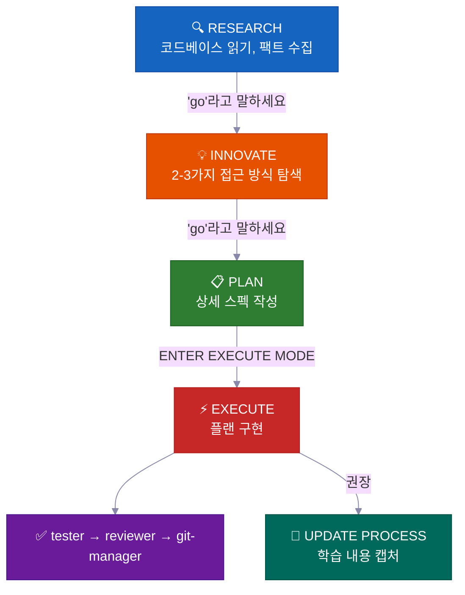
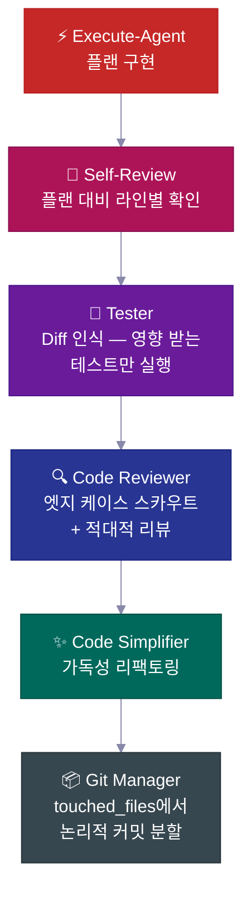
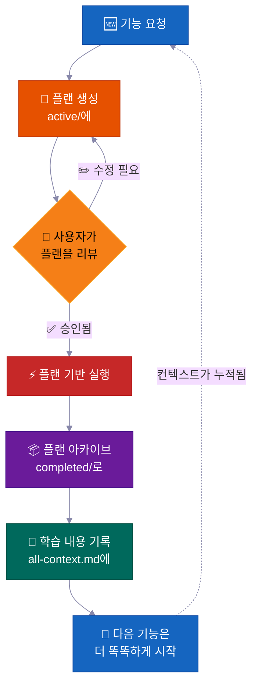
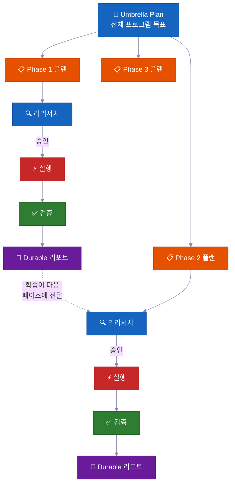

<p align="center">
  <a href="../../README.md">English</a> |
  <a href="README.zh-CN.md">简体中文</a> |
  <a href="README.ja-JP.md">日本語</a> |
  <strong>한국어</strong> |
  <a href="README.vi-VN.md">Tiếng Việt</a> |
  <a href="README.pt-BR.md">Portugues</a>
</p>

<div align="center">

<a href="https://flowser.ai">
  
</a>

*세계적 수준의 엔지니어들이 바이브코더를 위해 만들었어요*<br>
*[flowser.ai](https://flowser.ai) — GTM을 위한 컴퓨터 기반 AI 에이전트*

<br>

# vibecode-pro-max-kit

**AI가 생각하기도 전에 코드부터 쓰는 걸 멈추세요 — 그리고 여러분의 상세한 프롬프트를 매번 까먹는 것도요.<br>이 harness는 AI 코딩 에이전트를 리서치하고, 계획 세우고, 프로덕션급 코드를 출시하고,<br>6개월이 지나도 컨텍스트 부패에서 살아남도록 스스로 메모리를 개선하는 스펙 기반 엔지니어링 팀으로 바꿔줘요.**

<br>

<p align="center">
  
  <br><br>
  <em>"전집중 — 스펙의 호흡, 열 번째 형: 생생유전.<br>기능을 출시할 때마다 더 강해지는 끊임없는 개발 순환.<br>컨텍스트가 누적된다. 흐름은 절대 끊기지 않는다."</em><br>
  <strong>— 카마도 탄지로</strong>
</p>

🔬 AI 에이전트를 위한 스펙 기반 개발<br>
📋 PRD 자동 생성, 백로그 관리, 컨텍스트 자동 라우팅<br>
🧠 출시할 때마다 누적되는 자기개선 지식 베이스<br>
⚡ 대형 작업에서 상태 잃지 않고 몇 시간이고 자율 실행<br>
🤝 플랜과 스펙을 공유 가능 — 개발자, PM, 이해관계자가 동일한 산출물을 리뷰해요

<p>
  <a href="https://github.com/withkynam/vibecode-pro-max-kit/stargazers"></a>
  <a href="https://github.com/withkynam/vibecode-pro-max-kit/network/members"></a>
  <a href="LICENSE"></a>
  <a href="https://github.com/withkynam/vibecode-pro-max-kit/graphs/contributors"></a>
  <a href="https://github.com/withkynam/vibecode-pro-max-kit/actions/workflows/validate.yml"></a>
  <a href="https://github.com/withkynam/vibecode-pro-max-kit/commits/main"></a>
  
  
  
</p>

<p>
  <strong>가장 심플하고, 유연하고, 팀 친화적인 코딩 harness</strong><br><br>
  <a href="https://github.com/anthropics/claude-code"></a>&nbsp;
  <a href="https://github.com/openai/codex"></a>&nbsp;
  <a href="https://cursor.com"></a>&nbsp;
  <a href="https://windsurf.com"></a><br>
  <a href="https://github.com/google-gemini/gemini-cli"></a>&nbsp;
  <a href="https://github.com/opencode-ai/opencode"></a>&nbsp;
  <a href="https://github.com/features/copilot"></a>
</p>

<p>
  <em>어떤 기술 스택, 어떤 언어, 어떤 프로젝트든 동작해요</em><br><br>
  <picture>
    <source media="(prefers-color-scheme: dark)" srcset="https://skillicons.dev/icons?i=ts,js,react,nextjs,vue,nuxt,svelte,angular,nodejs,express,bun,python,django,flask,fastapi&theme=dark&perline=15" />
    <source media="(prefers-color-scheme: light)" srcset="https://skillicons.dev/icons?i=ts,js,react,nextjs,vue,nuxt,svelte,angular,nodejs,express,bun,python,django,flask,fastapi&theme=light&perline=15" />
    
  </picture>
  <br>
  <picture>
    <source media="(prefers-color-scheme: dark)" srcset="https://skillicons.dev/icons?i=ruby,rails,go,rust,java,spring,kotlin,swift,php,laravel,cs,dotnet,elixir,graphql,prisma&theme=dark&perline=15" />
    <source media="(prefers-color-scheme: light)" srcset="https://skillicons.dev/icons?i=ruby,rails,go,rust,java,spring,kotlin,swift,php,laravel,cs,dotnet,elixir,graphql,prisma&theme=light&perline=15" />
    
  </picture>
  <br>
  <picture>
    <source media="(prefers-color-scheme: dark)" srcset="https://skillicons.dev/icons?i=supabase,firebase,postgres,mongodb,redis,docker,kubernetes,aws,gcp,azure,vercel,cloudflare,tailwind,electron&theme=dark&perline=15" />
    <source media="(prefers-color-scheme: light)" srcset="https://skillicons.dev/icons?i=supabase,firebase,postgres,mongodb,redis,docker,kubernetes,aws,gcp,azure,vercel,cloudflare,tailwind,electron&theme=light&perline=15" />
    
  </picture>
  <br>
  <sub>React · Next.js · Vue · Nuxt · Svelte · Angular · React Native · Electron · Node.js · Express · Bun · Hono · Python · Django · FastAPI · Flask · Ruby · Rails · Go · Rust · Java · Spring Boot · Kotlin · Swift · PHP · Laravel · C# · .NET · Elixir · TypeScript · Prisma · Supabase · Firebase · PostgreSQL · MongoDB · Redis · GraphQL · Docker · Kubernetes · Terraform · AWS · GCP · Azure · Vercel · Cloudflare · Tailwind · shadcn/ui · 그리고 여러분의 프로젝트가 사용하는 모든 스택</sub>
</p>

</div>

---

## 🚀 설치 (30초)

```bash
curl -fsSL https://raw.githubusercontent.com/withkynam/vibecode-pro-max-kit/main/install.sh | bash
```

그다음 Claude Code를 열고 이렇게 말하세요:

```
Run vc-setup
```

끝이에요. setup skill이 스택을 감지하고, 프로젝트에 대해 질문하고 (체크리스트가 아니라 진짜 대화예요), process 디렉토리를 구성하고, 코드베이스를 딥스캔해서 컨텍스트 파일을 실제 내용으로 채워줘요 — placeholder가 아니라요.

<br>

<details>
<summary><strong>📦 설치되는 것들</strong></summary>

<br>

```
your-project/
├── .claude/
│   ├── agents/              # 🤖 12개의 전문 에이전트 정의
│   │   ├── vc-research-agent.md
│   │   ├── vc-execute-agent.md
│   │   └── ...
│   ├── skills/              # ⚡ 31개의 자동 탐색 skill
│   │   ├── vc-generate-plan/
│   │   ├── vc-security/
│   │   ├── vc-scout/
│   │   └── ...
│   └── hooks/               # 🪝 7개의 라이프사이클 hook
│       ├── privacy-block.cjs
│       ├── scout-block.cjs
│       └── ...
├── .codex/
│   └── agents/              # 🔄 Codex용 미러링된 에이전트
├── CLAUDE.md                # 📋 Orchestrator + 라우팅 규칙
├── AGENTS.md                # 📖 에이전트 레지스트리
└── process/                 # 🧠 vc-setup이 생성 (install이 아님)
    └── ...
```

- **새 프로젝트?** 전체 harness를 설치한 후, `vc-setup`이 코드베이스를 분석해요
- **기존 `.claude/` 설정이 있다면?** `.vibecode-backup/`에 백업하고, 새로 설치한 뒤, `settings.json`을 복원해요
- **기존 `process/` 디렉토리가 있다면?** install은 절대 건드리지 않아요 — `vc-setup`이 마이그레이션을 똑똑하게 처리해요
- **기존 `CLAUDE.md`가 있다면?** `CLAUDE.md.pre-vibecode`로 백업하고, harness 버전을 설치해요

</details>

<details>
<summary><strong>🤖 전체 에이전트 설정 프롬프트</strong> (최대한 제어하고 싶으면 이걸 Claude Code에 복붙하세요)</summary>

```
First, install the vibecode-pro-max-kit agent harness by running this command:

curl -fsSL https://raw.githubusercontent.com/withkynam/vibecode-pro-max-kit/main/install.sh | bash

After the install completes, run vc-setup to configure everything for this project.

Follow the full interactive flow:

1. DETECT — Read package.json, detect my stack (framework, package manager, monorepo
   structure, test framework, database, auth). Also check if I have any existing .claude/,
   process/, or context files from a previous setup.

2. SHOW ME WHAT YOU FOUND — Present a summary of the detection results and wait for me
   to confirm before continuing. If this is an existing project with process/ folders or
   context files, tell me what you found and what looks good vs what could be improved.

3. ASK ME ABOUT THE PROJECT — Before scaffolding or scanning, have a real conversation
   with me about this project. Don't just ask a fixed list of questions and move on — ask
   follow-ups based on my answers, probe deeper on anything vague, and keep going until
   you genuinely understand the project. Start with the basics (what is this? who uses it?),
   then dig into architecture, features, conventions, pain points, and anything else that
   matters. Summarize your understanding back to me and confirm it's correct before moving on.

4. SCAFFOLD — Create the process/ directory structure. If I already have process/ folders,
   show me what you plan to change and wait for my approval before reorganizing anything.
   Never silently move or delete my existing files.

5. STUDY — Deep-scan the codebase and populate process/context/all-context.md with REAL
   content based on what you find AND what I told you. Include: repo structure, tech stack
   with versions, key patterns and conventions, import aliases, env vars, API routes,
   database schema, test setup. Do not leave placeholder text.

6. VALIDATE — Run all the validation checks to make sure everything is wired correctly.

Important rules:
- If I have existing context files or a well-written CLAUDE.md, read them first and
  preserve what is good. Merge intelligently — do not replace good content with generic scans.
- Show me a summary of what you plan to create or change at each major step and wait
  for my OK before proceeding.
- Do not create empty placeholder files. Only create files that have real content.
- Ask before reorganizing. If my existing setup works, tell me what you would improve
  and let me decide.
```

</details>

<br>

<details>
<summary>목차</summary>

- [문제점](#-문제점)
- [해결책](#️-해결책)
- [바이브 코딩 혁명](#바이브-코딩-혁명)
- [누구를 위한 건가요?](#누구를-위한-건가요)
- [한눈에 보기](#한눈에-보기)
- [팀이 사용하는 이유](#-팀이-사용하는-이유)
- [비교 분석](#비교-분석)
- [차별점](#-차별점)
- [구성 요소](#-구성-요소)
- [작동 방식](#-작동-방식)
- [내장 안전 시스템](#️-내장-안전-시스템)
- [기여하기](#기여하기)
- [Star History](#-star-history)

</details>

---

## 🔥 문제점

Claude한테 "webhook 지원 추가해줘"라고 하면 바로 코드를 쓰기 시작해요. 아키텍처에 대한 질문도 없고, 기존 패턴 확인도 없고, 계획도 없어요. 코드베이스에 안 맞는 400줄짜리 코드를 받고, 고치느라 한 시간을 날리게 돼요.

**근데 이건 표면적인 문제일 뿐이에요.** 진짜 심각한 문제는 따로 있어요:

<table>
<tr>
<td width="50%" valign="top">
<h1>🧠</h1>
<strong>세션마다 컨텍스트가 사라져요</strong><br><br>
에이전트가 배운 걸 다 잊어버려요. 매번 같은 실수, 같은 질문. 메모리도 없고, 지식이 누적되지도 않아요.
</td>
<td width="50%" valign="top">
<h1>📄</h1>
<strong>문서가 순식간에 낡아져요</strong><br><br>
지난주에 훌륭한 컨텍스트 문서를 작성했는데 벌써 구식이에요. 코드베이스가 진화하면서 자동으로 업데이트해주는 게 아무것도 없어요.
</td>
</tr>
<tr>
<td width="50%" valign="top">
<h1>💥</h1>
<strong>큰 작업은 중간에 무너져요</strong><br><br>
컨텍스트 윈도우가 차고, 상태가 날아가고, 에이전트가 환각을 시작해요. 3시간째에 처음부터 다시 시작하게 돼요.
</td>
<td width="50%" valign="top">
<h1>🤝</h1>
<strong>스펙도 없고, 리뷰도 없고, 협업도 없어요</strong><br><br>
PM이 에이전트가 뭘 만들려는지 리뷰할 수가 없어요. 코드 작성 전에 공유하고, 논의하고, 승인할 수 있는 산출물이 없어요.
</td>
</tr>
<tr>
<td width="50%" valign="top">
<h1>🎭</h1>
<strong>아키텍처 결정이 환각이에요</strong><br><br>
에이전트가 다른 코드베이스에서 같은 문제를 어떻게 해결했는지 리서치하는 대신 패턴을 지어내요.
</td>
</tr>
</table>

**에이전트에 지능은 있지만 프로세스도 없고, 메모리도 없고, 팀과 협업할 방법도 없어요.**

개발자든, PM이든, 바이브 코딩을 이제 막 시작한 CEO든 — 이 문제는 모두에게 똑같이 찾아와요. 해결책도 같아요: **에이전트에게 진짜 개발 프로세스를 줘야 해요.**

---

## 🛠️ 해결책

이 harness는 프로젝트에 완전한 개발 시스템을 설치해요 — 그냥 CLAUDE.md 파일 하나가 아니라, **12개의 전문 에이전트, 31개의 skill**, 그리고 에이전트가 **만들기 전에 이해하도록 강제하는** phase-locked 워크플로우예요.

<br>

<table>
<tr>
<td align="center" width="50%" valign="top">
<h1>📋</h1>
<strong>스펙 기반 플랜</strong><br><br>
<sub>PM과 개발자가 코드 작성 전에 동일한 플랜 산출물을 리뷰해요</sub>
</td>
<td align="center" width="50%" valign="top">
<h1>🔄</h1>
<strong>자기개선 컨텍스트</strong><br><br>
<sub>기능 출시 때마다 자동 업데이트 — 문서가 절대 낡지 않아요</sub>
</td>
</tr>
<tr>
<td align="center" width="50%" valign="top">
<h1>⚡</h1>
<strong>자율 실행</strong><br><br>
<sub>컨텍스트 압축에서도 살아남아요 — 몇 분이 아니라 몇 시간 동안 실행돼요</sub>
</td>
<td align="center" width="50%" valign="top">
<h1>🧬</h1>
<strong>아키텍처 리서치</strong><br><br>
<sub>설계 결정 전에 실제 코드베이스를 연구해요</sub>
</td>
</tr>
<tr>
<td align="center" width="50%" valign="top">
<h1>🧭</h1>
<strong>스마트 컨텍스트 라우팅</strong><br><br>
<sub>관련된 것만 로드해요 — 매번 전체 지식 베이스를 불러오지 않아요</sub>
</td>
</tr>
</table>

<br>



모든 전환에는 **명시적인 승인**이 필요해요. 자동으로 넘어가는 건 없어요. 항상 여러분이 제어권을 갖고 있어요.

---

## 바이브 코딩 혁명

<div align="center">
<h3><em>"가장 핫한 프로그래밍 언어는 영어다."</em></h3>
<strong>— Andrej Karpathy</strong>
</div>

<br>

**바이브 코딩은 누가 소프트웨어를 만들 수 있는지를 바꿨어요. 스펙 기반 개발은 그들이 무엇을 출시할 수 있는지를 바꿔요.**

<table>
<tr>
<td align="center" width="50%">
<h3>63%</h3>
<sub>바이브 코딩 사용자가 개발자가 <strong>아니에요</strong></sub>
</td>
<td align="center" width="50%">
<h3>1,620만 명</h3>
<sub>전 세계 시민 개발자<br>(연간 38% 성장)</sub>
</td>
</tr>
<tr>
<td align="center" width="50%">
<h3>$47억</h3>
<sub>바이브 코딩 시장<br>연간 38% 성장</sub>
</td>
<td align="center" width="50%">
<h3>25%</h3>
<sub>YC W25 스타트업이 95%+ AI 생성 코드베이스를 보유</sub>
</td>
</tr>
</table>

대부분의 도구는 프로젝트를 시작하는 데 도움을 줘요. 이 harness는 프로젝트를 **완성**하는 데 도움을 줘요 — 팀이 리뷰할 수 있는 플랜, 절대 낡지 않는 컨텍스트, 그리고 실수를 출시 전에 잡아내는 안전 시스템과 함께요.

---

## 누구를 위한 건가요?

<div align="center">
<h3><em>"중요한 건 누가 타이핑했느냐가 아니라 무엇이 출시됐느냐다."</em></h3>
<strong>— Garry Tan, YC</strong>
</div>

<br>

바이브 코딩을 이제 막 발견했든, 프로덕션 시스템을 출시하는 스태프 엔지니어든 — 이 harness는 여러분의 워크플로우에 맞게 적응해요.

<table>
<tr>
<td width="50%" valign="top">
<h1>🧑‍💼</h1>
<strong>CEO / 창업자</strong><br><br>
<em>"인증, 빌링, 랜딩 페이지가 있는 SaaS를 만들어줘"</em><br><br>
에이전트가 스택을 리서치하고, 리뷰할 수 있는 아키텍처 플랜을 작성하고, 테스트와 함께 구현하고, 나중에 기술 공동창업자가 감사할 수 있도록 모든 결정을 기록해요.
</td>
<td width="50%" valign="top">
<h1>📊</h1>
<strong>프로덕트 매니저</strong><br><br>
<em>"MRR, 이탈률, 성장 지표를 보여주는 대시보드를 만들어줘"</em><br><br>
PRD 스타일의 스펙을 생성하고, 코드 작성 전에 승인을 받고, 스펙대로 구현하고, 플랜을 검색 가능한 프로젝트 히스토리로 아카이브해요.
</td>
</tr>
<tr>
<td width="50%" valign="top">
<h1>🎨</h1>
<strong>디자이너</strong><br><br>
<em>"이 Figma 스크린샷을 픽셀 퍼펙트로 맞춰줘"</em><br><br>
디자인 인식 에이전트가 목업을 분석하고, 디자인 토큰으로 컴포넌트별로 구현하고, 시각적 비교 검사를 실행해요.
</td>
<td width="50%" valign="top">
<h1>⚙️</h1>
<strong>엔지니어</strong><br><br>
<em>"인증 모듈을 다운타임 없이 RBAC를 지원하도록 리팩토링해줘"</em><br><br>
현재 인증 코드와 다른 코드베이스가 RBAC를 어떻게 해결했는지 리서치하고, blast radius 분석이 포함된 마이그레이션 플랜을 작성하고, 롤백 노트와 함께 안전하게 구현해요.
</td>
</tr>
</table>

---

## 한눈에 보기

<table>
<tr>
<td align="center" width="50%" valign="top">
<h1>🤖</h1>
<h3>12</h3>
<strong>전문 에이전트</strong><br>
<sub>각 개발 페이즈를 담당하는 도메인 전문가</sub>
</td>
<td align="center" width="50%" valign="top">
<h1>⚡</h1>
<h3>32</h3>
<strong>자동 탐색 Skill</strong><br>
<sub>키워드 매칭으로 표시되는 재사용 가능한 기능</sub>
</td>
</tr>
<tr>
<td align="center" width="50%" valign="top">
<h1>🪝</h1>
<h3>7</h3>
<strong>라이프사이클 Hook</strong><br>
<sub>실행 전후 가드레일과 컨텍스트 주입</sub>
</td>
<td align="center" width="50%" valign="top">
<h1>📜</h1>
<h3>6</h3>
<strong>개발 프로토콜</strong><br>
<sub>모든 도구에서 공유되는 워크플로우 규칙</sub>
</td>
</tr>
<tr>
<td align="center" width="50%" valign="top">
<h1>🛡️</h1>
<h3>5</h3>
<strong>안전 시스템</strong><br>
<sub>Phase-locking, blast radius, 프라이버시, 누출 감지</sub>
</td>
<td align="center" width="50%" valign="top">
<h1>🔧</h1>
<h3>7</h3>
<strong>지원 도구</strong><br>
<sub>Claude Code, Codex, Cursor, Windsurf, Antigravity, OpenCode, Copilot</sub>
</td>
</tr>
<tr>
<td align="center" width="50%" valign="top">
<h1>🌍</h1>
<h3>6</h3>
<strong>언어</strong><br>
<sub>EN · 中文 · 日本語 · 한국어 · Tiếng Việt · Portugues</sub>
</td>
<td align="center" width="50%" valign="top">
<h1>⚡</h1>
<h3>30초</h3>
<strong>설치 시간</strong><br>
<sub>curl 한 줄 + 자동 설정이 나머지를 해줘요</sub>
</td>
</tr>
</table>

---

## 💎 팀이 사용하는 이유

> 대부분의 harness는 CLAUDE.md와 지침만 줘요. 이건 시간이 지날수록 지능이 누적되는 **자율 개발 시스템**을 줘요.

<br>

### 📋 스펙 기반 개발 — 감이 아니라 스펙으로

모든 기능에 코드 한 줄 쓰기 전에 **blast radius 분석이 포함된 서면 플랜**이 만들어져요.

> 💡 PRD를 자동 생성하고, 백로그를 관리하고, 기능 그룹을 정리해요. 개발자와 PM 모두에게 동작해요 — 에이전트가 인턴이 아니라 시니어 엔지니어처럼 계획을 세워요.

**모든 플랜에 포함되는 것:**

| 섹션 | 용도 |
|---|---|
| 📍 **Touchpoints** | 생성 또는 수정될 모든 파일을 미리 나열해요 |
| 📜 **Public contracts** | 어떤 API surface나 인터페이스가 변경되는지 |
| 💥 **Blast radius** | 뭐가 깨질 수 있는지, 어떤 테스트를 돌려야 하는지, 뭘 주시해야 하는지 |
| ✅ **Verification evidence** | 구현이 맞다는 걸 어떻게 증명하는지 |
| 🔄 **Resume handoff** | 어떤 에이전트든 플랜 중간에서 이어받을 수 있을 만큼의 컨텍스트 |

<br>

### 🔄 자율 멀티 페이즈 실행 — 손 안 대고 몇 시간씩 작업

대형 작업의 경우, 에이전트가 **반복적인 페이즈 루프**를 실행해요:

```
🔍 research → ⚡ execute → ✅ validate → 📄 report → 🔄 repeat
```

> 💡 막히면 자가 치유하고, 접근 방식을 개선하기 위해 자기 성찰하고, 디스크에 지속적인 진행 보고서를 작성해요. **컨텍스트 압축으로도 죽지 않아요** — 모든 상태가 메모리가 아니라 파일에 있어요.

자리 비우고 돌아오면 작업이 끝나 있어요.

<br>

### 🧬 자동 아키텍처 리서치 — 어떤 코드베이스에서든 배워요

에이전트가 단순히 여러분의 코드만 읽는 게 아니라 — 비슷한 문제를 어떻게 해결했는지 **다른 레포지토리를 연구**해요 (`vc-xia`).

> 💡 리서치하고, 접근 방식을 비교하고, 최적의 패턴을 여러분의 코드베이스에 적용해요. 아키텍처 결정이 환각된 best practice가 아니라 실제 구현에 기반해요.

<br>

### 🧭 영속적인 스마트 컨텍스트 라우팅 — 항상 올바른 컨텍스트

컨텍스트가 거대한 파일 하나가 아니에요. **자동 라우팅되는 지식 도메인**으로 정리돼 있어요:

```
process/context/
├── all-context.md              # 🧭 루트 라우터 — 작업을 읽고 관련된 것만 로드
├── tests/
│   └── all-tests.md            # 🧪 테스트 러너, 명령어, 디버깅
├── container/
│   └── all-container.md        # 🐳 Docker, 배포, 인프라
├── uxui/
│   └── all-uxui.md             # 🎨 컴포넌트, 디자인 토큰, 패턴
└── {your-domain}/
    └── all-{domain}.md         # 📚 지속적인 문서 3개 이상인 모든 도메인
```

> 💡 에이전트가 빌링 작업을 할 때 빌링 컨텍스트를 로드해요 — 전체 코드베이스 문서가 아니라요. 기능을 완료할 때마다 컨텍스트가 **자동 업데이트**되니까 절대 낡지 않아요.

<br>

### 🧠 자기개선 지식 베이스 — 출시할수록 더 똑똑해져요

완료된 기능마다 학습 내용이 컨텍스트 시스템에 피드백돼요.

> 💡 리서치 결과, 아키텍처 결정, 디버깅 인사이트, 코딩 패턴이 **자동으로 캡처되고 인덱싱**돼요. 100번째 기능이 처음 99개에서 배운 모든 것의 혜택을 받아요. 지식이 누적돼요 — 리셋되지 않아요.

---

## 비교 분석

| 기능 | vibecode-pro-max-kit | Superpowers | GSD | gstack |
|---------|---------------------|-------------|-----|--------|
| 스펙 기반 라이프사이클 | 완전한 RIPER-5 (리서치 → 플랜 → 실행 → 검증) | 필수 워크플로우 | 컨텍스트 부패 해결 | 부분적 |
| Phase-locked 안전성 | 모드별 도구 제한 (리서치는 읽기 전용, innovate는 쓰기 불가) | Skill 기반 제약 | 페이즈 분리 | 없음 |
| 멀티 도구 지원 | AGENTS.md + 네이티브로 7개 도구 | Claude Code 플러그인 | 14개 런타임 | 1개 도구 |
| 자동 개선 컨텍스트 | 도메인 라우팅 컨텍스트 그룹, 기능 완료마다 업데이트 | 플러그인 메모리 | 디스크 영속 상태 | 수동 |
| 팀 협업 | 공유 스펙, 플랜, 리뷰 산출물 | 솔로 | 솔로 | 솔로 |
| Skill 시스템 | 32개 자동 탐색, 모든 프롬프트에서 키워드 매칭 | 86개 조합형 skill | 메타 프롬프팅 | 23개 역할 도구 |
| 멀티 페이즈 프로그램 | Umbrella 플랜 + 리그레션 체크가 있는 페이즈별 실행 루프 | 단일 작업 | 단일 작업 | 단일 작업 |
| 품질 파이프라인 | 6단계 체인 (코드 리뷰 → 테스트 → 간소화 → 보안 → 감사 → 커밋) | Skill별 품질 | 자동 체인 없음 | 자동 체인 없음 |
| 설치 | 30초 `curl` 설치 + 자동 설정 | 플러그인 마켓플레이스 | npx 한 줄 | git clone |
| 컨텍스트 라우팅 | 그룹화된 컨텍스트 팩이 있는 도메인 기반 라우팅 테이블 | 플랫 skill 컨텍스트 | 플랫 컨텍스트 | 단일 파일 |

> **런타임 범위에 대해:** GSD는 14개 런타임을 지원해요. 저희는 7개를 깊이 있게 지원해요 — 모든 플랫폼에 완전한 에이전트 harness, skill 탐색, 라이프사이클 hook이 있어요. 범위 vs. 깊이: 여러분의 선택이에요.

---

## ⚡ 차별점

대부분의 에이전트 harness는 큰 CLAUDE.md 하나랑 지침만 줘요. 이건 실제로 뭘 하는지 보여줄게요:

<br>

<table>
<tr>
<td width="50%" valign="top">
<h1>🔒</h1>
<strong>Phase-Locked 도구 제한</strong><br><br>
에이전트가 리서치 중에는 말 그대로 코드를 <strong>작성할 수 없어요</strong>. RESEARCH는 읽기 전용, INNOVATE는 Bash 접근이 아예 없고, PLAN은 <code>process/</code> 디렉토리에만 쓸 수 있어요. <strong>실제로 기능 자체를 제거해버려요</strong>, 제안이 아니에요.
</td>
<td width="50%" valign="top">
<h1>🎯</h1>
<strong>스마트 자동 라우팅</strong><br><br>
자연어에서 의도를 감지해요. "build webhook support" → 전체 파이프라인. "login is broken" → 디버거. 6단계 우선순위, 질문은 최대 하나.
</td>
</tr>
<tr>
<td width="50%" valign="top">
<h1>🔍</h1>
<strong>자동 Skill 탐색</strong><br><br>
요청을 라우팅하기 전에 <strong>32개 skill</strong>을 스캔하고 키워드를 매칭해요. "add webhook support"라고 하면 <code>vc-security</code> + <code>vc-scenario</code>가 자동으로 표시돼요.
</td>
<td width="50%" valign="top">
<h1>💾</h1>
<strong>컨텍스트 윈도우 압축에서 살아남아요</strong><br><br>
플랜, 리포트, 컨텍스트 문서, 학습 내용이 모두 디스크에 있어요. session-init hook이 압축 후 승인 게이트를 다시 주입해요. <strong>아무것도 잃지 않아요.</strong>
</td>
</tr>
<tr>
<td width="50%" valign="top">
<h1>🛡️</h1>
<strong>자체 감시 위반 감지</strong><br><br>
에이전트가 페이즈 경계를 넘으려는 걸 감지하면 스스로 멈춰요: <em>"PHASE JUMPING PREVENTED"</em>. <strong>구조적 환각 방지 장치</strong>예요.
</td>
<td width="50%" valign="top">
<h1>🔄</h1>
<strong>7개 AI 코딩 도구에서 동작해요</strong><br><br>
두 가지 오픈 표준 — <code>AGENTS.md</code>와 <code>SKILL.md</code> — 덕분에 <strong>어댑터도, 플러그인도, 설정도 필요 없어요.</strong> Claude Code에서 시작하고, Cursor로 전환하고, Codex에서 이어서 작업하세요.
</td>
</tr>
</table>

---

## 🧭 작동 방식

```
Your request
  → Step 0: Skill Discovery (match keywords → surface relevant skills)
  → Intent Detection (feature / bug / question / refactor / UI)
  → Route to the right agent
  → Phase-locked execution with explicit transitions
```

orchestrator는 **절대 직접 작업하지 않아요** — 라우팅하고, 모니터링하고, 전환을 관리해요.

<br>

### 📊 워크플로우

| 페이즈 | 무슨 일이 일어나는지 | 여러분이 할 말 |
|-------|-------------|---------|
| 🔍 **RESEARCH** | 읽기 전용 팩트 수집 — 코드베이스 + 웹 | *(기능 요청 시 자동)* |
| 💡 **INNOVATE** | 트레이드오프와 함께 2-3가지 접근 방식 탐색 | `go` |
| 📋 **PLAN** | 리뷰할 수 있는 상세 스펙 작성 | `go` |
| ⚡ **EXECUTE** | 계획한 대로 정확히 구현 | `ENTER EXECUTE MODE` |
| 🧠 **UPDATE PROCESS** | 학습 내용 캡처, 컨텍스트 업데이트, 플랜 아카이브 | *(중요한 작업 후 권장)* |

> 💡 **단축키:** `ENTER FAST MODE - [task]`를 쓰면 RESEARCH+INNOVATE+PLAN을 한 번에 압축해요 — EXECUTE 전에는 여전히 일시 정지해요. 사소한 수정 (단일 파일, 15줄 미만, 스키마/인증 변경 없음)은 바로 execute로 넘어가요.

<br>

### 💻 일반적인 세션

```
# 🆕 Feature request
You: "add webhook support to the API"
→ Skill discovery surfaces: vc-scenario, vc-security
→ research-agent gathers context (read-only, can't touch code)
→ You say "go" → innovate-agent explores approaches
→ You say "go" → plan-agent writes spec with blast radius
→ You review the plan, say "ENTER EXECUTE MODE"
→ execute-agent implements → self-review → tester → code-reviewer → git-manager
→ Closeout packet: what changed, what's verified, recommended next step
```

```
# 🐛 Bug fix
You: "login redirect is broken"
→ Routes to vc-debugger → evidence gathering → competing hypotheses
→ Root cause identified with proof chain
→ execute-agent implements the fix → quality pipeline
```

```
# ⏩ Fast mode
You: "ENTER FAST MODE - add rate limiting middleware"
→ Compressed research+innovate+plan in one pass
→ Mandatory safety pause → you review → "ENTER EXECUTE MODE"
```

```
# 🏗️ Large program
You: "build a full testing platform"
→ Creates umbrella plan + phase plans in a feature folder
→ Each phase: re-research → approve → execute → validate → durable report
→ Progress survives context compaction — durable reports on disk
```

```
# 🔄 Autonomous optimization
You: "improve test coverage to 80% using vc-autoresearch"
→ Agent iterates: make change → commit → measure → keep/revert
→ Stuck detection after 5 consecutive discards → strategy shift
→ Full audit trail in TSV
```

---

## 🛡️ 내장 안전 시스템

이건 그냥 가이드라인이 아니에요 — 모든 에이전트에 내장된 **구조적 강제**예요.

<table>
<tr>
<td width="50%" valign="top">
<h1>⏸️</h1>
<strong>50% 중간 체크인</strong><br><br>
실행 중 대략 절반 지점에서 에이전트가 <strong>일시 정지</strong>하고, 진행 상황을 보고하고, 완료된 항목과 남은 항목을 나열하고, 물어봐요: <em>"현재 접근 방식으로 계속할까요, 아니면 일시 정지하고 PLAN으로 돌아갈까요?"</em>
</td>
<td width="50%" valign="top">
<h1>🚫</h1>
<strong>무단 이탈 금지</strong><br><br>
execute-agent가 플랜에서 벗어나야 하는 문제를 만나면, <strong>즉시 멈추고</strong> 문제를 설명하고 PLAN 모드로 돌아가요. 조용히 즉흥적으로 하는 거 없어요.
</td>
</tr>
<tr>
<td width="50%" valign="top">
<h1>🔙</h1>
<strong>접근 방식 포기 프로토콜</strong><br><br>
접근 방식이 실패하면 에이전트가 재사용 가능한 컴포넌트를 평가하고, 삭제 전에 교훈을 문서화하고, 포기 요약을 작성하고, PLAN으로 돌아가요.
</td>
<td width="50%" valign="top">
<h1>🔐</h1>
<strong>프라이버시 가드레일 Hook</strong><br><br>
에이전트가 <code>.env</code>, 자격 증명, SSH 키, <code>.pem</code> 파일을 <strong>읽는 것이 차단</strong>돼요. 명시적 승인을 요청해야 해요.
</td>
</tr>
<tr>
<td width="50%" valign="top">
<h1>⚠️</h1>
<strong>고위험 증거 팩</strong><br><br>
인증, 빌링, 스키마 마이그레이션, 또는 공개 API를 건드리는 변경 — 시스템이 작업이 "완료"되기 전에 공식 증거 팩을 요구해요.
</td>
<td width="50%" valign="top">
<h1>📊</h1>
<strong>Drift Signal Scoring</strong><br><br>
실행 후, 시스템이 프로세스 업데이트 긴급도를 점수화해요: <strong>LOW</strong> (가벼운 터치), <strong>MEDIUM</strong> (상당한 변경), <strong>HIGH</strong> (harness/프로토콜 파일 수정).
</td>
</tr>
</table>

---

## 🔍 구현 전 사전 분석

코드 한 줄 쓰기 전에, 시스템이 전문 분석을 통해 문제를 잡을 수 있어요:

<br>

<table>
<tr>
<td width="50%" valign="top">
<h1>🎭</h1>
<strong>5-페르소나 구현 전 토론</strong><br><br>
<code>vc-predict</code> — Architect, Security, Performance, UX, Devil's Advocate가 플랜을 토론해요. 코드 한 줄 쓰기 전에 <strong>GO / CAUTION / STOP</strong> 판정을 내려요.
</td>
<td width="50%" valign="top">
<h1>🎲</h1>
<strong>12차원 엣지 케이스 생성기</strong><br><br>
<code>vc-scenario</code> — 모든 기능을 12개 차원(사용자 유형, 입력 극단값, 타이밍, 규모, 상태, 환경, 에러, 인증, 데이터, 통합, 규정, 비즈니스 로직)에 걸쳐 분해해요. 출력은 테스트 스펙으로 바로 사용 가능해요.
</td>
</tr>
<tr>
<td width="50%" valign="top">
<h1>🔐</h1>
<strong>STRIDE + OWASP 보안 감사</strong><br><br>
<code>vc-security</code> — 의존성 감사, 시크릿 탐지가 포함된 이중 방법론 보안 감사에요. Critical부터 수정하고 리그레션 가드가 있는 <strong>자동 수정 모드</strong>가 있어요.
</td>
</tr>
</table>

---

## 🤖 자율 에이전트 기능

<br>

<table>
<tr>
<td width="50%" valign="top">
<h1>🔄</h1>
<strong>자율 메트릭 최적화</strong><br><br>
<code>vc-autoresearch</code> — 목표를 설정하고 자리를 비우세요. 반복적인 git-backed 루프: 하나의 atomic 변경 → 커밋 → 측정 → 유지 또는 되돌리기. 5번 연속 폐기 후 stuck 감지가 전략 전환을 트리거해요.
</td>
<td width="50%" valign="top">
<h1>👥</h1>
<strong>병렬 에이전트 팀</strong><br><br>
<code>vc-team</code> — 여러 에이전트가 git worktree 격리로 <strong>동시에</strong> 작업해요. 병렬 리서치, 병렬 실행, 병렬 리뷰, 적대적 디버깅.
</td>
</tr>
<tr>
<td width="50%" valign="top">
<h1>🔬</h1>
<strong>증거 우선 가설 디버깅</strong><br><br>
<code>vc-debugger</code> — 먼저 증거를 수집하고 → 2-3개의 경쟁 가설을 세우고 → 각각을 체계적으로 테스트하고 → 소거 경로를 문서화해요. <strong>절대 추측하지 않아요 — 증명해요.</strong>
</td>
</tr>
</table>

---

## ✅ 품질 파이프라인 — 실행에 내장

execute-agent가 코드만 쓰고 끝이라고 하지 않아요. **품질 파이프라인**을 자동으로 체이닝해요:

<br>



<br>

| 단계 | 하는 일 |
|---|---|
| 🔎 **Self-review** | 모든 체크리스트 항목을 플랜과 비교하여 이탈을 확인하고 문서화해요 |
| 🧪 **Tester** | 변경된 파일을 테스트 파일에 매핑하고, 매핑률 70% 초과 시 전체 스위트로 자동 에스컬레이션해요 |
| 🔍 **Code reviewer** | 리뷰 전에 엣지 케이스 스카우트를 실행하고, N+1 쿼리, 인증 경로, 데이터 누출을 확인해요 |
| ✨ **Simplifier** | 리뷰 통과 후 가독성 리팩토링 — 동작 변경 없음 |
| 📦 **Git manager** | `touched_files` 목록을 받아 논리적인 conventional commit으로 분할하고, 알 수 없는 파일은 거부해요 |

---

## 📋 플랜 라이프사이클 — 감이 아니라 스펙 기반

모든 중요한 기능은 **플랜 라이프사이클**을 따라요 — 생성하고, 리뷰하고, 실행하고, 프로젝트 히스토리로 아카이브되는 서면 스펙이에요.

<br>



<br>

> 💡 6개월 후에 누군가 *"왜 인증을 이렇게 만들었지?"*라고 물으면, 답이 `completed/`에 있어요. Slack 스레드 어딘가에 묻힌 게 아니라요.

<br>

**디스크에서 플랜이 있는 위치:**

```
process/
├── general-plans/
│   ├── active/                  # 📋 현재 작업 중인 플랜
│   │   └── webhooks_PLAN_28-05-26.md
│   ├── completed/               # ✅ 아카이브된 플랜 (검색 가능한 히스토리)
│   ├── backlog/                 # 📌 지연된 작업
│   ├── reports/                 # 📄 범용 리포트
│   └── references/              # 📚 리서치 산출물
└── features/
    └── billing/                 # 🏷️ 기능별 스코프 (산출물 5개 이상)
        ├── active/
        ├── completed/
        ├── backlog/
        ├── reports/
        └── references/
```

---

## 🏗️ Phase Programs — 무너지지 않는 대형 프로젝트

일반 기능은 플랜 하나를 써요. **대형 멀티 페이즈 프로젝트**는 phase program을 써요 — umbrella 플랜에 개별 페이즈 플랜이 있고, 각각 자체 검증 게이트가 있어요.

<br>



<br>

**주요 특징:**

| | 기능 | 왜 중요한지 |
|---|---|---|
| 🔄 | **매 페이즈마다 리리서치** | 코드 drift를 확인하고, 최신 리포트를 읽고, 가정을 업데이트해요 |
| ✅ | **검증 게이트** | 증거가 증명할 때까지 페이즈가 `VERIFIED`가 아니에요. 정직한 상태: `PLANNED` → `CODE DONE` → `TESTING` → `VERIFIED` 또는 `BLOCKED` |
| 📄 | **Durable 리포트** | 매 페이즈가 결과를 디스크에 기록해요. 컨텍스트 압축에서도 진행 상황이 살아남아요 |
| 🧠 | **학습이 전방으로 전달** | Phase 1의 발견이 실행 전에 Phase 2의 플랜을 업데이트해요 |
| 🏗️ | **기반 vs 확장** | "아키텍처 검증"과 "전체 구현"을 명시적으로 분리해요 |
| 🚧 | **정직한 블로커 처리** | 블록된 페이즈는 증거와 함께 `BLOCKED` 상태를 유지해요. 강제로 녹색으로 만들지 않아요 |

---

## 🧠 Context Groups — 거대한 파일 하나가 아니라 정리된 지식

프로젝트 지식이 **context group**으로 정리돼요 — 지속적인 지식 도메인이고, 각각 `all-{group}.md` 라우터가 에이전트에게 뭘 언제 읽어야 하는지 알려줘요.

<br>

```
process/context/
├── all-context.md              # 🧭 루트 라우터 — 아키텍처, 스택, 패턴, 컨벤션
├── tests/
│   └── all-tests.md            # 🧪 테스트 러너, 명령어, 디버깅 절차
├── container/
│   └── all-container.md        # 🐳 Docker, 배포, 인프라 절차
├── uxui/
│   └── all-uxui.md             # 🎨 컴포넌트, 디자인 토큰, 패턴
├── infra/
│   └── all-infra.md            # 🖥️ 워커 노드, 프로비저닝, DNS
├── skills/
│   └── all-skills.md           # ⚡ Skill 런타임, 앱 아키텍처
├── workflows/
│   └── all-workflows.md        # 🔄 워크플로우 런타임, 배포
└── {your-domain}/
    └── all-{domain}.md         # 📚 지속적인 문서 3개 이상인 모든 지식 도메인
```

<br>

| | 작동 방식 |
|---|---|
| 🧭 **Router 패턴** | 에이전트가 전체가 아니라 작업에 관련된 것만 읽어요 |
| 📏 **자동 승격** | 문서 3개 이상이거나 800줄 이상이면 자체 context group을 받아요 |
| 🔄 **살아있는 문서** | 중요한 기능 완료 후 `update-process-agent`가 업데이트해요 |
| 🧪 **감사 가능** | `vc-audit-context`가 라우팅과 일관성을 검증해요 |

---

## 📁 Feature Folders — 자동 정리되는 프로젝트 메모리

한 주제에 산출물이 5개 이상 쌓이면 자체 **feature folder**를 받아요 — 완전한 라이프사이클 컨테이너예요.

<br>

```
process/features/{feature}/
├── active/       # 📋 현재 작업 중인 플랜
├── completed/    # ✅ 아카이브된 플랜 (검색 가능한 의사결정 히스토리)
├── backlog/      # 📌 지연된 작업 (에이전트가 중복 플랜 생성 전에 확인해요)
├── reports/      # 📄 실행 리포트, 포스트모텀, 검증 결과
└── references/   # 📚 미래 결정에 참고되는 리서치 산출물
```

<br>

| | 무슨 일이 일어나는지 |
|---|---|
| 🆕 | 새 작업이 `active/`에서 시작 → 리포트가 쌓이고 → 플랜이 `completed/`로 아카이브 |
| 📌 | 지연된 작업은 `backlog/`로 — 에이전트가 중복 플랜을 만들기 전에 여기를 확인해요 |
| 📦 | 일반 산출물이 5개 이상이면 자동으로 feature로 승격돼요 |
| 🔍 | 모든 기능이 완전하고 자체 완결적인 히스토리를 가져요 — 플랜, 결정, 리포트, 리서치 |

---

## 🤖 구성 요소

<br>

### 12개의 Agent

<details>
<summary>에이전트 목록 펼치기 (12개)</summary>

<br>

**핵심 워크플로우 에이전트** — RIPER-5 페이즈당 하나:

| Agent | 역할 |
|-------|------|
| 🔍 `vc-research-agent` | 코드베이스 + 웹 리서치, 읽기 전용. 모순 추적 내장 |
| 💡 `vc-innovate-agent` | 2-3가지 접근 방식 브레인스토밍. PLAN 전에 결정 요약 필수 |
| 📋 `vc-plan-agent` | 합리화 방지 가드와 함께 스펙 작성. "이미 알고 있어요"는 플랜이 아님 |
| ⚡ `vc-execute-agent` | 플랜대로 구현. 50% 체크인, 이탈 프로토콜, 셀프 리뷰 |
| ⏩ `vc-fast-mode-agent` | 압축된 RESEARCH→INNOVATE→PLAN에 필수 안전 일시정지 |
| 🧠 `vc-update-process-agent` | stale 산출물 스캐닝을 포함한 7단계 필수 체크리스트 |

<br>

**전문가 에이전트** — EXECUTE 중 또는 독립 실행:

| Agent | 역할 |
|-------|------|
| 🐛 `vc-debugger` | 증거 우선 가설. 경쟁 가설, 소거 체인 |
| 🧪 `vc-tester` | Diff 인식. 영향 받는 테스트만 실행. 설정 변경 시 자동 에스컬레이션 |
| 🔎 `vc-code-reviewer` | 리뷰 전 엣지 케이스 스카우트. N+1 탐지, 인증 경로 검증 |
| ✨ `vc-code-simplifier` | 동작 변경 없는 가독성 리팩토링 |
| 🎨 `vc-ui-ux-designer` | 디자인 인식 프론트엔드. 실행 중 리서치 subagent 생성 가능 |
| 📦 `vc-git-manager` | `touched_files`에서 논리적 커밋 분할. 알 수 없는 파일은 거부 |

</details>

<br>

### 31개의 Skill (자동 탐색)

<details>
<summary>Skill 목록 펼치기 (31개)</summary>

<br>

**🔧 Contract skill** — `vc-generate-plan` · `vc-generate-context` · `vc-audit-context` · `vc-audit-plans` · `vc-audit-vc` · `vc-setup` · `vc-update` · `vc-publish`

**🧠 Planning** — `vc-predict` (5-페르소나 토론) · `vc-scenario` (12차원 엣지 케이스) · `vc-sequential-thinking` · `vc-problem-solving`

**🐛 Debug & security** — `vc-debug` · `vc-security` (STRIDE + OWASP + 자동 수정) · `vc-autoresearch` (자율 최적화)

**📚 Research** — `vc-docs-seeker` · `vc-scout` · `vc-docs` · `vc-repomix` · `vc-xia` (레포 비교)

**🎨 Frontend** — `vc-frontend-design` · `vc-chrome-devtools` · `vc-agent-browser` · `vc-web-testing`

**⚙️ Utilities** — `vc-context-engineering` · `vc-mcp-management` · `vc-preview` · `vc-team` (병렬 에이전트) · `vc-tech-graph` · `vc-watzup` (세션 핸드오프) · `vc-merge-worktree`

</details>

<br>

### 🪝 7개의 Hook

| Hook | 하는 일 |
|------|-------------|
| 🔐 **Privacy guardrails** | `.env`, 자격 증명, SSH 키를 차단해요. 명시적 승인 필요 |
| 🚫 **Scout blocker** | 에이전트가 `node_modules/`, `dist/`로 헤매는 걸 방지해요. Gitignore 문법의 `.ckignore` |
| 🧠 **Session init** | 스택을 감지하고, 환경 변수를 주입하고, 압축 후 승인 게이트를 복구해요 |
| 💉 **Subagent context** | 모든 subagent에 ~200 토큰의 컴팩트 컨텍스트 블록을 주입해요 |
| ✨ **Edit quality** | 5회 이상 편집 후 code-simplifier 실행을 넛지해요 (논블로킹, 쓰로틀링) |
| 📛 **Descriptive naming** | 모든 Write에 언어별 파일 네이밍 컨벤션 적용 |
| 📊 **Usage tracking** | 세션 메트릭과 토큰 인식 |

<br>

**모든 것이 있는 위치:**

```
your-project/
├── .claude/
│   ├── agents/              # 🤖 12개 에이전트 정의 (.md)
│   ├── skills/              # ⚡ 31개 skill 모듈 (각각 SKILL.md가 있는 디렉토리)
│   └── hooks/               # 🪝 7개 라이프사이클 hook (.cjs)
├── .codex/
│   └── agents/              # 🔄 Codex 호환을 위한 미러링
├── .agents/
│   └── skills -> ../.claude/skills   # 🔗 Codex 탐색용 symlink
├── CLAUDE.md                # 📋 Orchestrator 설정 + 라우팅 규칙
├── AGENTS.md                # 📖 Agent + skill 레지스트리
└── process/
    ├── context/             # 🧠 자동 라우팅 지식 도메인
    ├── general-plans/       # 📋 범용 플랜 + 리포트
    ├── features/            # 🏷️ 기능별 라이프사이클 폴더
    └── development-protocols/  # 📜 공유 워크플로우 규칙
```

---

## 🔄 업데이트

최신 harness 개선사항을 가져오세요:

```
Run vc-update
```

> 💡 dry-run diff를 보여주고 확인을 기다려요. `process/` 디렉토리와 프로젝트별 내용은 **절대 건드리지 않아요**.

---

## 기여하기

기여를 환영해요! 가이드라인은 [CONTRIBUTING.md](CONTRIBUTING.md)를 참고해주세요.

<br>

**바로가기:**

- 🐛 [버그 신고](https://github.com/withkynam/vibecode-pro-max-kit/issues/new?template=1.bug_report.yml)
- 💡 [기능 요청](https://github.com/withkynam/vibecode-pro-max-kit/issues/new?template=2.feature_request.yml)
- ⚡ [Skill 제출](https://github.com/withkynam/vibecode-pro-max-kit/issues/new?template=3.skill_submission.yml)
- 🌐 [번역 추가](https://github.com/withkynam/vibecode-pro-max-kit/issues/new?template=5.translation.yml)

<br>

<a href="https://github.com/withkynam/vibecode-pro-max-kit/graphs/contributors">
  
</a>

---

## ⭐ Star History

<a href="https://star-history.com/#withkynam/vibecode-pro-max-kit&Date">
 <picture>
   <source media="(prefers-color-scheme: dark)" srcset="https://api.star-history.com/svg?repos=withkynam/vibecode-pro-max-kit&type=Date&theme=dark" />
   <source media="(prefers-color-scheme: light)" srcset="https://api.star-history.com/svg?repos=withkynam/vibecode-pro-max-kit&type=Date" />
   
 </picture>
</a>

---

## 📄 라이선스

MIT
