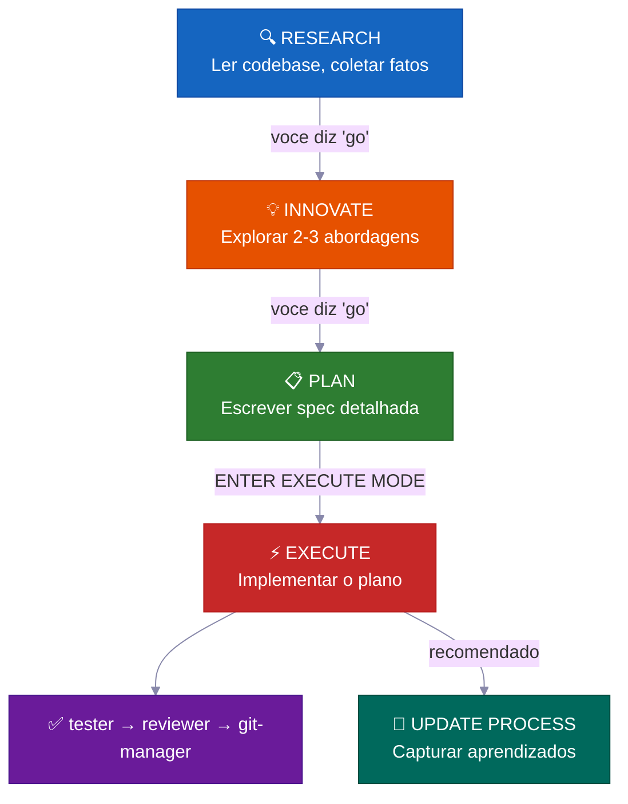
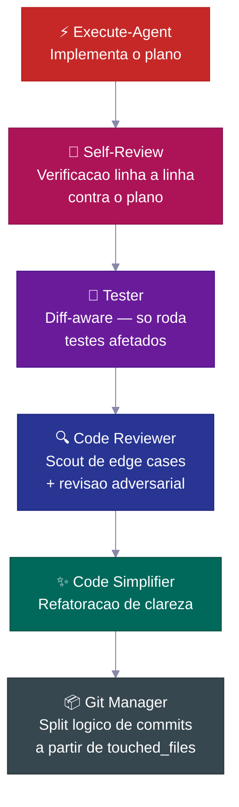
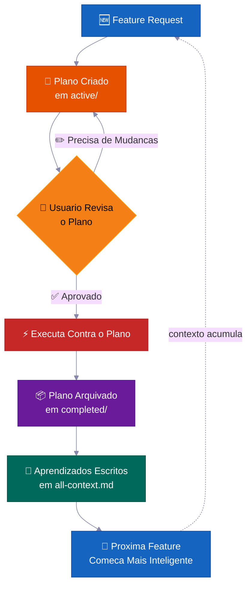
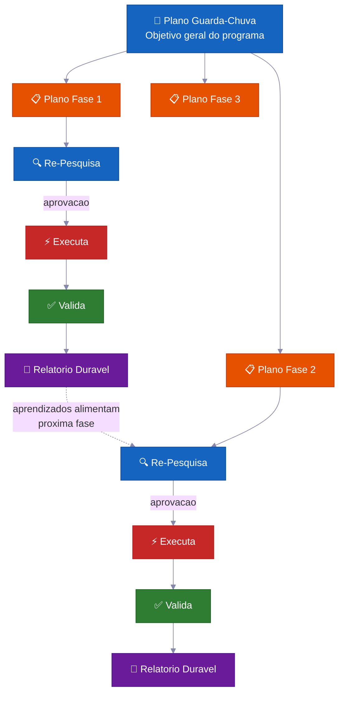

<p align="center">
  <a href="../../README.md">English</a> |
  <a href="README.zh-CN.md">简体中文</a> |
  <a href="README.ja-JP.md">日本語</a> |
  <a href="README.ko-KR.md">한국어</a> |
  <a href="README.vi-VN.md">Tiếng Việt</a> |
  <strong>Portugues</strong>
</p>

<div align="center">

<a href="https://flowser.ai">
  
</a>

*Feito por engenheiros de classe mundial, para vibecoders na*<br>
*[flowser.ai](https://flowser.ai) — Agentes de IA com computadores para GTM*

<br>

# vibecode-pro-max-kit

**Pare seu AI de codar antes de pensar — e de esquecer cada prompt detalhado que voce mandou.<br>Esse harness transforma qualquer agente de codigo AI num time de engenharia orientado a specs<br>que pesquisa, planeja, entrega codigo production-grade, e auto-aprimora sua memoria pra sobreviver ao apodrecimento de contexto mesmo 6 meses depois.**

<br>

<p align="center">
  
  <br><br>
  <em>"Concentracao Total — Respiracao Spec, Decima Forma: Fluxo Constante.<br>Um ciclo de desenvolvimento continuo que fica mais forte a cada feature entregue.<br>O contexto acumula. O flow nunca quebra."</em><br>
  <strong>— Tanjiro Kamado</strong>
</p>

🔬 Desenvolvimento orientado a specs para agentes de IA<br>
📋 Gera PRDs automaticamente, gerencia backlogs, roteia contexto automaticamente<br>
🧠 Base de conhecimento que se auto-aprimora e acumula conforme voce entrega<br>
⚡ Roda de forma autonoma por horas em tarefas grandes sem perder estado<br>
🤝 Planos e specs sao compartilhaveis — devs, PMs e stakeholders revisam os mesmos artefatos

<p>
  <a href="https://github.com/withkynam/vibecode-pro-max-kit/stargazers"></a>
  <a href="https://github.com/withkynam/vibecode-pro-max-kit/network/members"></a>
  <a href="LICENSE"></a>
  <a href="https://github.com/withkynam/vibecode-pro-max-kit/graphs/contributors"></a>
  <a href="https://github.com/withkynam/vibecode-pro-max-kit/actions/workflows/validate.yml"></a>
  <a href="https://github.com/withkynam/vibecode-pro-max-kit/commits/main"></a>
  
  
  
</p>

<p>
  <strong>O harness de coding mais simples, flexivel e team-friendly para</strong><br><br>
  <a href="https://github.com/anthropics/claude-code"></a>&nbsp;
  <a href="https://github.com/openai/codex"></a>&nbsp;
  <a href="https://cursor.com"></a>&nbsp;
  <a href="https://windsurf.com"></a><br>
  <a href="https://github.com/google-gemini/gemini-cli"></a>&nbsp;
  <a href="https://github.com/opencode-ai/opencode"></a>&nbsp;
  <a href="https://github.com/features/copilot"></a>
</p>

<p>
  <em>Funciona com qualquer stack, qualquer linguagem, qualquer projeto</em><br><br>
  <picture>
    <source media="(prefers-color-scheme: dark)" srcset="https://skillicons.dev/icons?i=ts,js,react,nextjs,vue,nuxt,svelte,angular,nodejs,express,bun,python,django,flask,fastapi,ruby,rails,go,rust,java,spring,kotlin,swift,php,laravel,cs,dotnet,elixir,graphql,prisma,supabase,firebase,postgres,mongodb,redis,docker,kubernetes,aws,gcp,azure,vercel,cloudflare,tailwind,electron&theme=dark&perline=15" />
    <source media="(prefers-color-scheme: light)" srcset="https://skillicons.dev/icons?i=ts,js,react,nextjs,vue,nuxt,svelte,angular,nodejs,express,bun,python,django,flask,fastapi,ruby,rails,go,rust,java,spring,kotlin,swift,php,laravel,cs,dotnet,elixir,graphql,prisma,supabase,firebase,postgres,mongodb,redis,docker,kubernetes,aws,gcp,azure,vercel,cloudflare,tailwind,electron&theme=light&perline=15" />
    
  </picture>
  <br>
  <sub>React · Next.js · Vue · Nuxt · Svelte · Angular · React Native · Electron · Node.js · Express · Bun · Hono · Python · Django · FastAPI · Flask · Ruby · Rails · Go · Rust · Java · Spring Boot · Kotlin · Swift · PHP · Laravel · C# · .NET · Elixir · TypeScript · Prisma · Supabase · Firebase · PostgreSQL · MongoDB · Redis · GraphQL · Docker · Kubernetes · Terraform · AWS · GCP · Azure · Vercel · Cloudflare · Tailwind · shadcn/ui · e qualquer outra stack que seu projeto use</sub>
</p>

</div>

---

## 🚀 Instalacao (30 segundos)

```bash
curl -fsSL https://raw.githubusercontent.com/withkynam/vibecode-pro-max-kit/main/install.sh | bash
```

Depois abra o Claude Code e diga:

```
Run vc-setup
```

E isso. A skill de setup detecta sua stack, pergunta sobre seu projeto (uma conversa de verdade, nao um checklist), cria a estrutura do diretorio process, faz um scan profundo do seu codebase e popula os arquivos de contexto com conteudo real — nao placeholders.

<br>

<details>
<summary><strong>📦 O que e instalado</strong></summary>

<br>

```
your-project/
├── .claude/
│   ├── agents/              # 🤖 12 definicoes de agentes especializados
│   │   ├── vc-research-agent.md
│   │   ├── vc-execute-agent.md
│   │   └── ...
│   ├── skills/              # ⚡ 31 skills auto-descobertas
│   │   ├── vc-generate-plan/
│   │   ├── vc-security/
│   │   ├── vc-scout/
│   │   └── ...
│   └── hooks/               # 🪝 7 hooks de ciclo de vida
│       ├── privacy-block.cjs
│       ├── scout-block.cjs
│       └── ...
├── .codex/
│   └── agents/              # 🔄 Agentes espelhados para Codex
├── CLAUDE.md                # 📋 Orquestrador + regras de roteamento
├── AGENTS.md                # 📖 Registro de agentes
└── process/                 # 🧠 Criado pelo vc-setup (nao pelo install)
    └── ...
```

- **Projeto novo?** Instala o harness completo, depois o `vc-setup` estuda seu codebase
- **Ja tem `.claude/` configurado?** Faz backup em `.vibecode-backup/`, instala do zero, restaura seu `settings.json`
- **Ja tem diretorio `process/`?** Nunca e tocado pelo install — o `vc-setup` cuida da migracao de forma inteligente
- **Ja tem `CLAUDE.md`?** Faz backup como `CLAUDE.md.pre-vibecode`, instala a versao do harness

</details>

<details>
<summary><strong>🤖 Prompt completo de setup do agente</strong> (copie e cole no Claude Code para maximo controle)</summary>

```
First, install the vibecode-pro-max-kit agent harness by running this command:

curl -fsSL https://raw.githubusercontent.com/withkynam/vibecode-pro-max-kit/main/install.sh | bash

After the install completes, run vc-setup to configure everything for this project.

Follow the full interactive flow:

1. DETECT — Read package.json, detect my stack (framework, package manager, monorepo
   structure, test framework, database, auth). Also check if I have any existing .claude/,
   process/, or context files from a previous setup.

2. SHOW ME WHAT YOU FOUND — Present a summary of the detection results and wait for me
   to confirm before continuing. If this is an existing project with process/ folders or
   context files, tell me what you found and what looks good vs what could be improved.

3. ASK ME ABOUT THE PROJECT — Before scaffolding or scanning, have a real conversation
   with me about this project. Don't just ask a fixed list of questions and move on — ask
   follow-ups based on my answers, probe deeper on anything vague, and keep going until
   you genuinely understand the project. Start with the basics (what is this? who uses it?),
   then dig into architecture, features, conventions, pain points, and anything else that
   matters. Summarize your understanding back to me and confirm it's correct before moving on.

4. SCAFFOLD — Create the process/ directory structure. If I already have process/ folders,
   show me what you plan to change and wait for my approval before reorganizing anything.
   Never silently move or delete my existing files.

5. STUDY — Deep-scan the codebase and populate process/context/all-context.md with REAL
   content based on what you find AND what I told you. Include: repo structure, tech stack
   with versions, key patterns and conventions, import aliases, env vars, API routes,
   database schema, test setup. Do not leave placeholder text.

6. VALIDATE — Run all the validation checks to make sure everything is wired correctly.

Important rules:
- If I have existing context files or a well-written CLAUDE.md, read them first and
  preserve what is good. Merge intelligently — do not replace good content with generic scans.
- Show me a summary of what you plan to create or change at each major step and wait
  for my OK before proceeding.
- Do not create empty placeholder files. Only create files that have real content.
- Ask before reorganizing. If my existing setup works, tell me what you would improve
  and let me decide.
```

</details>

<br>

<details>
<summary>Sumario</summary>

- [O Problema](#-o-problema)
- [A Solucao](#️-a-solucao)
- [A Revolucao do Vibe Coding](#a-revolucao-do-vibe-coding)
- [Pra Quem E Isso?](#pra-quem-e-isso)
- [Visao Geral](#visao-geral)
- [Por Que Times Usam Isso](#-por-que-times-usam-isso)
- [Como Se Compara](#como-se-compara)
- [O Que Torna Isso Diferente](#-o-que-torna-isso-diferente)
- [O Que Tem Dentro](#-o-que-tem-dentro)
- [Como Funciona](#-como-funciona)
- [Sistemas de Seguranca Integrados](#️-sistemas-de-seguranca-integrados)
- [Contribuindo](#contribuindo)
- [Star History](#-star-history)

</details>

---

## 🔥 O Problema

Voce pede pro Claude "adicionar suporte a webhooks." Ele imediatamente comeca a escrever codigo. Sem perguntas sobre sua arquitetura. Sem verificar padroes existentes. Sem plano. Voce recebe 400 linhas que nao encaixam no seu codebase, e gasta uma hora consertando.

**Mas isso e so a superficie.** Os problemas mais profundos doem mais:

<table>
<tr>
<td width="50%" valign="top">
<h1>🧠</h1>
<strong>O contexto morre a cada sessao</strong><br><br>
Seu agente esquece tudo que aprendeu. Mesmos erros, mesmas perguntas, toda vez. Sem memoria, sem conhecimento acumulado.
</td>
<td width="50%" valign="top">
<h1>📄</h1>
<strong>Docs ficam desatualizados instantaneamente</strong><br><br>
Voce escreveu otimos docs de contexto semana passada. Ja estao desatualizados. Nada atualiza eles automaticamente conforme o codebase evolui.
</td>
</tr>
<tr>
<td width="50%" valign="top">
<h1>💥</h1>
<strong>Tarefas grandes colapsam no meio do caminho</strong><br><br>
A context window enche, o estado se perde, o agente comeca a alucinar. Voce recomeca do zero na hora 3.
</td>
<td width="50%" valign="top">
<h1>🤝</h1>
<strong>Sem specs, sem revisao, sem colaboracao</strong><br><br>
Seu PM nao consegue revisar o que o agente vai construir. Nao existe artefato pra compartilhar, discutir ou aprovar antes do codigo ser escrito.
</td>
</tr>
<tr>
<td width="50%" valign="top">
<h1>🎭</h1>
<strong>Decisoes de arquitetura sao alucinadas</strong><br><br>
O agente inventa padroes em vez de pesquisar como outros codebases resolveram o mesmo problema.
</td>
</tr>
</table>

**Seu agente tem inteligencia mas nao tem processo, memoria, e nem como colaborar com seu time.**

Seja voce um desenvolvedor, um PM, ou um CEO que acabou de descobrir o vibe coding — esse problema atinge todo mundo da mesma forma. A solucao tambem e a mesma: **de pro seu agente um processo de desenvolvimento de verdade.**

---

## 🛠️ A Solucao

Esse harness instala um sistema de desenvolvimento completo no seu projeto — nao e so um arquivo CLAUDE.md, sao **12 agentes especializados, 31 skills**, e um workflow com fases travadas que forca seu agente a **entender antes de construir**.

<br>

<table>
<tr>
<td align="center" width="50%" valign="top">
<h1>📋</h1>
<strong>Planos orientados a specs</strong><br><br>
<sub>PMs e devs revisam o mesmo artefato de plano antes de qualquer codigo ser escrito</sub>
</td>
<td align="center" width="50%" valign="top">
<h1>🔄</h1>
<strong>Contexto que se auto-atualiza</strong><br><br>
<sub>Atualiza automaticamente toda vez que uma feature e entregue — docs nunca ficam defasados</sub>
</td>
</tr>
<tr>
<td align="center" width="50%" valign="top">
<h1>⚡</h1>
<strong>Execucao autonoma</strong><br><br>
<sub>Sobrevive a compactacao de contexto — roda por horas, nao minutos</sub>
</td>
<td align="center" width="50%" valign="top">
<h1>🧬</h1>
<strong>Pesquisa de arquitetura</strong><br><br>
<sub>Estuda codebases reais antes de tomar decisoes de design</sub>
</td>
</tr>
<tr>
<td align="center" width="50%" valign="top">
<h1>🧭</h1>
<strong>Roteamento inteligente de contexto</strong><br><br>
<sub>Carrega so o que e relevante — nao toda sua base de conhecimento toda vez</sub>
</td>
</tr>
</table>

<br>



Toda transicao exige sua **aprovacao explicita**. Nada avanca automaticamente. Voce mantem o controle.

---

## A Revolucao do Vibe Coding

<div align="center">
<h3><em>"A linguagem de programacao mais quente do momento e o ingles."</em></h3>
<strong>— Andrej Karpathy</strong>
</div>

<br>

**O vibe coding mudou quem pode construir software. O desenvolvimento orientado a specs muda o que eles conseguem entregar.**

<table>
<tr>
<td align="center" width="50%">
<h3>63%</h3>
<sub>dos usuarios de vibe coding <strong>NAO</strong> sao desenvolvedores</sub>
</td>
<td align="center" width="50%">
<h3>16.2M</h3>
<sub>citizen developers no mundo<br>(38% de crescimento ano a ano)</sub>
</td>
</tr>
<tr>
<td align="center" width="50%">
<h3>$4.7B</h3>
<sub>mercado de vibe coding<br>crescendo 38% ao ano</sub>
</td>
<td align="center" width="50%">
<h3>25%</h3>
<sub>das startups do YC W25 tinham 95%+ de codigo gerado por IA</sub>
</td>
</tr>
</table>

A maioria das ferramentas te ajuda a comecar um projeto. Esse harness te ajuda a **terminar** — com planos que seu time pode revisar, contexto que nunca fica defasado, e sistemas de seguranca que pegam erros antes de irem pra producao.

---

## Pra Quem E Isso?

<div align="center">
<h3><em>"O que importa nao e quem digitou. E o que foi entregue."</em></h3>
<strong>— Garry Tan, YC</strong>
</div>

<br>

Seja voce alguem que acabou de descobrir o vibe coding ou um staff engineer entregando sistemas em producao — esse harness se adapta ao seu workflow.

<table>
<tr>
<td width="50%" valign="top">
<h1>🧑‍💼</h1>
<strong>CEO / Fundador</strong><br><br>
<em>"Me construa um SaaS com auth, billing e uma landing page"</em><br><br>
O agente pesquisa sua stack, escreve um plano de arquitetura que voce pode revisar, implementa com testes, e captura cada decisao pro seu co-fundador tecnico auditar depois.
</td>
<td width="50%" valign="top">
<h1>📊</h1>
<strong>Product Manager</strong><br><br>
<em>"Crie um dashboard mostrando MRR, churn e metricas de crescimento"</em><br><br>
Ele gera uma spec estilo PRD, pega sua aprovacao antes de escrever codigo, implementa conforme a spec, e arquiva o plano como historico pesquisavel do projeto.
</td>
</tr>
<tr>
<td width="50%" valign="top">
<h1>🎨</h1>
<strong>Designer</strong><br><br>
<em>"Reproduza esse screenshot do Figma pixel-perfect"</em><br><br>
O agente design-aware analisa seu mockup, implementa componente por componente com seus design tokens, e dispara checagens de comparacao visual.
</td>
<td width="50%" valign="top">
<h1>⚙️</h1>
<strong>Engenheiro</strong><br><br>
<em>"Refatore o modulo de auth pra suportar RBAC com zero downtime"</em><br><br>
Ele pesquisa seu codigo de auth atual e como outros codebases resolveram RBAC, escreve um plano de migracao com analise de blast radius, implementa com seguranca e notas de rollback.
</td>
</tr>
</table>

---

## Visao Geral

<table>
<tr>
<td align="center" width="50%" valign="top">
<h1>🤖</h1>
<h3>12</h3>
<strong>Agentes Especializados</strong><br>
<sub>Especialistas de dominio que controlam cada fase do desenvolvimento</sub>
</td>
<td align="center" width="50%" valign="top">
<h1>⚡</h1>
<h3>32</h3>
<strong>Skills Auto-Descobertas</strong><br>
<sub>Capacidades reutilizaveis ativadas por match de keywords</sub>
</td>
</tr>
<tr>
<td align="center" width="50%" valign="top">
<h1>🪝</h1>
<h3>7</h3>
<strong>Hooks de Ciclo de Vida</strong><br>
<sub>Guardrails pre/pos execucao e injecao de contexto</sub>
</td>
<td align="center" width="50%" valign="top">
<h1>📜</h1>
<h3>6</h3>
<strong>Protocolos de Desenvolvimento</strong><br>
<sub>Regras de workflow compartilhadas entre todas as ferramentas</sub>
</td>
</tr>
<tr>
<td align="center" width="50%" valign="top">
<h1>🛡️</h1>
<h3>5</h3>
<strong>Sistemas de Seguranca</strong><br>
<sub>Travamento de fase, blast radius, privacidade, deteccao de vazamentos</sub>
</td>
<td align="center" width="50%" valign="top">
<h1>🔧</h1>
<h3>7</h3>
<strong>Ferramentas Suportadas</strong><br>
<sub>Claude Code, Codex, Cursor, Windsurf, Antigravity, OpenCode, Copilot</sub>
</td>
</tr>
<tr>
<td align="center" width="50%" valign="top">
<h1>🌍</h1>
<h3>6</h3>
<strong>Idiomas</strong><br>
<sub>EN · 中文 · 日本語 · 한국어 · Tiếng Việt · Portugues</sub>
</td>
<td align="center" width="50%" valign="top">
<h1>⚡</h1>
<h3>30s</h3>
<strong>Tempo de Instalacao</strong><br>
<sub>Um comando curl + auto-setup faz o resto</sub>
</td>
</tr>
</table>

---

## 💎 Por Que Times Usam Isso

> A maioria dos harnesses te da um CLAUDE.md e instrucoes. Esse te da um **sistema de desenvolvimento autonomo** que acumula inteligencia ao longo do tempo.

<br>

### 📋 Desenvolvimento Orientado a Specs — Nao a Vibes

Cada feature recebe um **plano escrito com analise de blast radius** antes de uma unica linha de codigo ser escrita.

> 💡 Gera PRDs automaticamente, gerencia backlogs, organiza grupos de features. Funciona tanto pra devs quanto pra product managers — seu agente planeja como um engenheiro senior, nao como um estagiario.

**O que tem em cada plano:**

| Secao | Proposito |
|---|---|
| 📍 **Touchpoints** | Cada arquivo que sera criado ou modificado, listado antecipadamente |
| 📜 **Contratos publicos** | Quais APIs ou interfaces mudam |
| 💥 **Blast radius** | O que pode quebrar, quais testes rodar, o que ficar de olho |
| ✅ **Evidencia de verificacao** | Como provar que a implementacao esta correta |
| 🔄 **Handoff de retomada** | Contexto suficiente pra qualquer agente retomar no meio do plano |

<br>

### 🔄 Execucao Autonoma Multi-Fase — Horas de Trabalho Hands-Free

Para tarefas grandes, o agente roda um **loop iterativo por fases**:

```
🔍 pesquisa → ⚡ executa → ✅ valida → 📄 relatorio → 🔄 repete
```

> 💡 Ele se auto-recupera quando trava, faz auto-reflexao pra melhorar a abordagem, e escreve relatorios de progresso duraveis em disco. **Compactacao de contexto nao mata ele** — todo estado vive em arquivos, nao em memoria.

Saia pra tomar um cafe e quando voltar, o trabalho ja ta pronto.

<br>

### 🧬 Pesquisa de Arquitetura Automatica — Aprenda com Qualquer Codebase

O agente nao so le seu codigo — ele **estuda outros repositorios** pra aprender como resolveram problemas similares (`vc-xia`).

> 💡 Ele pesquisa, compara abordagens e adapta os melhores padroes pro seu codebase. Decisoes de arquitetura sao informadas por implementacoes do mundo real, nao por best practices alucinadas.

<br>

### 🧭 Roteamento Inteligente e Persistente de Contexto — Sempre o Contexto Certo

O contexto nao e um arquivo gigante. Ele e organizado em **dominios de conhecimento auto-roteados**:

```
process/context/
├── all-context.md              # 🧭 Router raiz — le sua tarefa, carrega o que e relevante
├── tests/
│   └── all-tests.md            # 🧪 Test runners, comandos, debugging
├── container/
│   └── all-container.md        # 🐳 Docker, deployment, infra
├── uxui/
│   └── all-uxui.md             # 🎨 Componentes, design tokens, padroes
└── {seu-dominio}/
    └── all-{dominio}.md        # 📚 Qualquer dominio com 3+ docs duraveis
```

> 💡 Quando o agente trabalha em billing, ele carrega contexto de billing — nao os docs inteiros do seu codebase. O contexto **se auto-atualiza toda vez que voce completa uma feature**, entao nunca fica defasado.

<br>

### 🧠 Base de Conhecimento que Se Auto-Aprimora — Fica Mais Inteligente Conforme Voce Entrega

Cada feature completada alimenta aprendizados de volta no sistema de contexto.

> 💡 Descobertas de pesquisa, decisoes de arquitetura, insights de debugging e padroes de codigo sao **capturados e indexados automaticamente**. Sua feature numero 100 se beneficia de tudo que foi aprendido nas 99 anteriores. O conhecimento acumula — nao reseta.

---

## Como Se Compara

| Funcionalidade | vibecode-pro-max-kit | Superpowers | GSD | gstack |
|---------|---------------------|-------------|-----|--------|
| Ciclo de vida orientado a specs | RIPER-5 completo (pesquisa → plano → executa → verifica) | Workflows obrigatorios | Correcao de context-rot | Parcial |
| Seguranca travada por fase | Restricoes de ferramentas por modo (pesquisa read-only, innovate sem escrita) | Restricoes baseadas em skills | Separacao de fases | Nenhuma |
| Suporte multi-ferramenta | 7 ferramentas via AGENTS.md + nativo | Plugin Claude Code | 14 runtimes | 1 ferramenta |
| Contexto que se auto-aprimora | Context groups roteados por dominio, atualiza apos cada feature | Memoria de plugin | Estado persistido em disco | Manual |
| Colaboracao em time | Specs, planos e artefatos de revisao compartilhados | Solo | Solo | Solo |
| Sistema de skills | 32 auto-descobertas, match por keyword em cada prompt | 86 skills composiveis | Meta-prompting | 23 role tools |
| Programas multi-fase | Planos guarda-chuva + loop de execucao por fase com checks de regressao | Tarefa unica | Tarefa unica | Tarefa unica |
| Pipeline de qualidade | Cadeia de 6 passos (code-review → test → simplify → security → audit → commit) | Qualidade por skill | Sem cadeia automatica | Sem cadeia automatica |
| Instalacao | Install de 30s via `curl` + auto-setup | Marketplace de plugins | npx one-liner | git clone |
| Roteamento de contexto | Tabela de roteamento por dominio com packs de contexto agrupados | Contexto flat de skill | Contexto flat | Arquivo unico |

> **Sobre amplitude de runtimes:** GSD suporta 14 runtimes. Nos suportamos 7 em profundidade — com harnesses completos de agentes, descoberta de skills e hooks de ciclo de vida em cada plataforma. Amplitude vs. profundidade: a escolha e sua.

---

## ⚡ O Que Torna Isso Diferente

A maioria dos harnesses de agente te da um CLAUDE.md grande e algumas instrucoes. Veja o que esse aqui realmente faz:

<br>

<table>
<tr>
<td width="50%" valign="top">
<h1>🔒</h1>
<strong>Restricoes de Ferramentas Travadas por Fase</strong><br><br>
Seu agente literalmente <strong>nao consegue</strong> escrever codigo durante a pesquisa. RESEARCH e read-only, INNOVATE nao tem Bash, PLAN so pode escrever em <code>process/</code>. <strong>Remocao real de capacidade</strong>, nao sugestoes.
</td>
<td width="50%" valign="top">
<h1>🎯</h1>
<strong>Auto-Roteamento Inteligente</strong><br><br>
Detecta sua intencao a partir de linguagem natural. "build webhook support" → pipeline completo. "login is broken" → debugger. Precedencia de 6 niveis, no maximo uma pergunta de esclarecimento.
</td>
</tr>
<tr>
<td width="50%" valign="top">
<h1>🔍</h1>
<strong>Descoberta Automatica de Skills</strong><br><br>
Antes de rotear qualquer request, escaneia <strong>32 skills</strong> e faz match por keywords. Diga "add webhook support" e <code>vc-security</code> + <code>vc-scenario</code> aparecem automaticamente.
</td>
<td width="50%" valign="top">
<h1>💾</h1>
<strong>Sobrevive a Compactacao de Contexto</strong><br><br>
Planos, relatorios, docs de contexto e aprendizados vivem em disco. O hook session-init re-injeta approval gates apos compactacao. <strong>Nada e perdido.</strong>
</td>
</tr>
<tr>
<td width="50%" valign="top">
<h1>🛡️</h1>
<strong>Auto-Policiamento com Deteccao de Violacao</strong><br><br>
Quando o agente esta prestes a cruzar uma fronteira de fase, ele para sozinho: <em>"PHASE JUMPING PREVENTED"</em>. Uma <strong>guard estrutural contra alucinacao</strong>.
</td>
<td width="50%" valign="top">
<h1>🔄</h1>
<strong>Funciona em 7 Ferramentas de AI Coding</strong><br><br>
Dois padroes abertos — <code>AGENTS.md</code> e <code>SKILL.md</code> — significam <strong>zero adapters, zero plugins, zero configuracao.</strong> Comece no Claude Code, mude pro Cursor, continue no Codex.
</td>
</tr>
</table>

---

## 🧭 Como Funciona

```
Seu request
  → Step 0: Descoberta de Skills (match de keywords → traz skills relevantes)
  → Deteccao de Intencao (feature / bug / pergunta / refactor / UI)
  → Roteia pro agente certo
  → Execucao travada por fase com transicoes explicitas
```

O orquestrador **nunca faz o trabalho ele mesmo** — ele roteia, monitora e gerencia transicoes.

<br>

### 📊 O Workflow

| Fase | O que acontece | Voce diz |
|-------|-------------|---------|
| 🔍 **RESEARCH** | Coleta de fatos somente leitura — codebase + web | *(automatico em feature requests)* |
| 💡 **INNOVATE** | Explora 2-3 abordagens com trade-offs | `go` |
| 📋 **PLAN** | Escreve uma spec detalhada que voce pode revisar | `go` |
| ⚡ **EXECUTE** | Implementa exatamente o que foi planejado | `ENTER EXECUTE MODE` |
| 🧠 **UPDATE PROCESS** | Captura aprendizados, atualiza contexto, arquiva plano | *(recomendado apos trabalho nao-trivial)* |

> 💡 **Atalhos:** `ENTER FAST MODE - [tarefa]` comprime RESEARCH+INNOVATE+PLAN em uma passada — ainda pausa antes do EXECUTE. Correcoes triviais (arquivo unico, <15 linhas, sem mudancas de schema/auth) vao direto pro execute.

<br>

### 💻 Sessao Tipica

```
# 🆕 Feature request
Voce: "add webhook support to the API"
→ Descoberta de skills traz: vc-scenario, vc-security
→ research-agent coleta contexto (somente leitura, nao mexe no codigo)
→ Voce diz "go" → innovate-agent explora abordagens
→ Voce diz "go" → plan-agent escreve spec com blast radius
→ Voce revisa o plano, diz "ENTER EXECUTE MODE"
→ execute-agent implementa → self-review → tester → code-reviewer → git-manager
→ Pacote de closeout: o que mudou, o que foi verificado, proximo passo recomendado
```

```
# 🐛 Bug fix
Voce: "login redirect is broken"
→ Roteia pro vc-debugger → coleta de evidencias → hipoteses concorrentes
→ Causa raiz identificada com cadeia de provas
→ execute-agent implementa a correcao → pipeline de qualidade
```

```
# ⏩ Fast mode
Voce: "ENTER FAST MODE - add rate limiting middleware"
→ Research+innovate+plan comprimidos em uma passada
→ Pausa de seguranca obrigatoria → voce revisa → "ENTER EXECUTE MODE"
```

```
# 🏗️ Programa grande
Voce: "build a full testing platform"
→ Cria plano guarda-chuva + planos por fase numa feature folder
→ Cada fase: re-pesquisa → aprova → executa → valida → relatorio duravel
→ Progresso sobrevive compactacao de contexto — relatorios duraveis em disco
```

```
# 🔄 Otimizacao autonoma
Voce: "improve test coverage to 80% using vc-autoresearch"
→ Agente itera: faz mudanca → commit → mede → mantem/reverte
→ Deteccao de travamento apos 5 descartes consecutivos → muda de estrategia
→ Trilha de auditoria completa em TSV
```

---

## 🛡️ Sistemas de Seguranca Integrados

Esses nao sao apenas guidelines — sao **enforcement estrutural** embutido em cada agente.

<table>
<tr>
<td width="50%" valign="top">
<h1>⏸️</h1>
<strong>Check-In de 50% no Meio da Implementacao</strong><br><br>
Aproximadamente na metade da execucao, o agente <strong>pausa</strong> pra reportar progresso, listar itens completados e restantes, e pergunta: <em>"Continuar com a abordagem atual ou pausar e voltar pro PLAN?"</em>
</td>
<td width="50%" valign="top">
<h1>🚫</h1>
<strong>Nunca Desvia Silenciosamente</strong><br><br>
Se o execute-agent encontra um problema que exige desvio do plano, ele <strong>para imediatamente</strong>, explica o problema e volta pro modo PLAN. Sem improviso silencioso.
</td>
</tr>
<tr>
<td width="50%" valign="top">
<h1>🔙</h1>
<strong>Protocolo de Abandono de Abordagem</strong><br><br>
Quando uma abordagem falha, o agente avalia componentes reutilizaveis, documenta licoes antes de deletar, cria um resumo de abandono e volta pro PLAN.
</td>
<td width="50%" valign="top">
<h1>🔐</h1>
<strong>Hook de Guardrails de Privacidade</strong><br><br>
O agente e <strong>bloqueado de ler</strong> <code>.env</code>, credenciais, chaves SSH e arquivos <code>.pem</code>. Precisa pedir aprovacao explicita.
</td>
</tr>
<tr>
<td width="50%" valign="top">
<h1>⚠️</h1>
<strong>Pacotes de Evidencia para Alto Risco</strong><br><br>
Para mudancas que tocam auth, billing, migracoes de schema ou APIs publicas — o sistema exige um pacote de evidencia formal antes de considerar o trabalho "feito."
</td>
<td width="50%" valign="top">
<h1>📊</h1>
<strong>Scoring de Sinal de Drift</strong><br><br>
Apos a execucao, o sistema pontua a urgencia: <strong>LOW</strong> (leve), <strong>MEDIUM</strong> (mudancas significativas), <strong>HIGH</strong> (arquivos de harness/protocolo tocados).
</td>
</tr>
</table>

---

## 🔍 Inteligencia Pre-Implementacao

Antes de uma unica linha de codigo ser escrita, o sistema consegue capturar problemas atraves de analises especializadas:

<br>

<table>
<tr>
<td width="50%" valign="top">
<h1>🎭</h1>
<strong>Debate Pre-Implementacao com 5 Personas</strong><br><br>
<code>vc-predict</code> — Arquiteto, Seguranca, Performance, UX e Advogado do Diabo debatem seu plano. Produz um veredito <strong>GO / CAUTION / STOP</strong> antes de voce escrever uma linha de codigo.
</td>
<td width="50%" valign="top">
<h1>🎲</h1>
<strong>Gerador de Edge Cases em 12 Dimensoes</strong><br><br>
<code>vc-scenario</code> — Decompoe qualquer feature em 12 dimensoes (tipos de usuario, extremos de input, timing, escala, estado, ambiente, erros, auth, dados, integracoes, compliance, logica de negocio). Outputs utilizaveis como specs de teste.
</td>
</tr>
<tr>
<td width="50%" valign="top">
<h1>🔐</h1>
<strong>Auditoria de Seguranca STRIDE + OWASP</strong><br><br>
<code>vc-security</code> — Auditoria de seguranca com dupla metodologia, auditoria de dependencias, deteccao de secrets, e <strong>modo auto-fix</strong> que ordena por severidade e corrige Critical primeiro com guards de regressao.
</td>
</tr>
</table>

---

## 🤖 Capacidades de Agente Autonomo

<br>

<table>
<tr>
<td width="50%" valign="top">
<h1>🔄</h1>
<strong>Otimizacao Autonoma de Metricas</strong><br><br>
<code>vc-autoresearch</code> — Defina um objetivo, va embora. Loop iterativo com backup em git: faz UMA mudanca atomica → commit → mede → mantem ou reverte. Deteccao de travamento apos 5 descartes consecutivos dispara mudancas de estrategia.
</td>
<td width="50%" valign="top">
<h1>👥</h1>
<strong>Times de Agentes em Paralelo</strong><br><br>
<code>vc-team</code> — Multiplos agentes trabalhando <strong>simultaneamente</strong> com isolamento via git worktree. Pesquisa em paralelo, executa em paralelo, revisa em paralelo, debugga de forma adversarial.
</td>
</tr>
<tr>
<td width="50%" valign="top">
<h1>🔬</h1>
<strong>Debugging com Evidencia Antes da Hipotese</strong><br><br>
<code>vc-debugger</code> — Coleta evidencias primeiro → forma 2-3 hipoteses concorrentes → testa sistematicamente cada uma → documenta o caminho de eliminacao. <strong>Nunca chuta — prova.</strong>
</td>
</tr>
</table>

---

## ✅ Pipeline de Qualidade — Integrado na Execucao

O execute-agent nao so escreve codigo e diz que terminou. Ele encadeia automaticamente um **pipeline de qualidade**:

<br>



<br>

| Passo | O que faz |
|---|---|
| 🔎 **Self-review** | Verifica cada item do checklist contra o plano buscando desvios, documenta eles |
| 🧪 **Tester** | Mapeia arquivos alterados para arquivos de teste, auto-escala pra suite completa quando >70% mapeado |
| 🔍 **Code reviewer** | Dispara scout de edge cases ANTES da revisao, verifica queries N+1, paths de auth, vazamentos de dados |
| ✨ **Simplifier** | Refatoracao de clareza apos revisao passar — sem mudancas de comportamento |
| 📦 **Git manager** | Recebe lista de `touched_files`, divide em commits convencionais logicos, recusa arquivos desconhecidos |

---

## 📋 O Ciclo de Vida do Plano — Orientado a Specs, Nao a Vibes

Toda feature nao-trivial segue um **ciclo de vida de plano** — uma spec escrita que e criada, revisada, executada e arquivada como historico do projeto.

<br>



<br>

> 💡 Daqui a seis meses, quando alguem perguntar *"por que construimos auth assim?"*, a resposta ta em `completed/`. Nao perdida numa thread do Slack.

<br>

**Onde os planos ficam em disco:**

```
process/
├── general-plans/
│   ├── active/                  # 📋 Planos sendo trabalhados atualmente
│   │   └── webhooks_PLAN_28-05-26.md
│   ├── completed/               # ✅ Planos arquivados (historico pesquisavel)
│   ├── backlog/                 # 📌 Trabalho adiado
│   ├── reports/                 # 📄 Relatorios cross-cutting
│   └── references/              # 📚 Outputs de pesquisa
└── features/
    └── billing/                 # 🏷️ Escopo por feature (5+ artefatos)
        ├── active/
        ├── completed/
        ├── backlog/
        ├── reports/
        └── references/
```

---

## 🏗️ Programas de Fase — Projetos Grandes Que Nao Desmoronam

Features normais usam um plano. **Projetos grandes multi-fase** usam um programa de fases — um plano guarda-chuva mais planos individuais por fase, cada um com seu proprio gate de validacao.

<br>



<br>

**Funcionalidades principais:**

| | Funcionalidade | Por que importa |
|---|---|---|
| 🔄 | **Re-pesquisa a cada fase** | Verifica drift de codigo, le relatorios mais recentes, atualiza premissas |
| ✅ | **Gates de validacao** | Fase nao e `VERIFIED` ate evidencia provar. Status honesto: `PLANNED` → `CODE DONE` → `TESTING` → `VERIFIED` ou `BLOCKED` |
| 📄 | **Relatorios duraveis** | Cada fase escreve resultados em disco. Progresso sobrevive compactacao de contexto |
| 🧠 | **Aprendizados alimentam o futuro** | Descobertas da Fase 1 atualizam o plano da Fase 2 antes da execucao |
| 🏗️ | **Fundacao vs expansao** | Separa explicitamente "provar a arquitetura" de "implementar tudo" |
| 🚧 | **Tratamento honesto de blockers** | Fases bloqueadas ficam `BLOCKED` com evidencia. Sem forcar status verde |

---

## 🧠 Context Groups — Conhecimento Organizado, Nao Um Arquivo Gigante

O conhecimento do projeto e organizado em **context groups** — dominios de conhecimento duraveis, cada um com um router `all-{group}.md` que diz pros agentes o que ler e quando.

<br>

```
process/context/
├── all-context.md              # 🧭 Router raiz — arquitetura, stack, padroes, convencoes
├── tests/
│   └── all-tests.md            # 🧪 Test runners, comandos, procedimentos de debugging
├── container/
│   └── all-container.md        # 🐳 Docker, deployment, procedimentos de infra
├── uxui/
│   └── all-uxui.md             # 🎨 Componentes, design tokens, padroes
├── infra/
│   └── all-infra.md            # 🖥️ Worker nodes, provisionamento, DNS
├── skills/
│   └── all-skills.md           # ⚡ Runtime de skills, arquitetura de apps
├── workflows/
│   └── all-workflows.md        # 🔄 Runtime de workflows, deployment
└── {seu-dominio}/
    └── all-{dominio}.md        # 📚 Qualquer dominio de conhecimento com 3+ docs duraveis
```

<br>

| | Como funciona |
|---|---|
| 🧭 **Padrao router** | Agentes leem so o que e relevante pra sua tarefa, nao tudo |
| 📏 **Auto-promocao** | Topicos com 3+ docs ou 800+ linhas ganham seu proprio context group |
| 🔄 **Docs vivos** | Atualizados pelo `update-process-agent` apos cada feature nao-trivial |
| 🧪 **Auditavel** | `vc-audit-context` verifica roteamento e consistencia |

---

## 📁 Feature Folders — Memoria de Projeto Auto-Organizavel

Quando um topico acumula 5+ artefatos, ele ganha sua propria **feature folder** — um container de ciclo de vida completo.

<br>

```
process/features/{feature}/
├── active/       # 📋 Planos sendo trabalhados atualmente
├── completed/    # ✅ Planos arquivados (historico de decisoes pesquisavel)
├── backlog/      # 📌 Trabalho adiado (agentes checam antes de duplicar)
├── reports/      # 📄 Relatorios de execucao, post-mortems, resultados de validacao
└── references/   # 📚 Outputs de pesquisa que informam decisoes futuras
```

<br>

| | O que acontece |
|---|---|
| 🆕 | Trabalho novo comeca em `active/` → relatorios acumulam → plano arquiva em `completed/` |
| 📌 | Trabalho adiado vai pro `backlog/` — agentes checam antes de criar planos duplicados |
| 📦 | Promocao de feature acontece automaticamente quando artefatos gerais chegam em 5+ |
| 🔍 | Cada feature tem historico completo e auto-contido — planos, decisoes, relatorios, pesquisa |

---

## 🤖 O Que Tem Dentro

<br>

### 12 Agentes

<details>
<summary>Clique pra expandir a lista de agentes (12 agentes)</summary>

<br>

**Agentes core do workflow** — um por fase RIPER-5:

| Agente | Papel |
|-------|------|
| 🔍 `vc-research-agent` | Pesquisa de codebase + web, somente leitura. Tracking de contradicoes embutido |
| 💡 `vc-innovate-agent` | Brainstorm de 2-3 abordagens. Deve produzir resumo de decisao antes do PLAN |
| 📋 `vc-plan-agent` | Escreve spec com guards anti-racionalizacao. "Eu ja sei como" nao e um plano |
| ⚡ `vc-execute-agent` | Implementa conforme plano. Check-in de 50%, protocolo de desvio, self-review |
| ⏩ `vc-fast-mode-agent` | RESEARCH→INNOVATE→PLAN comprimido com pausa de seguranca obrigatoria |
| 🧠 `vc-update-process-agent` | Checklist obrigatorio de 7 fases incluindo scan de artefatos obsoletos |

<br>

**Agentes especialistas** — chamados durante EXECUTE ou standalone:

| Agente | Papel |
|-------|------|
| 🐛 `vc-debugger` | Evidencia antes de hipotese. Hipoteses concorrentes, cadeias de eliminacao |
| 🧪 `vc-tester` | Diff-aware. So roda testes afetados. Auto-escala em mudancas de config |
| 🔎 `vc-code-reviewer` | Scout de edge cases ANTES da revisao. Deteccao de N+1, validacao de paths de auth |
| ✨ `vc-code-simplifier` | Refatoracao de clareza sem mudanca de comportamento |
| 🎨 `vc-ui-ux-designer` | Frontend design-aware. Pode spawnar subagent de pesquisa durante execucao |
| 📦 `vc-git-manager` | Split logico de commits a partir de `touched_files`. Recusa arquivos desconhecidos |

</details>

<br>

### 31 Skills (auto-descobertas)

<details>
<summary>Clique pra expandir a lista de skills (31 skills)</summary>

<br>

**🔧 Skills de contrato** — `vc-generate-plan` · `vc-generate-context` · `vc-audit-context` · `vc-audit-plans` · `vc-audit-vc` · `vc-setup` · `vc-update` · `vc-publish`

**🧠 Planejamento** — `vc-predict` (debate com 5 personas) · `vc-scenario` (edge cases em 12 dimensoes) · `vc-sequential-thinking` · `vc-problem-solving`

**🐛 Debug & seguranca** — `vc-debug` · `vc-security` (STRIDE + OWASP + auto-fix) · `vc-autoresearch` (otimizacao autonoma)

**📚 Pesquisa** — `vc-docs-seeker` · `vc-scout` · `vc-docs` · `vc-repomix` · `vc-xia` (comparacao de repos)

**🎨 Frontend** — `vc-frontend-design` · `vc-chrome-devtools` · `vc-agent-browser` · `vc-web-testing`

**⚙️ Utilitarios** — `vc-context-engineering` · `vc-mcp-management` · `vc-preview` · `vc-team` (agentes em paralelo) · `vc-tech-graph` · `vc-watzup` (handoff de sessao) · `vc-merge-worktree`

</details>

<br>

### 🪝 7 Hooks

| Hook | O que faz |
|------|-------------|
| 🔐 **Privacy guardrails** | Bloqueia `.env`, credenciais, chaves SSH. Requer aprovacao explicita |
| 🚫 **Scout blocker** | Impede o agente de entrar em `node_modules/`, `dist/`. Sintaxe gitignore via `.ckignore` |
| 🧠 **Session init** | Detecta stack, injeta variaveis de ambiente, recupera approval gates apos compactacao |
| 💉 **Subagent context** | Injeta bloco de contexto compacto de ~200 tokens em cada subagent |
| ✨ **Edit quality** | Apos 5+ edicoes, sugere rodar code-simplifier (nao-bloqueante, com throttle) |
| 📛 **Descriptive naming** | Convencoes de nomenclatura de arquivos language-aware em cada Write |
| 📊 **Usage tracking** | Metricas de sessao e awareness de tokens |

<br>

**Onde tudo fica:**

```
your-project/
├── .claude/
│   ├── agents/              # 🤖 12 definicoes de agentes (.md)
│   ├── skills/              # ⚡ 31 modulos de skills (cada um e um diretorio com SKILL.md)
│   └── hooks/               # 🪝 7 hooks de ciclo de vida (.cjs)
├── .codex/
│   └── agents/              # 🔄 Espelhados para compatibilidade com Codex
├── .agents/
│   └── skills -> ../.claude/skills   # 🔗 Symlink pra descoberta pelo Codex
├── CLAUDE.md                # 📋 Config do orquestrador + regras de roteamento
├── AGENTS.md                # 📖 Registro de agentes + skills
└── process/
    ├── context/             # 🧠 Dominios de conhecimento auto-roteados
    ├── general-plans/       # 📋 Planos cross-cutting + relatorios
    ├── features/            # 🏷️ Folders de ciclo de vida por feature
    └── development-protocols/  # 📜 Regras de workflow compartilhadas
```

---

## 🔄 Atualizando

Puxe as melhorias mais recentes do harness:

```
Run vc-update
```

> 💡 Mostra um diff em dry-run, espera confirmacao. Seu diretorio `process/` e conteudo especifico do projeto **nunca sao tocados**.

---

## Contribuindo

Contribuicoes sao bem-vindas! Veja [CONTRIBUTING.md](../../CONTRIBUTING.md) para as diretrizes.

<br>

**Links rapidos:**

- 🐛 [Reportar um bug](https://github.com/withkynam/vibecode-pro-max-kit/issues/new?template=1.bug_report.yml)
- 💡 [Solicitar uma feature](https://github.com/withkynam/vibecode-pro-max-kit/issues/new?template=2.feature_request.yml)
- ⚡ [Enviar uma skill](https://github.com/withkynam/vibecode-pro-max-kit/issues/new?template=3.skill_submission.yml)
- 🌐 [Adicionar uma traducao](https://github.com/withkynam/vibecode-pro-max-kit/issues/new?template=5.translation.yml)

<br>

<a href="https://github.com/withkynam/vibecode-pro-max-kit/graphs/contributors">
  
</a>

---

## ⭐ Star History

<a href="https://star-history.com/#withkynam/vibecode-pro-max-kit&Date">
 <picture>
   <source media="(prefers-color-scheme: dark)" srcset="https://api.star-history.com/svg?repos=withkynam/vibecode-pro-max-kit&type=Date&theme=dark" />
   <source media="(prefers-color-scheme: light)" srcset="https://api.star-history.com/svg?repos=withkynam/vibecode-pro-max-kit&type=Date" />
   
 </picture>
</a>

---

## 📄 Licenca

MIT