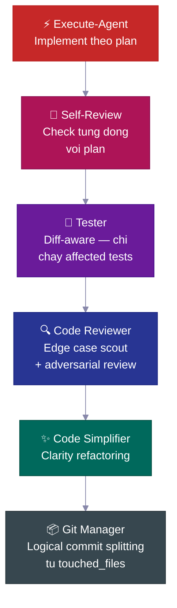
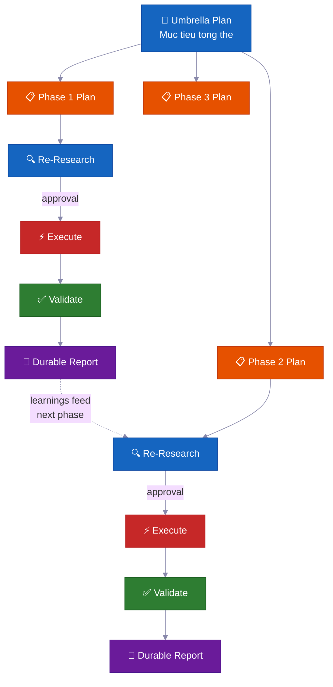

<p align="center">
  <a href="../../README.md">English</a> |
  <a href="README.zh-CN.md">简体中文</a> |
  <a href="README.ja-JP.md">日本語</a> |
  <a href="README.ko-KR.md">한국어</a> |
  <strong>Tiếng Việt</strong> |
  <a href="README.pt-BR.md">Portugues</a>
</p>

<div align="center">

<a href="https://flowser.ai">
  
</a>

*Được xây dựng bởi những kỹ sư hàng đầu, dành cho vibecoders tại*<br>
*[flowser.ai](https://flowser.ai) — AI Agents với máy tính cho GTM*

<br>

# vibecode-pro-max-kit

**Đừng để AI viết code trước khi nó suy nghĩ — rồi quên sạch mọi prompt chi tiết của bạn.<br>Bộ harness này biến bất kỳ AI coding agent nào thành một đội ngũ kỹ sư spec-driven<br>biết research, lên plan, ship code production-grade, và tự cải thiện bộ nhớ để sống sót qua context-rotting kể cả 6 tháng sau.**

<br>

<p align="center">
  
  <br><br>
  <em>"Toàn Tập Trung — Hô Hấp Spec, Thập Chi Hình: Dòng Chảy Bất Tận.<br>Một chu trình phát triển liên tục, mạnh hơn với mỗi feature được ship.<br>Context tích lũy. Dòng chảy không bao giờ đứt."</em><br>
  <strong>— Tanjiro Kamado</strong>
</p>

🔬 Spec-driven development cho AI agents<br>
📋 Tự động tạo PRDs, quản lý backlogs, route context tự động<br>
🧠 Knowledge base tự cải thiện, tích lũy theo từng lần ship<br>
⚡ Chạy autonomous hàng giờ cho những task lớn mà không mất state<br>
🤝 Plans và specs có thể chia sẻ — devs, PMs, và stakeholders cùng review chung một artifacts

<p>
  <a href="https://github.com/withkynam/vibecode-pro-max-kit/stargazers"></a>
  <a href="https://github.com/withkynam/vibecode-pro-max-kit/network/members"></a>
  <a href="LICENSE"></a>
  <a href="https://github.com/withkynam/vibecode-pro-max-kit/graphs/contributors"></a>
  <a href="https://github.com/withkynam/vibecode-pro-max-kit/actions/workflows/validate.yml"></a>
  <a href="https://github.com/withkynam/vibecode-pro-max-kit/commits/main"></a>
  
  
  
</p>

<p>
  <strong>Bộ coding harness đơn giản, linh hoạt, thân thiện với team nhất cho</strong><br><br>
  <a href="https://github.com/anthropics/claude-code"></a>&nbsp;
  <a href="https://github.com/openai/codex"></a>&nbsp;
  <a href="https://cursor.com"></a>&nbsp;
  <a href="https://windsurf.com"></a><br>
  <a href="https://github.com/google-gemini/gemini-cli"></a>&nbsp;
  <a href="https://github.com/opencode-ai/opencode"></a>&nbsp;
  <a href="https://github.com/features/copilot"></a>
</p>

<p>
  <em>Hoạt động trên mọi tech stack, mọi ngôn ngữ, mọi project</em><br><br>
  <picture>
    <source media="(prefers-color-scheme: dark)" srcset="https://skillicons.dev/icons?i=ts,js,react,nextjs,vue,nuxt,svelte,angular,nodejs,express,bun,python,django,flask,fastapi,ruby,rails,go,rust,java,spring,kotlin,swift,php,laravel,cs,dotnet,elixir,graphql,prisma,supabase,firebase,postgres,mongodb,redis,docker,kubernetes,aws,gcp,azure,vercel,cloudflare,tailwind,electron&theme=dark&perline=15" />
    <source media="(prefers-color-scheme: light)" srcset="https://skillicons.dev/icons?i=ts,js,react,nextjs,vue,nuxt,svelte,angular,nodejs,express,bun,python,django,flask,fastapi,ruby,rails,go,rust,java,spring,kotlin,swift,php,laravel,cs,dotnet,elixir,graphql,prisma,supabase,firebase,postgres,mongodb,redis,docker,kubernetes,aws,gcp,azure,vercel,cloudflare,tailwind,electron&theme=light&perline=15" />
    
  </picture>
  <br>
  <sub>React · Next.js · Vue · Nuxt · Svelte · Angular · React Native · Electron · Node.js · Express · Bun · Hono · Python · Django · FastAPI · Flask · Ruby · Rails · Go · Rust · Java · Spring Boot · Kotlin · Swift · PHP · Laravel · C# · .NET · Elixir · TypeScript · Prisma · Supabase · Firebase · PostgreSQL · MongoDB · Redis · GraphQL · Docker · Kubernetes · Terraform · AWS · GCP · Azure · Vercel · Cloudflare · Tailwind · shadcn/ui · va bat ky stack nao project cua ban dang dung</sub>
</p>

</div>

---

## 🚀 Cai dat (30 giay)

```bash
curl -fsSL https://raw.githubusercontent.com/withkynam/vibecode-pro-max-kit/main/install.sh | bash
```

Sau do mo Claude Code va go:

```
Run vc-setup
```

Vay thoi. Skill setup se detect stack cua ban, hoi han ve project (mot cuoc tro chuyen thuc su, khong phai checklist), scaffold thu muc process, deep-scan codebase, va populate cac context files voi noi dung that — khong phai placeholders.

<br>

<details>
<summary><strong>📦 Cai xong duoc gi</strong></summary>

<br>

```
your-project/
├── .claude/
│   ├── agents/              # 🤖 12 agent definitions chuyen biet
│   │   ├── vc-research-agent.md
│   │   ├── vc-execute-agent.md
│   │   └── ...
│   ├── skills/              # ⚡ 31 skills tu dong discover
│   │   ├── vc-generate-plan/
│   │   ├── vc-security/
│   │   ├── vc-scout/
│   │   └── ...
│   └── hooks/               # 🪝 7 lifecycle hooks
│       ├── privacy-block.cjs
│       ├── scout-block.cjs
│       └── ...
├── .codex/
│   └── agents/              # 🔄 Agents mirror cho Codex
├── CLAUDE.md                # 📋 Orchestrator + routing rules
├── AGENTS.md                # 📖 Agent registry
└── process/                 # 🧠 Duoc tao boi vc-setup (khong phai install)
    └── ...
```

- **Project moi?** Cai full harness, sau do `vc-setup` nghien cuu codebase cua ban
- **Da co `.claude/` config?** Backup vao `.vibecode-backup/`, cai moi, khoi phuc `settings.json` cua ban
- **Da co thu muc `process/`?** Khong bao gio bi dung boi install — `vc-setup` handle migration thong minh
- **Da co `CLAUDE.md`?** Backup thanh `CLAUDE.md.pre-vibecode`, cai version harness moi

</details>

<details>
<summary><strong>🤖 Prompt setup day du cho agent</strong> (copy-paste vao Claude Code de kiem soat toi da)</summary>

```
First, install the vibecode-pro-max-kit agent harness by running this command:

curl -fsSL https://raw.githubusercontent.com/withkynam/vibecode-pro-max-kit/main/install.sh | bash

After the install completes, run vc-setup to configure everything for this project.

Follow the full interactive flow:

1. DETECT — Read package.json, detect my stack (framework, package manager, monorepo
   structure, test framework, database, auth). Also check if I have any existing .claude/,
   process/, or context files from a previous setup.

2. SHOW ME WHAT YOU FOUND — Present a summary of the detection results and wait for me
   to confirm before continuing. If this is an existing project with process/ folders or
   context files, tell me what you found and what looks good vs what could be improved.

3. ASK ME ABOUT THE PROJECT — Before scaffolding or scanning, have a real conversation
   with me about this project. Don't just ask a fixed list of questions and move on — ask
   follow-ups based on my answers, probe deeper on anything vague, and keep going until
   you genuinely understand the project. Start with the basics (what is this? who uses it?),
   then dig into architecture, features, conventions, pain points, and anything else that
   matters. Summarize your understanding back to me and confirm it's correct before moving on.

4. SCAFFOLD — Create the process/ directory structure. If I already have process/ folders,
   show me what you plan to change and wait for my approval before reorganizing anything.
   Never silently move or delete my existing files.

5. STUDY — Deep-scan the codebase and populate process/context/all-context.md with REAL
   content based on what you find AND what I told you. Include: repo structure, tech stack
   with versions, key patterns and conventions, import aliases, env vars, API routes,
   database schema, test setup. Do not leave placeholder text.

6. VALIDATE — Run all the validation checks to make sure everything is wired correctly.

Important rules:
- If I have existing context files or a well-written CLAUDE.md, read them first and
  preserve what is good. Merge intelligently — do not replace good content with generic scans.
- Show me a summary of what you plan to create or change at each major step and wait
  for my OK before proceeding.
- Do not create empty placeholder files. Only create files that have real content.
- Ask before reorganizing. If my existing setup works, tell me what you would improve
  and let me decide.
```

</details>

<br>

<details>
<summary>Muc luc</summary>

- [Van de](#-van-de)
- [Giai phap](#️-giai-phap)
- [Cuoc cach mang Vibe Coding](#cuoc-cach-mang-vibe-coding)
- [Danh cho ai?](#danh-cho-ai)
- [Tong quan nhanh](#tong-quan-nhanh)
- [Tai sao cac team dung cai nay](#-tai-sao-cac-team-dung-cai-nay)
- [So sanh](#so-sanh)
- [Diem khac biet](#-diem-khac-biet)
- [Ben trong co gi](#-ben-trong-co-gi)
- [Cach hoat dong](#-cach-hoat-dong)
- [He thong an toan tich hop](#️-he-thong-an-toan-tich-hop)
- [Contributing](#contributing)
- [Star History](#-star-history)

</details>

---

## 🔥 Van de

Ban bao Claude "them webhook support." No lap tuc bat dau viet code. Khong hoi gi ve architecture. Khong check cac pattern da co. Khong plan. Ban nhan duoc 400 dong code khong khop voi codebase, va mat ca tieng de fix.

**Nhung do chi la be noi.** Nhung van de sau hon moi dau that:

<table>
<tr>
<td width="50%" valign="top">
<h1>🧠</h1>
<strong>Context chet moi session</strong><br><br>
Agent quen sach moi thu no da hoc. Cung mot loi, cung mot cau hoi, lap di lap lai. Khong memory, khong tich luy knowledge.
</td>
<td width="50%" valign="top">
<h1>📄</h1>
<strong>Docs cu ngay lap tuc</strong><br><br>
Ban viet context docs xin tuan truoc. Gio da outdated roi. Khong co gi tu dong cap nhat chung khi codebase thay doi.
</td>
</tr>
<tr>
<td width="50%" valign="top">
<h1>💥</h1>
<strong>Task lon sup do giua chung</strong><br><br>
Context window day, state bi mat, agent bat dau hallucinate. Ban phai restart lai tu dau o gio thu 3.
</td>
<td width="50%" valign="top">
<h1>🤝</h1>
<strong>Khong spec, khong review, khong collaboration</strong><br><br>
PM cua ban khong the review cai agent sap build. Khong co artifact nao de chia se, thao luan, hay approve truoc khi code duoc viet.
</td>
</tr>
<tr>
<td width="50%" valign="top">
<h1>🎭</h1>
<strong>Quyet dinh architecture bi hallucinate</strong><br><br>
Agent tu bia pattern thay vi research xem cac codebase khac giai quyet van de tuong tu nhu nao.
</td>
</tr>
</table>

**Agent cua ban co intelligence nhung khong co process, khong co memory, va khong co cach nao collaborate voi team.**

Du ban la developer, PM, hay CEO moi bat dau vibe coding — van de nay anh huong nhu nhau. Cach giai quyet cung giong nhau: **cho agent cua ban mot development process that su.**

---

## 🛠️ Giai phap

Bo harness nay cai dat mot he thong development hoan chinh vao project cua ban — khong chi mot file CLAUDE.md, ma la **12 agents chuyen biet, 31 skills**, va mot workflow phase-locked buoc agent phai **hieu truoc khi build**.

<br>

<table>
<tr>
<td align="center" width="50%" valign="top">
<h1>📋</h1>
<strong>Plans theo spec</strong><br><br>
<sub>PMs va devs cung review mot plan artifact truoc khi bat ky dong code nao duoc viet</sub>
</td>
<td align="center" width="50%" valign="top">
<h1>🔄</h1>
<strong>Context tu cai thien</strong><br><br>
<sub>Tu dong cap nhat moi khi ship feature — docs khong bao gio bi stale</sub>
</td>
</tr>
<tr>
<td align="center" width="50%" valign="top">
<h1>⚡</h1>
<strong>Autonomous execution</strong><br><br>
<sub>Song sot qua context compaction — chay hang gio, khong phai vai phut</sub>
</td>
<td align="center" width="50%" valign="top">
<h1>🧬</h1>
<strong>Architecture research</strong><br><br>
<sub>Nghien cuu cac codebase thuc truoc khi dua ra quyet dinh design</sub>
</td>
</tr>
<tr>
<td align="center" width="50%" valign="top">
<h1>🧭</h1>
<strong>Smart context routing</strong><br><br>
<sub>Chi load nhung gi lien quan — khong phai toan bo knowledge base moi lan</sub>
</td>
</tr>
</table>

<br>


Moi transition deu can su **phe duyet ro rang** cua ban. Khong co gi tu dong chuyen phase. Ban luon nam quyen kiem soat.

---

## Cuoc cach mang Vibe Coding

<div align="center">
<h3><em>"Ngon ngu lap trinh hot nhat bay gio la tieng Anh."</em></h3>
<strong>— Andrej Karpathy</strong>
</div>

<br>

**Vibe coding thay doi duoc ai co the xay dung phan mem. Spec-driven development thay doi duoc ho co the ship cai gi.**

<table>
<tr>
<td align="center" width="50%">
<h3>63%</h3>
<sub>nguoi dung vibe coding <strong>KHONG PHAI</strong> developer</sub>
</td>
<td align="center" width="50%">
<h3>16.2M</h3>
<sub>citizen developers toan cau<br>(tang truong 38% YoY)</sub>
</td>
</tr>
<tr>
<td align="center" width="50%">
<h3>$4.7B</h3>
<sub>thi truong vibe coding<br>tang truong 38% hang nam</sub>
</td>
<td align="center" width="50%">
<h3>25%</h3>
<sub>startups YC W25 co 95%+ codebase duoc tao boi AI</sub>
</td>
</tr>
</table>

Hau het cac tool giup ban bat dau mot project. Bo harness nay giup ban **hoan thanh no** — voi plans ma team co the review, context khong bao gio bi stale, va he thong an toan bat loi truoc khi ship.

---

## Danh cho ai?

<div align="center">
<h3><em>"Van de khong phai ai da go. Ma la cai gi da duoc ship."</em></h3>
<strong>— Garry Tan, YC</strong>
</div>

<br>

Du ban moi kham pha vibe coding hay la staff engineer dang ship production systems — bo harness nay thich nghi voi workflow cua ban.

<table>
<tr>
<td width="50%" valign="top">
<h1>🧑‍💼</h1>
<strong>CEO / Founder</strong><br><br>
<em>"Build cho toi mot SaaS voi auth, billing, va landing page"</em><br><br>
Agent research stack cua ban, viet architecture plan de ban review, implement voi tests, va luu moi quyet dinh de co-founder ky thuat cua ban audit sau.
</td>
<td width="50%" valign="top">
<h1>📊</h1>
<strong>Product Manager</strong><br><br>
<em>"Tao dashboard hien thi MRR, churn, va growth metrics"</em><br><br>
No tao spec kieu PRD, xin approval truoc khi viet code, implement theo spec, va archive plan thanh lich su project tim kiem duoc.
</td>
</tr>
<tr>
<td width="50%" valign="top">
<h1>🎨</h1>
<strong>Designer</strong><br><br>
<em>"Match screenshot Figma nay pixel-perfect"</em><br><br>
Agent hieu design phan tich mockup cua ban, implement tung component voi design tokens cua ban, va chay visual comparison checks.
</td>
<td width="50%" valign="top">
<h1>⚙️</h1>
<strong>Engineer</strong><br><br>
<em>"Refactor module auth de ho tro RBAC voi zero downtime"</em><br><br>
No research code auth hien tai va cach cac codebase khac giai quyet RBAC, viet migration plan voi blast radius analysis, implement an toan voi rollback notes.
</td>
</tr>
</table>

---

## Tong quan nhanh

<table>
<tr>
<td align="center" width="50%" valign="top">
<h1>🤖</h1>
<h3>12</h3>
<strong>Agents Chuyen Biet</strong><br>
<sub>Chuyen gia tung linh vuc, so huu tung phase phat trien</sub>
</td>
<td align="center" width="50%" valign="top">
<h1>⚡</h1>
<h3>32</h3>
<strong>Skills Tu Dong Discover</strong><br>
<sub>Kha nang tai su dung, duoc surface bang keyword matching</sub>
</td>
</tr>
<tr>
<td align="center" width="50%" valign="top">
<h1>🪝</h1>
<h3>7</h3>
<strong>Lifecycle Hooks</strong><br>
<sub>Guardrails truoc/sau execution va context injection</sub>
</td>
<td align="center" width="50%" valign="top">
<h1>📜</h1>
<h3>6</h3>
<strong>Development Protocols</strong><br>
<sub>Workflow rules chung cho moi tool</sub>
</td>
</tr>
<tr>
<td align="center" width="50%" valign="top">
<h1>🛡️</h1>
<h3>5</h3>
<strong>He Thong An Toan</strong><br>
<sub>Phase-locking, blast radius, privacy, leak detection</sub>
</td>
<td align="center" width="50%" valign="top">
<h1>🔧</h1>
<h3>7</h3>
<strong>Tools Duoc Ho Tro</strong><br>
<sub>Claude Code, Codex, Cursor, Windsurf, Antigravity, OpenCode, Copilot</sub>
</td>
</tr>
<tr>
<td align="center" width="50%" valign="top">
<h1>🌍</h1>
<h3>6</h3>
<strong>Ngon Ngu</strong><br>
<sub>EN · 中文 · 日本語 · 한국어 · Tiếng Việt · Portugues</sub>
</td>
<td align="center" width="50%" valign="top">
<h1>⚡</h1>
<h3>30s</h3>
<strong>Thoi Gian Cai Dat</strong><br>
<sub>Mot lenh curl + auto-setup lo phan con lai</sub>
</td>
</tr>
</table>

---

## 💎 Tai sao cac team dung cai nay

> Hau het cac harness chi cho ban mot file CLAUDE.md va huong dan. Cai nay cho ban mot **he thong development autonomous** tich luy intelligence theo thoi gian.

<br>

### 📋 Spec-Driven Development — Khong phai Vibes-Driven

Moi feature deu co mot **plan voi phan tich blast radius** truoc khi bat ky dong code nao duoc viet.

> 💡 Tu dong tao PRDs, quan ly backlogs, to chuc feature groups. Phu hop cho ca developers va product managers — agent plan nhu mot senior engineer, khong phai intern.

**Moi plan bao gom:**

| Muc | Muc dich |
|---|---|
| 📍 **Touchpoints** | Moi file se duoc tao hoac sua, liet ke truoc |
| 📜 **Public contracts** | Nhung API surfaces hoac interfaces nao thay doi |
| 💥 **Blast radius** | Cai gi co the hong, tests nao can chay, can theo doi gi |
| ✅ **Verification evidence** | Cach chung minh implementation la dung |
| 🔄 **Resume handoff** | Du context de bat ky agent nao pick up giua chung plan |

<br>

### 🔄 Autonomous Multi-Phase Execution — Hang gio Hands-Free

Voi nhung task lon, agent chay mot **vong lap phan phase**:

```
🔍 research → ⚡ execute → ✅ validate → 📄 report → 🔄 repeat
```

> 💡 No tu heal khi bi stuck, tu reflect de cai thien approach, va viet progress reports ben vung xuong disk. **Context compaction khong the kill no** — toan bo state nam trong files, khong phai memory.

Di pha ca phe roi quay lai, moi thu da xong.

<br>

### 🧬 Auto-Architecture Research — Hoc tu bat ky Codebase nao

Agent khong chi doc code cua ban — no **nghien cuu cac repositories khac** de hoc cach ho giai quyet van de tuong tu (`vc-xia`).

> 💡 No research, so sanh cac approaches, va adapt nhung patterns tot nhat vao codebase cua ban. Cac quyet dinh architecture dua tren real-world implementations, khong phai best practices bia ra.

<br>

### 🧭 Persistent Smart Context Routing — Luon dung Context

Context khong phai la mot file khong lo. No duoc to chuc thanh **cac knowledge domains tu dong route**:

```
process/context/
├── all-context.md              # 🧭 Root router — doc task, load cai lien quan
├── tests/
│   └── all-tests.md            # 🧪 Test runners, commands, debugging
├── container/
│   └── all-container.md        # 🐳 Docker, deployment, infra
├── uxui/
│   └── all-uxui.md             # 🎨 Components, design tokens, patterns
└── {your-domain}/
    └── all-{domain}.md         # 📚 Bat ky domain nao co 3+ durable docs
```

> 💡 Khi agent lam billing, no load billing context — khong phai toan bo docs codebase. Context **tu dong cap nhat moi khi ban hoan thanh feature**, nen no khong bao gio stale.

<br>

### 🧠 Knowledge Base Tu Cai Thien — Cang Ship Cang Thong Minh

Moi feature hoan thanh deu feed learnings nguoc lai vao context system.

> 💡 Research findings, architectural decisions, debugging insights, va coding patterns duoc **capture va index tu dong**. Feature thu 100 duoc huong loi tu moi thu da hoc o 99 feature truoc. Knowledge tich luy — no khong reset.

---

## So sanh

| Tinh nang | vibecode-pro-max-kit | Superpowers | GSD | gstack |
|---------|---------------------|-------------|-----|--------|
| Spec-driven lifecycle | Full RIPER-5 (research → plan → execute → verify) | Mandatory workflows | Context-rot fix | Mot phan |
| Phase-locked safety | Tool restrictions theo mode (read-only research, no-write innovate) | Skill-based constraints | Phase separation | Khong co |
| Ho tro nhieu tool | 7 tools qua AGENTS.md + native | Claude Code plugin | 14 runtimes | 1 tool |
| Auto-improving context | Domain-routed context groups, cap nhat sau moi feature | Plugin memory | Disk-persisted state | Thu cong |
| Team collaboration | Shared specs, plans, va review artifacts | Solo | Solo | Solo |
| He thong skills | 32 tu dong discover, keyword-matched o moi prompt | 86 composable skills | Meta-prompting | 23 role tools |
| Multi-phase programs | Umbrella plans + vong lap phase-by-phase voi regression checks | Single task | Single task | Single task |
| Quality pipeline | Chuoi 6 buoc (code-review → test → simplify → security → audit → commit) | Per-skill quality | Khong tu dong | Khong tu dong |
| Cai dat | 30 giay `curl` install + auto-setup | Plugin marketplace | npx one-liner | git clone |
| Context routing | Domain-based routing table voi grouped context packs | Flat skill context | Flat context | Single file |

> **Ve do rong runtime:** GSD ho tro 14 runtimes. Chung toi ho tro 7 mot cach sau — voi full agent harnesses, skill discovery, va lifecycle hooks tren moi platform. Rong vs. sau: ban chon.

---

## ⚡ Diem khac biet

Hau het agent harnesses cho ban mot file CLAUDE.md to va vai huong dan. Day la nhung gi cai nay thuc su lam:

<br>

<table>
<tr>
<td width="50%" valign="top">
<h1>🔒</h1>
<strong>Phase-Locked Tool Restrictions</strong><br><br>
Agent cua ban <strong>khong the</strong> viet code trong luc research. RESEARCH chi read-only, INNOVATE khong co Bash, PLAN chi duoc ghi vao <code>process/</code>. <strong>Truc tiep tat luon kha nang do</strong>, khong phai goi y.
</td>
<td width="50%" valign="top">
<h1>🎯</h1>
<strong>Smart Auto-Routing</strong><br><br>
Detect intent tu ngon ngu tu nhien. "build webhook support" → full pipeline. "login is broken" → debugger. 6 cap uu tien, toi da mot cau hoi lam ro.
</td>
</tr>
<tr>
<td width="50%" valign="top">
<h1>🔍</h1>
<strong>Automatic Skill Discovery</strong><br><br>
Truoc khi route bat ky request nao, scan <strong>32 skills</strong> va match keywords. Noi "add webhook support" va <code>vc-security</code> + <code>vc-scenario</code> tu dong surface.
</td>
<td width="50%" valign="top">
<h1>💾</h1>
<strong>Song sot qua Context Compaction</strong><br><br>
Plans, reports, context docs, va learnings deu nam tren disk. Hook session-init re-inject approval gates sau compaction. <strong>Khong mat gi ca.</strong>
</td>
</tr>
<tr>
<td width="50%" valign="top">
<h1>🛡️</h1>
<strong>Self-Policing Violation Detection</strong><br><br>
Khi agent sap vuot phase boundary, no tu dung: <em>"PHASE JUMPING PREVENTED"</em>. Mot <strong>structural hallucination guard</strong>.
</td>
<td width="50%" valign="top">
<h1>🔄</h1>
<strong>Chay tren 7 AI Coding Tools</strong><br><br>
Hai open standards — <code>AGENTS.md</code> va <code>SKILL.md</code> — co nghia la <strong>zero adapters, zero plugins, zero configuration.</strong> Bat dau o Claude Code, chuyen sang Cursor, tiep tuc o Codex.
</td>
</tr>
</table>

---

## 🧭 Cach hoat dong

```
Request cua ban
  → Step 0: Skill Discovery (match keywords → surface relevant skills)
  → Intent Detection (feature / bug / question / refactor / UI)
  → Route den agent dung
  → Phase-locked execution voi explicit transitions
```

Orchestrator **khong bao gio tu lam viec** — no route, monitor, va quan ly transitions.

<br>

### 📊 Workflow

| Phase | Chuyen gi xay ra | Ban noi |
|-------|-------------|---------|
| 🔍 **RESEARCH** | Fact gathering read-only — codebase + web | *(tu dong voi feature requests)* |
| 💡 **INNOVATE** | Explore 2-3 approaches voi trade-offs | `go` |
| 📋 **PLAN** | Viet spec chi tiet de ban review | `go` |
| ⚡ **EXECUTE** | Implement dung nhung gi da plan | `ENTER EXECUTE MODE` |
| 🧠 **UPDATE PROCESS** | Capture learnings, cap nhat context, archive plan | *(khuyen nghi sau non-trivial work)* |

> 💡 **Shortcuts:** `ENTER FAST MODE - [task]` nen RESEARCH+INNOVATE+PLAN thanh mot luot — van pause truoc EXECUTE. Trivial fixes (single file, <15 dong, khong schema/auth changes) nhay thang vao execute.

<br>

### 💻 Session dien hinh

```
# 🆕 Feature request
You: "add webhook support to the API"
→ Skill discovery surfaces: vc-scenario, vc-security
→ research-agent thu thap context (read-only, khong dung code)
→ You say "go" → innovate-agent explore approaches
→ You say "go" → plan-agent viet spec voi blast radius
→ You review plan, say "ENTER EXECUTE MODE"
→ execute-agent implement → self-review → tester → code-reviewer → git-manager
→ Closeout packet: thay doi gi, verified gi, next step khuyen nghi
```

```
# 🐛 Bug fix
You: "login redirect is broken"
→ Route den vc-debugger → thu thap evidence → competing hypotheses
→ Root cause xac dinh voi proof chain
→ execute-agent implement fix → quality pipeline
```

```
# ⏩ Fast mode
You: "ENTER FAST MODE - add rate limiting middleware"
→ Nen research+innovate+plan trong mot luot
→ Safety pause bat buoc → you review → "ENTER EXECUTE MODE"
```

```
# 🏗️ Large program
You: "build a full testing platform"
→ Tao umbrella plan + phase plans trong feature folder
→ Moi phase: re-research → approve → execute → validate → durable report
→ Progress song sot qua context compaction — durable reports tren disk
```

```
# 🔄 Autonomous optimization
You: "improve test coverage to 80% using vc-autoresearch"
→ Agent lap: make change → commit → measure → keep/revert
→ Stuck detection sau 5 lan discard lien tiep → strategy shift
→ Full audit trail trong TSV
```

---

## 🛡️ He thong an toan tich hop

Day khong chi la guidelines — ma la **structural enforcement** duoc build vao moi agent.

<table>
<tr>
<td width="50%" valign="top">
<h1>⏸️</h1>
<strong>Check-In giua chung 50%</strong><br><br>
Den khoang nua chang execution, agent <strong>tam dung</strong> de bao cao tien do, liet ke items da xong va con lai, roi hoi: <em>"Tiep tuc approach hien tai hay pause va quay lai PLAN?"</em>
</td>
<td width="50%" valign="top">
<h1>🚫</h1>
<strong>Khong bao gio am tham di lech</strong><br><br>
Neu execute-agent gap van de can di lech khoi plan, no <strong>dung ngay lap tuc</strong>, giai thich van de, va quay lai PLAN mode. Khong tu y improvise.
</td>
</tr>
<tr>
<td width="50%" valign="top">
<h1>🔙</h1>
<strong>Approach Abandonment Protocol</strong><br><br>
Khi mot approach fail, agent danh gia reusable components, document lessons truoc khi xoa, tao abandonment summary, va quay lai PLAN.
</td>
<td width="50%" valign="top">
<h1>🔐</h1>
<strong>Privacy Guardrails Hook</strong><br><br>
Agent bi <strong>chan doc</strong> <code>.env</code>, credentials, SSH keys, va <code>.pem</code> files. Phai xin phe duyet ro rang.
</td>
</tr>
<tr>
<td width="50%" valign="top">
<h1>⚠️</h1>
<strong>High-Risk Evidence Packs</strong><br><br>
Voi nhung thay doi cham vao auth, billing, schema migrations, hoac public APIs — system yeu cau evidence pack formal truoc khi goi cong viec la "done."
</td>
<td width="50%" valign="top">
<h1>📊</h1>
<strong>Drift Signal Scoring</strong><br><br>
Sau execution, system cham diem muc do can thiet: <strong>LOW</strong> (nhe nhang), <strong>MEDIUM</strong> (thay doi dang ke), <strong>HIGH</strong> (dung harness/protocol files).
</td>
</tr>
</table>

---

## 🔍 Pre-Implementation Intelligence

Truoc khi bat ky dong code nao duoc viet, system co the bat issues thong qua phan tich chuyen biet:

<br>

<table>
<tr>
<td width="50%" valign="top">
<h1>🎭</h1>
<strong>5-Persona Pre-Implementation Debate</strong><br><br>
<code>vc-predict</code> — Architect, Security, Performance, UX, va Devil's Advocate tranh luan ve plan cua ban. Dua ra verdict <strong>GO / CAUTION / STOP</strong> truoc khi ban viet mot dong code.
</td>
<td width="50%" valign="top">
<h1>🎲</h1>
<strong>12-Dimension Edge Case Generator</strong><br><br>
<code>vc-scenario</code> — Phan ra bat ky feature nao theo 12 dimensions (user types, input extremes, timing, scale, state, env, errors, auth, data, integrations, compliance, business logic). Outputs co the dung lam test specs.
</td>
</tr>
<tr>
<td width="50%" valign="top">
<h1>🔐</h1>
<strong>STRIDE + OWASP Security Audit</strong><br><br>
<code>vc-security</code> — Dual-methodology security audit voi dependency auditing, secret detection, va <strong>auto-fix mode</strong> sap xep theo severity va fix Critical truoc voi regression guards.
</td>
</tr>
</table>

---

## 🤖 Autonomous Agent Capabilities

<br>

<table>
<tr>
<td width="50%" valign="top">
<h1>🔄</h1>
<strong>Autonomous Metric Optimization</strong><br><br>
<code>vc-autoresearch</code> — Dat muc tieu, di choi. Vong lap git-backed: thuc hien MOT thay doi atomic → commit → do → giu hoac revert. Stuck detection sau 5 lan discard lien tiep trigger strategy shifts.
</td>
<td width="50%" valign="top">
<h1>👥</h1>
<strong>Parallel Agent Teams</strong><br><br>
<code>vc-team</code> — Nhieu agents lam viec <strong>dong thoi</strong> voi git worktree isolation. Research song song, execute song song, review song song, debug doi khang.
</td>
</tr>
<tr>
<td width="50%" valign="top">
<h1>🔬</h1>
<strong>Evidence-Before-Hypothesis Debugging</strong><br><br>
<code>vc-debugger</code> — Thu thap evidence truoc → hinh thanh 2-3 competing hypotheses → test tung cai mot cach co he thong → document elimination path. <strong>Khong bao gio doan — chung minh.</strong>
</td>
</tr>
</table>

---

## ✅ Quality Pipeline — Tich hop vao Execution

Execute-agent khong chi viet code roi goi la xong. No tu dong chain qua mot **quality pipeline**:

<br>



<br>

| Buoc | Lam gi |
|---|---|
| 🔎 **Self-review** | Check moi checklist item voi plan de phat hien deviations, document lai |
| 🧪 **Tester** | Map changed files sang test files, auto-escalate len full suite khi >70% duoc mapped |
| 🔍 **Code reviewer** | Dispatch edge case scout TRUOC review, check N+1 queries, auth paths, data leaks |
| ✨ **Simplifier** | Clarity refactoring sau khi review pass — khong thay doi behavior |
| 📦 **Git manager** | Nhan danh sach `touched_files`, split thanh logical conventional commits, tu choi unknown files |

---

## 📋 Plan Lifecycle — Spec-Driven, Khong phai Vibes-Driven

Moi feature non-trivial deu theo mot **plan lifecycle** — mot spec duoc viet ra, review, execute theo, va archive thanh project history.

<br>


<br>

> 💡 Sau thang sau, khi ai do hoi *"tai sao minh build auth kieu nay?"*, cau tra loi nam trong `completed/`. Khong bi troi trong Slack thread.

<br>

**Plans nam o dau tren disk:**

```
process/
├── general-plans/
│   ├── active/                  # 📋 Plans dang duoc lam
│   │   └── webhooks_PLAN_28-05-26.md
│   ├── completed/               # ✅ Plans da archive (lich su tim kiem duoc)
│   ├── backlog/                 # 📌 Cong viec tri hoan
│   ├── reports/                 # 📄 Reports cross-cutting
│   └── references/              # 📚 Research outputs
└── features/
    └── billing/                 # 🏷️ Feature-scoped (5+ artifacts)
        ├── active/
        ├── completed/
        ├── backlog/
        ├── reports/
        └── references/
```

---

## 🏗️ Phase Programs — Du an lon khong bi vo

Feature binh thuong dung mot plan. **Du an lon multi-phase** dung phase program — mot umbrella plan cung voi cac phase plans rieng, moi cai co validation gate rieng.

<br>



<br>

**Tinh nang chinh:**

| | Tinh nang | Tai sao quan trong |
|---|---|---|
| 🔄 | **Re-research moi phase** | Check code drift, doc reports moi nhat, cap nhat assumptions |
| ✅ | **Validation gates** | Phase chua `VERIFIED` cho den khi evidence chung minh. Status trung thuc: `PLANNED` → `CODE DONE` → `TESTING` → `VERIFIED` hoac `BLOCKED` |
| 📄 | **Durable reports** | Moi phase viet results xuong disk. Progress song sot qua context compaction |
| 🧠 | **Learnings feed forward** | Phat hien Phase 1 cap nhat plan Phase 2 truoc khi execute |
| 🏗️ | **Foundation vs expansion** | Tach ro "chung minh architecture" khoi "implement moi thu" |
| 🚧 | **Honest blocker handling** | Phases bi blocked giu nguyen `BLOCKED` voi evidence. Khong ep green status |

---

## 🧠 Context Groups — Knowledge co to chuc, khong phai mot file khong lo

Project knowledge duoc to chuc thanh **context groups** — cac knowledge domains ben vung, moi cai co mot `all-{group}.md` router cho agents biet doc gi va khi nao.

<br>

```
process/context/
├── all-context.md              # 🧭 Root router — architecture, stack, patterns, conventions
├── tests/
│   └── all-tests.md            # 🧪 Test runners, commands, debugging procedures
├── container/
│   └── all-container.md        # 🐳 Docker, deployment, infra procedures
├── uxui/
│   └── all-uxui.md             # 🎨 Components, design tokens, patterns
├── infra/
│   └── all-infra.md            # 🖥️ Worker nodes, provisioning, DNS
├── skills/
│   └── all-skills.md           # ⚡ Skill runtime, app architecture
├── workflows/
│   └── all-workflows.md        # 🔄 Workflow runtime, deployment
└── {your-domain}/
    └── all-{domain}.md         # 📚 Bat ky knowledge domain nao co 3+ durable docs
```

<br>

| | Cach hoat dong |
|---|---|
| 🧭 **Router pattern** | Agents chi doc cai lien quan den task, khong phai moi thu |
| 📏 **Auto-promotion** | Topics co 3+ docs hoac 800+ dong tu co context group rieng |
| 🔄 **Living docs** | Duoc cap nhat boi `update-process-agent` sau moi feature non-trivial |
| 🧪 **Auditable** | `vc-audit-context` verify routing va consistency |

---

## 📁 Feature Folders — Project Memory Tu To Chuc

Khi mot topic tich luy 5+ artifacts, no co **feature folder** rieng — mot lifecycle container hoan chinh.

<br>

```
process/features/{feature}/
├── active/       # 📋 Plans dang duoc lam
├── completed/    # ✅ Plans da archive (lich su quyet dinh tim kiem duoc)
├── backlog/      # 📌 Cong viec tri hoan (agents check truoc khi tao duplicate plans)
├── reports/      # 📄 Execution reports, post-mortems, validation results
└── references/   # 📚 Research outputs phuc vu quyet dinh tuong lai
```

<br>

| | Chuyen gi xay ra |
|---|---|
| 🆕 | Cong viec moi bat dau o `active/` → reports tich luy → plan archive vao `completed/` |
| 📌 | Cong viec tri hoan vao `backlog/` — agents check truoc khi tao plans trung lap |
| 📦 | Feature promotion tu dong khi general artifacts dat 5+ |
| 🔍 | Moi feature co lich su hoan chinh, khep kin — plans, decisions, reports, research |

---

## 🤖 Ben trong co gi

<br>

### 12 Agents

<details>
<summary>Click de xem danh sach agents (12 agents)</summary>

<br>

**Core workflow agents** — moi agent cho mot phase RIPER-5:

| Agent | Vai tro |
|-------|------|
| 🔍 `vc-research-agent` | Codebase + web research, read-only. Co contradiction tracking |
| 💡 `vc-innovate-agent` | Brainstorm 2-3 approaches. Phai tao decision summary truoc PLAN |
| 📋 `vc-plan-agent` | Viet spec voi anti-rationalization guards. "Toi da biet cach" khong phai la plan |
| ⚡ `vc-execute-agent` | Implement theo plan. 50% check-in, deviation protocol, self-review |
| ⏩ `vc-fast-mode-agent` | RESEARCH→INNOVATE→PLAN nen lai voi safety pause bat buoc |
| 🧠 `vc-update-process-agent` | Checklist bat buoc 7 buoc bao gom quet stale artifacts |

<br>

**Specialist agents** — duoc goi trong EXECUTE hoac standalone:

| Agent | Vai tro |
|-------|------|
| 🐛 `vc-debugger` | Evidence-before-hypothesis. Competing hypotheses, elimination chains |
| 🧪 `vc-tester` | Diff-aware. Chi chay affected tests. Auto-escalate khi config thay doi |
| 🔎 `vc-code-reviewer` | Edge case scout TRUOC review. N+1 detection, auth path validation |
| ✨ `vc-code-simplifier` | Clarity refactoring khong thay doi behavior |
| 🎨 `vc-ui-ux-designer` | Design-aware frontend. Co the spawn research subagent giua execution |
| 📦 `vc-git-manager` | Logical commit splitting tu `touched_files`. Tu choi unknown files |

</details>

<br>

### 31 Skills (tu dong discover)

<details>
<summary>Click de xem danh sach skills (31 skills)</summary>

<br>

**🔧 Contract skills** — `vc-generate-plan` · `vc-generate-context` · `vc-audit-context` · `vc-audit-plans` · `vc-audit-vc` · `vc-setup` · `vc-update` · `vc-publish`

**🧠 Planning** — `vc-predict` (5-persona debate) · `vc-scenario` (12-dimension edge cases) · `vc-sequential-thinking` · `vc-problem-solving`

**🐛 Debug & security** — `vc-debug` · `vc-security` (STRIDE + OWASP + auto-fix) · `vc-autoresearch` (autonomous optimization)

**📚 Research** — `vc-docs-seeker` · `vc-scout` · `vc-docs` · `vc-repomix` · `vc-xia` (repo comparison)

**🎨 Frontend** — `vc-frontend-design` · `vc-chrome-devtools` · `vc-agent-browser` · `vc-web-testing`

**⚙️ Utilities** — `vc-context-engineering` · `vc-mcp-management` · `vc-preview` · `vc-team` (parallel agents) · `vc-tech-graph` · `vc-watzup` (session handoff) · `vc-merge-worktree`

</details>

<br>

### 🪝 7 Hooks

| Hook | Chuc nang |
|------|-------------|
| 🔐 **Privacy guardrails** | Chan `.env`, credentials, SSH keys. Yeu cau phe duyet ro rang |
| 🚫 **Scout blocker** | Ngan agent lang thang vao `node_modules/`, `dist/`. Gitignore-syntax `.ckignore` |
| 🧠 **Session init** | Detect stack, inject env vars, khoi phuc approval gates sau compaction |
| 💉 **Subagent context** | Inject ~200 token compact context block vao moi subagent |
| ✨ **Edit quality** | Sau 5+ edits, nhac chay code-simplifier (non-blocking, throttled) |
| 📛 **Descriptive naming** | Language-aware file naming conventions tren moi Write |
| 📊 **Usage tracking** | Session metrics va token awareness |

<br>

**Moi thu nam o dau:**

```
your-project/
├── .claude/
│   ├── agents/              # 🤖 12 agent definitions (.md)
│   ├── skills/              # ⚡ 31 skill modules (each a directory with SKILL.md)
│   └── hooks/               # 🪝 7 lifecycle hooks (.cjs)
├── .codex/
│   └── agents/              # 🔄 Mirrored cho Codex compatibility
├── .agents/
│   └── skills -> ../.claude/skills   # 🔗 Symlink cho Codex discovery
├── CLAUDE.md                # 📋 Orchestrator config + routing rules
├── AGENTS.md                # 📖 Agent + skill registry
└── process/
    ├── context/             # 🧠 Auto-routed knowledge domains
    ├── general-plans/       # 📋 Cross-cutting plans + reports
    ├── features/            # 🏷️ Feature-scoped lifecycle folders
    └── development-protocols/  # 📜 Shared workflow rules
```

---

## 🔄 Cap nhat

Pull nhung cai tien harness moi nhat:

```
Run vc-update
```

> 💡 Hien thi dry-run diff, doi xac nhan. Thu muc `process/` va noi dung project-specific cua ban **khong bao gio bi dung**.

---

## Contributing

Chung toi hoan nghenh contributions! Xem [CONTRIBUTING.md](CONTRIBUTING.md) de biet guidelines.

<br>

**Links nhanh:**

- 🐛 [Bao bug](https://github.com/withkynam/vibecode-pro-max-kit/issues/new?template=1.bug_report.yml)
- 💡 [Yeu cau feature](https://github.com/withkynam/vibecode-pro-max-kit/issues/new?template=2.feature_request.yml)
- ⚡ [Submit skill](https://github.com/withkynam/vibecode-pro-max-kit/issues/new?template=3.skill_submission.yml)
- 🌐 [Them ban dich](https://github.com/withkynam/vibecode-pro-max-kit/issues/new?template=5.translation.yml)

<br>

<a href="https://github.com/withkynam/vibecode-pro-max-kit/graphs/contributors">
  
</a>

---

## ⭐ Star History

<a href="https://star-history.com/#withkynam/vibecode-pro-max-kit&Date">
 <picture>
   <source media="(prefers-color-scheme: dark)" srcset="https://api.star-history.com/svg?repos=withkynam/vibecode-pro-max-kit&type=Date&theme=dark" />
   <source media="(prefers-color-scheme: light)" srcset="https://api.star-history.com/svg?repos=withkynam/vibecode-pro-max-kit&type=Date" />
   
 </picture>
</a>

---

## 📄 License

MIT
