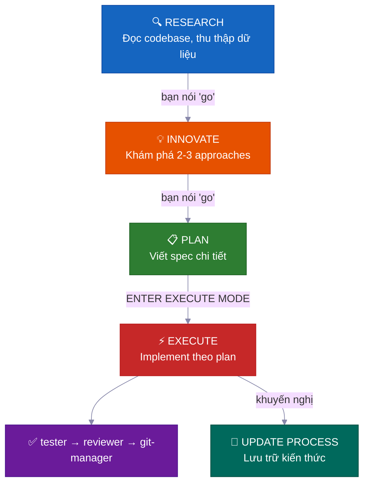
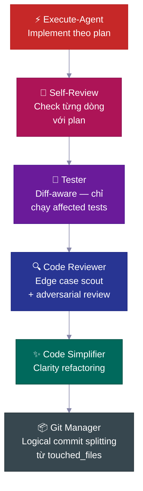
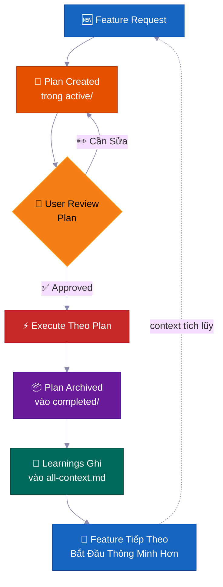
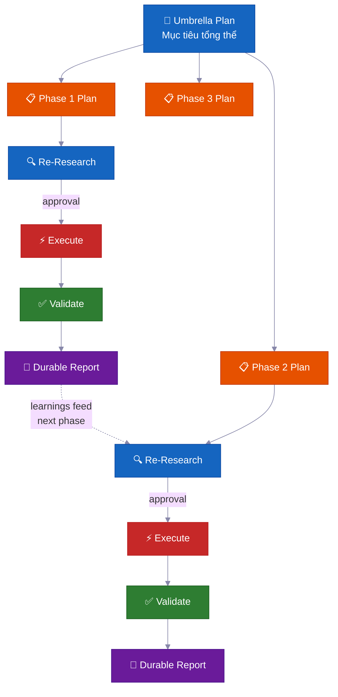

<p align="center">
  <a href="../../README.md">English</a> |
  <a href="README.zh-CN.md">简体中文</a> |
  <a href="README.ja-JP.md">日本語</a> |
  <a href="README.ko-KR.md">한국어</a> |
  <strong>Tiếng Việt</strong> |
  <a href="README.pt-BR.md">Português</a> |
  <a href="README.es.md">Español</a> |
  <a href="README.de.md">Deutsch</a> |
  <a href="README.fr.md">Français</a> |
  <a href="README.hi.md">हिंदी</a>
</p>

<div align="center">

<a href="https://flowser.ai">
  
</a>

*Được xây dựng bởi những kỹ sư hàng đầu, dành cho vibecoders tại*<br>
*[flowser.ai](https://flowser.ai) — AI Agents với máy tính cho GTM*

<br>

# vibecode-pro-max-kit

**Đừng để AI viết code trước khi nó suy nghĩ — rồi quên sạch mọi prompt chi tiết của bạn.<br>Bộ harness này biến bất kỳ AI coding agent nào thành một đội ngũ kỹ sư spec-driven<br>biết research, lên plan, ship code production-grade, và tự cải thiện bộ nhớ để sống sót qua context-rotting kể cả 6 tháng sau.**

<br>

<p align="center">
  
  <br><br>
  <em>"Toàn Tập Trung — Hô Hấp Spec, Thập Chi Hình: Vibe Flow không bao giờ đứt."</em><br>
  <strong>— Tanjiro Kamado</strong>
</p>

🔬 Spec-driven development cho AI agents<br>
📋 Tự động tạo PRDs, quản lý backlogs, route context tự động<br>
🧠 Knowledge base tự cải thiện, tích lũy theo từng lần ship<br>
⚡ Chạy autonomous hàng giờ cho những task lớn mà không mất state<br>
🤝 Plans và specs có thể chia sẻ — devs, PMs, và stakeholders cùng review chung một artifacts

<p>
  <a href="https://github.com/withkynam/vibecode-pro-max-kit/stargazers"></a>
  <a href="https://github.com/withkynam/vibecode-pro-max-kit/network/members"></a>
  <a href="LICENSE"></a>
  <a href="https://github.com/withkynam/vibecode-pro-max-kit/graphs/contributors"></a>
  <a href="https://github.com/withkynam/vibecode-pro-max-kit/actions/workflows/validate.yml"></a>
  <a href="https://github.com/withkynam/vibecode-pro-max-kit/commits/main"></a>
  
  
  
</p>

<p>
  <strong>Bộ coding harness đơn giản, linh hoạt, thân thiện với team nhất cho</strong><br><br>
  <a href="https://github.com/anthropics/claude-code"></a>&nbsp;
  <a href="https://github.com/openai/codex"></a>&nbsp;
  <a href="https://cursor.com"></a>&nbsp;
  <a href="https://windsurf.com"></a><br>
  <a href="https://github.com/google-gemini/gemini-cli"></a>&nbsp;
  <a href="https://github.com/opencode-ai/opencode"></a>&nbsp;
  <a href="https://github.com/features/copilot"></a>
</p>

<p>
  <em>Hoạt động trên mọi tech stack, mọi ngôn ngữ, mọi project</em><br><br>
  <picture>
    <source media="(prefers-color-scheme: dark)" srcset="https://skillicons.dev/icons?i=ts%2Cjs%2Creact%2Cnextjs%2Cvue%2Cnuxt%2Csvelte%2Cangular%2Cnodejs%2Cexpress%2Cbun%2Cpython%2Cdjango%2Cflask%2Cfastapi&theme=dark&perline=15" />
    <source media="(prefers-color-scheme: light)" srcset="https://skillicons.dev/icons?i=ts%2Cjs%2Creact%2Cnextjs%2Cvue%2Cnuxt%2Csvelte%2Cangular%2Cnodejs%2Cexpress%2Cbun%2Cpython%2Cdjango%2Cflask%2Cfastapi&theme=light&perline=15" />
    
  </picture>
  <br>
  <picture>
    <source media="(prefers-color-scheme: dark)" srcset="https://skillicons.dev/icons?i=ruby%2Crails%2Cgo%2Crust%2Cjava%2Cspring%2Ckotlin%2Cswift%2Cphp%2Claravel%2Ccs%2Cdotnet%2Celixir%2Cgraphql%2Cprisma&theme=dark&perline=15" />
    <source media="(prefers-color-scheme: light)" srcset="https://skillicons.dev/icons?i=ruby%2Crails%2Cgo%2Crust%2Cjava%2Cspring%2Ckotlin%2Cswift%2Cphp%2Claravel%2Ccs%2Cdotnet%2Celixir%2Cgraphql%2Cprisma&theme=light&perline=15" />
    
  </picture>
  <br>
  <picture>
    <source media="(prefers-color-scheme: dark)" srcset="https://skillicons.dev/icons?i=supabase%2Cfirebase%2Cpostgres%2Cmongodb%2Credis%2Cdocker%2Ckubernetes%2Caws%2Cgcp%2Cazure%2Cvercel%2Ccloudflare%2Ctailwind%2Celectron&theme=dark&perline=15" />
    <source media="(prefers-color-scheme: light)" srcset="https://skillicons.dev/icons?i=supabase%2Cfirebase%2Cpostgres%2Cmongodb%2Credis%2Cdocker%2Ckubernetes%2Caws%2Cgcp%2Cazure%2Cvercel%2Ccloudflare%2Ctailwind%2Celectron&theme=light&perline=15" />
    
  </picture>
  <br>
  <p><em>Không chỉ để trang trí. Khi chạy <code>vc-setup</code>, các agent song song sẽ quét codebase của bạn,<br>
  phát hiện stack, và xây dựng các context group dành riêng cho dự án mà mỗi skill đọc trước khi làm việc.<br>
  Các harness khác hardcode agent vào một ngôn ngữ — <code>rust-review-agent</code>, <code>python-linter</code> — vô dụng ở nơi khác.<br>
  Cái này thích nghi với mọi tổ hợp ở trên và tích lũy kiến thức khi bạn ship.</em></p>
</p>

</div>

---

## 🚀 Cài đặt (30 giây)

> **Chạy lệnh này bên trong thư mục project của bạn.** Mở terminal và `cd` vào project mà bạn muốn cài harness vào trước khi chạy lệnh — nó sẽ cài vào thư mục hiện tại.
>
> Thích điều khiển nó bằng agent hơn? Mở Claude Code hoặc Codex với thư mục project đó làm working directory, rồi dán toàn bộ prompt setup đầy đủ bên dưới.

```bash
curl -fsSL https://raw.githubusercontent.com/withkynam/vibecode-pro-max-kit/main/install.sh | bash
```

Sau đó mở Claude Code và gõ:

```
Run vc-setup
```

Vậy thôi. Skill setup sẽ detect stack của bạn, hỏi han về project (một cuộc trò chuyện thực sự, không phải checklist), scaffold thư mục process, deep-scan codebase, và populate các context files với nội dung thật — không phải placeholders.

<br>

<details>
<summary><strong>📦 Cài xong được gì</strong></summary>

<br>

```
your-project/
├── .claude/
│   ├── agents/              # 🤖 12 agent definitions chuyên biệt
│   │   ├── vc-research-agent.md
│   │   ├── vc-execute-agent.md
│   │   └── ...
│   ├── skills/              # ⚡ 31 skills tự động discover
│   │   ├── vc-generate-plan/
│   │   ├── vc-security/
│   │   ├── vc-scout/
│   │   └── ...
│   └── hooks/               # 🪝 7 lifecycle hooks
│       ├── privacy-block.cjs
│       ├── scout-block.cjs
│       └── ...
├── .codex/
│   └── agents/              # 🔄 Agents mirror cho Codex
├── CLAUDE.md                # 📋 Orchestrator + routing rules
├── AGENTS.md                # 📖 Agent registry
└── process/                 # 🧠 Được tạo bởi vc-setup (không phải install)
    └── ...
```

- **Project mới?** Cài full harness, sau đó `vc-setup` nghiên cứu codebase của bạn
- **Đã có `.claude/` config?** Backup vào `.vibecode-backup/`, cài mới, khôi phục `settings.json` của bạn
- **Đã có thư mục `process/`?** Không bao giờ bị đụng bởi install — `vc-setup` handle migration thông minh
- **Đã có `CLAUDE.md`?** Backup thành `CLAUDE.md.pre-vibecode`, cài version harness mới

</details>

<details>
<summary><strong>🤖 Prompt setup đầy đủ cho agent</strong> (copy-paste vào Claude Code để kiểm soát tối đa)</summary>

> **Trước tiên, mở Claude Code hoặc Codex với thư mục project của bạn làm working directory** (khởi chạy nó từ bên trong project, hoặc `cd` vào đó trước). Harness cài vào thư mục hiện tại, nên đây phải là project của bạn — rồi dán prompt bên dưới.

```
First, install the vibecode-pro-max-kit agent harness by running this command:

curl -fsSL https://raw.githubusercontent.com/withkynam/vibecode-pro-max-kit/main/install.sh | bash

After the install completes, run vc-setup to configure everything for this project.

Follow the full interactive flow:

1. DETECT — Read package.json, detect my stack (framework, package manager, monorepo
   structure, test framework, database, auth). Also check if I have any existing .claude/,
   process/, or context files from a previous setup.

2. SHOW ME WHAT YOU FOUND — Present a summary of the detection results and wait for me
   to confirm before continuing. If this is an existing project with process/ folders or
   context files, tell me what you found and what looks good vs what could be improved.

3. ASK ME ABOUT THE PROJECT — Before scaffolding or scanning, have a real conversation
   with me about this project. Don't just ask a fixed list of questions and move on — ask
   follow-ups based on my answers, probe deeper on anything vague, and keep going until
   you genuinely understand the project. Start with the basics (what is this? who uses it?),
   then dig into architecture, features, conventions, pain points, and anything else that
   matters. Summarize your understanding back to me and confirm it's correct before moving on.

4. SCAFFOLD — Create the process/ directory structure. If I already have process/ folders,
   show me what you plan to change and wait for my approval before reorganizing anything.
   Never silently move or delete my existing files.

5. STUDY — Deep-scan the codebase and populate process/context/all-context.md with REAL
   content based on what you find AND what I told you. Include: repo structure, tech stack
   with versions, key patterns and conventions, import aliases, env vars, API routes,
   database schema, test setup. Do not leave placeholder text.

6. VALIDATE — Run all the validation checks to make sure everything is wired correctly.

Important rules:
- If I have existing context files or a well-written CLAUDE.md, read them first and
  preserve what is good. Merge intelligently — do not replace good content with generic scans.
- Show me a summary of what you plan to create or change at each major step and wait
  for my OK before proceeding.
- Do not create empty placeholder files. Only create files that have real content.
- Ask before reorganizing. If my existing setup works, tell me what you would improve
  and let me decide.
```

</details>

<br>

<details>
<summary>Mục lục</summary>

- [Vấn đề](#-vấn-đề)
- [Giải pháp](#️-giải-pháp)
- [Cuộc cách mạng Vibe Coding](#cuộc-cách-mạng-vibe-coding)
- [Dành cho ai?](#dành-cho-ai)
- [Tổng quan nhanh](#tổng-quan-nhanh)
- [Tại sao các team dùng cái này](#-tại-sao-các-team-dùng-cái-này)
- [So sánh](#so-sánh)
- [Điểm khác biệt](#-điểm-khác-biệt)
- [Bên trong có gì](#-bên-trong-có-gì)
- [Cách hoạt động](#-cách-hoạt-động)
- [Hệ thống an toàn tích hợp](#️-hệ-thống-an-toàn-tích-hợp)
- [Contributing](#contributing)
- [Star History](#-star-history)

</details>

---

## 🔥 Vấn đề

Bạn bảo Claude "thêm webhook support." Nó lập tức bắt đầu viết code. Không hỏi gì về architecture. Không check các pattern đã có. Không plan. Bạn nhận được 400 dòng code không khớp với codebase, và mất cả tiếng để fix.

**Nhưng đó chỉ là bề nổi.** Những vấn đề sâu hơn mới đau thật:

<table>
<tr>
<td width="50%" valign="top">
<h1>🧠</h1>
<strong>Context chết mỗi session</strong><br><br>
Agent quên sạch mọi thứ nó đã học. Cùng một lỗi, cùng một câu hỏi, lặp đi lặp lại. Không memory, không tích lũy knowledge.
</td>
<td width="50%" valign="top">
<h1>📄</h1>
<strong>Docs cũ ngay lập tức</strong><br><br>
Bạn viết context docs xịn tuần trước. Giờ đã outdated rồi. Không có gì tự động cập nhật chúng khi codebase thay đổi.
</td>
</tr>
<tr>
<td width="50%" valign="top">
<h1>💥</h1>
<strong>Task lớn sụp đổ giữa chừng</strong><br><br>
Context window đầy, state bị mất, agent bắt đầu hallucinate. Bạn phải restart lại từ đầu ở giờ thứ 3.
</td>
<td width="50%" valign="top">
<h1>🤝</h1>
<strong>Không spec, không review, không collaboration</strong><br><br>
PM của bạn không thể review cái agent sắp build. Không có artifact nào để chia sẻ, thảo luận, hay approve trước khi code được viết.
</td>
</tr>
<tr>
<td width="50%" valign="top">
<h1>🎭</h1>
<strong>Quyết định architecture bị hallucinate</strong><br><br>
Agent tự bịa pattern thay vì research xem các codebase khác giải quyết vấn đề tương tự như nào.
</td>
</tr>
</table>

**Agent của bạn có intelligence nhưng không có process, không có memory, và không có cách nào collaborate với team.**

Dù bạn là developer, PM, hay CEO mới bắt đầu vibe coding — vấn đề này ảnh hưởng như nhau. Cách giải quyết cũng giống nhau: **cho agent của bạn một development process thật sự.**

---

## 🛠️ Giải pháp

Bộ harness này cài đặt một hệ thống development hoàn chỉnh vào project của bạn — không chỉ một file CLAUDE.md, mà là **12 agents chuyên biệt, 31 skills**, và một workflow phase-locked buộc agent phải **hiểu trước khi build**.

<br>

<table>
<tr>
<td align="center" width="50%" valign="top">
<h1>📋</h1>
<strong>Plans theo spec</strong><br><br>
<sub>PMs và devs cùng review một plan artifact trước khi bất kỳ dòng code nào được viết</sub>
</td>
<td align="center" width="50%" valign="top">
<h1>🔄</h1>
<strong>Context tự cải thiện</strong><br><br>
<sub>Tự động cập nhật mỗi khi ship feature — docs không bao giờ bị stale</sub>
</td>
</tr>
<tr>
<td align="center" width="50%" valign="top">
<h1>⚡</h1>
<strong>Autonomous execution</strong><br><br>
<sub>Sống sót qua context compaction — chạy hàng giờ, không phải vài phút</sub>
</td>
<td align="center" width="50%" valign="top">
<h1>🧬</h1>
<strong>Architecture research</strong><br><br>
<sub>Nghiên cứu các codebase thực trước khi đưa ra quyết định design</sub>
</td>
</tr>
<tr>
<td align="center" width="50%" valign="top">
<h1>🧭</h1>
<strong>Smart context routing</strong><br><br>
<sub>Chỉ load những gì liên quan — không phải toàn bộ knowledge base mỗi lần</sub>
</td>
</tr>
</table>

<br>



Mỗi transition đều cần sự **phê duyệt rõ ràng** của bạn. Không có gì tự động chuyển phase. Bạn luôn nắm quyền kiểm soát.

---

## Cuộc cách mạng Vibe Coding

<div align="center">
<h3><em>"Ngôn ngữ lập trình hot nhất bây giờ là tiếng Anh."</em></h3>
<strong>— Andrej Karpathy</strong>
</div>

<br>

**Vibe coding thay đổi được ai có thể xây dựng phần mềm. Spec-driven development thay đổi được họ có thể ship cái gì.**

<table>
<tr>
<td align="center" width="50%">
<h3>63%</h3>
<sub>người dùng vibe coding <strong>KHÔNG PHẢI</strong> developer</sub>
</td>
<td align="center" width="50%">
<h3>16.2M</h3>
<sub>citizen developers toàn cầu<br>(tăng trưởng 38% YoY)</sub>
</td>
</tr>
<tr>
<td align="center" width="50%">
<h3>$4.7B</h3>
<sub>thị trường vibe coding<br>tăng trưởng 38% hàng năm</sub>
</td>
<td align="center" width="50%">
<h3>25%</h3>
<sub>startups YC W25 có 95%+ codebase được tạo bởi AI</sub>
</td>
</tr>
</table>

Hầu hết các tool giúp bạn bắt đầu một project. Bộ harness này giúp bạn **hoàn thành nó** — với plans mà team có thể review, context không bao giờ bị stale, và hệ thống an toàn bắt lỗi trước khi ship.

---

## Dành cho ai?

<div align="center">
<h3><em>"Vấn đề không phải ai đã gõ. Mà là cái gì đã được ship."</em></h3>
<strong>— Garry Tan, YC</strong>
</div>

<br>

Dù bạn mới khám phá vibe coding hay là staff engineer đang ship production systems — bộ harness này thích nghi với workflow của bạn.

<table>
<tr>
<td width="50%" valign="top">
<h1>🧑‍💼</h1>
<strong>CEO / Founder</strong><br><br>
<em>"Build cho tôi một SaaS với auth, billing, và landing page"</em><br><br>
Agent research stack của bạn, viết architecture plan để bạn review, implement với tests, và lưu mọi quyết định để co-founder kỹ thuật của bạn audit sau.
</td>
<td width="50%" valign="top">
<h1>📊</h1>
<strong>Product Manager</strong><br><br>
<em>"Tạo dashboard hiển thị MRR, churn, và growth metrics"</em><br><br>
Nó tạo spec kiểu PRD, xin approval trước khi viết code, implement theo spec, và archive plan thành lịch sử project tìm kiếm được.
</td>
</tr>
<tr>
<td width="50%" valign="top">
<h1>🎨</h1>
<strong>Designer</strong><br><br>
<em>"Match screenshot Figma này pixel-perfect"</em><br><br>
Agent hiểu design phân tích mockup của bạn, implement từng component với design tokens của bạn, và chạy visual comparison checks.
</td>
<td width="50%" valign="top">
<h1>⚙️</h1>
<strong>Engineer</strong><br><br>
<em>"Refactor module auth để hỗ trợ RBAC với zero downtime"</em><br><br>
Nó research code auth hiện tại và cách các codebase khác giải quyết RBAC, viết migration plan với blast radius analysis, implement an toàn với rollback notes.
</td>
</tr>
</table>

---

## Tổng quan nhanh

<table>
<tr>
<td align="center" width="50%" valign="top">
<h1>🤖</h1>
<h3>12</h3>
<strong>Agents Chuyên Biệt</strong><br>
<sub>Chuyên gia từng lĩnh vực, sở hữu từng phase phát triển</sub>
</td>
<td align="center" width="50%" valign="top">
<h1>⚡</h1>
<h3>32</h3>
<strong>Skills Tự Động Discover</strong><br>
<sub>Khả năng tái sử dụng, được surface bằng keyword matching</sub>
</td>
</tr>
<tr>
<td align="center" width="50%" valign="top">
<h1>🪝</h1>
<h3>7</h3>
<strong>Lifecycle Hooks</strong><br>
<sub>Guardrails trước/sau execution và context injection</sub>
</td>
<td align="center" width="50%" valign="top">
<h1>📜</h1>
<h3>6</h3>
<strong>Development Protocols</strong><br>
<sub>Workflow rules chung cho mọi tool</sub>
</td>
</tr>
<tr>
<td align="center" width="50%" valign="top">
<h1>🛡️</h1>
<h3>5</h3>
<strong>Hệ Thống An Toàn</strong><br>
<sub>Phase-locking, blast radius, privacy, leak detection</sub>
</td>
<td align="center" width="50%" valign="top">
<h1>🔧</h1>
<h3>7</h3>
<strong>Tools Được Hỗ Trợ</strong><br>
<sub>Claude Code, Codex, Cursor, Windsurf, Antigravity, OpenCode, Copilot</sub>
</td>
</tr>
<tr>
<td align="center" width="50%" valign="top">
<h1>🌍</h1>
<h3>6</h3>
<strong>Ngôn Ngữ</strong><br>
<sub>EN · 中文 · 日本語 · 한국어 · Tiếng Việt · Portugues</sub>
</td>
<td align="center" width="50%" valign="top">
<h1>⚡</h1>
<h3>30s</h3>
<strong>Thời Gian Cài Đặt</strong><br>
<sub>Một lệnh curl + auto-setup lo phần còn lại</sub>
</td>
</tr>
</table>

---

## 💎 Tại sao các team dùng cái này

> Hầu hết các harness chỉ cho bạn một file CLAUDE.md và hướng dẫn. Cái này cho bạn một **hệ thống development autonomous** tích lũy intelligence theo thời gian.

<br>

### 📋 Spec-Driven Development — Không phải Vibes-Driven

Mỗi feature đều có một **plan với phân tích blast radius** trước khi bất kỳ dòng code nào được viết.

> 💡 Tự động tạo PRDs, quản lý backlogs, tổ chức feature groups. Phù hợp cho cả developers và product managers — agent plan như một senior engineer, không phải intern.

**Mỗi plan bao gồm:**

| Mục | Mục đích |
|---|---|
| 📍 **Touchpoints** | Mọi file sẽ được tạo hoặc sửa, liệt kê trước |
| 📜 **Public contracts** | Những API surfaces hoặc interfaces nào thay đổi |
| 💥 **Blast radius** | Cái gì có thể hỏng, tests nào cần chạy, cần theo dõi gì |
| ✅ **Verification evidence** | Cách chứng minh implementation là đúng |
| 🔄 **Resume handoff** | Đủ context để bất kỳ agent nào pick up giữa chừng plan |

<br>

### 🔄 Autonomous Multi-Phase Execution — Hàng giờ Hands-Free

Với những task lớn, agent chạy một **vòng lặp phân phase**:

```
🔍 research → ⚡ execute → ✅ validate → 📄 report → 🔄 repeat
```

> 💡 Nó tự heal khi bị stuck, tự reflect để cải thiện approach, và viết progress reports bền vững xuống disk. **Context compaction không thể kill nó** — toàn bộ state nằm trong files, không phải memory.

Đi pha cà phê rồi quay lại, mọi thứ đã xong.

<br>

### 🧬 Auto-Architecture Research — Học từ bất kỳ Codebase nào

Agent không chỉ đọc code của bạn — nó **nghiên cứu các repositories khác** để học cách họ giải quyết vấn đề tương tự (`vc-xia`).

> 💡 Nó research, so sánh các approaches, và adapt những patterns tốt nhất vào codebase của bạn. Các quyết định architecture dựa trên real-world implementations, không phải best practices bịa ra.

<br>

### 🧭 Persistent Smart Context Routing — Luôn đúng Context

Context không phải là một file khổng lồ. Nó được tổ chức thành **các knowledge domains tự động route**:

```
process/context/
├── all-context.md              # 🧭 Root router — đọc task, load cái liên quan
├── tests/
│   └── all-tests.md            # 🧪 Test runners, commands, debugging
├── container/
│   └── all-container.md        # 🐳 Docker, deployment, infra
├── uxui/
│   └── all-uxui.md             # 🎨 Components, design tokens, patterns
└── {your-domain}/
    └── all-{domain}.md         # 📚 Bất kỳ domain nào có 3+ durable docs
```

> 💡 Khi agent làm billing, nó load billing context — không phải toàn bộ docs codebase. Context **tự động cập nhật mỗi khi bạn hoàn thành feature**, nên nó không bao giờ stale.

<br>

### 🧠 Knowledge Base Tự Cải Thiện — Càng Ship Càng Thông Minh

Mỗi feature hoàn thành đều feed learnings ngược lại vào context system.

> 💡 Research findings, architectural decisions, debugging insights, và coding patterns được **capture và index tự động**. Feature thứ 100 được hưởng lợi từ mọi thứ đã học ở 99 feature trước. Knowledge tích lũy — nó không reset.

---

## So sánh

| Tính năng | vibecode-pro-max-kit | Superpowers | GSD | gstack |
|---------|---------------------|-------------|-----|--------|
| Spec-driven lifecycle | Full RIPER-5 (research → plan → execute → verify) | Mandatory workflows | Context-rot fix | Một phần |
| Phase-locked safety | Tool restrictions theo mode (read-only research, no-write innovate) | Skill-based constraints | Phase separation | Không có |
| Hỗ trợ nhiều tool | 7 tools qua AGENTS.md + native | Claude Code plugin | 14 runtimes | 1 tool |
| Auto-improving context | Domain-routed context groups, cập nhật sau mỗi feature | Plugin memory | Disk-persisted state | Thủ công |
| Team collaboration | Shared specs, plans, và review artifacts | Solo | Solo | Solo |
| Hệ thống skills | 32 tự động discover, keyword-matched ở mỗi prompt | 86 composable skills | Meta-prompting | 23 role tools |
| Multi-phase programs | Umbrella plans + vòng lặp phase-by-phase với regression checks | Single task | Single task | Single task |
| Quality pipeline | Chuỗi 6 bước (code-review → test → simplify → security → audit → commit) | Per-skill quality | Không tự động | Không tự động |
| Cài đặt | 30 giây `curl` install + auto-setup | Plugin marketplace | npx one-liner | git clone |
| Context routing | Domain-based routing table với grouped context packs | Flat skill context | Flat context | Single file |

> **Về độ rộng runtime:** GSD hỗ trợ 14 runtimes. Chúng tôi hỗ trợ 7 một cách sâu — với full agent harnesses, skill discovery, và lifecycle hooks trên mọi platform. Rộng vs. sâu: bạn chọn.

---

## ⚡ Điểm khác biệt

Hầu hết agent harnesses cho bạn một file CLAUDE.md to và vài hướng dẫn. Đây là những gì cái này thực sự làm:

<br>

<table>
<tr>
<td width="50%" valign="top">
<h1>🔒</h1>
<strong>Phase-Locked Tool Restrictions</strong><br><br>
Agent của bạn <strong>không thể</strong> viết code trong lúc research. RESEARCH chỉ read-only, INNOVATE không có Bash, PLAN chỉ được ghi vào <code>process/</code>. <strong>Trực tiếp tắt luôn khả năng đó</strong>, không phải gợi ý.
</td>
<td width="50%" valign="top">
<h1>🎯</h1>
<strong>Smart Auto-Routing</strong><br><br>
Detect intent từ ngôn ngữ tự nhiên. "build webhook support" → full pipeline. "login is broken" → debugger. 6 cấp ưu tiên, tối đa một câu hỏi làm rõ.
</td>
</tr>
<tr>
<td width="50%" valign="top">
<h1>🔍</h1>
<strong>Automatic Skill Discovery</strong><br><br>
Trước khi route bất kỳ request nào, scan <strong>32 skills</strong> và match keywords. Nói "add webhook support" và <code>vc-security</code> + <code>vc-scenario</code> tự động surface.
</td>
<td width="50%" valign="top">
<h1>💾</h1>
<strong>Sống sót qua Context Compaction</strong><br><br>
Plans, reports, context docs, và learnings đều nằm trên disk. Hook session-init re-inject approval gates sau compaction. <strong>Không mất gì cả.</strong>
</td>
</tr>
<tr>
<td width="50%" valign="top">
<h1>🛡️</h1>
<strong>Self-Policing Violation Detection</strong><br><br>
Khi agent sắp vượt phase boundary, nó tự dừng: <em>"PHASE JUMPING PREVENTED"</em>. Một <strong>structural hallucination guard</strong>.
</td>
<td width="50%" valign="top">
<h1>🔄</h1>
<strong>Chạy trên 7 AI Coding Tools</strong><br><br>
Hai open standards — <code>AGENTS.md</code> và <code>SKILL.md</code> — có nghĩa là <strong>zero adapters, zero plugins, zero configuration.</strong> Bắt đầu ở Claude Code, chuyển sang Cursor, tiếp tục ở Codex.
</td>
</tr>
</table>

---

## 🧭 Cách hoạt động

```
Request của bạn
  → Step 0: Skill Discovery (match keywords → surface relevant skills)
  → Intent Detection (feature / bug / question / refactor / UI)
  → Route đến agent đúng
  → Phase-locked execution với explicit transitions
```

Orchestrator **không bao giờ tự làm việc** — nó route, monitor, và quản lý transitions.

<br>

### 📊 Workflow

| Phase | Chuyện gì xảy ra | Bạn nói |
|-------|-------------|---------|
| 🔍 **RESEARCH** | Fact gathering read-only — codebase + web | *(tự động với feature requests)* |
| 💡 **INNOVATE** | Explore 2-3 approaches với trade-offs | `go` |
| 📋 **PLAN** | Viết spec chi tiết để bạn review | `go` |
| ⚡ **EXECUTE** | Implement đúng những gì đã plan | `ENTER EXECUTE MODE` |
| 🧠 **UPDATE PROCESS** | Capture learnings, cập nhật context, archive plan | *(khuyến nghị sau non-trivial work)* |

> 💡 **Shortcuts:** `ENTER FAST MODE - [task]` nén RESEARCH+INNOVATE+PLAN thành một lượt — vẫn pause trước EXECUTE. Trivial fixes (single file, <15 dòng, không schema/auth changes) nhảy thẳng vào execute.

<br>

### 💻 Session điển hình

```
# 🆕 Feature request
You: "add webhook support to the API"
→ Skill discovery surfaces: vc-scenario, vc-security
→ research-agent thu thập context (read-only, không đụng code)
→ You say "go" → innovate-agent explore approaches
→ You say "go" → plan-agent viết spec với blast radius
→ You review plan, say "ENTER EXECUTE MODE"
→ execute-agent implement → self-review → tester → code-reviewer → git-manager
→ Closeout packet: thay đổi gì, verified gì, next step khuyến nghị
```

```
# 🐛 Bug fix
You: "login redirect is broken"
→ Route đến vc-debugger → thu thập evidence → competing hypotheses
→ Root cause xác định với proof chain
→ execute-agent implement fix → quality pipeline
```

```
# ⏩ Fast mode
You: "ENTER FAST MODE - add rate limiting middleware"
→ Nén research+innovate+plan trong một lượt
→ Safety pause bắt buộc → you review → "ENTER EXECUTE MODE"
```

```
# 🏗️ Large program
You: "build a full testing platform"
→ Tạo umbrella plan + phase plans trong feature folder
→ Mỗi phase: re-research → approve → execute → validate → durable report
→ Progress sống sót qua context compaction — durable reports trên disk
```

```
# 🔄 Autonomous optimization
You: "improve test coverage to 80% using vc-autoresearch"
→ Agent lặp: make change → commit → measure → keep/revert
→ Stuck detection sau 5 lần discard liên tiếp → strategy shift
→ Full audit trail trong TSV
```

---

## 🛡️ Hệ thống an toàn tích hợp

Đây không chỉ là guidelines — mà là **structural enforcement** được build vào mọi agent.

<table>
<tr>
<td width="50%" valign="top">
<h1>⏸️</h1>
<strong>Check-In giữa chừng 50%</strong><br><br>
Đến khoảng nửa chặng execution, agent <strong>tạm dừng</strong> để báo cáo tiến độ, liệt kê items đã xong và còn lại, rồi hỏi: <em>"Tiếp tục approach hiện tại hay pause và quay lại PLAN?"</em>
</td>
<td width="50%" valign="top">
<h1>🚫</h1>
<strong>Không bao giờ âm thầm đi lệch</strong><br><br>
Nếu execute-agent gặp vấn đề cần đi lệch khỏi plan, nó <strong>dừng ngay lập tức</strong>, giải thích vấn đề, và quay lại PLAN mode. Không tự ý improvise.
</td>
</tr>
<tr>
<td width="50%" valign="top">
<h1>🔙</h1>
<strong>Approach Abandonment Protocol</strong><br><br>
Khi một approach fail, agent đánh giá reusable components, document lessons trước khi xóa, tạo abandonment summary, và quay lại PLAN.
</td>
<td width="50%" valign="top">
<h1>🔐</h1>
<strong>Privacy Guardrails Hook</strong><br><br>
Agent bị <strong>chặn đọc</strong> <code>.env</code>, credentials, SSH keys, và <code>.pem</code> files. Phải xin phê duyệt rõ ràng.
</td>
</tr>
<tr>
<td width="50%" valign="top">
<h1>⚠️</h1>
<strong>High-Risk Evidence Packs</strong><br><br>
Với những thay đổi chạm vào auth, billing, schema migrations, hoặc public APIs — system yêu cầu evidence pack formal trước khi gọi công việc là "done."
</td>
<td width="50%" valign="top">
<h1>📊</h1>
<strong>Drift Signal Scoring</strong><br><br>
Sau execution, system chấm điểm mức độ cần thiết: <strong>LOW</strong> (nhẹ nhàng), <strong>MEDIUM</strong> (thay đổi đáng kể), <strong>HIGH</strong> (đụng harness/protocol files).
</td>
</tr>
</table>

---

## 🔍 Pre-Implementation Intelligence

Trước khi bất kỳ dòng code nào được viết, system có thể bắt issues thông qua phân tích chuyên biệt:

<br>

<table>
<tr>
<td width="50%" valign="top">
<h1>🎭</h1>
<strong>5-Persona Pre-Implementation Debate</strong><br><br>
<code>vc-predict</code> — Architect, Security, Performance, UX, và Devil's Advocate tranh luận về plan của bạn. Đưa ra verdict <strong>GO / CAUTION / STOP</strong> trước khi bạn viết một dòng code.
</td>
<td width="50%" valign="top">
<h1>🎲</h1>
<strong>12-Dimension Edge Case Generator</strong><br><br>
<code>vc-scenario</code> — Phân rã bất kỳ feature nào theo 12 dimensions (user types, input extremes, timing, scale, state, env, errors, auth, data, integrations, compliance, business logic). Outputs có thể dùng làm test specs.
</td>
</tr>
<tr>
<td width="50%" valign="top">
<h1>🔐</h1>
<strong>STRIDE + OWASP Security Audit</strong><br><br>
<code>vc-security</code> — Dual-methodology security audit với dependency auditing, secret detection, và <strong>auto-fix mode</strong> sắp xếp theo severity và fix Critical trước với regression guards.
</td>
</tr>
</table>

---

## 🤖 Autonomous Agent Capabilities

<br>

<table>
<tr>
<td width="50%" valign="top">
<h1>🔄</h1>
<strong>Autonomous Metric Optimization</strong><br><br>
<code>vc-autoresearch</code> — Đặt mục tiêu, đi chơi. Vòng lặp git-backed: thực hiện MỘT thay đổi atomic → commit → đo → giữ hoặc revert. Stuck detection sau 5 lần discard liên tiếp trigger strategy shifts.
</td>
<td width="50%" valign="top">
<h1>👥</h1>
<strong>Parallel Agent Teams</strong><br><br>
<code>vc-team</code> — Nhiều agents làm việc <strong>đồng thời</strong> với git worktree isolation. Research song song, execute song song, review song song, debug đối kháng.
</td>
</tr>
<tr>
<td width="50%" valign="top">
<h1>🔬</h1>
<strong>Evidence-Before-Hypothesis Debugging</strong><br><br>
<code>vc-debugger</code> — Thu thập evidence trước → hình thành 2-3 competing hypotheses → test từng cái một cách có hệ thống → document elimination path. <strong>Không bao giờ đoán — chứng minh.</strong>
</td>
</tr>
</table>

---

## ✅ Quality Pipeline — Tích hợp vào Execution

Execute-agent không chỉ viết code rồi gọi là xong. Nó tự động chain qua một **quality pipeline**:

<br>



<br>

| Bước | Làm gì |
|---|---|
| 🔎 **Self-review** | Check mọi checklist item với plan để phát hiện deviations, document lại |
| 🧪 **Tester** | Map changed files sang test files, auto-escalate lên full suite khi >70% được mapped |
| 🔍 **Code reviewer** | Dispatch edge case scout TRƯỚC review, check N+1 queries, auth paths, data leaks |
| ✨ **Simplifier** | Clarity refactoring sau khi review pass — không thay đổi behavior |
| 📦 **Git manager** | Nhận danh sách `touched_files`, split thành logical conventional commits, từ chối unknown files |

---

## 📋 Plan Lifecycle — Spec-Driven, Không phải Vibes-Driven

Mỗi feature non-trivial đều theo một **plan lifecycle** — một spec được viết ra, review, execute theo, và archive thành project history.

<br>



<br>

> 💡 Sáu tháng sau, khi ai đó hỏi *"tại sao mình build auth kiểu này?"*, câu trả lời nằm trong `completed/`. Không bị trôi trong Slack thread.

<br>

**Plans nằm ở đâu trên disk:**

```
process/
├── general-plans/
│   ├── active/                  # 📋 Plans đang được làm
│   │   └── webhooks_PLAN_28-05-26.md
│   ├── completed/               # ✅ Plans đã archive (lịch sử tìm kiếm được)
│   ├── backlog/                 # 📌 Công việc trì hoãn
│   ├── reports/                 # 📄 Reports cross-cutting
│   └── references/              # 📚 Research outputs
└── features/
    └── billing/                 # 🏷️ Feature-scoped (5+ artifacts)
        ├── active/
        ├── completed/
        ├── backlog/
        ├── reports/
        └── references/
```

---

## 🏗️ Phase Programs — Dự án lớn không bị vỡ

Feature bình thường dùng một plan. **Dự án lớn multi-phase** dùng phase program — một umbrella plan cùng với các phase plans riêng, mỗi cái có validation gate riêng.

<br>



<br>

**Tính năng chính:**

| | Tính năng | Tại sao quan trọng |
|---|---|---|
| 🔄 | **Re-research mỗi phase** | Check code drift, đọc reports mới nhất, cập nhật assumptions |
| ✅ | **Validation gates** | Phase chưa `VERIFIED` cho đến khi evidence chứng minh. Status trung thực: `PLANNED` → `CODE DONE` → `TESTING` → `VERIFIED` hoặc `BLOCKED` |
| 📄 | **Durable reports** | Mỗi phase viết results xuống disk. Progress sống sót qua context compaction |
| 🧠 | **Learnings feed forward** | Phát hiện Phase 1 cập nhật plan Phase 2 trước khi execute |
| 🏗️ | **Foundation vs expansion** | Tách rõ "chứng minh architecture" khỏi "implement mọi thứ" |
| 🚧 | **Honest blocker handling** | Phases bị blocked giữ nguyên `BLOCKED` với evidence. Không ép green status |

---

## 🧠 Context Groups — Knowledge có tổ chức, không phải một file khổng lồ

Project knowledge được tổ chức thành **context groups** — các knowledge domains bền vững, mỗi cái có một `all-{group}.md` router cho agents biết đọc gì và khi nào.

<br>

```
process/context/
├── all-context.md              # 🧭 Root router — architecture, stack, patterns, conventions
├── tests/
│   └── all-tests.md            # 🧪 Test runners, commands, debugging procedures
├── container/
│   └── all-container.md        # 🐳 Docker, deployment, infra procedures
├── uxui/
│   └── all-uxui.md             # 🎨 Components, design tokens, patterns
├── infra/
│   └── all-infra.md            # 🖥️ Worker nodes, provisioning, DNS
├── skills/
│   └── all-skills.md           # ⚡ Skill runtime, app architecture
├── workflows/
│   └── all-workflows.md        # 🔄 Workflow runtime, deployment
└── {your-domain}/
    └── all-{domain}.md         # 📚 Bất kỳ knowledge domain nào có 3+ durable docs
```

<br>

| | Cách hoạt động |
|---|---|
| 🧭 **Router pattern** | Agents chỉ đọc cái liên quan đến task, không phải mọi thứ |
| 📏 **Auto-promotion** | Topics có 3+ docs hoặc 800+ dòng tự có context group riêng |
| 🔄 **Living docs** | Được cập nhật bởi `update-process-agent` sau mỗi feature non-trivial |
| 🧪 **Auditable** | `vc-audit-context` verify routing và consistency |

---

## 📁 Feature Folders — Project Memory Tự Tổ Chức

Khi một topic tích lũy 5+ artifacts, nó có **feature folder** riêng — một lifecycle container hoàn chỉnh.

<br>

```
process/features/{feature}/
├── active/       # 📋 Plans đang được làm
├── completed/    # ✅ Plans đã archive (lịch sử quyết định tìm kiếm được)
├── backlog/      # 📌 Công việc trì hoãn (agents check trước khi tạo duplicate plans)
├── reports/      # 📄 Execution reports, post-mortems, validation results
└── references/   # 📚 Research outputs phục vụ quyết định tương lai
```

<br>

| | Chuyện gì xảy ra |
|---|---|
| 🆕 | Công việc mới bắt đầu ở `active/` → reports tích lũy → plan archive vào `completed/` |
| 📌 | Công việc trì hoãn vào `backlog/` — agents check trước khi tạo plans trùng lặp |
| 📦 | Feature promotion tự động khi general artifacts đạt 5+ |
| 🔍 | Mỗi feature có lịch sử hoàn chỉnh, khép kín — plans, decisions, reports, research |

---

## 🤖 Bên trong có gì

<br>

### 12 Agents

<details>
<summary>Click để xem danh sách agents (12 agents)</summary>

<br>

**Core workflow agents** — mỗi agent cho một phase RIPER-5:

| Agent | Vai trò |
|-------|------|
| 🔍 `vc-research-agent` | Codebase + web research, read-only. Có contradiction tracking |
| 💡 `vc-innovate-agent` | Brainstorm 2-3 approaches. Phải tạo decision summary trước PLAN |
| 📋 `vc-plan-agent` | Viết spec với anti-rationalization guards. "Tôi đã biết cách" không phải là plan |
| ⚡ `vc-execute-agent` | Implement theo plan. 50% check-in, deviation protocol, self-review |
| ⏩ `vc-fast-mode-agent` | RESEARCH→INNOVATE→PLAN nén lại với safety pause bắt buộc |
| 🧠 `vc-update-process-agent` | Checklist bắt buộc 7 bước bao gồm quét stale artifacts |

<br>

**Specialist agents** — được gọi trong EXECUTE hoặc standalone:

| Agent | Vai trò |
|-------|------|
| 🐛 `vc-debugger` | Evidence-before-hypothesis. Competing hypotheses, elimination chains |
| 🧪 `vc-tester` | Diff-aware. Chỉ chạy affected tests. Auto-escalate khi config thay đổi |
| 🔎 `vc-code-reviewer` | Edge case scout TRƯỚC review. N+1 detection, auth path validation |
| ✨ `vc-code-simplifier` | Clarity refactoring không thay đổi behavior |
| 🎨 `vc-ui-ux-designer` | Design-aware frontend. Có thể spawn research subagent giữa execution |
| 📦 `vc-git-manager` | Logical commit splitting từ `touched_files`. Từ chối unknown files |

</details>

<br>

### 31 Skills (tự động discover)

<details>
<summary>Click để xem danh sách skills (31 skills)</summary>

<br>

**🔧 Contract skills** — `vc-generate-plan` · `vc-generate-context` · `vc-audit-context` · `vc-audit-plans` · `vc-audit-vc` · `vc-setup` · `vc-update` · `vc-publish`

**🧠 Planning** — `vc-predict` (5-persona debate) · `vc-scenario` (12-dimension edge cases) · `vc-sequential-thinking` · `vc-problem-solving`

**🐛 Debug & security** — `vc-debug` · `vc-security` (STRIDE + OWASP + auto-fix) · `vc-autoresearch` (autonomous optimization)

**📚 Research** — `vc-docs-seeker` · `vc-scout` · `vc-docs` · `vc-repomix` · `vc-xia` (repo comparison)

**🎨 Frontend** — `vc-frontend-design` · `vc-chrome-devtools` · `vc-agent-browser` · `vc-web-testing`

**⚙️ Utilities** — `vc-context-engineering` · `vc-mcp-management` · `vc-preview` · `vc-team` (parallel agents) · `vc-tech-graph` · `vc-watzup` (session handoff) · `vc-merge-worktree`

</details>

> 💡 Một số skill (như `vc-xia`) được lấy cảm hứng từ [ClaudeKit](https://claudekit.cc/?ref=OEOM7R7G) của [@mrgoonie](https://github.com/mrgoonie). Chúng tôi tập trung vào ít skill hơn nhưng sâu hơn, thay vì 80+.

<br>

### 🪝 7 Hooks

| Hook | Chức năng |
|------|-------------|
| 🔐 **Privacy guardrails** | Chặn `.env`, credentials, SSH keys. Yêu cầu phê duyệt rõ ràng |
| 🚫 **Scout blocker** | Ngăn agent lang thang vào `node_modules/`, `dist/`. Gitignore-syntax `.ckignore` |
| 🧠 **Session init** | Detect stack, inject env vars, khôi phục approval gates sau compaction |
| 💉 **Subagent context** | Inject ~200 token compact context block vào mỗi subagent |
| ✨ **Edit quality** | Sau 5+ edits, nhắc chạy code-simplifier (non-blocking, throttled) |
| 📛 **Descriptive naming** | Language-aware file naming conventions trên mọi Write |
| 📊 **Usage tracking** | Session metrics và token awareness |

<br>

**Mọi thứ nằm ở đâu:**

```
your-project/
├── .claude/
│   ├── agents/              # 🤖 12 agent definitions (.md)
│   ├── skills/              # ⚡ 31 skill modules (each a directory with SKILL.md)
│   └── hooks/               # 🪝 7 lifecycle hooks (.cjs)
├── .codex/
│   └── agents/              # 🔄 Mirrored cho Codex compatibility
├── .agents/
│   └── skills -> ../.claude/skills   # 🔗 Symlink cho Codex discovery
├── CLAUDE.md                # 📋 Orchestrator config + routing rules
├── AGENTS.md                # 📖 Agent + skill registry
└── process/
    ├── context/             # 🧠 Auto-routed knowledge domains
    ├── general-plans/       # 📋 Cross-cutting plans + reports
    ├── features/            # 🏷️ Feature-scoped lifecycle folders
    └── development-protocols/  # 📜 Shared workflow rules
```

---

## 🔄 Cập nhật

Pull những cải tiến harness mới nhất:

```
Run vc-update
```

> 💡 Hiển thị dry-run diff, đợi xác nhận. Thư mục `process/` và nội dung project-specific của bạn **không bao giờ bị đụng**.

---

## Contributing

Chúng tôi hoan nghênh contributions! Xem [CONTRIBUTING.md](CONTRIBUTING.md) để biết guidelines.

<br>

**Links nhanh:**

- 🐛 [Báo bug](https://github.com/withkynam/vibecode-pro-max-kit/issues/new?template=1.bug_report.yml)
- 💡 [Yêu cầu feature](https://github.com/withkynam/vibecode-pro-max-kit/issues/new?template=2.feature_request.yml)
- ⚡ [Submit skill](https://github.com/withkynam/vibecode-pro-max-kit/issues/new?template=3.skill_submission.yml)
- 🌐 [Thêm bản dịch](https://github.com/withkynam/vibecode-pro-max-kit/issues/new?template=5.translation.yml)

<br>

<a href="https://github.com/withkynam/vibecode-pro-max-kit/graphs/contributors">
  
</a>

<br>

### 🙏 Ghi nhận

Dự án này được hưởng lợi từ [ClaudeKit](https://claudekit.cc/?ref=OEOM7R7G) của [@mrgoonie](https://github.com/mrgoonie) — đặc biệt các skill như `ck:xia` đã truyền cảm hứng cho chúng tôi.

Điểm khác biệt: vibecode-pro-max-kit tập trung vào framework phát triển theo spec và tổ chức context tự cải tiến, không phình to với 80+ skill. Ít công cụ hơn, nhiều cấu trúc hơn.

---

## ⭐ Star History

<a href="https://star-history.com/#withkynam/vibecode-pro-max-kit&Date">
 <picture>
   <source media="(prefers-color-scheme: dark)" srcset="https://api.star-history.com/svg?repos=withkynam/vibecode-pro-max-kit&type=Date&theme=dark" />
   <source media="(prefers-color-scheme: light)" srcset="https://api.star-history.com/svg?repos=withkynam/vibecode-pro-max-kit&type=Date" />
   
 </picture>
</a>

---

## 📄 License

MIT
