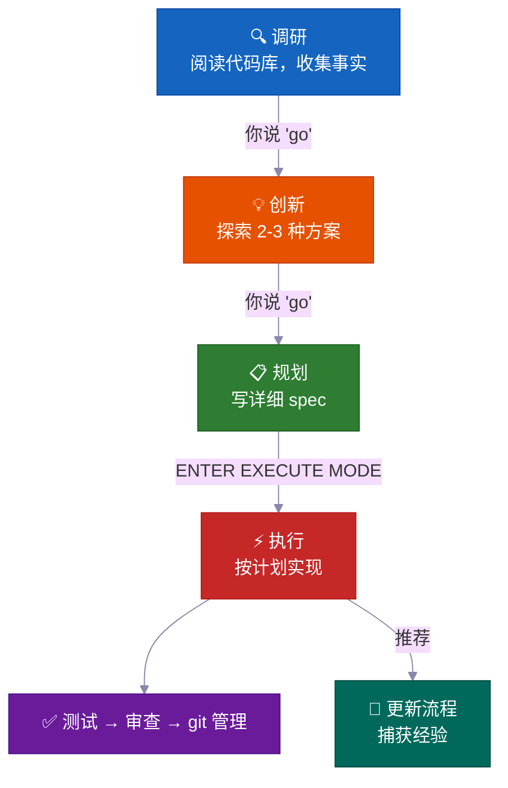
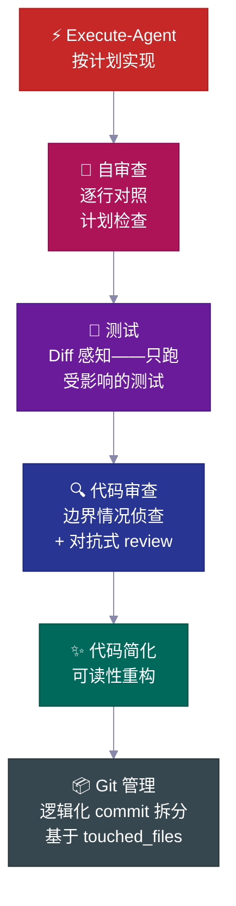
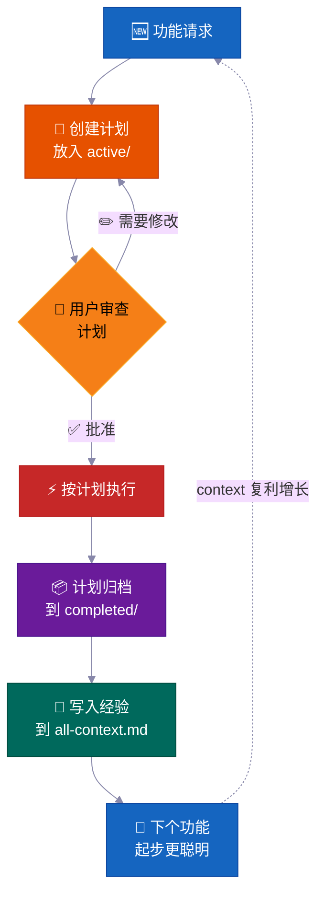
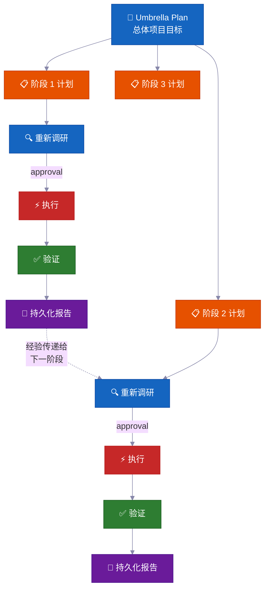

<p align="center">
  <a href="../../README.md">English</a> |
  <strong>简体中文</strong> |
  <a href="README.ja-JP.md">日本語</a> |
  <a href="README.ko-KR.md">한국어</a> |
  <a href="README.vi-VN.md">Tiếng Việt</a> |
  <a href="README.pt-BR.md">Portugues</a>
</p>

<div align="center">

<a href="https://flowser.ai">
  
</a>

*由世界级工程师打造，为 vibecoders 而生*<br>
*[flowser.ai](https://flowser.ai) — 带计算机能力的 AI Agents，专注 GTM*

<br>

# vibecode-pro-max-kit

**别让你的 AI 还没想清楚就开始写代码——更别让它把你精心写的每条 prompt 都忘得一干二净。<br>这套 harness 把任何 AI 编程 agent 变成一支 spec 驱动的工程团队，<br>能调研、能规划、能交付生产级代码，还能自我进化记忆，哪怕 6 个月后也扛得住 context 腐烂。**

<br>

<p align="center">
  
  <br><br>
  <em>"全集中——Spec 呼吸，拾之型：生生流转。<br>一个随每次功能交付而愈加强大的持续开发循环。<br>Context 在复利增长。水流永不中断。"</em><br>
  <strong>— �的门炭治郎</strong>
</p>

🔬 面向 AI agent 的 spec 驱动开发<br>
📋 自动生成 PRD、管理 backlog、自动路由上下文<br>
🧠 自我进化的知识库，随着你交付功能不断积累<br>
⚡ 大型任务可自主跑好几个小时都不丢状态<br>
🤝 计划和规范是可共享的——开发、PM、stakeholder 都看同一份产物

<p>
  <a href="https://github.com/withkynam/vibecode-pro-max-kit/stargazers"></a>
  <a href="https://github.com/withkynam/vibecode-pro-max-kit/network/members"></a>
  <a href="LICENSE"></a>
  <a href="https://github.com/withkynam/vibecode-pro-max-kit/graphs/contributors"></a>
  <a href="https://github.com/withkynam/vibecode-pro-max-kit/actions/workflows/validate.yml"></a>
  <a href="https://github.com/withkynam/vibecode-pro-max-kit/commits/main"></a>
  
  
  
</p>

<p>
  <strong>最简洁、最灵活、最适合团队的编程 harness，支持</strong><br><br>
  <a href="https://github.com/anthropics/claude-code"></a>&nbsp;
  <a href="https://github.com/openai/codex"></a>&nbsp;
  <a href="https://cursor.com"></a>&nbsp;
  <a href="https://windsurf.com"></a><br>
  <a href="https://github.com/google-gemini/gemini-cli"></a>&nbsp;
  <a href="https://github.com/opencode-ai/opencode"></a>&nbsp;
  <a href="https://github.com/features/copilot"></a>
</p>

<p>
  <em>适用于任何技术栈、任何语言、任何项目</em><br><br>
  <picture>
    <source media="(prefers-color-scheme: dark)" srcset="https://skillicons.dev/icons?i=ts,js,react,nextjs,vue,nuxt,svelte,angular,nodejs,express,bun,python,django,flask,fastapi,ruby,rails,go,rust,java,spring,kotlin,swift,php,laravel,cs,dotnet,elixir,graphql,prisma,supabase,firebase,postgres,mongodb,redis,docker,kubernetes,aws,gcp,azure,vercel,cloudflare,tailwind,electron&theme=dark&perline=15" />
    <source media="(prefers-color-scheme: light)" srcset="https://skillicons.dev/icons?i=ts,js,react,nextjs,vue,nuxt,svelte,angular,nodejs,express,bun,python,django,flask,fastapi,ruby,rails,go,rust,java,spring,kotlin,swift,php,laravel,cs,dotnet,elixir,graphql,prisma,supabase,firebase,postgres,mongodb,redis,docker,kubernetes,aws,gcp,azure,vercel,cloudflare,tailwind,electron&theme=light&perline=15" />
    
  </picture>
  <br>
  <sub>React · Next.js · Vue · Nuxt · Svelte · Angular · React Native · Electron · Node.js · Express · Bun · Hono · Python · Django · FastAPI · Flask · Ruby · Rails · Go · Rust · Java · Spring Boot · Kotlin · Swift · PHP · Laravel · C# · .NET · Elixir · TypeScript · Prisma · Supabase · Firebase · PostgreSQL · MongoDB · Redis · GraphQL · Docker · Kubernetes · Terraform · AWS · GCP · Azure · Vercel · Cloudflare · Tailwind · shadcn/ui · 以及你项目使用的任何其他技术栈</sub>
</p>

</div>

---

## 🚀 安装（30 秒搞定）

```bash
curl -fsSL https://raw.githubusercontent.com/withkynam/vibecode-pro-max-kit/main/install.sh | bash
```

然后打开 Claude Code 说：

```
Run vc-setup
```

搞定。setup skill 会检测你的技术栈，跟你聊聊项目（是真正的对话，不是走清单），搭建 process 目录，深度扫描代码库，用真实内容填充 context 文件——不是占位符。

<br>

<details>
<summary><strong>📦 安装了什么</strong></summary>

<br>

```
your-project/
├── .claude/
│   ├── agents/              # 🤖 12 个专用 agent 定义
│   │   ├── vc-research-agent.md
│   │   ├── vc-execute-agent.md
│   │   └── ...
│   ├── skills/              # ⚡ 31 个自动发现的 skills
│   │   ├── vc-generate-plan/
│   │   ├── vc-security/
│   │   ├── vc-scout/
│   │   └── ...
│   └── hooks/               # 🪝 7 个生命周期 hooks
│       ├── privacy-block.cjs
│       ├── scout-block.cjs
│       └── ...
├── .codex/
│   └── agents/              # 🔄 为 Codex 镜像的 agents
├── CLAUDE.md                # 📋 Orchestrator + 路由规则
├── AGENTS.md                # 📖 Agent 注册表
└── process/                 # 🧠 由 vc-setup 创建（不是 install）
    └── ...
```

- **新项目？** 安装完整 harness，然后 `vc-setup` 研究你的代码库
- **已有 `.claude/` 配置？** 备份到 `.vibecode-backup/`，全新安装，恢复你的 `settings.json`
- **已有 `process/` 目录？** install 完全不碰——`vc-setup` 会智能迁移
- **已有 `CLAUDE.md`？** 备份为 `CLAUDE.md.pre-vibecode`，安装 harness 版本

</details>

<details>
<summary><strong>🤖 完整的 agent setup 提示词</strong>（复制粘贴到 Claude Code 里可以获得最大控制力）</summary>

```
First, install the vibecode-pro-max-kit agent harness by running this command:

curl -fsSL https://raw.githubusercontent.com/withkynam/vibecode-pro-max-kit/main/install.sh | bash

After the install completes, run vc-setup to configure everything for this project.

Follow the full interactive flow:

1. DETECT — Read package.json, detect my stack (framework, package manager, monorepo
   structure, test framework, database, auth). Also check if I have any existing .claude/,
   process/, or context files from a previous setup.

2. SHOW ME WHAT YOU FOUND — Present a summary of the detection results and wait for me
   to confirm before continuing. If this is an existing project with process/ folders or
   context files, tell me what you found and what looks good vs what could be improved.

3. ASK ME ABOUT THE PROJECT — Before scaffolding or scanning, have a real conversation
   with me about this project. Don't just ask a fixed list of questions and move on — ask
   follow-ups based on my answers, probe deeper on anything vague, and keep going until
   you genuinely understand the project. Start with the basics (what is this? who uses it?),
   then dig into architecture, features, conventions, pain points, and anything else that
   matters. Summarize your understanding back to me and confirm it's correct before moving on.

4. SCAFFOLD — Create the process/ directory structure. If I already have process/ folders,
   show me what you plan to change and wait for my approval before reorganizing anything.
   Never silently move or delete my existing files.

5. STUDY — Deep-scan the codebase and populate process/context/all-context.md with REAL
   content based on what you find AND what I told you. Include: repo structure, tech stack
   with versions, key patterns and conventions, import aliases, env vars, API routes,
   database schema, test setup. Do not leave placeholder text.

6. VALIDATE — Run all the validation checks to make sure everything is wired correctly.

Important rules:
- If I have existing context files or a well-written CLAUDE.md, read them first and
  preserve what is good. Merge intelligently — do not replace good content with generic scans.
- Show me a summary of what you plan to create or change at each major step and wait
  for my OK before proceeding.
- Do not create empty placeholder files. Only create files that have real content.
- Ask before reorganizing. If my existing setup works, tell me what you would improve
  and let me decide.
```

</details>

<br>

<details>
<summary>目录</summary>

- [问题在哪](#-问题在哪)
- [解决方案](#️-解决方案)
- [Vibe Coding 革命](#vibe-coding-革命)
- [这是给谁用的？](#这是给谁用的)
- [一览](#一览)
- [团队为什么用这个](#-团队为什么用这个)
- [横向对比](#横向对比)
- [差异化在哪里](#-差异化在哪里)
- [里面有什么](#-里面有什么)
- [工作流程](#-工作流程)
- [内置安全机制](#️-内置安全机制)
- [贡献](#贡献)
- [Star 历史](#-star-历史)

</details>

---

## 🔥 问题在哪

你让 Claude "加个 webhook 支持"。它立刻就开始写代码了。没问你架构长啥样，没查现有的 pattern，没有计划。结果写了 400 行跟你代码库格格不入的东西，你花一个小时擦屁股。

**但这只是表面。** 深层问题更扎心：

<table>
<tr>
<td width="50%" valign="top">
<h1>🧠</h1>
<strong>每次会话上下文都丢了</strong><br><br>
agent 忘掉了之前学到的所有东西。同样的错误，同样的问题，每次都来一遍。没记忆，没积累。
</td>
<td width="50%" valign="top">
<h1>📄</h1>
<strong>文档瞬间就过时了</strong><br><br>
上周写的很棒的 context 文档，已经跟不上代码了。没有什么机制会自动更新它们。
</td>
</tr>
<tr>
<td width="50%" valign="top">
<h1>💥</h1>
<strong>大任务做到一半就崩了</strong><br><br>
context window 满了，状态丢了，agent 开始瞎编。第三个小时你只能从头再来。
</td>
<td width="50%" valign="top">
<h1>🤝</h1>
<strong>没有 spec、没有审查、没法协作</strong><br><br>
PM 没法 review agent 要做什么。在写代码之前，没有任何可以分享、讨论或审批的产物。
</td>
</tr>
<tr>
<td width="50%" valign="top">
<h1>🎭</h1>
<strong>架构决策全靠编</strong><br><br>
agent 自己发明 pattern，而不是去调研别的代码库是怎么解决同样问题的。
</td>
</tr>
</table>

**你的 agent 有智力但没流程，没记忆，也没法跟团队协作。**

无论你是开发者、PM，还是刚开始 vibe coding 的 CEO——这个问题同样打击每一个人。解决方案也一样：**给你的 agent 一套真正的开发流程。**

---

## 🛠️ 解决方案

这套 harness 给你的项目装上一整套开发体系——不只是一个 CLAUDE.md 文件，而是 **12 个专用 agent、31 个 skills**，加上一个阶段锁定的工作流，强制你的 agent **先理解再动手**。

<br>

<table>
<tr>
<td align="center" width="50%" valign="top">
<h1>📋</h1>
<strong>Spec 驱动的计划</strong><br><br>
<sub>PM 和开发在写代码前 review 同一份 plan</sub>
</td>
<td align="center" width="50%" valign="top">
<h1>🔄</h1>
<strong>自我进化的 context</strong><br><br>
<sub>每次交付功能自动更新——文档永远不过时</sub>
</td>
</tr>
<tr>
<td align="center" width="50%" valign="top">
<h1>⚡</h1>
<strong>自主执行</strong><br><br>
<sub>扛得住 context compaction——跑几个小时不是几分钟</sub>
</td>
<td align="center" width="50%" valign="top">
<h1>🧬</h1>
<strong>架构调研</strong><br><br>
<sub>做设计决策前先研究真实代码库</sub>
</td>
</tr>
<tr>
<td align="center" width="50%" valign="top">
<h1>🧭</h1>
<strong>智能 context 路由</strong><br><br>
<sub>只加载相关内容——不是每次都把整个知识库塞进去</sub>
</td>
</tr>
</table>

<br>



每次阶段切换都需要你**明确批准**。不会自动推进。控制权始终在你手上。

---

## Vibe Coding 革命

<div align="center">
<h3><em>"最火的新编程语言是英语。"</em></h3>
<strong>— Andrej Karpathy</strong>
</div>

<br>

**Vibe coding 改变了谁能写软件。Spec 驱动开发改变了他们能交付什么。**

<table>
<tr>
<td align="center" width="50%">
<h3>63%</h3>
<sub>的 vibe coding 用户<strong>不是</strong>开发者</sub>
</td>
<td align="center" width="50%">
<h3>1620 万</h3>
<sub>全球公民开发者<br>（年增长 38%）</sub>
</td>
</tr>
<tr>
<td align="center" width="50%">
<h3>47 亿美元</h3>
<sub>vibe coding 市场<br>年增长 38%</sub>
</td>
<td align="center" width="50%">
<h3>25%</h3>
<sub>的 YC W25 创业公司有 95%+ AI 生成的代码库</sub>
</td>
</tr>
</table>

大多数工具帮你启动项目。这套 harness 帮你**完成它**——有团队可以 review 的计划，永不过时的 context，还有在上线前就能抓住错误的安全机制。

---

## 这是给谁用的？

<div align="center">
<h3><em>"关键不在于谁敲的代码。关键在于交付了什么。"</em></h3>
<strong>— Garry Tan, YC</strong>
</div>

<br>

无论你刚发现 vibe coding，还是你是一个交付生产系统的 Staff 工程师——这套 harness 都能适配你的工作流。

<table>
<tr>
<td width="50%" valign="top">
<h1>🧑‍💼</h1>
<strong>CEO / 创始人</strong><br><br>
<em>"帮我搭一个带 auth、计费和 landing page 的 SaaS"</em><br><br>
agent 调研你的技术栈，写一份你可以 review 的架构方案，带测试实现，把每个决策都记录下来，方便你的技术合伙人以后审计。
</td>
<td width="50%" valign="top">
<h1>📊</h1>
<strong>产品经理</strong><br><br>
<em>"做一个展示 MRR、流失率和增长指标的仪表盘"</em><br><br>
它生成 PRD 风格的 spec，在写代码前获取你的批准，按 spec 实现，把计划归档为可搜索的项目历史。
</td>
</tr>
<tr>
<td width="50%" valign="top">
<h1>🎨</h1>
<strong>设计师</strong><br><br>
<em>"按这个 Figma 截图像素级还原"</em><br><br>
设计感知的 agent 分析你的设计稿，用你的 design token 逐组件实现，还会启动视觉对比检查。
</td>
<td width="50%" valign="top">
<h1>⚙️</h1>
<strong>工程师</strong><br><br>
<em>"把 auth 模块重构为支持 RBAC，零停机"</em><br><br>
它调研你当前的 auth 代码以及其他代码库如何解决 RBAC，写一份带影响面分析的迁移方案，安全实现并附回滚说明。
</td>
</tr>
</table>

---

## 一览

<table>
<tr>
<td align="center" width="50%" valign="top">
<h1>🤖</h1>
<h3>12</h3>
<strong>专用 Agent</strong><br>
<sub>各司其职的领域专家，掌管每个开发阶段</sub>
</td>
<td align="center" width="50%" valign="top">
<h1>⚡</h1>
<h3>32</h3>
<strong>自动发现的 Skill</strong><br>
<sub>通过关键词匹配自动浮现的可复用能力</sub>
</td>
</tr>
<tr>
<td align="center" width="50%" valign="top">
<h1>🪝</h1>
<h3>7</h3>
<strong>生命周期 Hook</strong><br>
<sub>执行前后的防护栏和上下文注入</sub>
</td>
<td align="center" width="50%" valign="top">
<h1>📜</h1>
<h3>6</h3>
<strong>开发协议</strong><br>
<sub>跨所有工具共享的工作流规则</sub>
</td>
</tr>
<tr>
<td align="center" width="50%" valign="top">
<h1>🛡️</h1>
<h3>5</h3>
<strong>安全系统</strong><br>
<sub>阶段锁定、影响面分析、隐私防护、泄露检测</sub>
</td>
<td align="center" width="50%" valign="top">
<h1>🔧</h1>
<h3>7</h3>
<strong>支持的工具</strong><br>
<sub>Claude Code, Codex, Cursor, Windsurf, Antigravity, OpenCode, Copilot</sub>
</td>
</tr>
<tr>
<td align="center" width="50%" valign="top">
<h1>🌍</h1>
<h3>6</h3>
<strong>种语言</strong><br>
<sub>EN · 中文 · 日本語 · 한국어 · Tiếng Việt · Português</sub>
</td>
<td align="center" width="50%" valign="top">
<h1>⚡</h1>
<h3>30s</h3>
<strong>安装时间</strong><br>
<sub>一条 curl 命令 + 自动设置搞定一切</sub>
</td>
</tr>
</table>

---

## 💎 团队为什么用这个

> 大多数 harness 给你一个 CLAUDE.md 加一堆说明。这个给你一套**自主开发系统**，随着时间推移越来越聪明。

<br>

### 📋 Spec 驱动的开发——不是凭感觉

每个功能在写第一行代码之前都有**带影响面分析的书面计划**。

> 💡 自动生成 PRD，管理 backlog，组织 feature 分组。开发和产品都能用——你的 agent 像高级工程师一样做规划，不像实习生。

**每份计划包含：**

| 章节 | 用途 |
|---|---|
| 📍 **Touchpoints** | 所有要创建或修改的文件，提前列出 |
| 📜 **Public contracts** | 哪些 API 接口或 interface 会变 |
| 💥 **Blast radius** | 什么可能挂掉，跑什么测试，注意什么 |
| ✅ **Verification evidence** | 怎么证明实现是正确的 |
| 🔄 **Resume handoff** | 足够的上下文让任何 agent 都能半路接手 |

<br>

### 🔄 自主多阶段执行——放手好几个小时

对于大型任务，agent 跑一个**迭代式阶段循环**：

```
🔍 research → ⚡ execute → ✅ validate → 📄 report → 🔄 repeat
```

> 💡 卡住了会自我修复，反思后调整策略，还会把持久化的进度报告写到磁盘。**context compaction 干不掉它**——所有状态都在文件里，不在内存里。

放心去摸鱼，回来就是完成的活儿。

<br>

### 🧬 自动架构调研——从任何代码库学习

agent 不只是读你的代码——它会**研究其他仓库**学习别人怎么解决类似问题（`vc-xia`）。

> 💡 它调研、对比方案、把最佳 pattern 适配到你的代码库。架构决策基于真实世界的实现，而不是编出来的最佳实践。

<br>

### 🧭 持久化智能 Context 路由——总是加载对的上下文

Context 不是一个巨大的文件。它被组织成**自动路由的知识域**：

```
process/context/
├── all-context.md              # 🧭 根路由——读取你的任务，加载相关内容
├── tests/
│   └── all-tests.md            # 🧪 测试运行器、命令、调试
├── container/
│   └── all-container.md        # 🐳 Docker、部署、基础设施
├── uxui/
│   └── all-uxui.md             # 🎨 组件、设计 token、模式
└── {your-domain}/
    └── all-{domain}.md         # 📚 任何有 3+ 持久文档的领域
```

> 💡 agent 处理计费功能时只加载计费 context——不是你整个代码库的文档。context 在**每次完成功能后自动更新**，所以永远不会过时。

<br>

### 🧠 自我进化的知识库——越交付越聪明

每个完成的功能都会把经验反馈回 context 系统。

> 💡 调研发现、架构决策、调试洞察、编码模式都被**自动捕获和索引**。你的第 100 个功能能享受前 99 个功能积累的所有经验。知识在复利增长——不是每次归零。

---

## 横向对比

| 功能 | vibecode-pro-max-kit | Superpowers | GSD | gstack |
|---------|---------------------|-------------|-----|--------|
| Spec 驱动的生命周期 | 完整 RIPER-5（调研 → 规划 → 执行 → 验证） | 强制工作流 | 修复 context 腐烂 | 部分 |
| 阶段锁定的安全机制 | 每个模式有工具限制（调研只读、创新禁写） | 基于 skill 的约束 | 阶段分离 | 无 |
| 多工具支持 | 7 个工具，通过 AGENTS.md + 原生支持 | Claude Code 插件 | 14 个运行时 | 1 个工具 |
| 自动进化的 context | 领域路由的 context groups，每次功能完成后更新 | 插件记忆 | 磁盘持久化状态 | 手动 |
| 团队协作 | 共享的 spec、计划和 review 产物 | 单人 | 单人 | 单人 |
| Skills 系统 | 32 个自动发现，每次 prompt 关键词匹配 | 86 个可组合 skills | Meta-prompting | 23 个角色工具 |
| 多阶段程序 | Umbrella plan + 逐阶段执行循环，带回归检查 | 单任务 | 单任务 | 单任务 |
| 质量流水线 | 6 步链（code-review → test → simplify → security → audit → commit） | 每个 skill 独立质量 | 无自动链 | 无自动链 |
| 安装 | 30 秒 `curl` 安装 + 自动设置 | 插件市场 | npx 一行命令 | git clone |
| Context 路由 | 基于领域的路由表，分组 context pack | 扁平 skill context | 扁平 context | 单文件 |

> **关于运行时广度：** GSD 支持 14 个运行时。我们深度支持 7 个——每个平台都有完整的 agent harness、skill 发现和生命周期 hooks。广度 vs 深度：由你选择。

---

## ⚡ 差异化在哪里

大多数 agent harness 给你一个大的 CLAUDE.md 加一些说明。这个实际上做了什么：

<br>

<table>
<tr>
<td width="50%" valign="top">
<h1>🔒</h1>
<strong>阶段锁定的工具限制</strong><br><br>
你的 agent 在调研阶段<strong>根本写不了代码</strong>。RESEARCH 是只读的，INNOVATE 完全没有 Bash 权限，PLAN 只能写到 <code>process/</code> 目录。<strong>是直接把能力给你禁掉</strong>，不是那种可以无视的建议。
</td>
<td width="50%" valign="top">
<h1>🎯</h1>
<strong>智能自动路由</strong><br><br>
从自然语言识别你的意图。"build webhook support" → 完整流水线。"login is broken" → debugger。6 级优先级排序，最多问一个确认问题。
</td>
</tr>
<tr>
<td width="50%" valign="top">
<h1>🔍</h1>
<strong>自动 Skill 发现</strong><br><br>
在路由任何请求之前，扫描 <strong>32 个 skills</strong> 并匹配关键词。你说 "add webhook support"，<code>vc-security</code> + <code>vc-scenario</code> 自动浮现。
</td>
<td width="50%" valign="top">
<h1>💾</h1>
<strong>扛得住 Context Compaction</strong><br><br>
计划、报告、context 文档和经验都存在磁盘上。session-init hook 在 compaction 后重新注入审批门。<strong>什么都不会丢。</strong>
</td>
</tr>
<tr>
<td width="50%" valign="top">
<h1>🛡️</h1>
<strong>自我纠错的违规检测</strong><br><br>
当 agent 即将越过阶段边界时，它会自己停下来：<em>"PHASE JUMPING PREVENTED"</em>。一个<strong>结构化的幻觉防护机制</strong>。
</td>
<td width="50%" valign="top">
<h1>🔄</h1>
<strong>跨 7 个 AI 编程工具工作</strong><br><br>
两个开放标准——<code>AGENTS.md</code> 和 <code>SKILL.md</code>——意味着<strong>零适配器、零插件、零配置。</strong>在 Claude Code 里开始，切到 Cursor，在 Codex 里继续。
</td>
</tr>
</table>

---

## 🧭 工作流程

```
Your request
  → Step 0: Skill Discovery (match keywords → surface relevant skills)
  → Intent Detection (feature / bug / question / refactor / UI)
  → Route to the right agent
  → Phase-locked execution with explicit transitions
```

orchestrator **自己从不干活**——它只负责路由、监控和管理阶段切换。

<br>

### 📊 工作流

| 阶段 | 做什么 | 你说 |
|-------|-------------|---------|
| 🔍 **RESEARCH** | 只读的信息收集——代码库 + 网络 | *(功能请求自动触发)* |
| 💡 **INNOVATE** | 探索 2-3 种方案及其 trade-off | `go` |
| 📋 **PLAN** | 写一份你可以 review 的详细 spec | `go` |
| ⚡ **EXECUTE** | 严格按计划实现 | `ENTER EXECUTE MODE` |
| 🧠 **UPDATE PROCESS** | 捕获经验，更新 context，归档计划 | *(非平凡工作后建议执行)* |

> 💡 **快捷方式：** `ENTER FAST MODE - [task]` 把 RESEARCH+INNOVATE+PLAN 压缩成一步——但在 EXECUTE 前还是会暂停。小修小补（单文件、<15 行、不涉及 schema/auth 变更）直接跳到 execute。

<br>

### 💻 典型会话

```
# 🆕 Feature request
You: "add webhook support to the API"
→ Skill discovery surfaces: vc-scenario, vc-security
→ research-agent gathers context (read-only, can't touch code)
→ You say "go" → innovate-agent explores approaches
→ You say "go" → plan-agent writes spec with blast radius
→ You review the plan, say "ENTER EXECUTE MODE"
→ execute-agent implements → self-review → tester → code-reviewer → git-manager
→ Closeout packet: what changed, what's verified, recommended next step
```

```
# 🐛 Bug fix
You: "login redirect is broken"
→ Routes to vc-debugger → evidence gathering → competing hypotheses
→ Root cause identified with proof chain
→ execute-agent implements the fix → quality pipeline
```

```
# ⏩ Fast mode
You: "ENTER FAST MODE - add rate limiting middleware"
→ Compressed research+innovate+plan in one pass
→ Mandatory safety pause → you review → "ENTER EXECUTE MODE"
```

```
# 🏗️ Large program
You: "build a full testing platform"
→ Creates umbrella plan + phase plans in a feature folder
→ Each phase: re-research → approve → execute → validate → durable report
→ Progress survives context compaction — durable reports on disk
```

```
# 🔄 Autonomous optimization
You: "improve test coverage to 80% using vc-autoresearch"
→ Agent iterates: make change → commit → measure → keep/revert
→ Stuck detection after 5 consecutive discards → strategy shift
→ Full audit trail in TSV
```

---

## 🛡️ 内置安全机制

这些不只是指南——它们是**结构化的强制措施**，内嵌在每个 agent 里。

<table>
<tr>
<td width="50%" valign="top">
<h1>⏸️</h1>
<strong>50% 进度检查</strong><br><br>
在执行大约过半时，agent 会<strong>暂停</strong>，汇报进度，列出已完成和剩余项，然后问你：<em>"继续当前方案还是暂停回到 PLAN？"</em>
</td>
<td width="50%" valign="top">
<h1>🚫</h1>
<strong>绝不偷偷偏离</strong><br><br>
如果 execute-agent 碰到需要偏离计划的问题，它会<strong>立即停下来</strong>，解释问题，返回 PLAN 模式。不会偷偷自由发挥。
</td>
</tr>
<tr>
<td width="50%" valign="top">
<h1>🔙</h1>
<strong>方案放弃协议</strong><br><br>
当一个方案失败时，agent 会评估可复用的组件，删除前记录教训，创建放弃总结，返回 PLAN。知识被保留，不会丢失。
</td>
<td width="50%" valign="top">
<h1>🔐</h1>
<strong>隐私防护 Hook</strong><br><br>
agent 被<strong>禁止读取</strong> <code>.env</code>、凭证、SSH 密钥和 <code>.pem</code> 文件。必须征得你的明确同意。
</td>
</tr>
<tr>
<td width="50%" valign="top">
<h1>⚠️</h1>
<strong>高风险 Evidence Pack</strong><br><br>
涉及 auth、计费、schema migration 或公开 API 的变更——系统要求正式的 evidence pack 才能标记为"完成"。
</td>
<td width="50%" valign="top">
<h1>📊</h1>
<strong>Drift Signal 评分</strong><br><br>
执行完成后，系统对紧迫性打分：<strong>LOW</strong>（轻微改动）、<strong>MEDIUM</strong>（重大变更）、<strong>HIGH</strong>（涉及 harness/协议文件）。
</td>
</tr>
</table>

---

## 🔍 实现前的智能分析

在写第一行代码之前，系统可以通过专项分析提前发现问题：

<br>

<table>
<tr>
<td width="50%" valign="top">
<h1>🎭</h1>
<strong>5 人格实现前辩论</strong><br><br>
<code>vc-predict</code> — 架构师、安全专家、性能专家、UX 专家和魔鬼代言人就你的方案展开辩论。在你写第一行代码之前给出 <strong>GO / CAUTION / STOP</strong> 裁定。
</td>
<td width="50%" valign="top">
<h1>🎲</h1>
<strong>12 维度边界情况生成器</strong><br><br>
<code>vc-scenario</code> — 从 12 个维度分解任何功能（用户类型、输入极端值、时序、规模、状态、环境、错误、auth、数据、集成、合规、业务逻辑）。输出可以直接当测试 spec 用。
</td>
</tr>
<tr>
<td width="50%" valign="top">
<h1>🔐</h1>
<strong>STRIDE + OWASP 安全审计</strong><br><br>
<code>vc-security</code> — 双方法论安全审计，包含依赖审计、密钥检测，还有<strong>自动修复模式</strong>按严重性排序，先修 Critical——每步都有回归防护。
</td>
</tr>
</table>

---

## 🤖 自主 Agent 能力

<br>

<table>
<tr>
<td width="50%" valign="top">
<h1>🔄</h1>
<strong>自主指标优化</strong><br><br>
<code>vc-autoresearch</code> — 设定目标，放心走开。迭代式 git 支持的循环：做一个原子变更 → commit → 测量 → 保留或回滚。连续丢弃 5 次后触发卡住检测，自动切换策略。
</td>
<td width="50%" valign="top">
<h1>👥</h1>
<strong>并行 Agent 团队</strong><br><br>
<code>vc-team</code> — 多个 agent <strong>同时</strong>工作，用 git worktree 隔离。并行调研、并行开发、并行 review、对抗式调试。
</td>
</tr>
<tr>
<td width="50%" valign="top">
<h1>🔬</h1>
<strong>先证据后假设的调试</strong><br><br>
<code>vc-debugger</code> — 先收集证据 → 形成 2-3 个竞争假设 → 系统性逐个验证 → 记录排除路径。<strong>从不猜测——它证明。</strong>
</td>
</tr>
</table>

---

## ✅ 质量流水线——内嵌在执行中

execute-agent 不是写完代码就完事了。它自动串联一条**质量流水线**：

<br>



<br>

| 步骤 | 做什么 |
|---|---|
| 🔎 **Self-review** | 对照计划逐条检查 checklist，记录偏差 |
| 🧪 **Tester** | 映射变更文件到测试文件，变更覆盖率 >70% 时自动升级为全量测试 |
| 🔍 **Code reviewer** | review 之前先派边界情况侦查兵，检查 N+1 查询、auth 路径、数据泄露 |
| ✨ **Simplifier** | review 通过后做可读性重构——不改行为 |
| 📦 **Git manager** | 接收 `touched_files` 列表，拆分为逻辑化的 conventional commits，拒绝未知文件 |

---

## 📋 Plan 生命周期——Spec 驱动，不是凭感觉

每个非平凡功能都遵循 **plan 生命周期**——一份书面 spec，从创建、review、执行到归档成为项目历史。

<br>



<br>

> 💡 六个月后有人问 *"我们当初为什么这样做 auth？"*，答案就在 `completed/` 里。不是埋在 Slack 聊天记录里找不到。

<br>

**Plan 在磁盘上的位置：**

```
process/
├── general-plans/
│   ├── active/                  # 📋 正在进行的计划
│   │   └── webhooks_PLAN_28-05-26.md
│   ├── completed/               # ✅ 归档的计划（可搜索的历史）
│   ├── backlog/                 # 📌 延后的工作
│   ├── reports/                 # 📄 跨功能的报告
│   └── references/              # 📚 调研输出
└── features/
    └── billing/                 # 🏷️ 功能级别（5+ 产物时创建）
        ├── active/
        ├── completed/
        ├── backlog/
        ├── reports/
        └── references/
```

---

## 🏗️ Phase Programs——大项目不崩盘

普通功能用一个 plan。**大型多阶段项目**用 phase program——一个 umbrella plan 加各阶段独立 plan，每个阶段都有验证门。

<br>



<br>

**核心特性：**

| | 特性 | 为什么重要 |
|---|---|---|
| 🔄 | **每阶段重新调研** | 检查代码漂移，读取最新报告，更新假设 |
| ✅ | **验证门** | 阶段没有证据证明完成就不算 `VERIFIED`。真实状态：`PLANNED` → `CODE DONE` → `TESTING` → `VERIFIED` 或 `BLOCKED` |
| 📄 | **持久化报告** | 每个阶段的结果写到磁盘。进度扛得住 context compaction |
| 🧠 | **经验向前传递** | Phase 1 的发现在执行前更新 Phase 2 的计划 |
| 🏗️ | **基础 vs 扩展** | 明确拆分"验证架构"和"全面实现" |
| 🚧 | **诚实的阻塞处理** | 被阻塞的阶段就标 `BLOCKED` 附上证据。不会强行标绿 |

---

## 🧠 Context Groups——有组织的知识，不是一个巨大文件

项目知识被组织成 **context groups**——持久化的知识域，每个都有一个 `all-{group}.md` 路由告诉 agent 该读什么、什么时候读。

<br>

```
process/context/
├── all-context.md              # 🧭 根路由——架构、技术栈、模式、惯例
├── tests/
│   └── all-tests.md            # 🧪 测试运行器、命令、调试流程
├── container/
│   └── all-container.md        # 🐳 Docker、部署、基础设施流程
├── uxui/
│   └── all-uxui.md             # 🎨 组件、设计 token、模式
├── infra/
│   └── all-infra.md            # 🖥️ 工作节点、配置、DNS
├── skills/
│   └── all-skills.md           # ⚡ Skill 运行时、应用架构
├── workflows/
│   └── all-workflows.md        # 🔄 工作流运行时、部署
└── {your-domain}/
    └── all-{domain}.md         # 📚 任何有 3+ 持久文档的知识域
```

<br>

| | 运作方式 |
|---|---|
| 🧭 **路由模式** | Agent 只读跟任务相关的内容，不是全部 |
| 📏 **自动提升** | 3+ 文档或 800+ 行的主题自动获得独立 context group |
| 🔄 **活文档** | 每次非平凡功能完成后由 `update-process-agent` 更新 |
| 🧪 **可审计** | `vc-audit-context` 验证路由和一致性 |

---

## 📁 Feature Folders——自组织的项目记忆

当某个主题积累了 5+ 产物，它就获得自己的 **feature folder**——一个完整的生命周期容器。

<br>

```
process/features/{feature}/
├── active/       # 📋 正在进行的计划
├── completed/    # ✅ 归档的计划（可搜索的决策历史）
├── backlog/      # 📌 延后的工作（agent 创建新计划前会先检查这里）
├── reports/      # 📄 执行报告、复盘、验证结果
└── references/   # 📚 为未来决策提供参考的调研输出
```

<br>

| | 会发生什么 |
|---|---|
| 🆕 | 新工作从 `active/` 开始 → 报告积累 → 计划归档到 `completed/` |
| 📌 | 延后的工作放到 `backlog/`——agent 在创建重复计划前会先检查 |
| 📦 | 通用产物达到 5+ 时自动提升为 feature folder |
| 🔍 | 每个 feature 都有完整的自包含历史——计划、决策、报告、调研 |

---

## 🤖 里面有什么

<br>

### 12 个 Agents

<details>
<summary>点击展开 agent 列表（12 个 agents）</summary>

<br>

**核心工作流 agents**——每个 RIPER-5 阶段一个：

| Agent | 职责 |
|-------|------|
| 🔍 `vc-research-agent` | 代码库 + 网络调研，只读。内置矛盾追踪 |
| 💡 `vc-innovate-agent` | 头脑风暴 2-3 种方案。进入 PLAN 前必须产出决策总结 |
| 📋 `vc-plan-agent` | 写 spec，带反自圆其说防护。"我已经知道怎么做"不算一个计划 |
| ⚡ `vc-execute-agent` | 按计划实现。50% 进度检查、偏离协议、自审查 |
| ⏩ `vc-fast-mode-agent` | 压缩的 RESEARCH→INNOVATE→PLAN，带强制安全暂停 |
| 🧠 `vc-update-process-agent` | 7 阶段强制检查清单，包含陈旧产物扫描 |

<br>

**专家 agents**——在 EXECUTE 阶段内调用或独立调用：

| Agent | 职责 |
|-------|------|
| 🐛 `vc-debugger` | 先证据后假设。竞争假设，排除链 |
| 🧪 `vc-tester` | Diff 感知。只跑受影响的测试。配置变更时自动升级 |
| 🔎 `vc-code-reviewer` | review 前先派边界情况侦查兵。N+1 检测、auth 路径验证 |
| ✨ `vc-code-simplifier` | 不改行为的可读性重构 |
| 🎨 `vc-ui-ux-designer` | 设计感知的前端。执行期间可生成调研子 agent |
| 📦 `vc-git-manager` | 从 `touched_files` 做逻辑 commit 拆分。拒绝未知文件 |

</details>

<br>

### 31 个 Skills（自动发现）

<details>
<summary>点击展开 skill 列表（31 个 skills）</summary>

<br>

**🔧 Contract skills** — `vc-generate-plan` · `vc-generate-context` · `vc-audit-context` · `vc-audit-plans` · `vc-audit-vc` · `vc-setup` · `vc-update` · `vc-publish`

**🧠 规划** — `vc-predict`（5 人格辩论） · `vc-scenario`（12 维度边界情况） · `vc-sequential-thinking` · `vc-problem-solving`

**🐛 调试 & 安全** — `vc-debug` · `vc-security`（STRIDE + OWASP + 自动修复） · `vc-autoresearch`（自主优化）

**📚 调研** — `vc-docs-seeker` · `vc-scout` · `vc-docs` · `vc-repomix` · `vc-xia`（仓库对比）

**🎨 前端** — `vc-frontend-design` · `vc-chrome-devtools` · `vc-agent-browser` · `vc-web-testing`

**⚙️ 工具** — `vc-context-engineering` · `vc-mcp-management` · `vc-preview` · `vc-team`（并行 agents） · `vc-tech-graph` · `vc-watzup`（会话交接） · `vc-merge-worktree`

</details>

<br>

### 🪝 7 个 Hooks

| Hook | 做什么 |
|------|-------------|
| 🔐 **Privacy guardrails** | 阻止访问 `.env`、凭证、SSH 密钥。需要明确批准 |
| 🚫 **Scout blocker** | 防止 agent 跑到 `node_modules/`、`dist/` 里。支持 gitignore 语法的 `.ckignore` |
| 🧠 **Session init** | 检测技术栈、注入环境变量、compaction 后恢复审批门 |
| 💉 **Subagent context** | 给每个子 agent 注入约 200 token 的紧凑上下文块 |
| ✨ **Edit quality** | 5+ 次编辑后提醒跑 code-simplifier（非阻塞、节流） |
| 📛 **Descriptive naming** | 每次 Write 时检查语言感知的文件命名规范 |
| 📊 **Usage tracking** | 会话指标和 token 使用感知 |

<br>

**所有东西的位置：**

```
your-project/
├── .claude/
│   ├── agents/              # 🤖 12 个 agent 定义 (.md)
│   ├── skills/              # ⚡ 31 个 skill 模块 (每个是含 SKILL.md 的目录)
│   └── hooks/               # 🪝 7 个生命周期 hooks (.cjs)
├── .codex/
│   └── agents/              # 🔄 为 Codex 兼容性镜像
├── .agents/
│   └── skills -> ../.claude/skills   # 🔗 Codex 发现用的 symlink
├── CLAUDE.md                # 📋 Orchestrator 配置 + 路由规则
├── AGENTS.md                # 📖 Agent + skill 注册表
└── process/
    ├── context/             # 🧠 自动路由的知识域
    ├── general-plans/       # 📋 跨功能的计划 + 报告
    ├── features/            # 🏷️ 功能级别的生命周期文件夹
    └── development-protocols/  # 📜 共享的工作流规则
```

---

## 🔄 更新

拉取最新的 harness 改进：

```
Run vc-update
```

> 💡 先展示 dry-run diff，等你确认。你的 `process/` 目录和项目特定内容**绝对不会被动**。

---

## 贡献

欢迎贡献！详见 [CONTRIBUTING.zh-CN.md](CONTRIBUTING.zh-CN.md)。

<br>

**快速链接：**

- 🐛 [报告 Bug](https://github.com/withkynam/vibecode-pro-max-kit/issues/new?template=1.bug_report.yml)
- 💡 [功能请求](https://github.com/withkynam/vibecode-pro-max-kit/issues/new?template=2.feature_request.yml)
- ⚡ [提交 Skill](https://github.com/withkynam/vibecode-pro-max-kit/issues/new?template=3.skill_submission.yml)
- 🌐 [添加翻译](https://github.com/withkynam/vibecode-pro-max-kit/issues/new?template=5.translation.yml)

<br>

<a href="https://github.com/withkynam/vibecode-pro-max-kit/graphs/contributors">
  
</a>

---

## ⭐ Star 历史

<a href="https://star-history.com/#withkynam/vibecode-pro-max-kit&Date">
 <picture>
   <source media="(prefers-color-scheme: dark)" srcset="https://api.star-history.com/svg?repos=withkynam/vibecode-pro-max-kit&type=Date&theme=dark" />
   <source media="(prefers-color-scheme: light)" srcset="https://api.star-history.com/svg?repos=withkynam/vibecode-pro-max-kit&type=Date" />
   
 </picture>
</a>

---

## 📄 License

MIT
